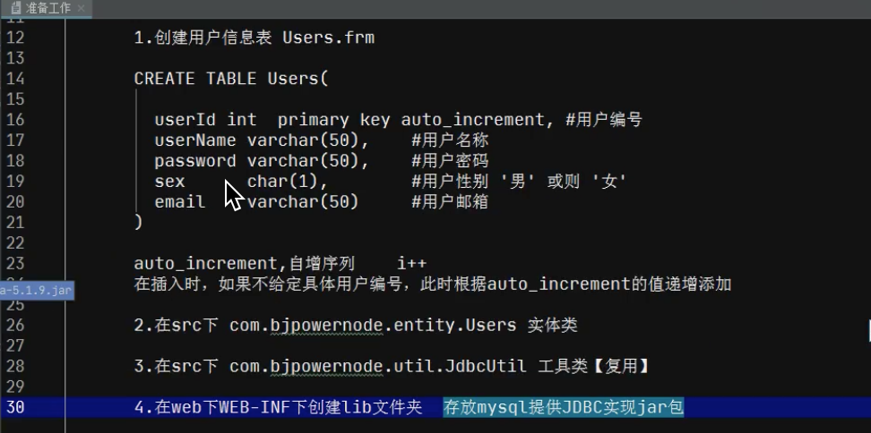
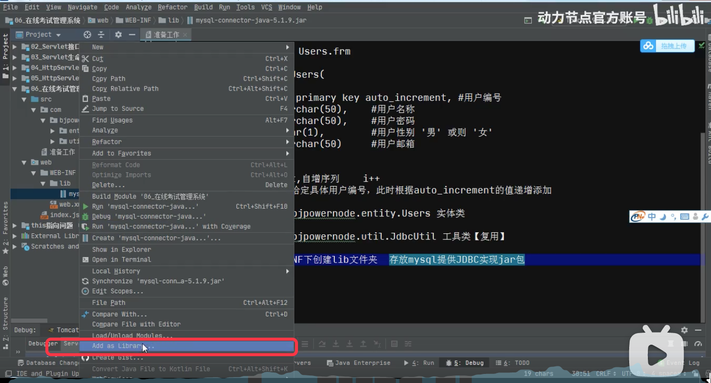
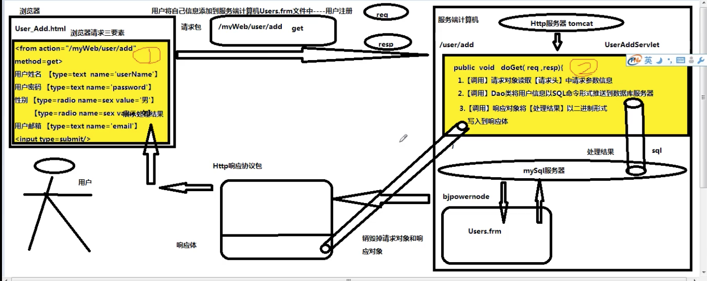
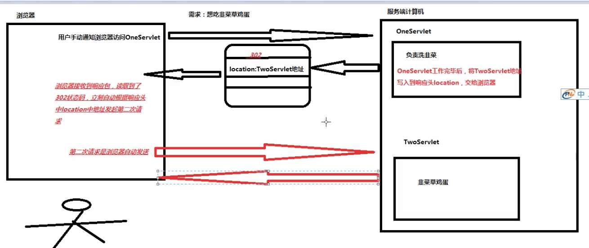

### 环境搭建



**在web工程中，jar包必须放在WEB-INF/lib目录（需要自己建lib目录）下面。这是一个固定位置，新加的jar包都需要放在这个目录下面。**



**设置 jar包，Add as Library**


### 用户信息注册流程图




Servlet：

1. 调用请求对象，从请求头中，获取请求参数，得到用户的信息；
2. 调用DAO类，将用户信息填充到insert语句，借助JDBC协议，将数据插入到mysql服务器；
3. 调用响应对象，将处理结果以二进制形式写入到响应体中；
4. Tomcat服务器销毁请求对象和响应对象；
5. Tomcat服务器将Http响应协议包推送给发送请求的浏览器；
6. 浏览器根据响应头content-type指定编译器，对响应体二进制内容进行编辑；
7. 浏览器将处理结果展示给用户。 =》 过程结束。

其中第4步-第7步 是Tomcat服务器和浏览器自动完成的，不用我们手动干预处理。


### 用户添加开发

user_add.html 是网站中的一个静态资源文件，所以只能写在web目录下面，不能写在WEB-INF下面。

https://www.bilibili.com/video/BV1y5411p7kb?p=12&spm_id_from=pageDriver

#### Http状态码

https://www.bilibili.com/video/BV1y5411p7kb?p=17

### 多个Servlet之间的调用规则

为了提高用户使用感受规则：

无论本次涉及到多少个servlet，用户只需要【手动】通知浏览器发起一次请求即可。

浏览器一次只能访问一个资源文件。

多个servlet之间调用规则：

- 重定向解决方案；
- 请求转发解决方案。

#### 重定向解决方案

原理图：




##### 1.原理

- 用户第一次通过【手动方式】通知浏览器访问OneServlet；
- OneServlet工作完毕后，会将TwoServlet的地址写入到响应头中的location属性中，导致Tomcat将302状态码协议到状态行中；
- 在浏览器接收到响应之后，会读取到302状态。此时浏览器自动根据响应头中location属性地址发起第二次请求，访问TwoServlet去完成请求中剩余任务。

##### 2.实现命令

```
response.sendRedirect("请求地址");


```

将地址写入到响应包中的响应头中的location属性：


##### 3.特征

- 请求地址：既可以把当前网站内的资源文件地址发送给浏览器（/网站名/资源文件名），也可以把其它网站资源文件地址发送给浏览器（http://ip地址:端口号/网站名/资源文件名）；
- 请求次数：浏览器至少发送两次请求，但是只有第一次是用户手动发送，后续请求都是浏览器自动发送的；
- 请求方式：是通过地址栏通知浏览器发送下一次请求，因此调用的资源文件接收的请求方式一定是【GET】。

##### 4.缺点

需要在服务器和浏览器之间多次往返，大量的时间消耗在往返次数。

#### 请求转发解决方案

##### 1.原理

用户第一次通过手动方式要求浏览器访问oneServlet。oneServlet工作完毕后，通过当前请求对象代替浏览器向Tomcat服务器发起请求，申请调用TwoServlet。

Tomcat在接收到这个请求之后，自动调用TwoServlet来完成剩余任务。

##### 2.实现命令

请求对象代替浏览器向tomcat发送请求。

```txt
// 1.通过当前请求对象生成资源文件申请报告对象
RequestDispatcher report = request.getRequestDispatcher("/资源文件"); // 一定要以"开头"
// 2.将报告对象发送给Tomcat
report.forward(当前请求对象,当前响应对象);

```

```java
public class TenServlet extends HttpServlet {
    protected void doPost(HttpServletRequest request, HttpServletResponse response) throws ServletException, IOException {

    }

    protected void doGet(HttpServletRequest request, HttpServletResponse response) throws ServletException, IOException {
        System.out.println("洗韭菜......");

        // 1.通过当前请求对象生成资源文件申请报告对象
        RequestDispatcher report = request.getRequestDispatcher("/eleven");

        // 2.将报告对象发送给Tomcat
        report.forward(request, response);
    }
}
public class ElevenServlet extends HttpServlet {
    protected void doPost(HttpServletRequest request, HttpServletResponse response) throws ServletException, IOException {

    }

    protected void doGet(HttpServletRequest request, HttpServletResponse response) throws ServletException, IOException {
        System.out.println("韭菜炒鸡蛋......");
    }
}
```


##### 3.优点

- 无论本次请求涉及到多少个Servlet，用户只需要手动通过浏览器发送一次请求；
- Servlet之间调用发生在服务端计算机上，节省了服务端与浏览器之间发生往返的次数，增加处理服务速度。

##### 4.特征

- 在请求发送过程中浏览器只发送了一次请求，因此只发送了一个Http协议包；
- 参与本次请求的所有Servlet共享同一个的请求协议包；
- 因此，这些Servlet接收请求的方式与发送的请求方式保持一致。


### 九、多个Servlet之间数据共享实现方案

https://www.bilibili.com/video/BV1y5411p7kb?p=21

#### 数据共享

OneServlet工作完毕后，将产生的数据交给TwoServlet来使用。

#### 在Servlet中提供四种数据共享方案

##### 1、ServletContext接口

- 来自于Servlet规范中的一个接口，存在于Tomcat的servlet-api.jar；
- 如果两个Servlet来自于同一个网站，彼此之间通过网站的ServletContext实例对象实现数据共享；
- 开发人员习惯将ServletContext实例对象称作为【全局作用域对象】。

##### 工作原理

- 每个网站都存在一个全局作用域；
- 相当于是一个Map。

##### 全局作用于对象生命周期

- 在Http服务t启动过程中，自动为当前网站在内存中创建一个全局作用域对象；
- 在Http服务器运行期间，一个网站只有一个全局作用域对象；
- 在Http服务器运行期间，全局作用域对象一直存活；
- 在Http服务器准备关闭时，负责将当前网站中的全局作用域对象进行销毁处理。

##### 命令实现

```java
// 1.获取全局作用域对象；
ServletContext application = request.getServletContext();

// 2.取出数据
Object data = application.get("key1");
```


##### 2、Cookie类；

##### 3、HttpSession接口；

##### 4、HttpServletRequest接口；