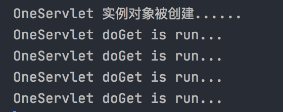
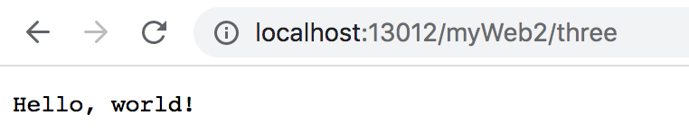

## Servlet

### 一、Servlet规范

- servlet规范来自于 javaee规范的一种；
- 作用：
  - 在servlet规范中，指定【动态资源文件】的开发步骤；
  - 在servlet规范中，指定Http服务器调用【动态资源文件】的规则；
  - 在servlet规范中，指定Http服务器管理动态资源文件实例对象规则。

### 二、Servlet接口实现类

- servlet接口来自于servlet规范下的一个接口，这个接口存在于Http服务器，提供jar包；
- Tomcat服务器下lib目录有一个servlet-api.jar存放Servlet接口：

### 三、Servlet对象生命周期(http服务器是怎么管理这个servlet对象)

1. 网站中所有servlet接口实现类的实例对象，只能由Http服务器负责创建。开发人员不能手动创建servlet接口实现类的实例对象。
2. 在默认情况下，Http服务器接收到对于当前servlet接口实现类第一次请求时，会自动创建这个servlet接口实现类实例对象。
3. 在http服务器运行期间，一个servlet接口实现类只能被创建一个实例对象。一个进程对应多个线程，用户请求相当于一个线程，无论有多少用户访问tomcat这个servlet接口实现类，自始至终，tomcat只会new一次这个实例对象。
4. 这个servlet接口实现类对象什么时候被销毁呢？=》在http服务器关闭的时候，会自动将网站中所有的sevelet对象销毁。

用java web的servlet接口实现类demo（blog-demo/servlet-life-cycle），来了解servlet对象声明周期：

- TwoServlet 会在tomcat初始化的过程中就被创建；

- OneServlet是在请求http://localhost:13000/myWeb/one时，会被创建：

  ```bash
  OneServlet 实例对象被创建......
  OneServlet doGet is run...
  ```

  再次访问：

  

​       会发现，OneServlet不会再被创建了。也就是不管被访问多少次，只会被创建一个实例对象。

### 四、HttpServletResponse接口

#### 介绍

1. HttpServletResponse接口来自于servlet规范中，在Tomcat的servlet-api.jar中；
2. HttpServletResponse接口实现类由Http服务器提供；
3. HttpServletResponse接口实现类负责将doGet或doPost方法执行结果写入到【响应体】交给浏览器；
4. 开发人员习惯将HttpServletResponse接口修改的对象称为响应对象。

#### 主要功能

1. 将执行结果以二进制形式写到【响应体】中；
2. 设置响应头中【content-type】属性值，从而控制浏览器使用对应编译器将接收到的二进制数据编译为：【文字、图片、视频、命令】；
3. 设置响应头中【location】属性，将一个请求地址赋值给location，从而控制浏览器向指定服务器发送请求。

以Hello World测试：

```xml
<?xml version="1.0" encoding="UTF-8"?>
<web-app xmlns="http://xmlns.jcp.org/xml/ns/javaee"
         xmlns:xsi="http://www.w3.org/2001/XMLSchema-instance"
         xsi:schemaLocation="http://xmlns.jcp.org/xml/ns/javaee http://xmlns.jcp.org/xml/ns/javaee/web-app_4_0.xsd"
         version="4.0">
    <servlet>
        <servlet-name>HelloWorldServlet</servlet-name>
        <servlet-class>com.fullstackboy.servlet.controller.HelloWorldServlet</servlet-class>
        <!--在tomcat接收到第一次对该servlet实例对象请求时才会创建实例对象-->
    </servlet>

    <!--为servlet设置别名-->
    <servlet-mapping>
        <servlet-name>HelloWorldServlet</servlet-name>
        <url-pattern>/three</url-pattern>
    </servlet-mapping>
</web-app>
```

HelloWorldServlet：

```java
public class HelloWorldServlet extends HttpServlet {

    @Override
    protected void doGet(HttpServletRequest request,  HttpServletResponse response) throws javax.servlet.ServletException, IOException {
        // 模拟业务逻辑处理结果
        String result = "Hello, world!";

        // 1.通过响应对象，向Tomcat索要输出流
        PrintWriter out = response.getWriter();

        // 2.通过输出流将数据以二进制形式发送给【响应体】
        // out.write(result);
        out.print(result);
        // doGet执行完毕，Tomcat将响应体推送给浏览器
    }
}
```




浏览器的请求行为即可以由前端工程师来控制，也可以由后端工程师来控制。

可以通过服务端来控制浏览器的请求行为。怎么做呢？在这里就体现到了。

#### 修改content-type属性

```java
public class FourServlet extends HttpServlet {

    protected void doGet(HttpServletRequest request, HttpServletResponse response) throws ServletException, IOException {
//        String result = "Java<br/>Mysql<br/>Vue";
        String result = "你好";

        // 默认content-type=text，这样的浏览器不会解析html字符
//        response.setContentType("text/html");
        response.setContentType("text/html;charset=utf-8");

        // 模拟业务逻辑处理结果

        // 1.通过响应对象，向Tomcat索要输出流
        PrintWriter out = response.getWriter();

        // 2.通过输出流将数据以二进制形式发送给【响应体】
        out.print(result);

        // doGet执行完毕，Tomcat将响应体推送给浏览器
    }
}
```


#### sendRedirect方法

// 通过响应对象，将地址赋值给响应头中的location属性，sendRedirect方法远程控制浏览器请求行为【请求地址、请求方式、请求参数】。

```java
public class FiveServlet extends HttpServlet {


    protected void doGet(HttpServletRequest request, HttpServletResponse response) throws ServletException, IOException {
        String result = "http://www.baidu.com";

        // 通过响应对象，将地址赋值给响应头中的location属性
        response.sendRedirect(result);

        // 浏览器在收到响应后，如果发现响应头中有location属性，会自动通过地址栏向location指定的网站发送请求
        // sendRedirect方法远程控制浏览器请求行为【请求地址、请求方式、请求参数】
    }
}
```


### 五、HttpServletRequest接口

#### 介绍

- HttpServletRequest接口来自于Servlet规范中，在Tomcat中存在servlet-api.jar中；
- HttpServletRequest接口实现类由Http服务器负责提供；
- HttpServletRequest接口负责在doGet/doPost方法运行时读取Http请求协议包中信息；
- 开发人员习惯于将HttpServletRequest接口修饰的对象称为【请求对象】。

#### 作用

- 可以请求

URI：资源文件精确定位地址，在请求行里并没有这个属性。

可以通过URL中截取一个字符串，这个字符串格式："/网站名/资源文件名"

URI用于到Http服务器对被访问的资源文件进行定位。

https://www.bilibili.com/video/BV1y5411p7kb?p=5&spm_id_from=pageDriver

#### 以GET方式和POST方式请求Servlet

##### 乱码

post方式请求包含中文时servlet时，会得到乱码，get方式则不会。

##### 原因

- 浏览器以get方式发送请求，请求参数保存在【请求头】中，在Http请求协议包到达Http服务器之后，第一件事就是进行解码。请求头二进制内容由Tomcat负责解码。Tomcat9.0默认就是使用【utf-8】字符集进行解码，可以解释一切国家文字；
- 浏览器以get方式发送请求，请求参数保存在【请求体】中，在Http请求协议包到达Http服务器之后，第一件事就是进行解码。请求体二进制内容由当前请求对象（request）负责解码，request默认使用【ISO-8859-1】字符集，一个东欧语系字符集。此时如果请求体中包含中文，将无法解码只能得到乱码。

解决：

在POST请求方式下，在读取请求体内容之前，应该通知请求对象使用utf-8字符集对请求内容进行一次重新解码。

```java
@WebServlet(name = "SeventhServlet")
public class SeventhServlet extends HttpServlet {
    protected void doPost(HttpServletRequest request, HttpServletResponse response) throws ServletException, IOException {
        // 通知请求对象，使用utf-8字符集对请求体二进制内容进行一次重新解码
        request.setCharacterEncoding("utf-8");
        // 通过请求对象，得到【请求体】参数信息
        String value = request.getParameter("username");
        System.out.println(value);
    }

    protected void doGet(HttpServletRequest request, HttpServletResponse response) throws ServletException, IOException {
        // 通过请求对象，得到【请求参数】参数信息
        String value = request.getParameter("username");
        System.out.println(value);
    }
}
```


### 请求对象和响应对象生命周期

1、当Http服务器接收到浏览器发送的请求协议包时，将会为这个请求协议包**自动生成两个工具对象**，一个是HttpServletRequest对象，另一个是HttpServletResponse对象；

2、在Http服务器调用doGet/doPost方法时，负责将【请求对象】和【响应对象】做为实参传递到方法，确保doGet/doPost方法正确执行；

3、在Http服务器负责将http响应协议包推送给浏览器之前，会将【请求对象】和【响应对象】销毁。


### Servlet执行流程图


https://www.bilibili.com/video/BV1y5411p7kb?p=7