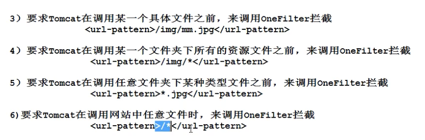
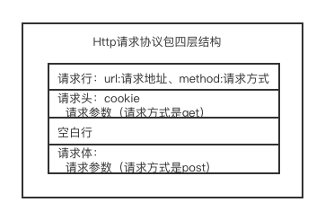
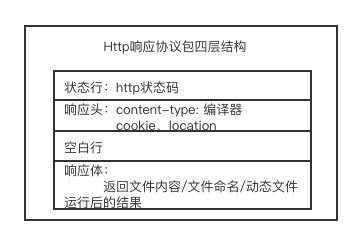

### 过滤器接口（Filter接口）

#### 介绍

- 来自与Servlet规范下接口，在Tomcat中存在于servlet-api.jar；
- Filter接口实现类由开发人员负责提供，Http服务器不负责提供；
- Filter接口在Http服务器调用资源文件之前，对Http服务器进行拦截。

#### 具体作用

- 拦截Http服务器，帮助Http服务器检测当前请求合法性；
- 拦截Http服务器，对当前请求进行增强操作。

#### Filter接口实现类开发步骤：三步

1. 创建一个Java类，实现Filter接口；
2. 重写doFilter方法；
3. 在web.xml将过滤器接口实现类注册到Http服务器。

#### 利用Filter接口来检测请求的合法性

```java
/**
 * Servlet过滤器实现类：
 * 1.拦截Http服务器，帮助Http服务器检测当前请求的合法性;
 * 2.拦截Http服务器，对当前请求做增强操作
 *
 * @author Liuyongfei
 * @date 2021/11/13 16:05
 */
public class OneFilter implements Filter {
    @Override
    public void init(FilterConfig filterConfig) throws ServletException {

    }

    @Override
    public void doFilter(ServletRequest servletRequest, ServletResponse servletResponse, FilterChain filterChain) throws IOException, ServletException {
        String age = servletRequest.getParameter("age");

        if (Integer.valueOf(age) < 70) {
            // 将拦截请求对象和响应对象交还给Tomcat，由Tomcat继续调用资源文件
            filterChain.doFilter(servletRequest, servletResponse);
        } else {
            // 过滤器替代Http服务器拒绝本次请求
            servletResponse.setContentType("text/html;charset=utf-8");

            PrintWriter out = servletResponse.getWriter();
            out.print("<center><font style='color:red; font-size: 40px'>大爷，珍爱生命呢！</center>");
        }
```

```xml
<!--    声明filter类-->
    <filter>
        <filter-name>OneFilter</filter-name>
        <filter-class>com.fullstackboy.servlet.filter.OneFilter</filter-class>
    </filter>

<!--    通知Tomcat在调用何种资源文件时需要被当前过滤器拦截-->
    <filter-mapping>
        <filter-name>OneFilter</filter-name>
        <url-pattern>/mm.jpg</url-pattern>
    </filter-mapping>
```

#### 利用Filter接口来对当前请求进行增强

假如一个网站，有很多的Servlet。

OneServlet：

```java
protected void doPost(HttpServletRequest request, HttpServletResponse response) throws ServletException, IOException {
    // 通知请求对象，使用utf-8字符集对请求体二进制内容进行一次重新解码
    request.setCharacterEncoding("utf-8");
    // 通过请求对象，得到【请求体】参数信息
    String value = request.getParameter("username");
    System.out.println(value);
}
```

TwoServlet：

```java
protected void doPost(HttpServletRequest request, HttpServletResponse response) throws ServletException, IOException {
    // 通知请求对象，使用utf-8字符集对请求体二进制内容进行一次重新解码
    request.setCharacterEncoding("utf-8");
    // 通过请求对象，得到【请求体】参数信息
    String value = request.getParameter("username");
    System.out.println(value);
}
```

为了避免拿到的参数值是乱码，需要使用request.setCharacterEncoding("utf-8") 对请求体二进制内容进行一次重新编码。

这样每个Servlet都需要做一次。

我们可以把这个事情放到Filter里去统一处理一次，Servlet里直接使用请求参数就可以了。

OneFilter：


```java
@Override
    public void doFilter(ServletRequest servletRequest, ServletResponse servletResponse, FilterChain filterChain) throws IOException, ServletException {

   // 通知请求对象，使用utf-8字符集对请求体二进制内容进行一次重新解码
   request.setCharacterEncoding("utf-8");
   // 将拦截请求对象和响应对象交还给Tomcat，由Tomcat继续调用资源文件
   filterChain.doFilter(servletRequest, servletResponse);
```
xml：

```xml
<!--    声明filter类-->
    <filter>
        <filter-name>OneFilter</filter-name>
        <filter-class>com.fullstackboy.servlet.filter.OneFilter</filter-class>
    </filter>

<!--    通知Tomcat在调用何种资源文件时需要被当前过滤器拦截-->
    <filter-mapping>
        <filter-name>OneFilter</filter-name>
        <url-pattern>/*</url-pattern>
    </filter-mapping>
```




#### 过滤器防止用户恶意登录行为

令牌机制

HttpSession session = request.getSession(); // 有则返回，没有则创建一个session后返回。

在用户登录成功后，判定该用户是合法用户后，使用该命令向Tomcat申请给该用户生成一个session。

和

HttpSession session = request.getSession(false); // 有则返回，没有则返回null

可以在其它servlet里使用该命令，来判断该用户是否是合法用户，如果拿到的是null，则就为非法用户，拒绝提供服务。

https://www.bilibili.com/video/BV1y5411p7kb?p=38&spm_id_from=pageDriver


互联网网络通信图

请求协议包：



Servlet接口实现类=》动态资源文件

响应协议包：

在


定义一个Filter过滤器，放行 login相关的请求，主要代码如下：

````java
HttpSession session = request.getSession(false); 
String uri = request.getRequestURI();
// 当有login请求或者，只输入/myWeb时(这种情况会跳转到默认的欢迎页，是在web.xml里配置的)
if (uri.indexOf("login") != -1 || "/myWeb" == uri) {
  // 放行此请求
	filterChain.doFilter(servletRequest,servletResponse);
  return;
}

if (session != null) {
   // 放行此请求
	filterChain.doFilter(servletRequest,servletResponse);
  return;
}

// 拒绝此次请求
request.getRequestDispatcher("/login_error.html").forward(servletRequest,servletResponse);
````

