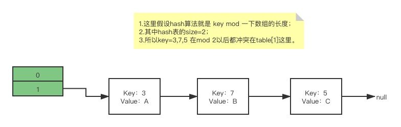
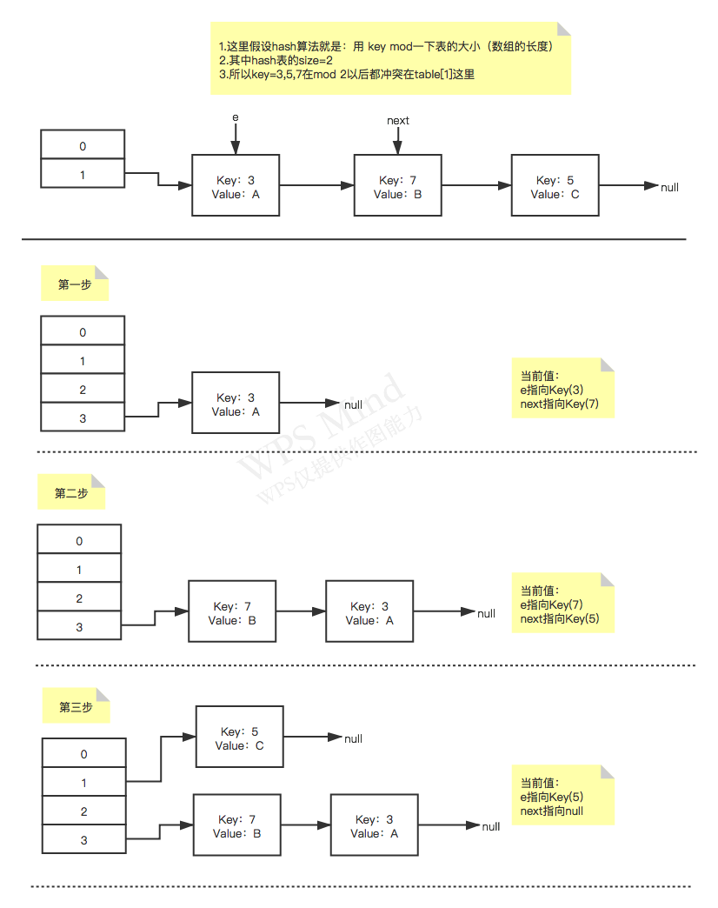
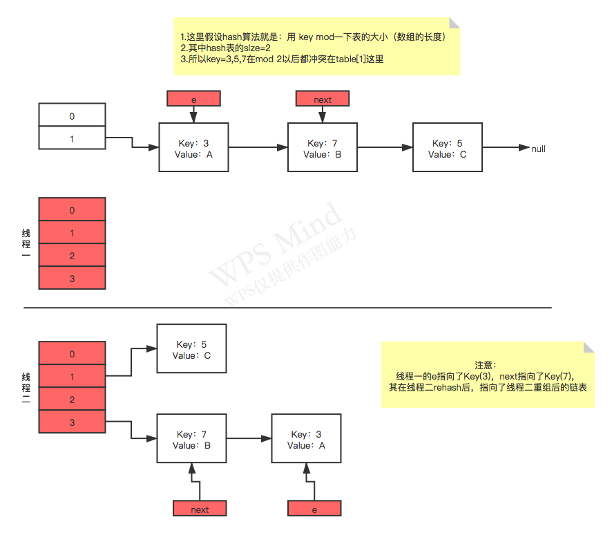
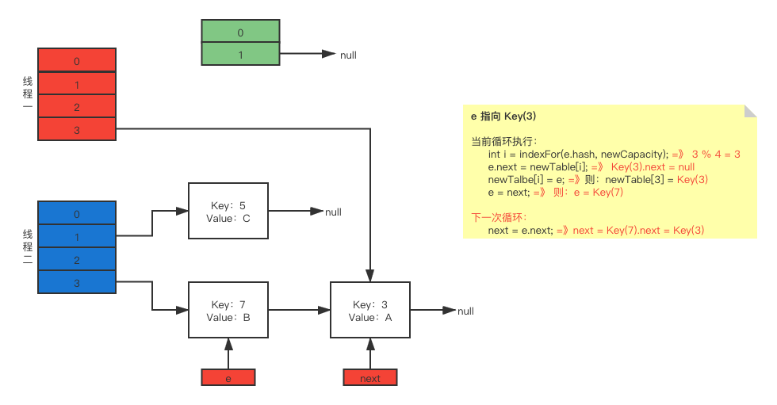
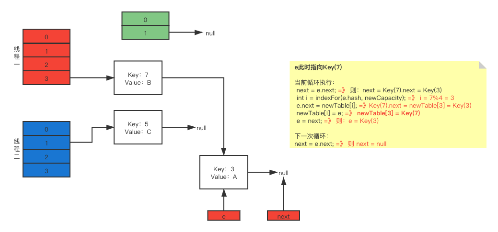
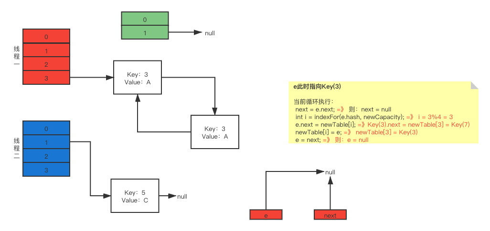

### HashMap的数据结构

- HashMap通过会用一个指针数组（假设为table[i]）来分散所有的key，当有一个key进来时，会通过hash算法计算出这个数组的下标i，然后就把这个<key,value> 插入table[i]中去；
- 如果有两个不同的key通过hash算法后都算在了同一个i上时，那么就叫hash冲突，hash碰撞，这样就会在table[i]上生成一个链表（这样一个O(1)的查找算法，就变成了链表遍历，性能就变成了O(n)，这就是Hash表的缺陷）；
- 所以，Hash表的尺寸和容量非常重要。一般来说，Hash表这个容器当有元素插入时都会检查当前的容量是否大于设定的thredhold，如果超过，就需要增大Hash表的尺寸，这样一来，整个hash表里的元素都要被重新计算一遍，这就叫rehash。



#### HashMap的源码

##### 添加元素

put一个<Key,Value>对到Hash表中去：

```java
public V put(K key, V value){
    ......

    //算Hash值
    int hash = hash(key.hashCode());
    int i = indexFor(hash, table.length);
  
    //如果该key已被插入，则替换掉旧的value （链接操作）
    for (Entry<K,V> e = table[i]; e != null; e = e.next) {
        Object k;
        if (e.hash == hash && ((k = e.key) == key || key.equals(k))) {
            V oldValue = e.value;
            e.value = value;
            e.recordAccess(this);
            return oldValue;
        }
    }
    modCount++;
    //该key不存在，需要增加一个结点
    addEntry(hash, key, value, i);
    return null;
}
```

##### 检查容量是否超标

```java
void addEntry(int hash, K key, V value, int bucketIndex){
    Entry<K,V> e = table[bucketIndex];
    table[bucketIndex] = new Entry<K,V>(hash, key, value, e);
    //查看当前的size是否超过了我们设定的阈值threshold，如果超过，需要resize
    if (size++ >= threshold)
        resize(2 * table.length);
}
```

##### 新建一个更大尺寸的Hash表

新建一个更大尺寸的hash表，然后把数据从老的Hash表中迁移到新的Hash表中。

```java
void resize(int newCapacity){
    Entry[] oldTable = table;
    int oldCapacity = oldTable.length;
    ......

    //创建一个新的Hash Table
    Entry[] newTable = new Entry[newCapacity];
    //将Old Hash Table上的数据迁移到New Hash Table上
    transfer(newTable);
    table = newTable;
    threshold = (int)(newCapacity * loadFactor);
}
```

##### 迁移的源代码

```java
void transfer(Entry[] newTable){
    Entry[] src = table;
    int newCapacity = newTable.length;
    // 下面这段代码的意思是：
    // 从OldTable里摘一个元素出来，然后放到NewTable中
    for (int j = 0; j < src.length; j++) {
        Entry<K,V> e = src[j];
        if (e != null) {
            src[j] = null;
            do {
                Entry<K,V> next = e.next;
                int i = indexFor(e.hash, newCapacity);
                e.next = newTable[i];
                newTable[i] = e;
                e = next;
            } while (e != null);
        }
    }
}
```

#### 正常的rehash过程



#### 多线程并发时的Rehash

假设我们有两个线程。分别用红色和蓝色标注。

再看transfer代码中的细节：

假设线程一执行到这里就被调度挂起了：

```java
do {
    Entry<K,V> next = e.next; // 假设线程一执行到这里就被调度挂起了
    int i = indexFor(e.hash, newCapacity);
    e.next = newTable[i];
    newTable[i] = e;
    e = next;
} while (e != null);
```

而线程二则执行完成了，于是有下面的这个图：



线程一被调度回来执行：

第一次循环：

```java
int i = indexFor(e.hash, newCapacity); // => i = 3
e.next = newTable[i]; // => Key(3).next = newTable[3] = null
newTable[i] = e; // => newTable[3] = Key(3)
e = next; // => e = Key(7)
```



第二次的循环：

```java
// e => <7, B>
next = e.next; // => next = Key(3)
int i = indexFor(e.hash, newCapacity); // => i = 3
e.next = newTable[i]; // => Key(7).next = newTable[3] = Key(3)
newTable[i] = e; // => newTable[3] = Key(7)
e = next; // => e => Key(3)
```

则：

e.next = Key(3)

newTable[3] = Key(7)

会把Key(7)摘下来，放到newTable[i]的第一个：



此时：

e.next = newTable[i]; =》**Key(7).next 指向了Key(3)**

##### 第三次循环

```java
// e => <3, A>
next = e.next; // => next = null
int i = indexFor(e.hash, newCapacity); // => i = 3
e.next = newTable[i]; // => Key(3).next = newTable[3] = Key(7)
newTable[i] = e; // => newTable[3] = Key(3)
e = next; // => e => null
```

关键的这一步：

e.next = newTable[i]; =》 **Key(3).next 指向了 Key(7)**

由于之前的Key(7).next 已经指向了 Key(3)，因此这里就形成了环形链表：



于是，当我们的线程调用到 HashTables.get(11)时，悲剧就出现了- **Infinite Loop**

有人把这个问题报给了Sun，不过Sun不认为这个是一个问题。因为HashMap本来就不支持并发。要并发就用ConcurrentHashmap。

