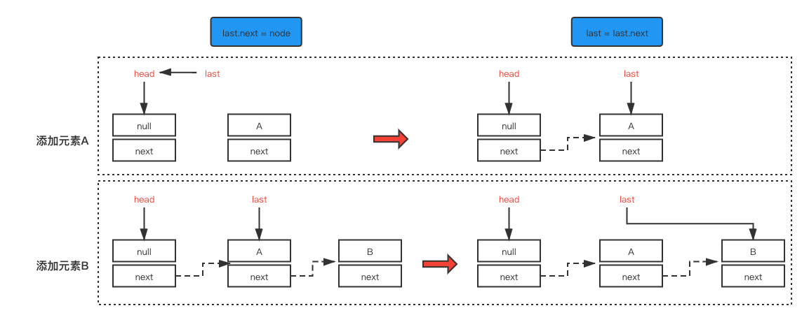
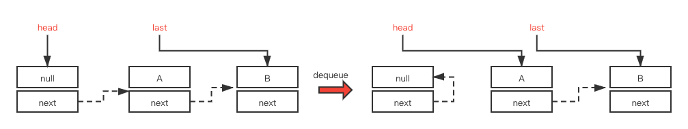

## LinkedBlockingQueue

### 源码分析

参考文章：https://blog.csdn.net/tonywu1992/article/details/83419448

#### 1.属性

```java
/**
 * 节点类，用于存储数据
 */
static class Node<E> {
	E item;
  Node<E> next;
  Node(E x) {
    item = x; 
  }
}

/**
 * 阻塞队列的大小，默认为Integer.MAX_VALUE
 */
private final int capacity;

/**
 * 当前阻塞队列中元素的个数
 */
private final AtomicInteger count = new AtomicInteger();

/**
 * 阻塞队列的头节点
 */
transient Node<E> head;

/**
 * 阻塞队列的尾节点
 */
transient Node<E> last;

/**
 * 获取并移除元素时使用的锁，如take,poll
 */
private final ReentrantLock takeLock = new ReentrantLock();

/**
 * 当队列没有数据时，用于挂起 "执行删除" 的线程
 */
private final Condition notEmpty = takeLock.newCondition();

/**
 * 添加元素时使用的锁，如put,offer
 */
private final ReentrantLock putLock = new ReentrantLock();

/**
 * 当队列已满时，用于挂起 "执行添加" 的线程
 */
private final Condition notFull = putLock.newCondition();
```

从上面的属性我们可以看出：

- 与ArrayBlockingQueue不同的是，LinkedBlockingQueue内部分别使用了takeLock和putLock两把锁对并发进行控制，也就是说，**添加和删除操作并不是互斥操作，可以同时进行，这样可以大大提高吞吐量**。
- 如果不指定容量的大小，则默认为Integer.MAX_VALUE，如果存在速度大于删除速度的时候，有可能会内存溢出。这一点在使用之前要慎重考虑。
- 对每一个lock锁都使用了Condition用来挂起和唤醒其它线程。

备注：

- Condition是在jdk 1.5中出现的，它用来替代传统的Object的wait(),notify()实现线程间的协作。
- 相比较Object的wait(),notify()，使用Condition的await(),signal()这种方式实现线程间的协作更加安全和高效。
- Condition是个接口，基本的方法就是await()和signal()方法。

#### 2.Put方法

```java
public void put(E e) throws InterruptedException {
        if (e == null) throw new NullPointerException();
        int c = -1;
        Node<E> node = new Node<E>(e);
        final ReentrantLock putLock = this.putLock;
        final AtomicInteger count = this.count;
        // 获取锁中断
        putLock.lockInterruptibly();
        try {
            // 如果队列已满，则让该线程进入阻塞
            while (count.get() == capacity) {
                notFull.await();
            }
            // 将node放入队列中
            enqueue(node);
            c = count.getAndIncrement();
            // 再次判断是否有空用空间，如果有则唤醒下一个线程进行添加操作
            if (c + 1 < capacity)
                notFull.signal();
        } finally {
            putLock.unlock();
        }
        // 放之前队列中没有元素，唤醒消费线程进行消费
        if (c == 0)
            signalNotEmpty();
    }
```

##### 总结

- 队列已满，则阻塞等待；

- 队列未满，创建一个node节点放入队列中；

  - 如果放完以后队列中还有剩余空间，则继续唤醒下一个线程进行添加操作；

  - 如果放之前队列中没有元素，则放完以后唤醒消费线程进行消费。

我们再来看看该方法中用到的几个方法。

##### enqueue(Node node)

```java
/**
     * Links node at end of queue.
     *
     * @param node the node
     */
    private void enqueue(Node<E> node) {
        // assert putLock.isHeldByCurrentThread();
        // assert last.next == null;
        last = last.next = node;
    }

```

用一张图更方便理解enqueue方法：



##### signalNotEmpty和signalNotFull方法

```java
/**
 * Signals a waiting take. Called only from put/offer (which do not
 * otherwise ordinarily lock takeLock.)
 */
private void signalNotEmpty() {
        final ReentrantLock takeLock = this.takeLock;
        takeLock.lock();
        try {
            notEmpty.signal();
        } finally {
            takeLock.unlock();
        }
    }

    /**
     * Signals a waiting put. Called only from take/poll.
     */
    private void signalNotFull() {
        final ReentrantLock putLock = this.putLock;
        putLock.lock();
        try {
            notFull.signal();
        } finally {
            putLock.unlock();
        }
    }
```

Condition必须要配合锁一起使用，因为对共享状态变量的访问发生在多线程环境下。

#### offer(E e)

```java
public boolean offer(E e) {
        if (e == null) throw new NullPointerException();
        final AtomicInteger count = this.count;
        if (count.get() == capacity)
            return false;
        int c = -1;
        Node<E> node = new Node<E>(e);
        final ReentrantLock putLock = this.putLock;
        putLock.lock();
        try {
            if (count.get() < capacity) {
                enqueue(node);
                c = count.getAndIncrement();
                if (c + 1 < capacity)
                    notFull.signal();
            }
        } finally {
            putLock.unlock();
        }
        if (c == 0)
            signalNotEmpty();
        return c >= 0;
    }
```

##### 总结

- offer()方法与put()方法相比，仅改动了一小部分代码；
- put()方法在队列已满时会阻塞等待；
- offer()方法在队列已满时会直接返回false。

是一个有界队列，有大小限制。如果超过了限制，你往队列里塞数据就会被阻塞。

好处就在于说可以限制内存队列的大小，避免说内存队列无限制的增长，最后撑爆内存。

#### 出队take()

```java
public E take() throws InterruptedException {
        E x;
        int c = -1;
        final AtomicInteger count = this.count;
        final ReentrantLock takeLock = this.takeLock;
        takeLock.lockInterruptibly();
        try {
            while (count.get() == 0) {
                notEmpty.await();
            }
            x = dequeue();
            // 执行完这一行代码之后：c之前count减之前的值，count减1
            c = count.getAndDecrement();
            if (c > 1)
                notEmpty.signal();
        } finally {
            takeLock.unlock();
        }
        // 如果移除之前是满的，则唤醒生成线程进行添加元素
        if (c == capacity)
            signalNotFull();
        return x;
    }
```

##### 总结

- 如果队列为空，则阻塞等待；
- 如果队列不为空，则通知其它消费线程来执行消费操作；
- 如果移除之前是满的，则唤醒生成线程进行添加元素。

##### dequeue方法

```java
/**
     * Removes a node from head of queue.
     *
     * @return the node
     */
    private E dequeue() {
        // assert takeLock.isHeldByCurrentThread();
        // assert head.item == null;
        // 获取到head节点
        Node<E> h = head;
        // 获取到head节点指向的下一个节点
        Node<E> first = h.next;
        // head节点的next指向自己，等待下次gc回收
        h.next = h; // help GC
        // head节点指向新节点
        head = first;
        // 获取新的节点的item值
        E x = first.item;
        // 新head节点的item值设为null
        first.item = null;
        return x;
    }
```




同一时间只能有一个线程可以入队。

队列满时，是如何实现阻塞线程的？


while(coun.get == capacity) {

​	// 直接会调用put锁对应的condition队列进行阻塞

}

take掉一个元素后，队列不满了，是如何唤醒线程的？


队列为空时，是如何实现阻塞线程的？


### size

size直接通过CAS+ volatile，拿到的基本是比较准备的一个值。

#### iterator

是直接锁了整个队列，直接把两把锁都给锁掉了。

遍历的时候不允许入队或出队了。

### 总结

LinkedBlockingQueue是一个阻塞队列，内部由两个ReentrantLock来实现出入队列的线程安全。由各自的Condition对象来实现线程的await和signal来实现等待和唤醒功能。

它和ArrayBlockingQueue的不同之处在于：

1. 队列的大小有所不同：

- ArrayBlockingQueue是有界的，初始化时必须指定初始值大小；

- LinkedBlockingQueue在初始化的时候可以指定初始值大小，也可以不指定。当添加速度大于移除速度时，在无界的情况下，有可能会造成内存溢出问题。

2.数据存储容器不同：

- ArrayBlockingQueue 采用的是数组做为存储容器，因此在插入或删除元素时不会产生或销毁任何额外的对象实例；
- 而LinkedBlockingQueue是链表做为存储容器，在插入或删除元素时会产生一个额外的Node对象。在长时间需要高并发处理大批量的数据时，对于GC可能会存在影响；

3.两者实现的队列添加或移除的锁不一样：

- ArrayBlockingQueue中添加或移除元素是用同一个ReentrantLock锁；
- 而LinkedBlockingQueue实现的队列中的锁是分离的，添加是用putLock锁，删除是用takeLock锁，这样能大大提高队列的吞吐量。也意味着在高并发的情况下生产者和消费者可以并行的操作队列中的数据，以此来提高整个队列的并发性能。


