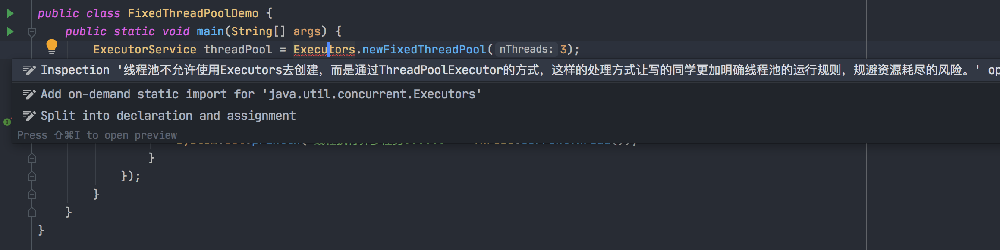

## 线程池有什么用

### 不使用线程池

如果不使用线程池，在有些场景里可能会频繁的创建和销毁线程，这样性能开销是比较大的。

比如100个任务要异步执行，如果频繁的创建和销毁线程，会一共创建和销毁100个线程。

### 使用线程池

使用线程池，会创建一批线程，执行完一个任务之后，不会立即销毁这个线程，可以等待去执行下一个任务。

使用线程池，假如里面有20个线程，先执行20个任务，每个线程执行一个任务，执行完了之后，线程不销毁，继续执行下20个任务，以此类推，就是复用这20个线程，执行了100个异步任务。避免了频繁的创建和销毁线程。

可有效的控制最大并发线程数，提高系统资源的利用率，同时避免过多资源竞争，避免堵塞。

提供定期执行，定时执行，单线程，并发数控制等功能。

### 常见的四种线程池

- fixed：固定数量的线程池；

- cached：线程数量不固定，无论来多少任务都是不停的创建线程来执行，如果线程空闲了一段时间，就会释放掉这个线程；
- single：线程池里就只有一个线程；
- scheduled：提交进去的任务，会在指定时间过后才被执行。


### 为什么阿里代码规范中不允许使用Executors创建线程池

这篇文章讲的挺好：https://www.jianshu.com/p/cdf9f912ec84      https://www.jianshu.com/p/e9b32e3971f9



#### 通过Executors创建线程池的弊端

##### FixedThreadPool和SingleThreadPool

```java
ExecutorService threadPool = Executors.newFixedThreadPool(3);
ExecutorService threadPool2 = Executors.newCachedThreadPool(3);
```

源码：

```java
public static ExecutorService newFixedThreadPool(int nThreads) {
        return new ThreadPoolExecutor(nThreads, nThreads,
                                      0L, TimeUnit.MILLISECONDS,
                                      new LinkedBlockingQueue<Runnable>());
    }


public static ExecutorService newSingleThreadExecutor() {
        return new FinalizableDelegatedExecutorService
            (new ThreadPoolExecutor(1, 1,
                                    0L, TimeUnit.MILLISECONDS,
                                    new LinkedBlockingQueue<Runnable>()));
```

这两个方法都是通过 LinkedBlockingQueue<Runnable>来接收来不及处理的任务，关键点就在这个队列，默认的容量是Integer.MAX_VALUE。

当流量突然变大时，线程池满，等候队列变得非常庞大，内存和CPU都告急，这样无疑会对服务器造成非常大的压力。

##### CachedThreadPool和ScheduledThreadPool

##### 


