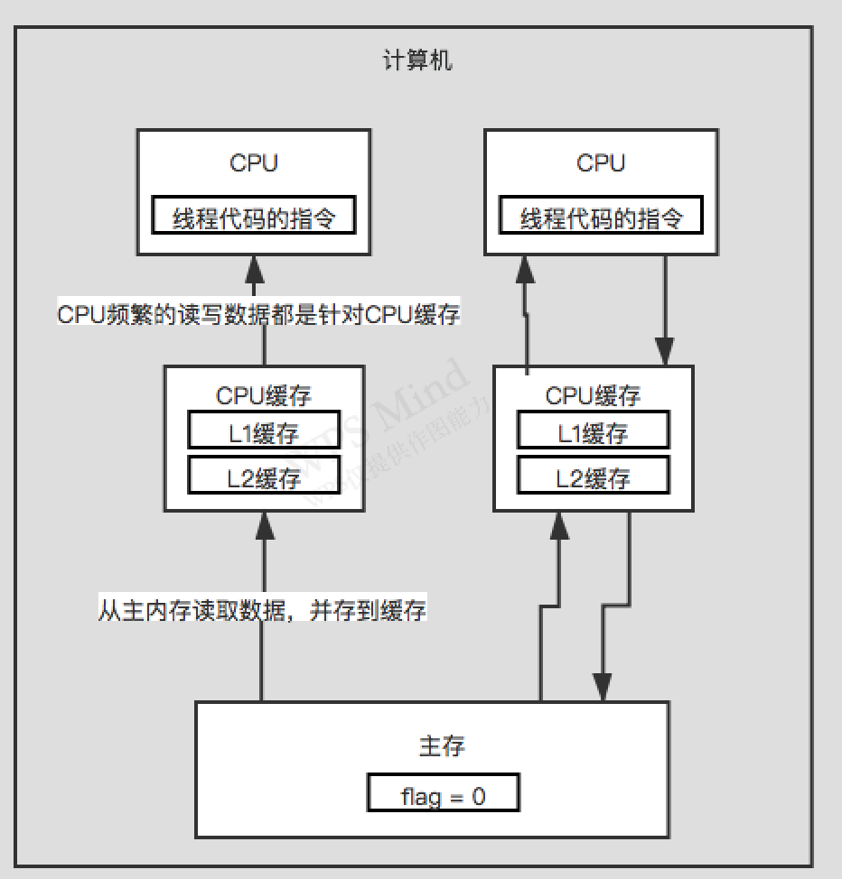

### CPU内存模型的介绍

- 现代计算机技术在读写主存这方面没有什么实际突破，由于CPU直接读写主存会影响效率，因此，在CPU和主存之间又加了缓存。
- CPU直接读写自己对应的高速缓存，不需要频繁的跟主存进行通信，这样可以保证计算机的效率非常高。

### CPU内存模型存在的问题

见本地电脑目录： 儒猿/自己画的流程图

主内存的数据会被加载到CPU缓存内，然后后边CPU就会从自己的缓存内读取数据。

在多线程并发运行的时候，会导致各个CPU缓存内的数据和主存内的数据不同步，就会导致数据的不一致。

### 怎么去解决

#### 总线加锁机制

最早的时候，用的是总线加锁机制，现在已经没人用了。

大概的意思：

就是某个CPU要过来读数据，这时就会通过总线，对这个数据加个锁，然后其它CPU就没法读写这数据了，只有等这个CPU操作完释放锁后才能操作。

在多个线程共享某个数据的访问之后，这可能会导致串行化的问题，效率差。

#### MESI协议

缓存一致性协议，基本上就可以解决这个并发读写变量，然后没有办法及时感知的问题了。

volatile关键字涉及到底层的一些指令。

修改数据，修改本地缓存，立马刷主存。其它CPU感知到缓存过期，立马重新从主存加载。