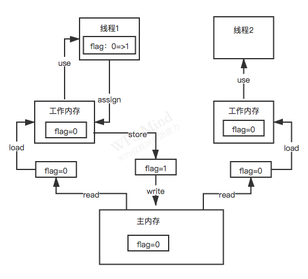

### Java内存模型

java内存模型，是基于CPU缓存模型图来建立的，只不过java内存模型是标准化的，屏蔽掉底层不同的计算机的区别。

#### java内存模型图

- read：从主内存读；
- load：将主内存读取到的值写入到工作内存；
- use：从工作内存读取数值来计算；
- assign：将计算好的数值重新赋值到工作内存；
- store：将工作内存中的数据写入到主内存；
- write：将store过去的值赋给主存中的变量。