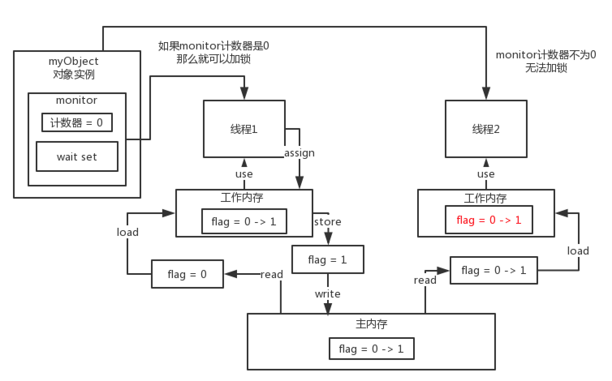

### wait和notify

先看一个demo：

```java
/**
 * 在队列中的wait()和notify()用法
 *
 * @author Liuyongfei
 * @date 2021/8/21 11:31
 */
public class QueueWaitAndNotifyDemo {

    /**
     * 队列的长度
     */
    private static final long QUEUE_MAX_SIZE = 100;

    /**
     * 定义一个队列
     */
    private LinkedList<String> queue = new LinkedList<>();

    /**
     * 往队列中放入数据
     * @param element
     */
    public synchronized void offer (String element){
        try {
            // 进到这里，说明就已经获取到一把锁了
            // 队列已经满了
            if (queue.size() == QUEUE_MAX_SIZE) {
                wait(); // 释放掉这把锁，进入阻塞
            }
            // 队列没有满，则向队列中放入数据
            queue.add(element);
            notifyAll(); // 唤醒当前在等待这个锁的那些线程
        } catch (InterruptedException e) {
            e.printStackTrace();
        }
    }

    /**
     * 从队列中取出数据
     */
    public synchronized String take(){
        String element = null;
        try {
            // 进到这里，说明就已经获取到一把锁了
            // 队列里已经空了
            if (queue.size() == 0) {
                wait();// 释放掉这把锁，进入阻塞，这时其它线程加锁成功，往队列中放入数据
            }
            element = queue.removeFirst();
            notifyAll(); // 唤醒当前在等待这个锁的那些线程
        } catch (InterruptedException e) {
            e.printStackTrace();
        }
        return element;
    }
}
```

如果有多个线程在运行，你可以用各种各样的手段来控制它，比如：volatile，synchronized，wait，notify等，在多线程开发中还是挺常见的。

wait和notify是用来控制线程的，线程通信，某个线程可以处于等待状态，其它线程还可以开通知唤醒它。

#### wait和notify的底层原理

要跟synchronized的实现原来结合到一块，synchronized加锁的时候，主要是monitor里的一个计数器有关。

wait和notify的底层原理也跟 monitor有关联，**每个对象的monitor，除了关联一个计数器外，还关联一个wait set。**

结合上面的代码，调用wait()后：

- 相当于会把当前这个线程加入到与当前对象的这把锁的monitor的wait set关联里，也就是它现在是处于这个锁的wait set状态的一个线程；
- 然后会释放掉这个锁，之前卡在尝试获取这把锁的线程，现在就可以获取到这把锁了；
- 这时如果获取到锁的线程里调用了notifyAll()方法，则会把之前monitor里wait set里面的线程给唤醒。



