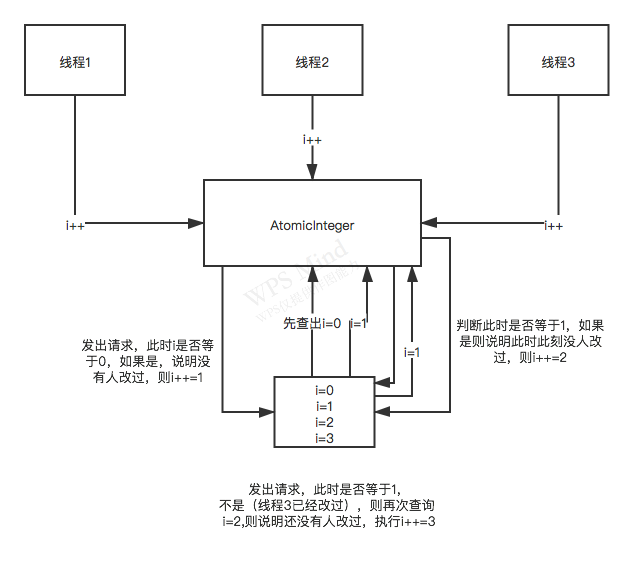

### i++和AtomicInteger之间的差别分析

```java
public class AtomicIntegerDemo {

    private static long i = 0;

    private static AtomicInteger j = new AtomicInteger(0);

    public static void main(String[] args) {
//        synchronizedAdd();
        atomicIntegerAdd();
    }

    public static void synchronizedAdd() {
        for (int i = 0; i < 10; i++) {
            new Thread() {
                @Override
                public void run() {
                    synchronized (AtomicIntegerDemo.class) {
                        System.out.println(AtomicIntegerDemo.i++);
                    }
                }
            }.start();
        }
    }

    public static void atomicIntegerAdd() {
        for (int i = 0; i < 10; i++) {
            new Thread() {
                @Override
                public void run() {
                    System.out.println(AtomicIntegerDemo.j.incrementAndGet());
                }
            }.start();
        }
    }
}
```

Atomic一些列的类可以来优化加锁的性能。

### Atomic原理图



Atomic原子类体系的底层核心的原理是CAS。Compare And Set。

无锁化。

- 每次尝试修改值的时候，就对比一下，有没有人修改过这个值，没有人修改的话，就自己修改；
- 如果有人修改过，就重新查出来最新的值；
- 再次重复这个过程。

#### 源码分析

```java
public class AtomicInteger extends Number implements java.io.Serializable {
    private static final long serialVersionUID = 6214790243416807050L;

    // setup to use Unsafe.compareAndSwapInt for updates
    private static final Unsafe unsafe = Unsafe.getUnsafe();
    private static final long valueOffset;

    static {
        try {
            valueOffset = unsafe.objectFieldOffset
                (AtomicInteger.class.getDeclaredField("value"));
        } catch (Exception ex) { throw new Error(ex); }
    }

    private volatile int value;
```

- 这段代码是在类初始化的时候执行的；
- valueOffset：可以理解为value这个字段在AtomicInteger这个类中的位置。在底层，这个类是有自己对应的结构的，无论是在磁盘的.class文件里，还是在JVM内存中；
- 在类初始化的时候，就会完成这个操作，final的，一旦初始化完毕，就不会再变更了。

```java
/**
 * Atomically increments by one the current value.
 *
 * @return the updated value
 */
public final int incrementAndGet() {
    return unsafe.getAndAddInt(this, valueOffset, 1) + 1;
}
```

```java
public final int getAndAddInt(Object var1, long var2, int var4) {
    int var5;
    do {
        var5 = this.getIntVolatile(var1, var2);
    } while(!this.compareAndSwapInt(var1, var2, var5, var5 + var4));

    return var5;
}
```

- var1：当前的AtomicInteger对象实例；

- var2：valueOffset，就是那个位置偏移量；

- var5：就是刚刚根据getIntVolatile()方法拿到的值，比如i；

- var5 + var4：i + 1；

- getIntVolatile方法：从AtomicInteger对象实例，通过valueOffset偏移量，知道了value这个字段的位置，去获取当前value的值；

- compareAndSwapInt方法：这个就是CAS方法，比较底层了，会有一些指针的操作。他会拿你刚刚获取到的那个值，去跟当前AtomicInteger实例中的value值进行比较：

  

  - 如果是一样的话，就会执行set的过程，将value的值递增+1；
  - 如果不一样的话，此时compareAndSwapInt就会返回false；
  - 如果while循环里拿到的是false，就会自动进入下一轮循环。
  - 如果成功的话，就会返回一个i的值，然后incrementAndGet()方法里会加1，得到当前累加1后的最新的值。

  #### AtomicInteger源码分析图

  

#### 底层CPU指令是如何实现CAS语义的？

最底层，用了一个native方法，是用c语言写的，可以通过发送一些CPU指令来确保说这个CAS的过程是原子性的。

具体是怎么实现的呢？

以前的CPU会通过指定锁定一小块内存，后来进行了优化，可以保证，在同一个时间段内只会有一个线程可以对某小块内存中的数据做CAS操作。

compare =》set，这一系列的步骤，在执行这个步骤的时候，每一个操作都是原子性的，有一个线程在执行compare和set的过程中，其它线程是不能来执行操作的。

通过轻量级的锁小块内存的机制来实现，可以保证并发的性能会好很多。


#### Atomic原子类体系的CAS语义存在的三大缺点分析

##### ABA问题

##### 无限循环

jdk1.8中的LongAdder来解决，分段CAS的思路。jdk1.8中新增的关于long类型的一个数据操作工具类。

分段迁移，某一个线程对一个Cell更新的时候，如果出现多次自旋的一个问题，如果他CAS失败了，就会自动迁移段，会去尝试更新别的Cell的值，这样的话就会让一个线程不会盲目的等待一个Cell的值。


##### 多变量原子问题

一般的AtomicInteger只能保证一个变量的原子性，如果是多个变量呢？这时可以用AtomicReference。

##### AtomicReference

这个是封装自定义对象的，多个变量放在一个自定义对象里，然后他会检查这个对象的引用是不是一个。

如果很多操作都要对一个变量的引用进行赋值的话，很可能会导致并发冲突的问题，如果要保证原子性的话，推荐用AtomicReference的CAS操作来解决，不会使用加锁的重量级的方式。


##### AtomicStampedRefence

AtomicStampedRefence比 AtomicReference 多了一个邮戳的概念。

1. 获取到了一个Applications对象（01），还有一个stamp = 0的邮戳；

2. 此时别的线程，反复的修改了几次这个Applications对象，比如：Applications对象（02），stamp = 1；

3. 又修改回了Applications对象（01），stamp = 2；
4. 尝试CAS操作，发现 stamp = 0 与实际的 stamp = 2 不符合，CAS操作失败；
5. 再次尝试获取到Application（0）对象，此时 stamp = 2，再次尝试CAS操作成功。

##### 实战场景

Register-server的全量拉取注册表和增量拉取注册表。