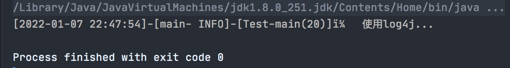
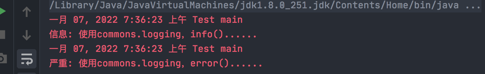
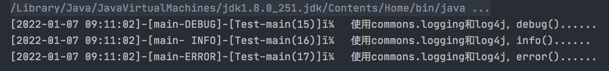
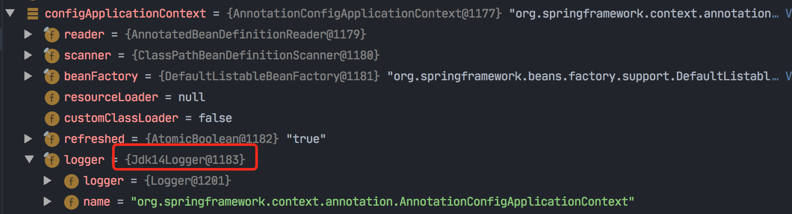
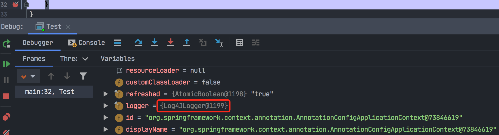
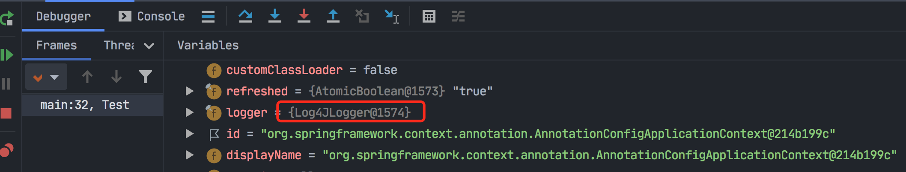
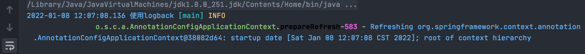
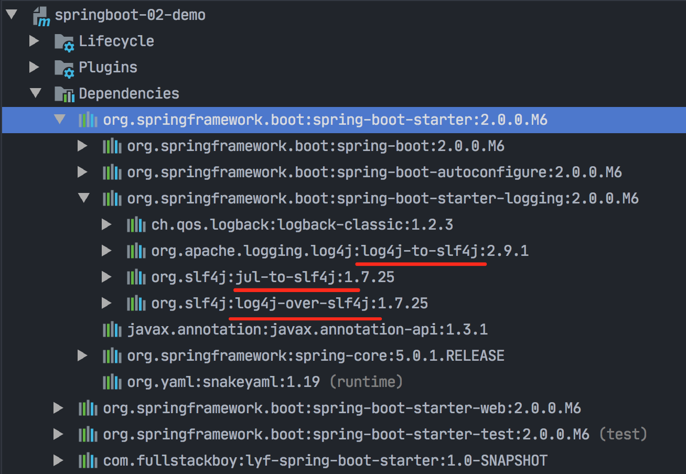
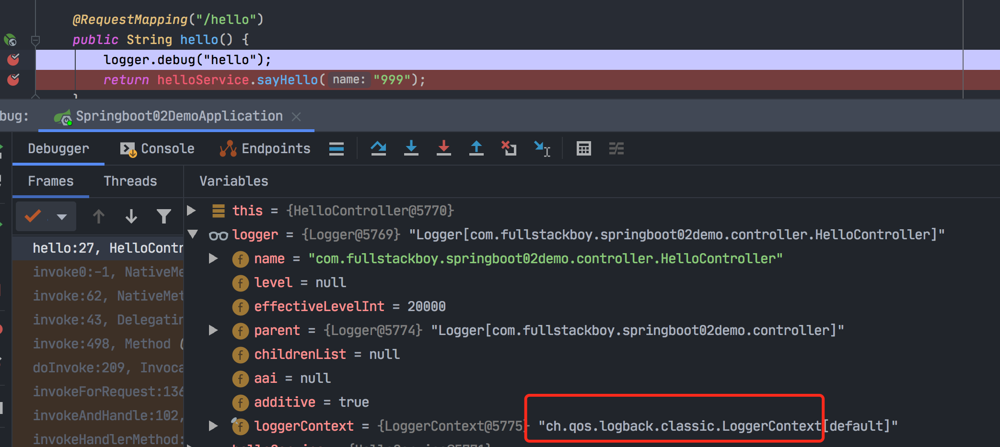

### spring源码编译-准备工作

#### 下载spring源码

使用5.2.19 RELEASE 版本的：

https://github.com/spring-projects/spring-framework.git

spring容器，从代码上理解的话其实就是`AnnotationConfigApplicationContext`这个对象。

详细步骤见： /Users/lyf/study/2021年/儒猿/子路-spring5/01_课前基础知识资料。

#### 建自己的Module

同时使用的是本地的依赖，而不是远程的jar包。

```java
package com.fullstackboy;

import org.springframework.context.annotation.AnnotationConfigApplicationContext;

/**
 * 测试使用目前的这套编译后的源码来讲将自己建的Bean1这个类放到Spring容器中 是否生效
 *
 * @author Liuyongfei
 * @date 2021/12/25 22:34
 */
public class Test {
	public static void main(String[] args) {
		AnnotationConfigApplicationContext context = new AnnotationConfigApplicationContext();
		context.register(Bean1.class);
		context.refresh();
		System.out.println(context.getBean(Bean1.class));
	}
}
```

输出结果：

```java
com.fullstackboy.Bean1@5d6f64b1
```


### Spring日志现象

体会一下：

目前存在有:

 logback-classic、

compile("org.slf4j:slf4j-api")、

compile("org.apache.logging.log4j:log4j-core")、

也就是当前存在有logback + logback的绑定器 + slf4j + log4j2，但是并没有log4j2的绑定器。

所以 @Slf4j ，然后

```java
@Slf4j
public class Test1 {
  @Test
  public void test() {
    log.debug("----");
  }
}
```

// 会查找绑定器，发现只有logback的绑定器，于是会实例化出来logback。

如果你使用了spring的日志技术（什么叫spring的日志技术？=》也就是说你使用的是spring-jcl这个项目中的日志），比如spring的源码，那么就会被log4j2给覆盖。

------------------------------------------------------------------

spring-boot 默认是用`logback`打印日志的。

spring-boot为什么默认采用logback？

### 众多的日志框架

#### java.util.logging.Logger

它是伴随着java发布的时候就有的。

使用：

```java
import java.util.logging.Logger;
Logger logger = Logger.getLogger("a")
logger.info("jul");
```

它打印的日志是特别明显的，文字颜色是红色的。

#### Log4j

然后市面上又出现了一个新的日志框架，就是Log4j，需要有一个配置文件log4j.properties，进行配置。

使用：

```java
import org.apache.log4j.Logger;
Logger logger = Logger.getLogger("a")
logger.info("log4j");
```

#### commons-logging

第三个commons-logging.jar，全称是 jarkart Commons-logging（jcl），为了解决这个硬编码。但现在已经被淘汰了，2014年已经不更新了。

Commons Logging (JCL)提供的是一个日志(Log)接口(interface)，也可称为"Apache Commons Logging"。JCL能够允许开发人员使用不同的具体日志实现工具：log4j，jdk自带的jul，logback等。

spring把这个jar拿过来在它的基础上形成了spring-jcl。

#### Slf4j

slf4j只是一个日志标准（slf4j-api提供接口），并不是日志系统的具体实现，如果项目只有slf4j的包是没有办法实现日志功能的，需要通过绑定器来和具体日志框架工作的。

#### 总结这一周的课程

spring的作者是非常喜欢使用log4j，可以从源代码中看出来。

`因此如果项目中使用了slf4j + logback，然后如果引入一个redis的 jar包，这个包里引入了log4j，那么spring内部的源码还是会使用log4j去打印日志。`

解决办法：

因此虽然我们自己在pom文件中没有引入log4j，但保不齐引入的依赖包里需要使用log4j。

- 一个一劳永逸的解决办法就是添加一个桥接器：`log4j-to-slf4j`；
- 这样，spring内部的源码就也会使用logback打印日志了。


#### 使用各种日志

##### 1、log4j

使用log4j需要引入log4j的配置文件log4j.properties，内容简配一下：

```.properties
log4j.rootLogger = info,stdout
log4j.appender.stdout = org.apache.log4j.ConsoleAppender
log4j.appender.stdout.Target = System.out
log4j.appender.stdout.layout = org.apache.log4j.PatternLayout
log4j.appender.stdout.layout.ConversionPattern = [%-5p] %d{yyyy-MM-dd HH:mm:ss,SSS} method:%l%n%m%n
```

pom文件中只引入log4j的jar包：

```.xml
<dependencies>
  <dependency>
    <groupId>log4j</groupId>
    <artifactId>log4j</artifactId>
    <version>1.2.17</version>
  </dependency>
</dependencies>
```


```java
/**
 * 使用各种日志
 * 1、使用log4j
 * @author Liuyongfei
 * @date 2022/1/5 23:20
 */
public class Test {
    private static Logger logger = Logger.getLogger(Test.class);

    public static void main(String[] args) {
        logger.info("使用log4j...");
    }
}
```



##### 2、JUL

jul是jdk自带的，所以pom文件中不需要引入任何包，直接撸代码：

```java
import java.util.logging.Logger;

/**
 * 使用各种日志
 * 1、使用log4j
 * 2、使用jdk自带的jul
 * @author Liuyongfei
 * @date 2022/1/5 23:20
 */
public class Test {

    private static Logger logger = Logger.getLogger("Test");

    public static void main(String[] args) {
        logger.info("使用jdk自带的jul...");
    }
}

```


##### 3、commons-logging（不添加log4j依赖）

```java
<dependencies>
        <dependency>
            <groupId>commons-logging</groupId>
            <artifactId>commons-logging</artifactId>
            <version>1.2</version>
        </dependency>
    </dependencies>
```

```java
/**
 * 使用各种日志
 * 1、使用log4j
 * 2、使用jdk自带的jul
 * 3、commons-logging，且不添加其它依赖
 * @author Liuyongfei
 * @date 2022/1/5 23:20
 */
public class Test {
    public static Log logger = LogFactory.getLog(Test.class);

    public static void main(String[] args) {
        logger.debug("使用commons.logging，debug()......");
        logger.info("使用commons.logging，info()......");
        logger.error("使用commons.logging，error()......");
    }
}
```

输出结果：




由于没有添加log4j，因此使用的是JDK Logging。

`从结果中可以看到，JDK自带的Logging其实就是一个鸡肋，竟然没有debug级别的日志。。。`

#### 4、commons-logging（添加log4j依赖）

```.xml
<dependencies>
  <dependency>
    <groupId>commons-logging</groupId>
    <artifactId>commons-logging</artifactId>
    <version>1.2</version>
  </dependency>
  <dependency>
    <groupId>log4j</groupId>
    <artifactId>log4j</artifactId>
    <version>1.2.17</version>
  </dependency>
</dependencies>
```

```java
/**
 * 使用各种日志
 * 1、使用log4j
 * 2、使用jdk自带的jul
 * 3、commons-logging，且不添加其它依赖
 * 4、commons-logging，添加log4j依赖
 * @author Liuyongfei
 * @date 2022/1/5 23:20
 */
public class Test {
    public static Log logger = LogFactory.getLog(Test.class);

    public static void main(String[] args) {
        logger.debug("使用commons.logging和log4j，debug()......");
        logger.info("使用commons.logging和log4j，info()......");
        logger.error("使用commons.logging和log4j，error()......");
    }
}
```




##### 总结

- commons-logging能够选择使用log4j，还是使用JDK logging，但是它不依赖Log4j，JDK Logging的API；
- 如果项目的classpath中包含了log4j的类库，就会使用log4j，否则就使用JDK Logging；
- 使用JDK Logging能够灵活的选择使用哪种日志，而且不用修改源代码。

#### logback-classic

是一个绑定器，包含slf4j-api、logback-core、logback-classic（绑定器自己）。

##### 源码探究

这个日志很眼熟呀，长得像上面JUL打印出来的日志。于是看一下源码：

org.apache.commons.logging.LogFactory：

```java
public static Log getLog(Class clazz) throws LogConfigurationException {
        return getFactory().getInstance(clazz);
    }
```

org.apache.commons.logging.impl.LogFactoryImpl类：

```java
private static final String[] classesToDiscover = new String[]{"org.apache.commons.logging.impl.Log4JLogger", "org.apache.commons.logging.impl.Jdk14Logger", "org.apache.commons.logging.impl.Jdk13LumberjackLogger", "org.apache.commons.logging.impl.SimpleLog"};
```

org.apache.commons.logging.impl.LogFactoryImpl类，discoverLogImplementation方法：

```
for(int i = 0; i < classesToDiscover.length && result == null; ++i) {
	result = this.createLogFromClass(classesToDiscover[i], logCategory, true);
}
```

LogFactory.class：

```java
public static LogFactory getFactory() throws LogConfigurationException {
    factory = newFactory("org.apache.commons.logging.impl.LogFactoryImpl", thisClassLoader, contextClassLoader);
    ....
}
```

我们在引入log4j后，其他代码不做修改，这样按照数组顺序，就打印出了log4j日志。

`由此可以看出，JCL只是起到一个中间商赚差价的作用，在有log4j的时候使用log4j，否则使用jul。`

#### 总结

1. JCL有两个基本的抽象类：Log（基本记录器）和LogFactory（负责创建Log实例）；

2. 当 commons-logging.jar 加入到CLASSPATH 之后，它会合理的猜想你想用的日志工具，然后进行自我设置，用户不需要做任何设置；

3. 默认的logFactory是按照下列的步骤去发现并决定那个日志工具将被使用的（按照顺序，寻找过程会在找到第一个工具时中止） :

   - 首先在classpath下寻找commons-logging.properties文件。
     - 如果找到，则使用其中定义的Log实现类；
     - 如果找不到，则在查找是否已定义系统环境变量org.apache.commons.logging.Log，找到则使用其定义的Log实现类；
   - 查看 CLASSPATH 中是否有log4j的包，如果发现，则自动使用log4j做为日志实现类；
   - 否则，使用JDK自身的日志实现类（JDK1.4之后才有日志实现类）；
   - 否则，使用commons-logging自己提供的一个简单的日志实现类SimpleLog；

   

   org.apache.commons.logging.Log 的具体实现有如下：

   ---org.apache.commons.logging.impl.Jdk14Logger 　使用 JDK1.4 。

   ---org.apache.commons.logging.impl.Log4JLogger 　使用 Log4J 。

   ---org.apache.commons.logging.impl.LogKitLogger    使用 avalon-Logkit 。

   ---org.apache.commons.logging.impl.SimpleLog 　    common-logging 自带日志实现类。

   ---org.apache.commons.logging.impl.NoOpLog          common-logging 自带日志实现类。它实现了 Log 接口。 其输出日志的方法中不进行任何操作。
   


#### spring4的日志体系

https://www.cnblogs.com/wudb/p/11511266.html

上面说了那么多，只是介绍了一部分日志技术，接下来我们分别分析spring4和spring5的日志体系。

##### 构建spring4项目

采用java+注解方式快速构建，pom中只引入spring-context包：

```pom.xml
<dependency>
  <groupId>org.springframework</groupId>
  	<artifactId>spring-context</artifactId>
  <version>4.3.14.RELEASE</version>
</dependency>
```

代码：

```java
/**
 * spring4日志体系

 * @author Liuyongfei
 * @date 2022/1/7 23:38
 */
public class Test {
    public static void main(String[] args) {
        AnnotationConfigApplicationContext configApplicationContext = new AnnotationConfigApplicationContext(Test.class);
    }
}
```




可以看出，使用的Log是JUL。也就是说在默认的spring日志体系下，采用的是JUL。

接下来，按照之前的方法引入log4j：

```.xml
<dependencies>
        <dependency>
            <groupId>org.springframework</groupId>
            <artifactId>spring-context</artifactId>
            <version>4.3.14.RELEASE</version>
        </dependency>
        <dependency>
            <groupId>log4j</groupId>
            <artifactId>log4j</artifactId>
            <version>1.2.17</version>
        </dependency>
    </dependencies>
```

debug运行上面的程序，再次查看日志类型：


发现这次在增加log4j jar包和配置文件的情况下，spring4使用了log4j，这么像JCL呢？

#### spring4里边怎么使用高阶的日志框架：Logback

Logback是由log4j创始人设计的又一个开源日志组件。Logback当前分成三个模块：

- Logback-core
- Logback-classic
- Logback-access

Logback-classic是log4j的一个改良版本。此外，Logback完整的实现了SLF4J API，使你可以很方便地更换成其它日志系统如log4j或JDK14 Logging。

在pom.xml里添加logback依赖：

```.xml
<dependency>
       <dependency>
            <groupId>org.springframework</groupId>
            <artifactId>spring-context</artifactId>
            <version>4.3.14.RELEASE</version>
        </dependency>
        <dependency>
            <groupId>log4j</groupId>
            <artifactId>log4j</artifactId>
            <version>1.2.17</version>
        </dependency>
       <dependency>
            <groupId>ch.qos.logback</groupId>
            <artifactId>logback-classic</artifactId>
            <version>1.2.7</version>
        </dependency>
</dependency>
```

logback.xml：

```xml
<?xml version="1.0" encoding="UTF-8"?>
<configuration>
    <timestamp key="bySecond" datePattern="yyyyMMdd"/>
    <appender name="FILE" class="ch.qos.logback.core.FileAppender">
        <file>/data/application/logs/logtest/logtest-${bySecond}.log</file>
        <encoder><!-- 必须指定，否则不会往文件输出内容 -->
            <pattern>%date %level %thread %10logger %file %line %msg %n</pattern>
        </encoder>
        <append>true</append>
        <prudent>false</prudent>
    </appender>

    <appender name="STDOUT" class="ch.qos.logback.core.ConsoleAppender">
        <!-- encoders are assigned the type ch.qos.logback.classic.encoder.PatternLayoutEncoder
            by default -->
        <encoder>
            <!-- <pattern>%-4relative [%thread] %-5level %logger{35} - %msg %n</pattern> -->
<!--            <pattern>%blue 测试：%date %level %thread %10logger %file %line %msg %n</pattern>-->
            <pattern>
                %highlight(%date{yyyy-MM-dd HH:mm:ss.SSS} 使用logback) %cyan([%thread]) %yellow(%-5level)
                %green(%logger{36}).%gray(%M)-%boldMagenta(%line) - %blue(%msg%n)
            </pattern>
        </encoder>
    </appender>

    <root level="INFO">
        <appender-ref ref="FILE" />
        <appender-ref ref="STDOUT" />
    </root>
</configuration>
```


代码：

```java
public class Test {
    public static void main(String[] args) {
        AnnotationConfigApplicationContext configApplicationContext = new AnnotationConfigApplicationContext(Test.class);
    }
}
```

直接打印，发现还是使用的log4j：




如果就是要用logback，该怎么做呢？

这时可以借助`log4j-over-slf4j`桥接器，添加log4j-over-slf4j：

```xml
<dependencies>
        <dependency>
            <groupId>org.springframework</groupId>
            <artifactId>spring-context</artifactId>
            <version>4.3.14.RELEASE</version>
        </dependency>
        <dependency>
            <groupId>log4j</groupId>
            <artifactId>log4j</artifactId>
            <version>1.2.17</version>
        </dependency>
        <dependency>
            <groupId>ch.qos.logback</groupId>
            <artifactId>logback-classic</artifactId>
            <version>1.2.7</version>
        </dependency>
        <!--添加桥接器，将log4j桥接到logback-->
        <dependency>
            <groupId>org.slf4j</groupId>
            <artifactId>log4j-over-slf4j</artifactId>
            <version>1.7.25</version>
        </dependency>
    </dependencies>
```

`注意：`

由于log4j-over-slf4j里边有自己的log4j，需要将原本pom里引入的log4注释掉，要不然日志打印不出来。

log4j-over-slf4j和log4j不能同时出现，两个jar包都有org.apache.log4j.Logger会冲突。

```xml
<dependencies>
        <dependency>
            <groupId>org.springframework</groupId>
            <artifactId>spring-context</artifactId>
            <version>4.3.14.RELEASE</version>
        </dependency>
        <dependency>
            <groupId>ch.qos.logback</groupId>
            <artifactId>logback-classic</artifactId>
            <version>1.2.7</version>
        </dependency>
        <!--添加桥接器，将log4j桥接到logback-->
        <dependency>
            <groupId>org.slf4j</groupId>
            <artifactId>log4j-over-slf4j</artifactId>
            <version>1.7.25</version>
        </dependency>
    </dependencies>
```



输出结果：



#### spring5日志新特性详解


spring5使用的日志是spring-jcl。


可见spring的作者是比较偏爱log4j2。

#### SpringBoot的日志体系



可以看到，springboot默认用了三个桥接器。说明springboot的作者还是比较喜欢slf4j。

不管是你自己引进log4j 1，还是log4j 2，还是jul，最终都给桥接到slf4j，使用logback。

为什么要这么做呢？

因为springboot 启动的时候会加载各种starter，如果每个starter用的日志框架都不一样，且springboot不做统一处理的话，那么整个springboot项目就会出现各种的日志，就不会兼容别人了。

经过这几个桥接器，最终都统一使用了slf4j-》logback：



