https://www.bilibili.com/video/BV18E411x7eT?p=25&spm_id_from=pageDriver

### 什么是微服务

1. 微服务架构是一种架构模式，它提倡将单一应用程序划分为一组小的服务，服务之间互相协调、互相配合，为用户提供最终价值。

2. 每个服务运行在其独立的进程中，服务与服务间采用轻量级的通信机制互相协作（通常是基于HTTP协议的RestFul API）。

3. 每个服务都围绕着具体业务进行构建，并且能够被独立的部署到生产环境、类生产环境等。

### SpringCloud简介

1. SpringCloud 是分布式微服务架构的一种具体体现。

2. SpringCloud是分布式微服务架构的一站式解决方案，是多种微服务架构落地技术的集合体，俗称`微服务全家桶。`


### 使用版本

我们的数据巴士用的 

Spring Boot 版本：2.2.1.RELEASE；

Spring Cloud 版本：Hoxton.RC1。


### 本次视频教程中项目用的版本


### Cloud组件停更说明


### 创建工程


### 支付模块构建

上、中、下，一共三节。

 支付模块服务：cloud-provider-payment8001

### 消费者订单模块

RestTemplate 提供了多种便捷访问远程Http服务的方法。

是一种便捷的访问restful服务模板类，是spring提供的用于访问rest服务的客户端模板工具集。

### 工程重构

每个服务中有重复部分


### 支付微服务集群配置

重点关注：

```java
@Bean
@LoadBalanced
RestTemplate restTemplate() {
  return new RestTemplate();
}
```

服务间的调用：

```java
String s = staticRestTemplate.postForObject("http://" + kafkaAppName + "/send", map, String.class);
```

这个 @LoadBalanced 注解，是Ribbon的负载均衡功能注解，赋予 RestTemplate 负载均衡的能力。

Ribbon和Eureka结合后，可以直接调用服务而不用关心地址和端口号，且该服务还有负载均衡功能了。


#### 服务发现Discovery

@EnableDiscoveryClient 注解。

可以 拿到注册到 eureka 上的服务信息。

详见：/Users/lyf/Workspace/www/cloud2020/cloud-provider-payment8001/src/main/java/com/atguigu/springcloud/controller/PaymentController.java

### Eureka自我保护理论知识

#### 是什么是自我保护模式

默认情况下，如果EurekaServer在一定时间内没有接收到某个微服务实例的心跳，EurekaServer将会注销该实例（默认90秒）。

但是当网络分区故障发生（延时、卡顿、拥挤）时，微服务与Eureka之间无法正常通信，以上行为可能就变得非常危险了- 因为微服务本身是健康的，`此时本不应该注销这个微服务`。Eureka通过`自我保护模式`来解决这个问题，当EurekaServer节点在短时间内丢失过多客户端时（可能发生了网络分区故障），那么这个节点就进入自我保护模式。

它的设计哲学是，宁可保留错误的服务注册信息，也不盲目注销任何可能健康的服务实例。一句话讲解：好死不如赖活着。

属于CAP里的AP分支。

开发中经常的做法是：关闭自我保护。

#### 为什么会产生自我保护机制

为了防止 EurekaClient 可以正常运行，但是与 EurekaServer 网络不同的情况下，EurekaServer 误删掉 EurekaClient。

#### 什么是CAP原则

`CAP`原则又称`CAP`定理， 指的是在一个`分布式系统`中， `Consistency`（一致性） 、`Availability`（可用性） 、 `Partition tolerance`（分区容错性，可以理解为分布式系统） ， 三者不可兼得。


#### 关闭自我保护机制

EurekaServer端：

```yml
eureka:
	server:
		enable-self-preservation: false
		eviction-interval-timer-in-ms: 2000
```

默认是true，给改为false。

客户端：

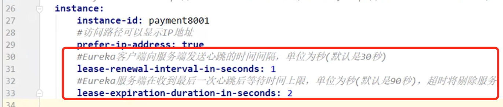


### SpringCloud整合Zookeeper代替Eureka：支付服务注册进zookeeper

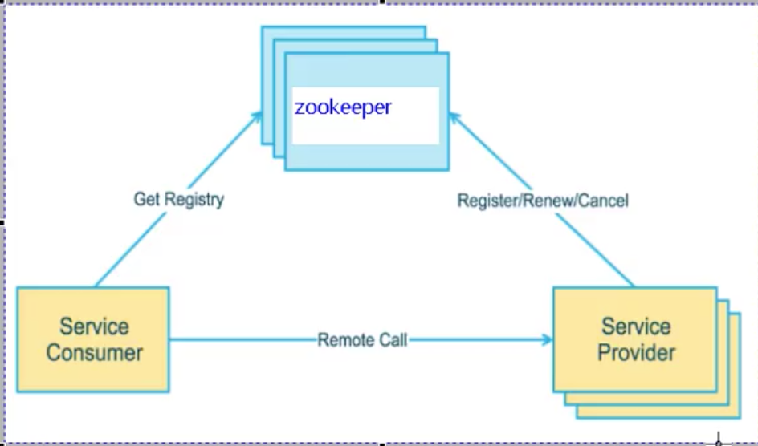

springcloud整合zookeeper替代eureka。=》发现很多公司还在用zookeeper，所以这里就讲了一下。

测试使用 zookeeper，不使用 eureka。

- zookeeper是一个分布式协调工具，可以实现注册中心功能；
- 关闭linux服务器后，启动zookeeper服务器；
- zookeeper服务器替代eureka服务器，zk做为服务注册中心；

#### zookeeper服务

在192.168.111.144机器上安装zookeeper，端口号为2181。

#### 服务提供者

/Users/lyf/Workspace/www/cloud2020/cloud-provider-payment8004

##### 测试

成功启动服务 cloud-provider-payment8004后，访问zk，会有一个节点生成：

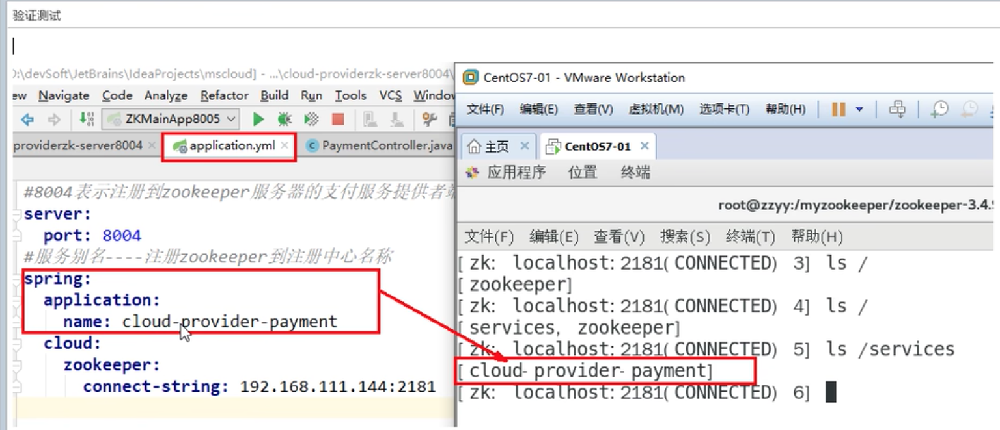

这说明服务注册进zookeeper成功。

再来看一下服务访问是否成功：

访问 localhost:8004/payment/zk，可以正常输出结果。=》程序调通。

##### 验证测试2

继续深挖zookeeper里的内容：

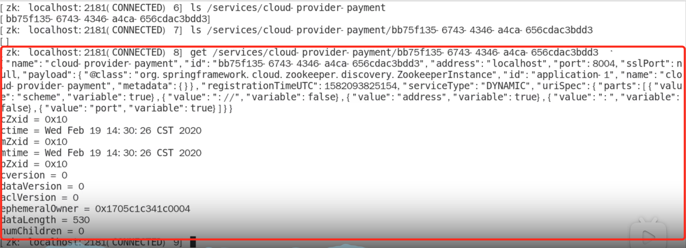

可以看到该服务对应的node节点信息：


##### 思考：zookeeper中的微服务对应的这个node节点是临时的还是永久的

1. 在使用eureka做为注册中心时，偶尔服务发生故障时，eureka由于自我保护机制并不会把这个服务摘除；
2. 在我们这个测试中，使用zookeeper做为注册中心时，把cloud-provider-payment8004服务停掉后，去zookeeper上查看，该节点并没有立即消失：
   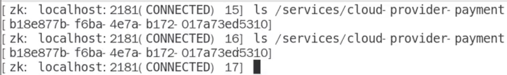

 稍微等一会儿，在等待一定的心跳时间后，再次查看：

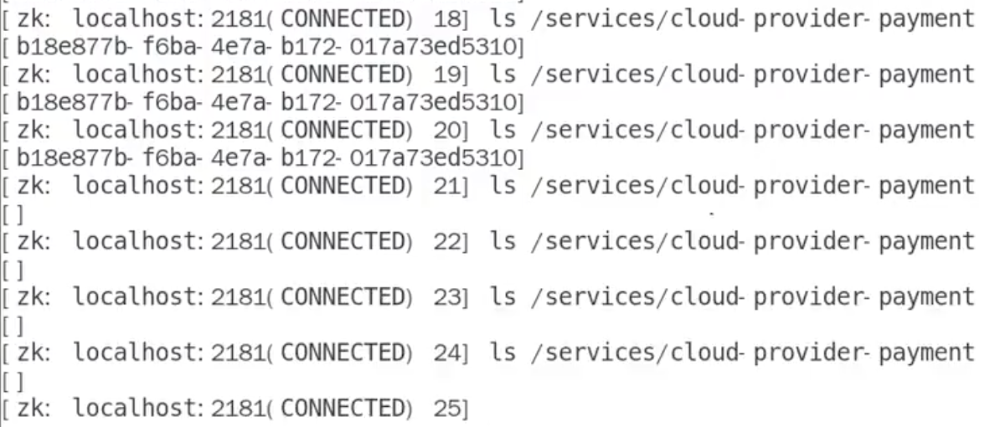

可以看到，zookeeper的做法是，在等待一定的心跳时间后，还没有反应，则就不客气了，就把node节点给干掉了。

结论：`zookeeper中的微服务对应的这个node节点是临时的。`

然后这时候重新启动服务，再去zookeeper里查看，会发现这个node节点对应的service流水号是不一样的。

所以，看到这里就要深刻体会CAP理论里的 CP和AP。

#### 服务消费者

/Users/lyf/Workspace/www/cloud2020/cloud-consumerzk-order80

在没有讲 Ribbon 之前，还是用 RestTemplate 来进行 http 调用。

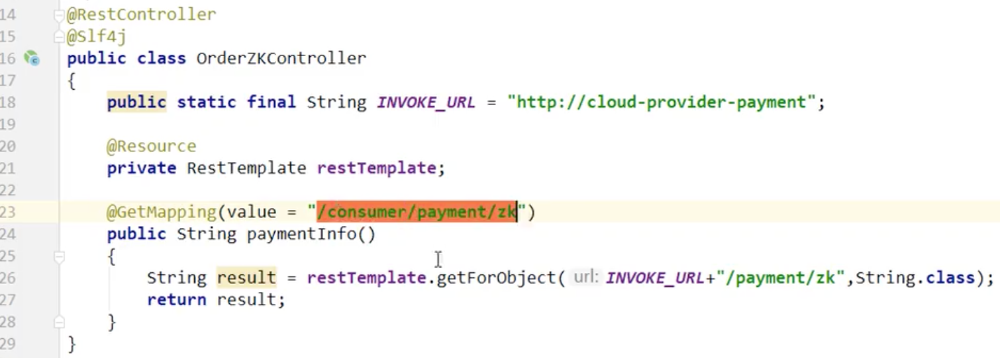

### Consul

是一套开源的分布式服务发现和配置管理系统，使用GO语言开发的。


现在用 Nacos 更多一些。

#### 安装并运行Consul

官网下载，然后安装。

#### 服务提供者

/Users/lyf/Workspace/www/cloud2020/cloud-providerconsul-payment8006

#### 服务消费者

/Users/lyf/Workspace/www/cloud2020/cloud-consumerconsul-order80

### 三个注册中心异同点

#### 什么是CAP原则

`CAP`原则又称`CAP`定理， 指的是在一个`分布式系统`中， `Consistency`（一致性） 、`Availability`（可用性） 、 `Partition tolerance`（分区容错性，可以理解为分布式系统） ， 三者不可兼得。

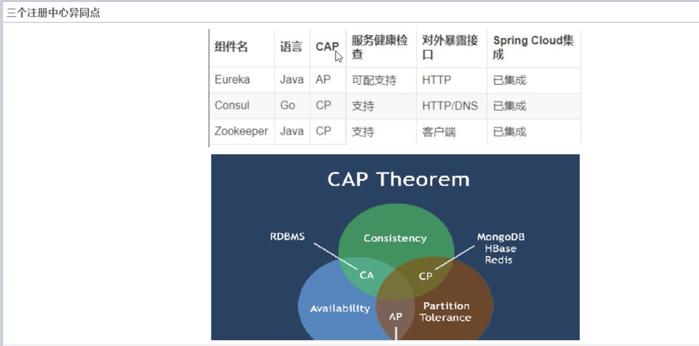

#### AP架构

保证微服务的高可用，服务一时出现故障，不会把服务摘除掉，好死不如赖活着。

#### CP架构

当网络分区出现后，为了保证一致性，就必须拒绝请求，否则无法保证一致性。

结论：违背了可用性A的要求，只满足一致性和分区容错，即CP。

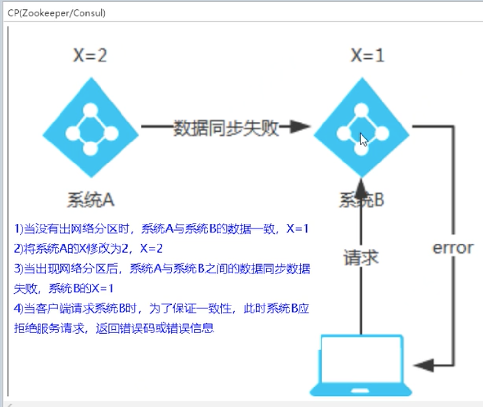

### Ribbon入门介绍

Spring Cloud Ribbon 是基于 Netiflix Ribbon 实现的一套 `客户端负载均衡的工具。`


ribbon 也进入维护模式了，Spring Cloud 想用  Spring Cloud loadbalancer 来替代，但目前ribbon生命力还很顽强，很多的大型项目生产环境中还在部署着。

nginx相当于大门。=》属于集中式 LB。

ribbon相当于科室内的负载均衡，告诉你去找哪个轮班的医生。=》属于 进程内 LB。

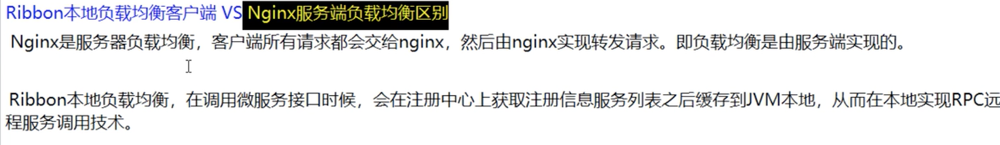

####  总结：

什么叫 ribbon：=》负载均衡 + RestTemplate 调用。

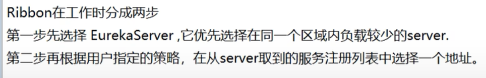

#### Ribbon默认自带的负载规则

##### Ribbon核心组件IRule

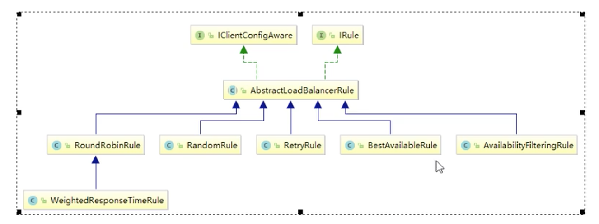

常用的几个落地的实现规则有：

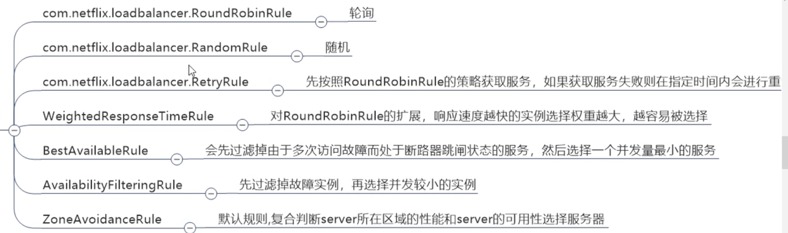

#### Ribbon负载规则替换

见 /Users/lyf/Workspace/www/cloud2020/cloud-consumer-order80

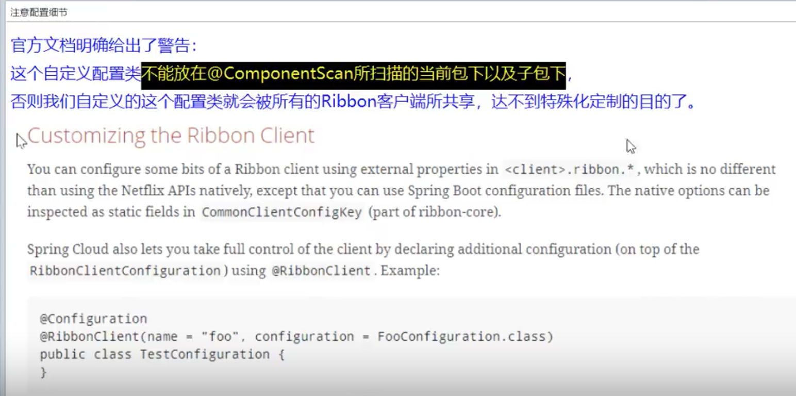

所以这里新建一个目录，叫myrule，与springcloud 保持平级即可。

#### Ribbon默认负载轮询算法原理

RoundRobinRule 的负载均衡算法：

rest接口第几次请求 % 服务集群总数量 = 实际调用服务器下标。每次服务重启后rest接口技术从1开始。

#### 手写一个负载的算法

自己试着写一个本地负载均衡器试试：/Users/lyf/Workspace/www/cloud2020/cloud-consumer-order80/src/main/java/com/atguigu/springcloud/lb/MyLB.java

使用了CAS+自旋锁。

- 7001，7002 集群启动；

- 8001/8002 微服务改造

  - /Users/lyf/Workspace/www/cloud2020/cloud-provider-payment8001和/Users/lyf/Workspace/www/cloud2020/cloud-provider-payment8002的PaymentController添加：

    ```java
    @GetMapping(value = "/payment/lb")
    public String getPaymentLB()
    {
      return serverPort;
    }
    ```

    

- 80 订单服务改造

/Users/lyf/Workspace/www/cloud2020/cloud-consumer-order80/src/main/java/com/atguigu/springcloud/controller/OrderController.java：

该方法演示，使用自己写的轮询算法，去访问其它微服务（支付服务的/payment/lb 方法）：

```java
@GetMapping(value = "/consumer/payment/lb")
public String getPaymentLB()
{
    List<ServiceInstance> instances = discoveryClient.getInstances("CLOUD-PAYMENT-SERVICE");

    if(instances == null || instances.size() <= 0)
    {
        return null;
    }

    ServiceInstance serviceInstance = loadBalancer.instances(instances);
    URI uri = serviceInstance.getUri();

    return restTemplate.getForObject(uri+"/payment/lb",String.class);

}
```

可以看到输出结果轮询输出 8001/8002 这两个端口号。

### OpenFeign是什么

OpenFeign 是服务之间的调用。可以理解为 Feign和OpenFeign 其实是一回事儿，只不过 Spring Cloud又在 Feign的基础上进行了扩充。

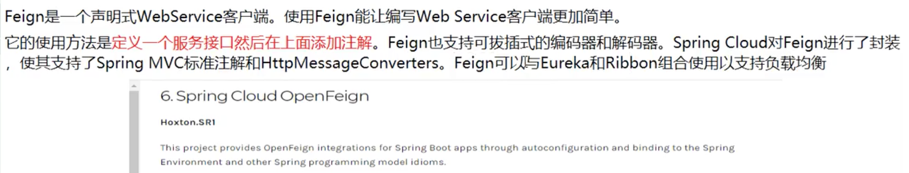

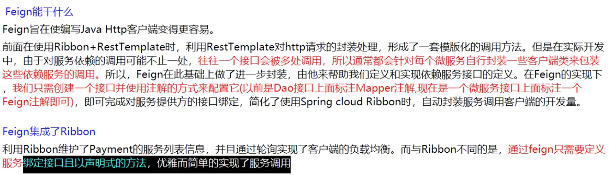

在使用 Mybatis时，只需要在Dao层的interface上添加一个 @Mapper 注解即可实现对数据库的访问。

那么OpenFeign也大概干的是类似的事情。=》`微服务调用接口 + @FeignClient 注解。`	

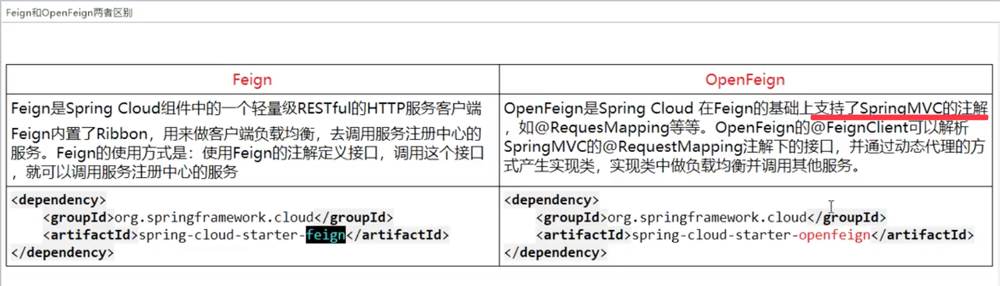

#### OpenFeign服务调用

1. 新建 /Users/lyf/Workspace/www/cloud2020/cloud-consumer-feign-order80；

2. 在入口启动类上要添加 @EnableFeignClients 注解 =》意思是，使用Feign，激活并开启；

3. 新建 PaymentFeignService：

   ```java
   @Component
   @FeignClient(value = "CLOUD-PAYMENT-SERVICE") // 告诉 Feign 去找名字叫 CLOUD-PAYMENT-SERVICE 的微服务
   public interface PaymentFeignService
   {
       // 相当于就是调 8001 的地址为 /payment/get/{id} 的接口
       // 比如，你是想要访问 8001 的PaymentService的getPaymentById方法，则此时就可以新建一个PaymentFeignService的getPaymentById 方法
       @GetMapping(value = "/payment/get/{id}")
       public CommonResult<Payment> getPaymentById(@PathVariable("id") Long id);
   
       @GetMapping(value = "/payment/feign/timeout")
       public String paymentFeignTimeout();
   }
   ```

   

4. 添加OrderFeignController的getPaymentById访问方法。

#### OpenFeign 超时控制

演示见 /Users/lyf/Workspace/www/cloud2020/cloud-consumer-feign-order80/src/main/java/com/atguigu/springcloud/controller/OrderFeignController.java的paymentFeignTimeout方法，会报一个访问超时的错误。

OpenFeign默认只等待1秒钟，但是服务端处理需要超过1秒钟，导致Feign客户端不想等待了，直接返回报错。

为了避免这样的情况，有时我们需要设置Feign客户端的超时控制。

在80服务的配置文件里添加：

```yml
#设置feign客户端超时时间(OpenFeign默认支持ribbon)
ribbon:
#指的是建立连接所用的时间，适用于网络状况正常的情况下,两端连接所用的时间
  ReadTimeout: 5000
#指的是建立连接后从服务器读取到可用资源所用的时间
  ConnectTimeout: 5000
```


还可以通过日志配置，详细的显示出 OpenFeign的调用链路情况。

### Hystrix是什么

#### 分布式系统面临的问题

复杂分布式体系结构中的应用程序有数十个依赖关系，每个依赖关系在某些时候将不可避免的失败。


ada

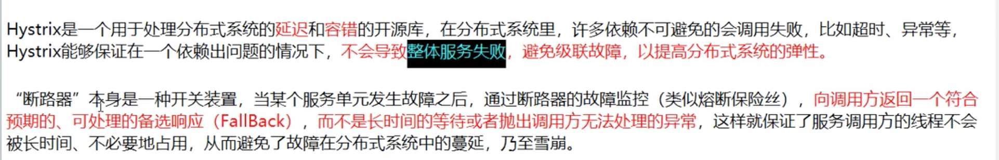


最重要的三个是：服务熔断、服务降级、接近实时的监控。

#### 概念：服务降级

fallback

假设对方系统不好用了，不让客户端继续等待，你要给我一个兜底的解决方案，并立即返回一个友好的提示fallback。

比如：给一个友好的提示：服务器忙，请稍后再试。

##### 哪些情况会触发服务降级

1. 程序运行异常；
2. 超时；
3. 服务熔断时触发服务降级；
4. 线程池/信号量打满，也会导致服务降级。


#### 概念：服务熔断

break

#### 概念：服务限流

flowlimit


