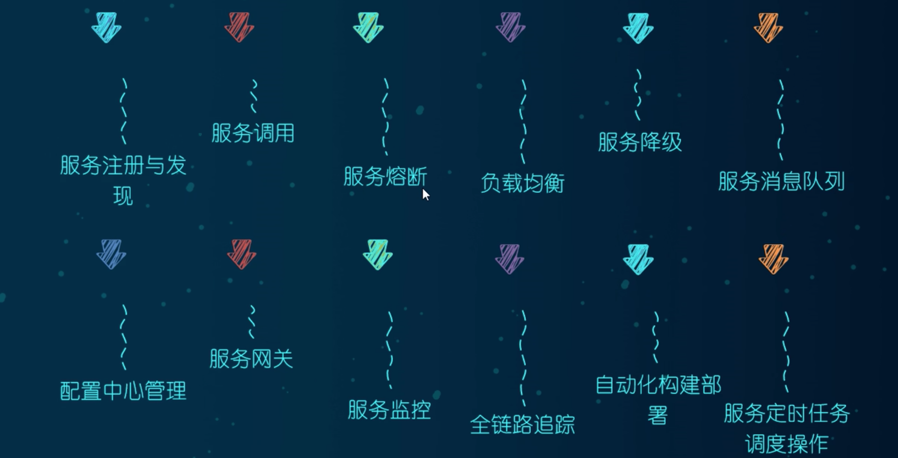
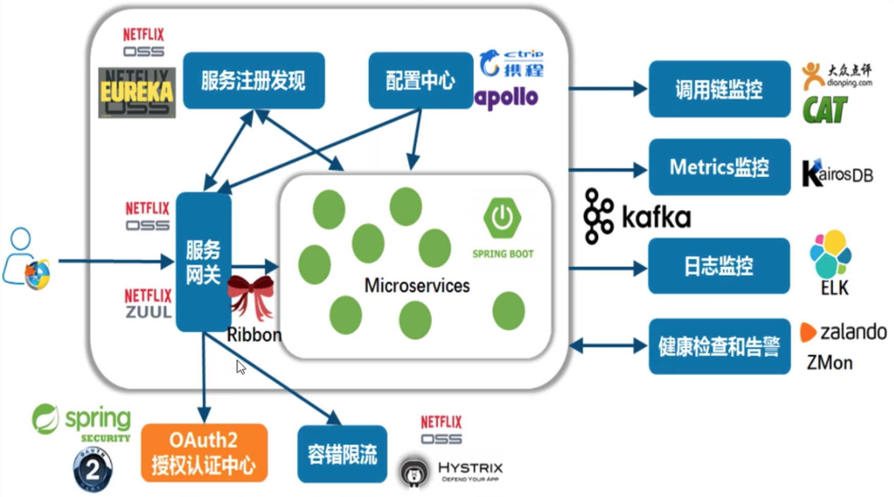
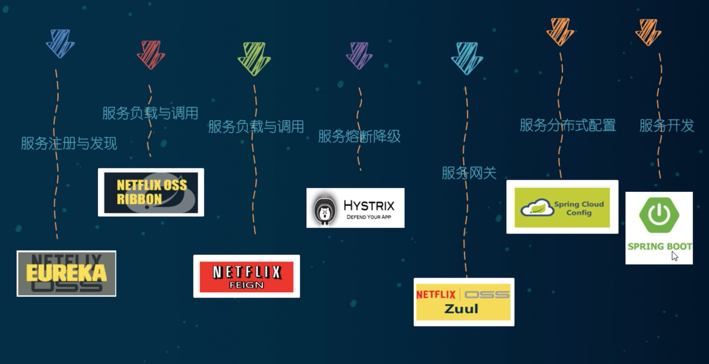
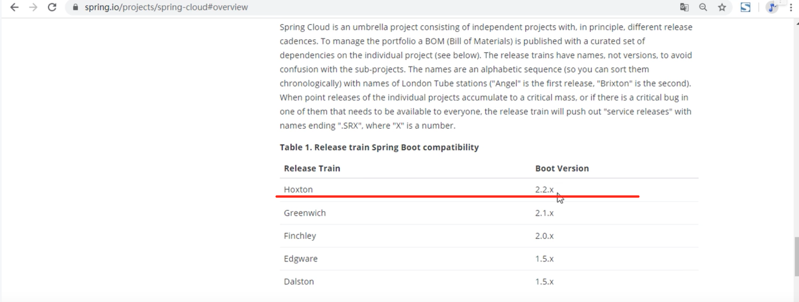
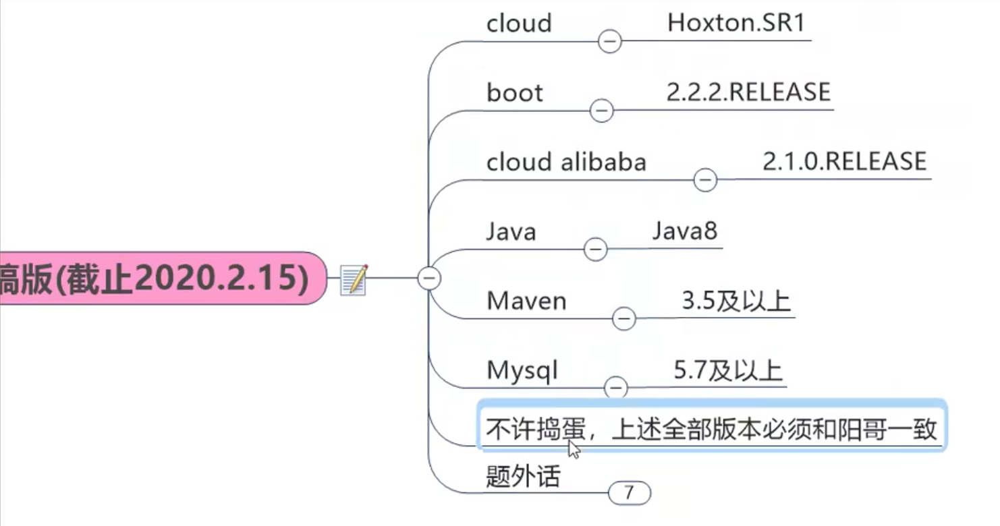
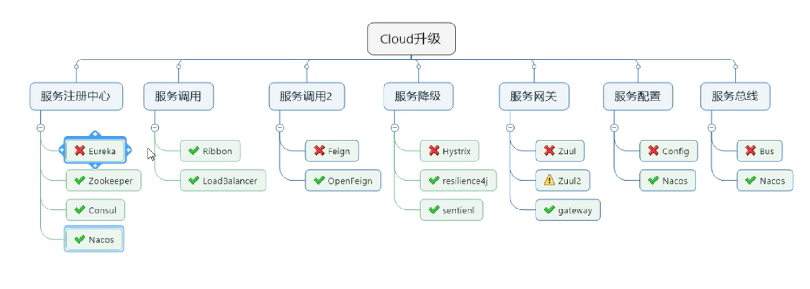
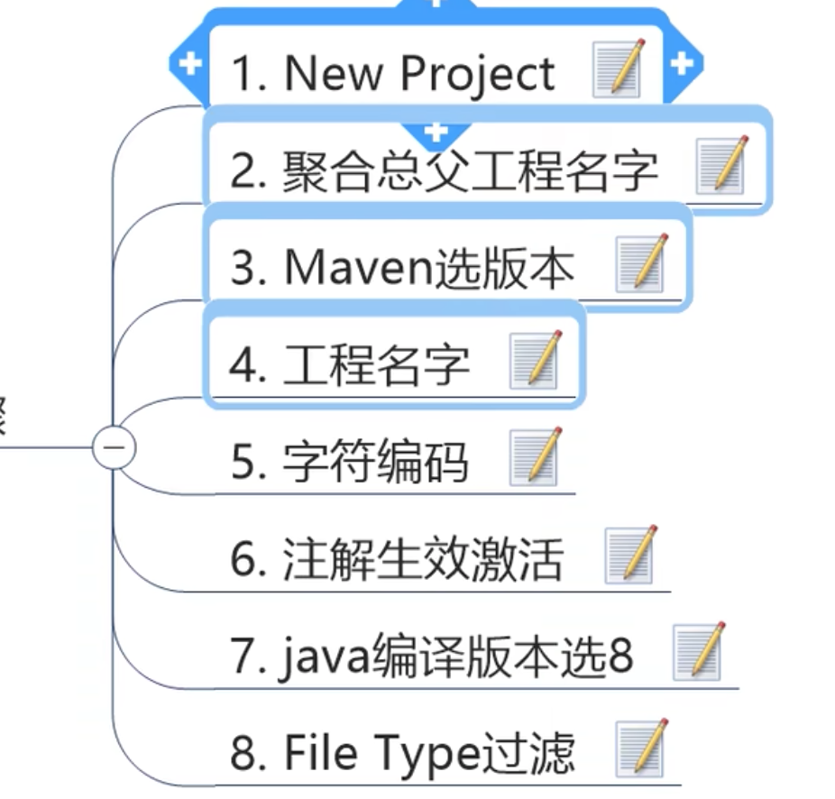
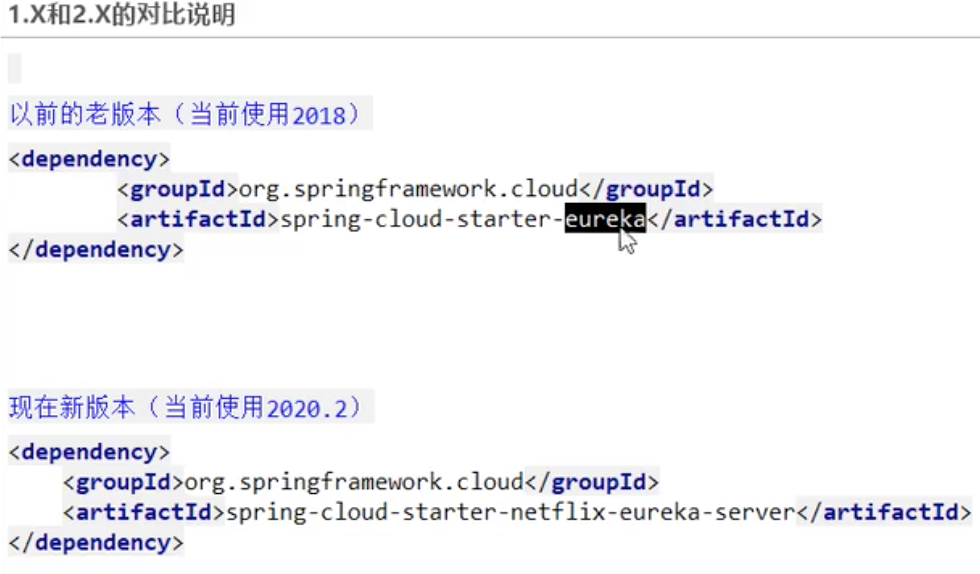

https://www.bilibili.com/video/BV18E411x7eT?p=25&spm_id_from=pageDriver

### 什么是微服务

1. 微服务架构是一种架构模式，它提倡将单一应用程序划分为一组小的服务，服务之间互相协调、互相配合，为用户提供最终价值。

2. 每个服务运行在其独立的进程中，服务与服务间采用轻量级的通信机制互相协作（通常是基于HTTP协议的RestFul API）。

3. 每个服务都围绕着具体业务进行构建，并且能够被独立的部署到生产环境、类生产环境等。

### SpringCloud简介

1. SpringCloud 是分布式微服务架构的一种具体体现。

2. SpringCloud是分布式微服务架构的一站式解决方案，是多种微服务架构落地技术的集合体，俗称`微服务全家桶。`









### 使用版本

我们的数据巴士用的 

Spring Boot 版本：2.2.1.RELEASE；

Spring Cloud 版本：Hoxton.RC1。



### 本次视频教程中项目用的版本




### Cloud组件停更说明



### 创建工程



### 支付模块构建

上、中、下，一共三节。

 支付模块服务：cloud-provider-payment8001

### 消费者订单模块

RestTemplate 提供了多种便捷访问远程Http服务的方法。

是一种便捷的访问restful服务模板类，是spring提供的用于访问rest服务的客户端模板工具集。

### 工程重构

每个服务中有重复部分



### 支付微服务集群配置

重点关注：

```java
@Bean
@LoadBalanced
RestTemplate restTemplate() {
  return new RestTemplate();
}
```

服务间的调用：

```java
String s = staticRestTemplate.postForObject("http://" + kafkaAppName + "/send", map, String.class);
```

这个 @LoadBalanced 注解，是Ribbon的负载均衡功能注解，赋予 RestTemplate 负载均衡的能力。

Ribbon和Eureka结合后，可以直接调用服务而不用关心地址和端口号，且该服务还有负载均衡功能了。


#### 服务发现Discovery

@EnableDiscoveryClient 注解。

可以 拿到注册到 eureka 上的服务信息。

详见：/Users/lyf/Workspace/www/cloud2020/cloud-provider-payment8001/src/main/java/com/atguigu/springcloud/controller/PaymentController.java

### Eureka自我保护理论知识

#### 是什么是自我保护模式

默认情况下，如果EurekaServer在一定时间内没有接收到某个微服务实例的心跳，EurekaServer将会注销该实例（默认90秒）。

但是当网络分区故障发生（延时、卡顿、拥挤）时，微服务与Eureka之间无法正常通信，以上行为可能就变得非常危险了- 因为微服务本身是健康的，`此时本不应该注销这个微服务`。Eureka通过`自我保护模式`来解决这个问题，当EurekaServer节点在短时间内丢失过多客户端时（可能发生了网络分区故障），那么这个节点就进入自我保护模式。

它的设计哲学是，宁可保留错误的服务注册信息，也不盲目注销任何可能健康的服务实例。一句话讲解：好死不如赖活着。

属于CAP里的AP分支。

#### 为什么会产生自我保护机制

为了防止 EurekaClient 可以正常运行，但是与 EurekaServer 网络不同的情况下，EurekaServer 误删掉 EurekaClient。

#### 什么是CAP原则

`CAP`原则又称`CAP`定理， 指的是在一个`分布式系统`中， `Consistency`（一致性） 、`Availability`（可用性） 、 `Partition tolerance`（分区容错性） ， 三者不可兼得。

