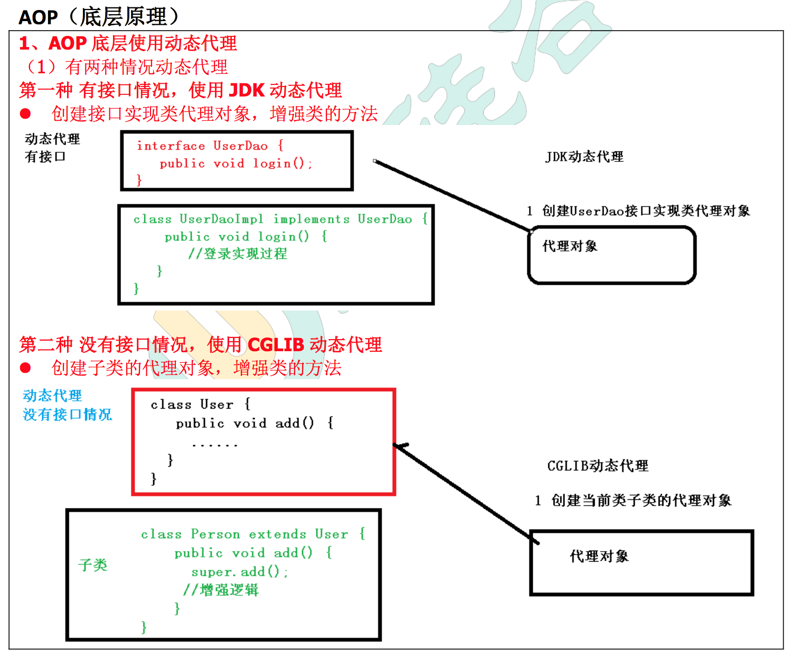
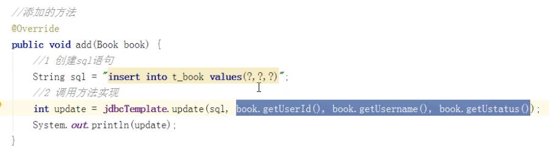
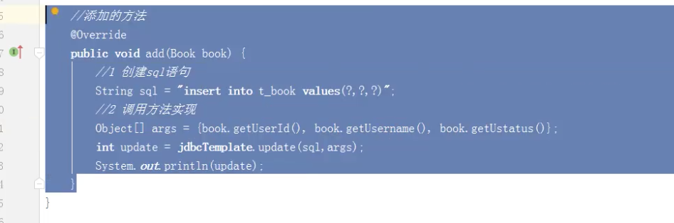

### AOP（概念）

面相切面编程。利用AOP可以是业务逻辑的各个部分分离开来，从而使得业务逻辑各部分之间的耦合度降低。

通俗理解就是：不用修改源代码就可以在主干功能上添加新功能。

### AOP底层原理

aop底层是使用**动态代理**方式来增强类中的某个方法。

动态代理有两种方式：

1. 有接口的情况，使用JDK动态代理；
2. 没有接口的情况，使用cglib动态代理。




### AOP术语

#### 1、连接点

在一个类中，哪些方法可以被增强，这些方法就叫 连接点。

比如：

```java
public class User {

   public void add() {
   
   }
   
   public void update() {
   
   }
   
   public void delete() {
   
   }
}
```

在User类中，add()、update()、delete() 这几个方法都叫 连接点。

#### 2、切入点

实际被增强的方法就叫 切入点。

#### 3、通知（增强）

实际增强的逻辑部分就叫做增强，比如登录的时候 加的那个 权限判断功能 就叫通知（增强）。

##### 通知有多种类型

##### 前置通知

##### 后置通知

##### 环绕通知

在前面和后边都增强

##### 异常通知

发送异常时增强

##### 最终通知

类似 try catch的 finally。

#### 4、切面

是动作，把通知应用到切入点的过程就叫做切面。

https://www.bilibili.com/video/BV1Vf4y127N5?p=29&spm_id_from=pageDriver

bean1.xml中，需要：


##### 相同的切入点抽取

相同的切入点抽取一下，做成公共的。 =》 @Pointcut()

##### 多个增强类都会同一个方法进行增强，可以设置增强类优先级

在增强类上面添加注解 @Order(数字)，数字越小，优先级越高。


### jdbcTemplate

Spring对jdbc进行封装，使用jdbcTemplate 可以很方便的对数据库进行增删改查操作。




参数是可变参数，可以用数组的形式：



效果是一样的。

P34：

https://www.bilibili.com/video/BV1Vf4y127N5?p=34&spm_id_from=pageDriver