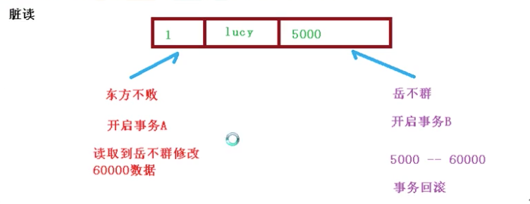
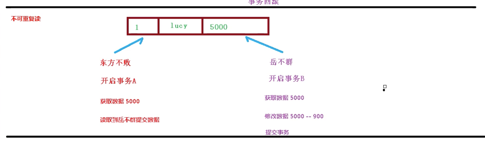
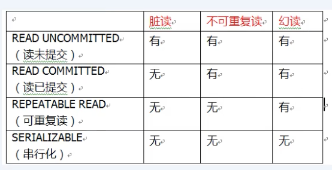
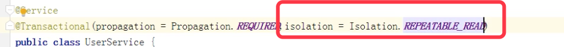

### AOP（概念）

面相切面编程。利用AOP可以是业务逻辑的各个部分分离开来，从而使得业务逻辑各部分之间的耦合度降低。

通俗理解就是：不用修改源代码就可以在主干功能上添加新功能。

### AOP底层原理

aop底层是使用**动态代理**方式来增强类中的某个方法。

动态代理有两种方式：

1. 有接口的情况，使用JDK动态代理；
2. 没有接口的情况，使用cglib动态代理。


### AOP术语

#### 1、连接点

在一个类中，哪些方法可以被增强，这些方法就叫 连接点。

比如：

```java
public class User {

   public void add() {
   
   }
   
   public void update() {
   
   }
   
   public void delete() {
   
   }
}
```

在User类中，add()、update()、delete() 这几个方法都叫 连接点。

#### 2、切入点

实际被增强的方法就叫 切入点。

#### 3、通知（增强）

实际增强的逻辑部分就叫做增强，比如登录的时候 加的那个 权限判断功能 就叫通知（增强）。

##### 通知有多种类型

##### 前置通知

##### 后置通知

##### 环绕通知

在前面和后边都增强

##### 异常通知

发送异常时增强

##### 最终通知

类似 try catch的 finally。

#### 4、切面

是动作，把通知应用到切入点的过程就叫做切面。

https://www.bilibili.com/video/BV1Vf4y127N5?p=29&spm_id_from=pageDriver

bean1.xml中，需要：


##### 相同的切入点抽取

相同的切入点抽取一下，做成公共的。 =》 @Pointcut()

##### 多个增强类都会同一个方法进行增强，可以设置增强类优先级

在增强类上面添加注解 @Order(数字)，数字越小，优先级越高。


### jdbcTemplate

Spring对jdbc进行封装，使用jdbcTemplate 可以很方便的对数据库进行增删改查操作。


参数是可变参数，可以用数组的形式：


效果是一样的。

P34：

https://www.bilibili.com/video/BV1Vf4y127N5?p=34&spm_id_from=pageDriver

### 事务

事务是数据库操作基本单元，逻辑上一组操作，要么都成功，如果有一个失败，所有操作都失败。

事务四个特性（ACID）

#### 原子性

#### 一致性

#### 隔离性

#### 持久性

事务一般加在 JavaEE三层结构（Web + Service + Dao）中的Service层。


#### Spring中进行事务管理

两种方式，分别是编程式事务和声明式事务。

最常用的是 声明式事务。

##### 声明式事务

基于注解方式实现和基于xml方式实现。

在Spring中，进行声明式事务管理，底层就是使用AOP。

https://www.bilibili.com/video/BV1Vf4y127N5?p=44&spm_id_from=pageDriver

##### 事务的传播级别


##### 事务的隔离级别

如果不考虑事务的隔离性，就会产生三个问题：脏读、不可重复读、虚读。

一个未提交的事务 能读到另一个未提交事务里变化的数据



**脏读**

当 右边的事务一回滚，左边事务读到的数据就不对了，就是脏读。

**不可重复读**

一个未提交事务读到了另一个已提交事务修改的数据，这就叫不可重复读。



##### 虚读

一个未提交事务读到了另一个已提交事务添加的数据，这就叫虚读。

##### 怎么解决

通过设置事务的隔离级别，就能解决上面的这三个问题。





mysql默认的就是 REPEATABLE READ。

**rollbackFor**

设置出现哪些异常进行事务回滚。 

https://www.bilibili.com/video/BV1Vf4y127N5?p=49&spm_id_from=pageDriver

#### Spring5框架新功能

##### @Nullable注解

比如手动创建对象，然后交给spring管理，可以借助GenericApplicationContext：

```java
/**
     * 测试使用函数风格创建对象，并交给Spring管理
     */
    @Test
    public void testGenericApplicationContext() {
        GenericApplicationContext context = new GenericApplicationContext();

        // 调用GenericApplicationContext的方法注册bean
        context.refresh();;
//        context.registerBean(User1.class, () -> new User1());
        context.registerBean("user1", User1.class, () -> new User1());

        // 获取在spring中注册的bean对象
//        User1 user1 = (User1) context.getBean("com.fullstackboy.springdemo.User1");
        User1 user1 = (User1) context.getBean("user1");
        System.out.println(user1);
    }
```

registerBean源码：

```java
 registerBean(@Nullable String beanName, Class<T> beanClass, @Nullable Supplier<T> supplier, BeanDefinitionCustomizer... customizers) {
```

第一个参数可传，可不传


