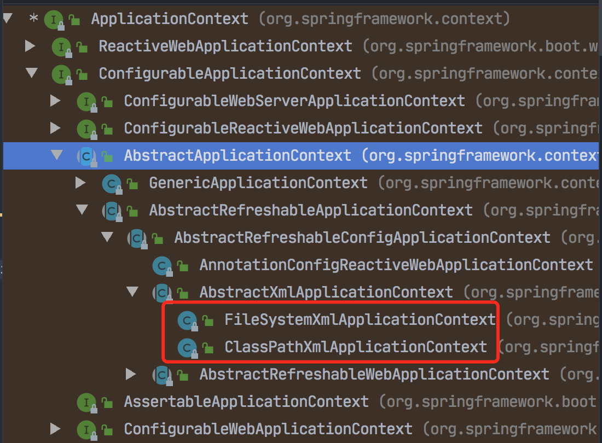

课程使用Spring版本：

spring 5.2.6稳定版本。下载地址：https://repo.spring.io/ui/native/release/org/springframework/spring

### IOC容器

#### ioc底层原理

xml解析、工程模式、反射。

反射，就是得到类的字节码文件。

Spring提供IOC容器实现的两种方式：（两个接口）

- BeanFactory：IOC容器基本实现，是Spring容器内部使用的接口，一般不提供开发人员使用。
- ApplicationContext：BeanFactory的子接口，提供更强大的功能，一般由开发人员使用。

这两个接口的功能都是类似的，都能实现加载配置文件，通过工厂模式，来实现创建对象。

ApplicationContext的两个主要实现类：



#### IOC操作bean管理（基于xml方式）

这个术语是什么意思？

可以概括为两方面：

1. Spring创建对象；

   ```xml
   <bean id="user" class="com.fullstackboy.springdemo.ioc.User"></bean>
   ```

   创建对象的时候，默认会执行类的无参构造方法。

2. Spring注入属性

- DI：依赖注入（就是注入属性），需要在创建对象的基础上才能完成。Spring中支持的两种方是set注入和有参构造方法进行属性注入。

