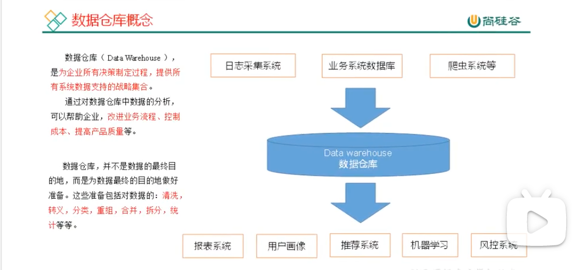

## 相关资料

### 大数据核心技术-数据采集

大数据技术，就是从各种类型的数据中快速获得有价值信息的技术。

采集数据的方式：

- 企业个人数据
  - 海量采集数据工具；
  - 分布式架构；
- 企业公开数据
  - 网络爬虫；
  - 网站公开API；
- 企业保密数据
  - 特定系统接口。

### 大数据项目之数据采集

https://www.bilibili.com/video/BV1kS4y1U7td?spm_id_from=333.337.search-card.all.click

#### 数据仓库概念

数据仓库（Data Warehouse），是为企业所有决策制定过程，提供所有系统数据支撑的战略集合。

可以帮忙企业 改善业务流程、控制成本、提高产品质量。

比如，领导想要最近1年的订单总金额。这些订单数据都分布在多个机器的多个文件上。=》可以在数仓中通过聚合，然后把计算出来的指标 再拿给领导。

数据仓库一共主要干了两件事儿：

1. 对数据进行采集并存储；
2. 对数据进行计算和分析。

