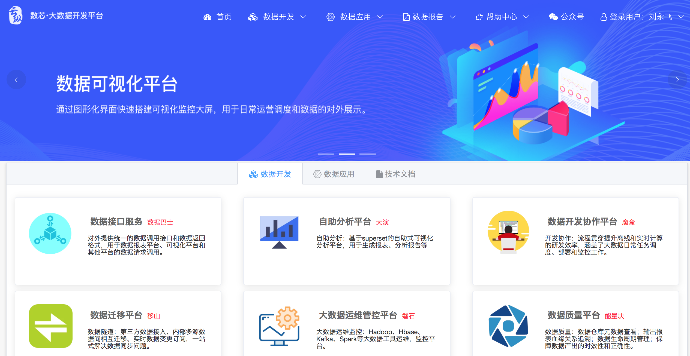

## 禧云.数芯大数据平台

### 一.数芯

1.

2.

3.

### 二.移山

#### 1.工作台

#### 2.数据通道-数据接入

##### 2.1应用管理

##### 2.2任务管理

1.

会请求：http://yishan.yunzongnet.com/td/config/queryConfigList.do

和 http://yishan.yunzongnet.com/td/application/queryApplicationList4DropDown.do

2.

点击确定，会掉 http://datacollect.yunzongnet.com/manual/execute.do 接口。

------------------

3.

会请求：http://yishan.yunzongnet.com/td/application/queryApplicationList4DropDown.do

和 http://yishan.yunzongnet.com/td/config/queryConfigById.do

点击提交，请求：http://yishan.yunzongnet.com/td/config/save.do

4.

会请求 http://yishan.yunzongnet.com/td/application/queryApplicationList4DropDown.do

和 http://yishan.yunzongnet.com/td/application/queryApplicationList4DropDown.do

点提交，请求：http://yishan.yunzongnet.com/td/config/save.do

##### 2.3访问控制

#### 3.数据迁移

##### 3.1基本配置

1.

2.

3.

4.

##### 3.2任务管理

1.

http://yishan.yunzongnet.com/id/job/query.do

点执行，就会调 datax的 python 服务：

http://172.18.10.80:8000/socket.io/?EIO=3&transport=polling&t=O40rK1p

2.

3.点实验室配置

4.

5.点确定

会请求：

http://yishan.yunzongnet.com/id/job/updateLabSetting.do

**其实，后台就是去更新 ys_inner_data_job 表。**

点编辑：

http://yishan.yunzongnet.com/id/job/queryDetail.do

2.

3.

4.

点"确定"，http://yishan.yunzongnet.com/id/job/save.do

