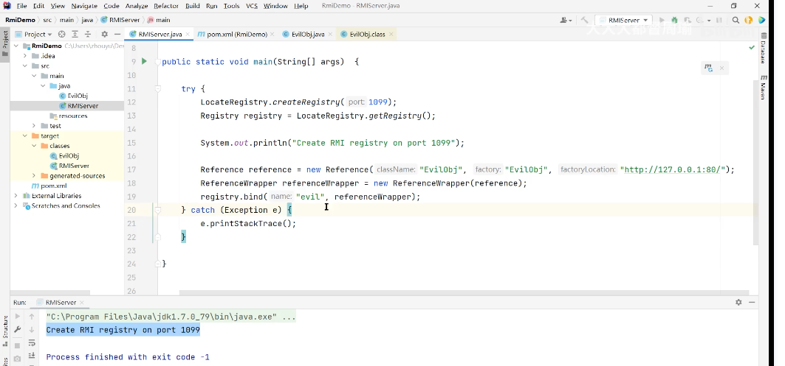
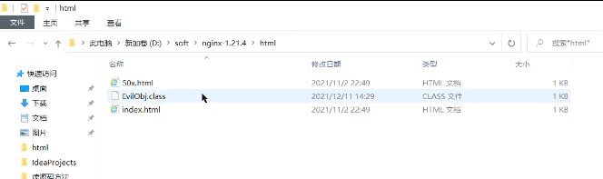
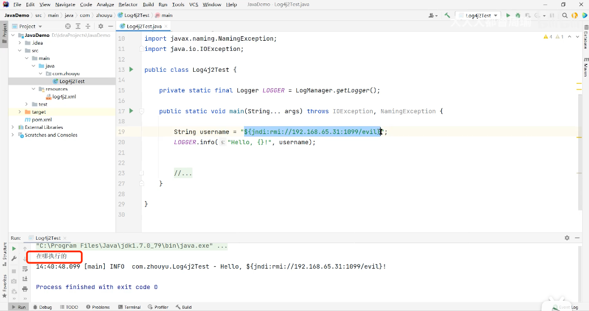
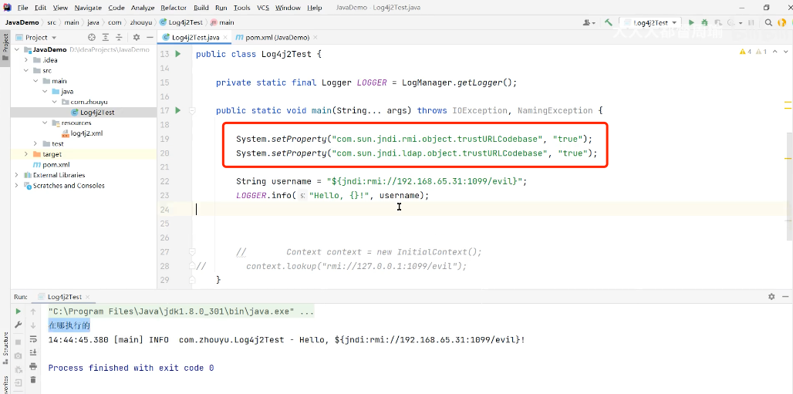

#### 小白提问，到底什么是J2EE？

小白提问，到底什么是j2ee？ - hzj629206的回答 - 知乎 https://www.zhihu.com/question/43385669/answer/314752560


### Servlet的本质是什么？它是如何工作的？

这一篇里讲的非常经典：

https://www.zhihu.com/question/21416727


稍微看一下：

https://www.bilibili.com/video/BV1y5411p7kb?from=search&seid=2942483728602321727&spm_id_from=333.337.0.0

#### Servlet规范

#### 什么是动态资源文件

只有实现Servlet接口的Java类才是 【动态资源文件】，只有这样的类才能被Tomcat调用。

例如：

```java
class Student{
  // 不是动态资源文件，Tomcat无权调用
}

class Teacher implements Servlet{
  // 是动态资源文件，Tomcat有权利创建和调用这个类的实例对象
  
  void doGet() {
    ....
  }
}
```

怎么请求呢？

tomcat收到请求后，有权利创建Teacher类的实例对象，然后调用Teacher类的相关方法。

```java
Servlet obj = new Teacher();
obj.doGet();
```


花65元买的小册：

https://www.yuque.com/books/share/2b434c74-ed3a-470e-b148-b4c94ba14535

eydb


### Log4j2漏洞复现

log4j2 漏洞演示：

https://www.bilibili.com/video/BV18U4y1K72L/?spm_id_from=333.788.b_636f6d6d656e74.4

两个工程：

RmiDemo：



将EvilObj.java文件编译，将编译后的EvilObj.class文件放到ngix的html目录下面：



JavaDemo:



这样就能复现这个漏洞，网站后台（JavaDemo）会执行黑客自己写的攻击类里（RmiDemo）的代码（static代码块里的代码）。

备注：这个Up主用的是JDK1.7来做演示的，如果改成JDK1.8的，没有复现。



备注：

- JDK1.8，默认把这两个属性给关闭了，这里手动打开，然后重启，仍然可以复现。

- 这底层是怎么工作的？=》跟RMI有关系。
- log4j-api和log4j-core，如果要用2.14的版本，则必须把jdk换成1.8的。

####  解决

将log4j-api和log4j-core升级到2.15.0就可以解决了。