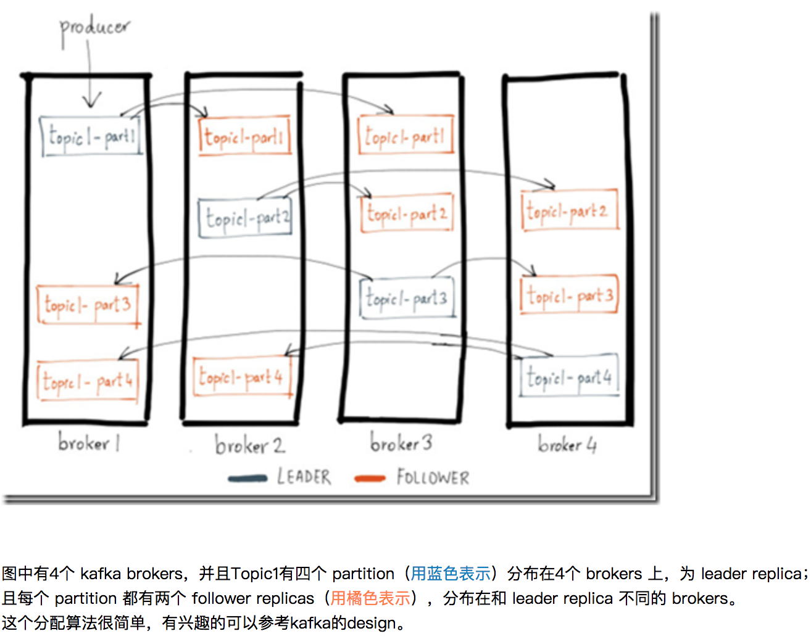
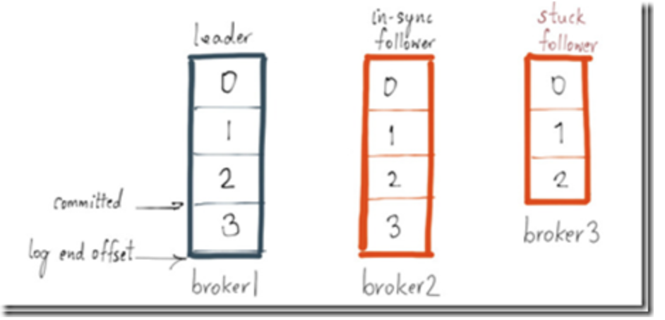

## Kafka简介

分布式消息中间件

### Broker

Kafka集群中的一台或多台服务器统称为broker。

我们目前有10个节点。

### group

- group能够自动地帮你分配要订阅的分区在不同的consumer实例上；

- 同时它还支持fail-over。这样当有consumer实例挂掉的话，group能够重新分配消费负载到剩余存活的consumer实例上。

### Replica机制

### 数据是否会丢失

#### 从producer的角度，发的数据是否会丢失？

除了要打开replica机制，还取决于 producer的request.required.ack设置：

- ack=0，发就发了，不需要ack，无论成功与否；
- ack=1，当leader replica写成功后就返回，其他的replica都是通过fetcher去异步更新的，当然这样会有数据丢失的风险，如果lead的数据还没有来得及同步，lead就挂了，那么会丢失数据；
- acks=-1，要等待所有的replicas都成功后，才能返回；这种纯同步写的延迟比较高。

所以一般情况下，ack设成1，在极端情况下，是有可能丢数据的。

如果可以接受较长的写延迟，可以选择将ack设为-1。

#### 从consumer的角度，是否会读取到不一致的数据？

首先无论是 high-level 或 low-level consumer，我们要知道它是怎么从kafka读数据的。

kafka的log partition是存在文件中，并以offset作为索引，所以每个consumer需要对于每个partition记录上次读取到的offset。 （high-level和low-level的区别在于是 kafka 帮你记，还是你自己记）

所以如果consumer dead，重启后只需要继续从上次的offset开始读，那就不会有不一致的问题。

但是如果kafka broker dead，并发生partiton leader切换，如何保证在新的leader上这个offset仍然有效？

kafaka采用一种机制，叫做commited offset，来保证这种一致性，如下图：

commited offset只有在所有replica都同步完成该offset后，才会被置为该offset；

所有图中的commited置为2，但是broker3上的replica还没有完成offset 3的同步，所以此时offset3的message对于consumer是不可见的，consumer最多只能读到offset 2。

如果此时，leader dead，无论哪个follower 重新选举成leader，都不会影响数据的一致性，因为consumer可见的offset最多为2，而这个offset在所有的replica上都是一致的。

所以在一般正常情况下，当kafka发生failover的时候，consumer是不会读到不一致的数据。

特例的情况是：

当前leader是唯一有效的replica，其它replica都处在完全不同步的状态，这样发生leader切换，一定是会丢失数据的，并会发生offset不一致。

