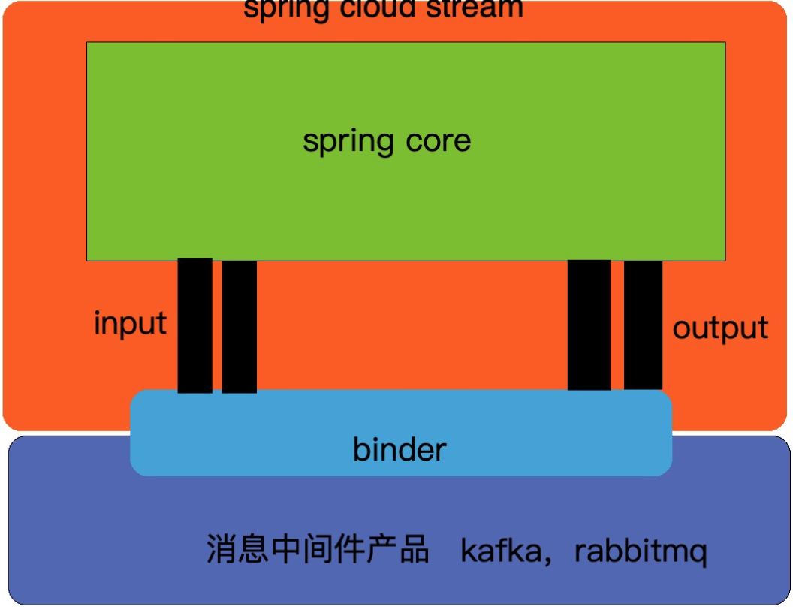

### MQ引进背景

电商系统第一阶段，库存模块的库存消息是存入内存队列中，

在第二阶段进行技术升级，由于库存模块、调度模块都是独立部署，很有可能都不在一个机器上，所以不能再用内存队列了。改为使用MQ。

在电商系统第二阶段不会对MQ做过多深入的讲解，建议去看 **互联网Java工程师面试突击训练第一季**。

### RabbitMQ

项目中用的是哪个版本的？

### Spring Cloud Stream

Spring Cloud Stream官方的说法是一个构建消息驱动服务的框架。我们可以这么理解，这个Spring Cloud Stream封装了mq的玩法，统一了模型，然后屏蔽了各个消息中间件的不同，降低了我们的学习成本，不过目前只支持RabbitMQ和Kafka。

我们可以看一下Spring Cloud Stream的架构图：

从上往下看，我们的应用程序，也就是spring core，通过input和output这两种channel与binder进行交互，binder（绑定器对象）屏蔽了咱们消息中间件产品的差异。