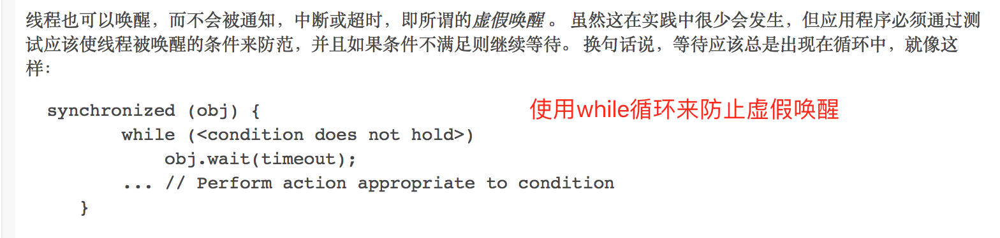
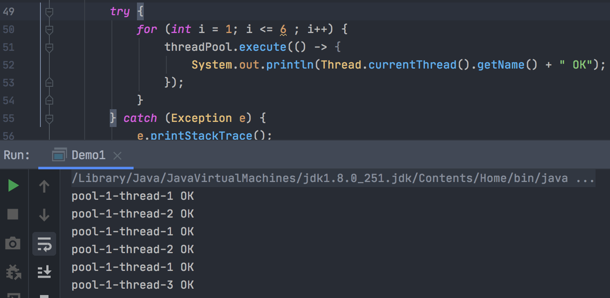
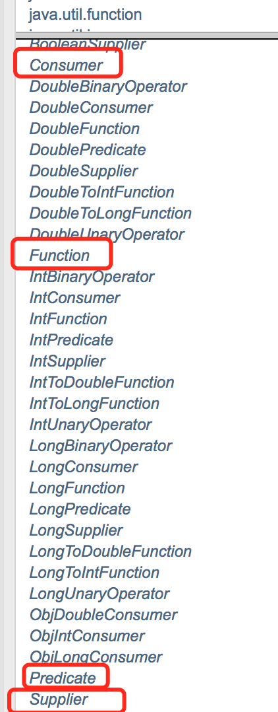
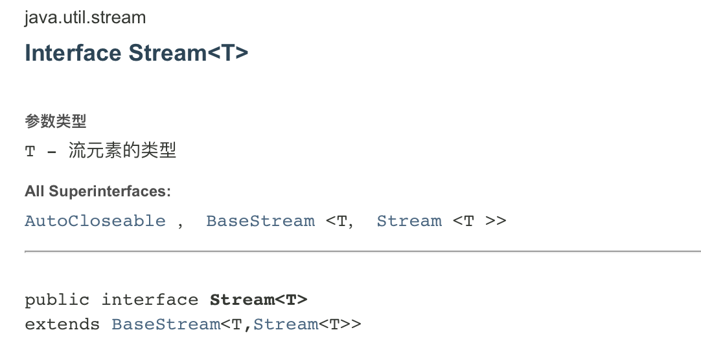
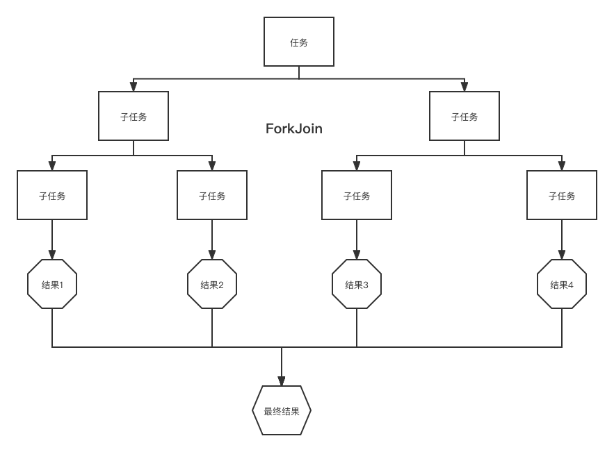
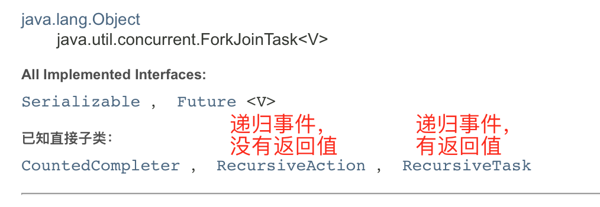
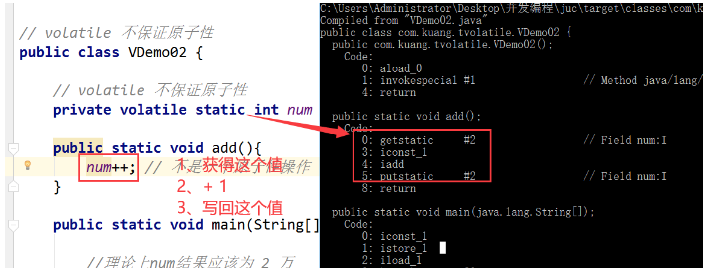

### 1、什么是JUC

java并发编程时用到的这几个包：


### 2、线程和进程

> 线程、进程

进程：一个程序，QQ.exe，Music.exe，程序的集合。

一个进程包含多个线程。

Java默认有两个线程，一个是main线程，一个是GC线程。

线程：比如使用这个Typora这个软件，会有一个线程负责输入文字，还会有一个线程负责自动保存文字。

Java中通过Threa、Runnable、Callable去使用线程。

> 并发并行

并发：多线程操作同一个资源

- CPU 一核，模拟出来多线程，天下武功，唯快不破，快速交替

并行：多个人一起行走

- CPU多核，多个线程可以同时执行；线程池。

```java
// 查看CPU核数
System.out.println(Runtime.getRuntime().availableProcessors());
```


>  线程Thread有几个状态

```java
public enum State {
    /**
     * 新生
     */
    NEW,

    /**
     * 运行
     */
    RUNNABLE,

    /**
     * 阻塞
     */
    BLOCKED,

    /**
     * 等待，死死的等
     */
    WAITING,

    /**
     * 超时等待
     */
    TIMED_WAITING,

    /**
     * 终止
     */
    TERMINATED;
```

> wait与sleep区别

1、**来自不同的类**

wait -> Object

sleep -> Thread 类独有的

2、**关于锁的释放**

wait会释放锁；

sleep睡觉了，抱着锁睡的，不会释放锁。

3、**使用的范围是不同的**

- wait必须在同步代码块内使用；

- sleep可以在任何地方睡。

4、**是否需要捕获异常**

- wait不需要捕获异常；

- sleep需要捕获异常（因为有可能会发生超时等待）。

### 3、Lock锁

https://www.bilibili.com/video/BV1B7411L7tE?p=4&spm_id_from=pageDriver

Lock锁是一个接口，它的实现类是：


>  Synchronized和Lock区别

1、Synchronized 内部的java关键字，Lock是一个java类；

2、Synchronized无法获取锁的状态，Lock可以判断是否获取到了锁；

3、Synchronized 会自动释放锁，Lock必须手动释放锁，如果不释放锁，会造成死锁；

4、Synchronized 线程1获取到锁如果被阻塞了，线程2会傻傻的等，Lock锁就不一定会等待下去；

5、Synchronized 可重入锁，不可以中断的、非公平锁；Lock 可重入锁、可以判断锁，非公平（可以设置为公平锁）；

6、Synchronized 适合少量的代码同步问题，Lock适合大量的同步代码。


### 4、生产者和消费者

`面试时的几个高频问题：单例模式、排序算法、生产者和消费者、死锁。`

线程之间的通信问题，比如涉及到生产者和消费者。

两个线程操作同一个变量，一个线程加，一个线程减。

- A线程对这个变量进行加1，就会告诉B线程；
- B线程收到通知就对这个变量进行减1。

> #### Synchronized版

```java
/**
 * 使用两个线程来进行测试 线程之间的通信
 *
 * @author Liuyongfei
 * @date 2021/11/23 09:09
 */
public class Demo1 {

    public static void main(String[] args) {
        MyData myData = new MyData();

        // 这个线程会调用10次 加的方法
        new Thread(() -> {
            for (int i = 1; i <= 10 ; i++) {
                try {
                    myData.increment();
                } catch (InterruptedException e) {
                    e.printStackTrace();
                }
            }
        }," T1").start();


        new Thread(() -> {
            for (int i = 1; i <= 10 ; i++) {
                try {
                    myData.decrement();
                } catch (InterruptedException e) {
                    e.printStackTrace();
                }
            }
        },"T2").start();
    }
}

/**
 * 这里写业务逻辑，
 *
 * 一个执行加操作的方法： 0 -》1
 * 一个执行减操作的方法： 1 -》0
 *
 * 判断是否需要等待
 *
 * 业务
 *
 * 通知
 * @author Liuyongfei
 * @date 2021/11/23 08:57
 */
public class MyData {

    private int number = 0;


    /**
     * 执行加操作
     */
    public synchronized void increment() throws InterruptedException {

        if (number != 0) {
            // 等待
            this.wait();
        }

        number++;

        System.out.println(Thread.currentThread().getName() + "=>" + number);

        // 通知其它线程，我+1完毕了
        this.notifyAll();
    }

    /**
     * 执行减操作
     */
    public synchronized void decrement() throws InterruptedException {

        if (number == 0) {
            // 等待
            this.wait();
        }

        number--;

        System.out.println(Thread.currentThread().getName() + "=>" + number);

        // 通知其它线程，我-1完毕了
        this.notifyAll();
    }
}

```

输出结果：

```java
 T1=>1
T2=>0
 T1=>1
T2=>0
 T1=>1
T2=>0
 T1=>1
T2=>0
 T1=>1
T2=>0
 T1=>1
T2=>0
 T1=>1
T2=>0
 T1=>1
T2=>0
 T1=>1
T2=>0
 T1=>1
T2=>0
```

可以看到：

- T1线程执行加1操作后，会发出通知，然后自己处于等待状态；
- T2线程原本处于等待状态，收到通知后，执行减1操作后，会发出通知；
- T1线程收到通知后，执行加1操作后，会发出通知；
- 每个线程循环交替执行10次。

三步曲：

判断是否等待/ 业务代码 / 通知



所以需要把上面的代码中if判断改为使用while循环。

> Lock版

通过Lock找到Condition


```java
/**
 * 这里写业务逻辑，使用 Lock Condition
 *
 * 一个执行加操作的方法： 0 -》1
 * 一个执行减操作的方法： 1 -》0
 *
 * 判断是否需要等待
 *
 * 业务
 *
 * 通知
 * @author Liuyongfei
 * @date 2021/11/23 08:57
 */
public class MyDataUseLock {

    private int number = 0;

    Lock lock  = new ReentrantLock();
    Condition condition = lock.newCondition();


    /**
     * 执行加操作
     */
    public void increment() throws InterruptedException {

        lock.lock();

        try {
            if (number != 0) {
                // 等待
                condition.await();
            }

            number++;

            System.out.println(Thread.currentThread().getName() + "=>" + number);

            // 通知其它线程，我+1完毕了
            condition.signalAll();
        } catch (Exception e) {
            e.printStackTrace();
        } finally {
            lock.unlock();
        }
    }

    /**
     * 执行减操作
     */
    public void decrement() throws InterruptedException {

       lock.lock();
        try {
            if (number == 0) {
                // 等待
                condition.await();
            }

            number--;

            System.out.println(Thread.currentThread().getName() + "=>" + number);

            // 通知其它线程，我-1完毕了
            condition.signalAll();
        } catch (InterruptedException e) {
            e.printStackTrace();
        } finally {
            lock.unlock();
        }
    }
}
```


那么，如果想有序的执行，A -> B -> C -> D -> A，那么该怎么做呢？

> Condition可以精确的通知和唤醒线程

```JAVA
/**
 * 这里写业务逻辑，使用 Lock Condition
 * 利用多个Condition（监视器），可以实现多个线程有序执行
 * 一个执行加操作的方法： 0 -》1
 * 一个执行减操作的方法： 1 -》0
 *
 * 判断是否需要等待
 *
 * 业务
 *
 * 通知
 * @author Liuyongfei
 * @date 2021/11/23 08:57
 */
public class MyDataUseLock2 {

    private int number = 1;

    Lock lock  = new ReentrantLock();
    Condition condition1 = lock.newCondition();
    Condition condition2 = lock.newCondition();
    Condition condition3 = lock.newCondition();


    public void printA() {
        lock.lock();

        try {
            while (number  != 1) {
                condition1.await();
            }

            System.out.println(Thread.currentThread().getName()+"=>AAAAAAA");

            // 唤醒执行的人：B
            number = 2;
            condition2.signal();
        } catch (InterruptedException e) {
            e.printStackTrace();
        } finally {
            lock.unlock();
        }
    }

    public void printB() {
        lock.lock();

        try {
            while (number != 2) {
                condition2.await();
            }

            System.out.println(Thread.currentThread().getName()+"=>BBBBBBB");

            // 唤醒执行的人：C
            number = 3;
            condition3.signal();
        } catch (InterruptedException e) {
            e.printStackTrace();
        } finally {
            lock.unlock();
        }
    }

    public void printC() {
        lock.lock();

        try {
            while (number != 3) {
                condition3.await();
            }

            System.out.println(Thread.currentThread().getName()+"=>CCCCCC");

            // 唤醒执行的人：A
            number = 1;
            condition1.signal();
        } catch (InterruptedException e) {
            e.printStackTrace();
        } finally {
            lock.unlock();
        }
    }
}
```


```java
/**
 * 使用Condition来对三个线程来进行测试 线程之间的通信：
 * 且 A执行完 -》通知B线程，B线程执行完 -》通知C线程，C线程执行完 -》通知A线程，A线程执行
 * 这样有序的循环执行
 *
 * @author Liuyongfei
 * @date 2021/11/23 09:09
 */
public class Demo3 {

    public static void main(String[] args) {
        MyDataUseLock2 myData = new MyDataUseLock2();

        // 这个线程会调用10次 加的方法
        new Thread(() -> {
            for (int i = 1; i <= 10 ; i++) {
                myData.printA();
            }
        }," A").start();


        new Thread(() -> {
            for (int i = 1; i <= 10 ; i++) {
                myData.printB();
            }
        },"B").start();

        new Thread(() -> {
            for (int i = 1; i <= 10 ; i++) {
                myData.printC();
            }
        },"C").start();

    }
}
```

输出结果：

```bash
A=>AAAAAAA
B=>BBBBBBB
C=>CCCCCC
 A=>AAAAAAA
B=>BBBBBBB
C=>CCCCCC
 A=>AAAAAAA
B=>BBBBBBB
C=>CCCCCC
 A=>AAAAAAA
B=>BBBBBBB
C=>CCCCCC
 A=>AAAAAAA
B=>BBBBBBB
C=>CCCCCC
 A=>AAAAAAA
B=>BBBBBBB
C=>CCCCCC
 A=>AAAAAAA
B=>BBBBBBB
C=>CCCCCC
 A=>AAAAAAA
B=>BBBBBBB
C=>CCCCCC
 A=>AAAAAAA
B=>BBBBBBB
C=>CCCCCC
 A=>AAAAAAA
B=>BBBBBBB
C=>CCCCCC
```

可以看到，达到我们想要的结果。Condition可以精确的通知和唤醒线程

https://www.bilibili.com/video/BV1B7411L7tE?p=13&spm_id_from=pageDriver

### 5、8锁现象

就是关于锁的8个问题。

`第一个：两个同步方法，同一个调用对象，该代码是 先执行 发短信，还是先执行 打电话呢？`

> synchronized，锁的对象是方法的调用者。

```java
/**
 * 8锁现象，就是关于锁的8个问题- 第一个问题
 * 该代码是 先执行 发短信，还是先执行 打电话呢？
 * synchronized，锁的对象是方法的调用者。因此两个方法锁的都是同一个对象。
 * 则谁先拿到锁谁先执行。
 *
 * 执行结果：
 * 发短信
 * 打电话
 * @author Liuyongfei
 * @date 2021/11/23 23:18
 */
public class Test1 {
    public static void main(String[] args) throws InterruptedException {
        Phone phone = new Phone();

        new Thread(() -> {
            phone.sendSms();
        }).start();

        TimeUnit.SECONDS.sleep(1);

        new Thread(() -> {
            phone.phone();
        }).start();

    }
}

class Phone {

    public synchronized void sendSms() {
        System.out.println("发短信");
    }

    public synchronized void phone() {
        System.out.println("打电话");
    }
}
```


`第二个：sendSms方法延迟了4秒，该代码是 先执行 发短信，还是先执行 打电话呢？`

> ```
> synchronized，锁的对象是方法的调用者。
> ```

```java
/**
 * 8锁现象，就是关于锁的8个问题- 第二个问题
 * sendSms方法延迟了4秒，该代码是 先执行 发短信，还是先执行 打电话呢？
 * synchronized，锁的对象是方法的调用者。因此两个方法锁的都是同一个对象。
 * 则谁先拿到锁谁先执行。
 *
 * 执行结果：
 * 发短信
 * 打电话
 * @author Liuyongfei
 * @date 2021/11/23 23:18
 */
public class Test2 {
    public static void main(String[] args) throws InterruptedException {
        Phone2 phone = new Phone2();

        new Thread(() -> {
            phone.sendSms();
        }).start();

        TimeUnit.SECONDS.sleep(1);

        new Thread(() -> {
            phone.phone();
        }).start();

    }
}

class Phone2 {

    public synchronized void sendSms() {
        try {
            TimeUnit.SECONDS.sleep(4);
        } catch (InterruptedException e) {
            e.printStackTrace();
        }
        System.out.println("发短信");
    }

    public synchronized void phone() {
        System.out.println("打电话");
    }
}
```


执行结果：

```bash
发短信
打电话
```

总结：

`synchronized，锁的对象是方法的调用者。因此两个方法锁的都是同一个对象。=》 则谁先拿到锁谁先执行。`

`第三个：添加一个普通方法，线程B调用普通方法，是先输出发短信，还是先输出hello？`

```java
/**
 * 8锁现象，就是关于锁的8个问题- 第三个问题
 * sendSms方法延迟了4秒
 * synchronized，锁的对象是方法的调用者。
 * 但是B线程调用的是同一个方法，这时是先输出发短信，还是先输出hello呢？
 *
 *
 * 执行结果：
 * hello
 * 发短信
 * @author Liuyongfei
 * @date 2021/11/23 23:18
 */
public class Test3 {
    public static void main(String[] args) throws InterruptedException {
        Phone3 phone = new Phone3();

        new Thread(() -> {
            phone.sendSms();
        }).start();

        TimeUnit.SECONDS.sleep(1);

        new Thread(() -> {
//            phone.phone();
            phone.hello();
        }).start();

    }
}

class Phone3 {

    public synchronized void sendSms() {
        try {
            TimeUnit.SECONDS.sleep(4);
        } catch (InterruptedException e) {
            e.printStackTrace();
        }
        System.out.println("发短信");
    }

    public synchronized void phone() {
        System.out.println("打电话");
    }

    public void hello() {
        System.out.println("hello");
    }
}
```

`第四个：sendSms方法延迟了4秒，有两个对象，分别调用sendSms和phone,先输出发短信，还是打电话呢？`

```java
/**
 * 8锁现象，就是关于锁的8个问题- 第四个问题
 * sendSms方法延迟了4秒
 * synchronized，锁的对象是方法的调用者。
 * 有两个对象，分别调用sendSms和phone,先输出发短信，还是打电话呢？
 *
 *
 * 执行结果：
 * 打电话
 * 发短信
 * @author Liuyongfei
 * @date 2021/11/23 23:18
 */
public class Test4 {
    public static void main(String[] args) throws InterruptedException {
        Phone4 phone1 = new Phone4();
        Phone4 phone2 = new Phone4();

        new Thread(() -> {
            phone1.sendSms();
        }).start();

        TimeUnit.SECONDS.sleep(1);

        new Thread(() -> {
            phone2.phone();
        }).start();

    }
}

class Phone4 {

    public synchronized void sendSms() {
        try {
            TimeUnit.SECONDS.sleep(4);
        } catch (InterruptedException e) {
            e.printStackTrace();
        }
        System.out.println("发短信");
    }

    public synchronized void phone() {
        System.out.println("打电话");
    }

    public void hello() {
        System.out.println("hello");
    }
}
```

`第五个：增加两个静态的同步方法，只有一个对象，先打印 发短信？打电话？`

```java
/**
 * 8锁现象，就是关于锁的8个问题- 第五个问题
 * sendSms方法延迟了4秒
 * synchronized，锁的对象是方法的调用者。
 * 增加两个静态的同步方法，只有一个对象,先输出发短信，还是打电话呢？
 *
 *
 * 执行结果：
 * 发短信
 * 打电话
 * @author Liuyongfei
 * @date 2021/11/23 23:18
 */
public class Test5 {
    public static void main(String[] args) throws InterruptedException {
        Phone5 phone = new Phone5();

        new Thread(() -> {
            phone.sendSms();
        }).start();

        TimeUnit.SECONDS.sleep(1);

        new Thread(() -> {
            phone.phone();
        }).start();

    }
}

class Phone5 {

    public static synchronized void sendSms() {
        try {
            TimeUnit.SECONDS.sleep(4);
        } catch (InterruptedException e) {
            e.printStackTrace();
        }
        System.out.println("发短信");
    }

    public static synchronized void phone() {
        System.out.println("打电话");
    }

    public void hello() {
        System.out.println("hello");
    }
}
```

`第六个：增加两个静态的同步方法，有两个对象，先打印 发短信？打电话？`

```java
/**
 * 8锁现象，就是关于锁的8个问题- 第六个问题
 * sendSms方法延迟了4秒
 * synchronized，锁的对象是方法的调用者。
 * 增加两个静态的同步方法，只有一个对象,先输出发短信，还是打电话呢？
 *
 *
 * 执行结果：
 * 发短信
 * 打电话
 * @author Liuyongfei
 * @date 2021/11/23 23:18
 */
public class Test6 {
    public static void main(String[] args) throws InterruptedException {

        // 两个对象的Class模板只有一个
        Phone6 phone1 = new Phone6();
        Phone6 phone2 = new Phone6();

        new Thread(() -> {
            phone1.sendSms();
        }).start();

        TimeUnit.SECONDS.sleep(1);

        new Thread(() -> {
            phone2.phone();
        }).start();

    }
}

class Phone6 {

    public static synchronized void sendSms() {
        try {
            TimeUnit.SECONDS.sleep(4);
        } catch (InterruptedException e) {
            e.printStackTrace();
        }
        System.out.println("发短信");
    }

    public static synchronized void phone() {
        System.out.println("打电话");
    }

    public void hello() {
        System.out.println("hello");
    }
}
```

**总结**

static 静态方法，加上 synchronized修饰，则锁的是Phone4这个唯一的 Class （就是那个反射对象）：

```java
Class<Phone4> phone = Phone4.class;
```

所以 因为这两个方法都是用的static，所以锁的都是同一个Class。

`第七个：一个静态的同步方法，一个普通的同步方法，只有一个对象分别调用，先输出发短信，还是打电话?`

```java
/**
 * 8锁现象，就是关于锁的8个问题- 第七个问题
 * sendSms方法延迟了4秒
 * synchronized，锁的对象是方法的调用者。
 * 一个静态的同步方法，一个普通的同步方法，只有一个对象,先输出发短信，还是打电话呢？
 *
 *
 * 执行结果：
 * 打电话
 * 发短信
 * @author Liuyongfei
 * @date 2021/11/23 23:18
 */
public class Test7 {
    public static void main(String[] args) throws InterruptedException {
        Phone7 phone = new Phone7();

        new Thread(() -> {
            phone.sendSms();
        }).start();

        TimeUnit.SECONDS.sleep(1);

        new Thread(() -> {
            phone.phone();
        }).start();

    }
}

class Phone7 {

    /**
     * 锁的是 这个 Class模板
     */
    public static synchronized void sendSms() {
        try {
            TimeUnit.SECONDS.sleep(4);
        } catch (InterruptedException e) {
            e.printStackTrace();
        }
        System.out.println("发短信");
    }

    /**
     * 锁的是方法的调用者
     */
    public synchronized void phone() {
        System.out.println("打电话");
    }

}
```

**总结**

- 带static的同步方法锁的是那个唯一的Class模板；
- 不带static的同步方法锁的是方法的调用者；
- 因此这两个方法锁的不是同一个对象，所以先执行打电话。


`第8个：一个静态的同步方法，一个普通的同步方法，两个对象调用,先输出发短信，还是打电话呢？`

```java
/**
 * 8锁现象，就是关于锁的8个问题- 第八个问题
 * sendSms方法延迟了4秒
 * synchronized，锁的对象是方法的调用者。
 * 一个静态的同步方法，一个普通的同步方法，两个对象调用,先输出发短信，还是打电话呢？
 *
 *
 * 执行结果：
 * 打电话
 * 发短信
 * @author Liuyongfei
 * @date 2021/11/23 23:18
 */
public class Test8 {
    public static void main(String[] args) throws InterruptedException {
        Phone8 phone1 = new Phone8();
        Phone8 phone2 = new Phone8();

        new Thread(() -> {
            phone1.sendSms();
        }).start();

        TimeUnit.SECONDS.sleep(1);

        new Thread(() -> {
            phone2.phone();
        }).start();

    }
}

class Phone8 {

    /**
     * 锁的是 这个 Class模板
     */
    public static synchronized void sendSms() {
        try {
            TimeUnit.SECONDS.sleep(4);
        } catch (InterruptedException e) {
            e.printStackTrace();
        }
        System.out.println("发短信");
    }

    /**
     * 锁的是方法的调用者
     */
    public synchronized void phone() {
        System.out.println("打电话");
    }

}
```


### 6、集合类不安全

https://www.bilibili.com/video/BV1B7411L7tE?p=11

#### List不安全

 案例：

```java
/**
 * 集合类不安全：
 *
 * List 不安全
 * @author Liuyongfei
 * @date 2021/11/24 13:21
 */
public class ListTest {

    public static void main(String[] args) {
        // 1.单线程下是安全的，没有问题的
//        List<String> list = Arrays.asList("1","2","3");
//        list.forEach(System.out::println);

        // 2.单线程下是安全的，没有问题的
//        List<String> list = new ArrayList<>();
//
//        for (int i = 1; i < 10; i++) {
//            list.add(UUID.randomUUID().toString().substring(0,5));
//        }
//
//        System.out.println(list);

        // 3. 改为多线程情况下 则会有报错
        List<String> list = new ArrayList<>();

        for (int i = 1; i <= 20; i++) {
            new Thread(() -> {
                list.add(UUID.randomUUID().toString().substring(0,5));
                System.out.println(list);
            },String.valueOf(i)).start();
        }
    }
}
```

报错：

```bash
[89b5a, 400fd, faca2, a250c, b705c]
[89b5a, 400fd, faca2, a250c, b705c, 5de36, fdfbf, 8a805]
[89b5a, 400fd, faca2, a250c, b705c, 5de36, fdfbf, 8a805, 7151f]
[89b5a, 400fd, faca2, a250c, b705c, 5de36, fdfbf, 8a805, 7151f, 707f3]
[89b5a, 400fd, faca2, a250c, b705c, 5de36, fdfbf, 8a805, 7151f, 707f3, 35555]
[89b5a, 400fd, faca2, a250c, b705c, 5de36, fdfbf, 8a805, 7151f, 707f3, 35555, f99e2]
[89b5a, 400fd, faca2, a250c, b705c, 5de36, fdfbf, 8a805, 7151f, 707f3, 35555, f99e2, d0357]
[89b5a, 400fd, faca2, a250c, b705c, 5de36, fdfbf, 8a805, 7151f, 707f3, 35555, f99e2, d0357, 3a1bd]
[89b5a, 400fd, faca2, a250c, b705c, 5de36, fdfbf, 8a805, 7151f, 707f3, 35555, f99e2, d0357, 3a1bd, 0e320, 4121b]
[89b5a, 400fd, faca2, a250c, b705c, 5de36, fdfbf, 8a805, 7151f, 707f3, 35555, f99e2, d0357, 3a1bd, 0e320, 4121b, 016aa, 01631]
[89b5a, 400fd, faca2, a250c, b705c, 5de36]
[89b5a, 400fd, faca2, a250c, b705c, 5de36, fdfbf, 8a805, 7151f, 707f3, 35555, f99e2, d0357, 3a1bd, 0e320, 4121b, 016aa, 01631, b9c10, 65679]
[89b5a, 400fd, faca2, a250c, b705c, 5de36]
[89b5a, 400fd, faca2, a250c, b705c, 5de36, fdfbf]
[89b5a, 400fd, faca2, a250c, b705c]
[89b5a, 400fd, faca2, a250c, b705c]
[89b5a, 400fd, faca2, a250c, b705c]
[89b5a, 400fd, faca2, a250c, b705c, 5de36, fdfbf, 8a805, 7151f, 707f3, 35555, f99e2, d0357, 3a1bd, 0e320, 4121b, 016aa, 01631, b9c10]
[89b5a, 400fd, faca2, a250c, b705c, 5de36, fdfbf, 8a805, 7151f, 707f3, 35555, f99e2, d0357, 3a1bd, 0e320]
Exception in thread "4" java.util.ConcurrentModificationException
	at java.util.ArrayList$Itr.checkForComodification(ArrayList.java:909)
	at java.util.ArrayList$Itr.next(ArrayList.java:859)
	at java.util.AbstractCollection.toString(AbstractCollection.java:461)
	at java.lang.String.valueOf(String.java:2994)
	at java.io.PrintStream.println(PrintStream.java:821)
	at unsafe.ListTest.lambda$main$0(ListTest.java:37)
	at java.lang.Thread.run(Thread.java:748)

Process finished with exit code 0
```

并发集合下报错：

```java
java.util.ConcurrentModificationException
```

`并发下List不安全，报并发修改异常。`

**解决**

```java
/**
 * 集合类不安全：
 *
 * List 不安全
 * @author Liuyongfei
 * @date 2021/11/24 13:21
 */
public class ListTest {

    public static void main(String[] args) {
        // 1.单线程下是安全的，没有问题的
//        List<String> list = Arrays.asList("1","2","3");
//        list.forEach(System.out::println);

        // 2.单线程下是安全的，没有问题的
//        List<String> list = new ArrayList<>();
//
//        for (int i = 1; i < 10; i++) {
//            list.add(UUID.randomUUID().toString().substring(0,5));
//        }
//
//        System.out.println(list);

        // 3. 改为多线程情况下 则会有报错
//        List<String> list = new ArrayList<>();

        // 解决办法一: 将ArrayList改成 Vector
//        List<String> list = new Vector<>();

        // 解决办法二: 将ArrayList转成安全的
//        List<String> list = Collections.synchronizedList(new ArrayList<>());

        // 解决办法三: 使用juc下的CopyOnWriteArrayList（写入时复制）
        List<String> list = new CopyOnWriteArrayList<>();

        for (int i = 1; i <= 20; i++) {
            new Thread(() -> {
                list.add(UUID.randomUUID().toString().substring(0,5));
                System.out.println(list);
            },String.valueOf(i)).start();
        }
    }
}
```

为什么推荐用CopyOnWriteArrayList，而不是Vector呢？

查看Vector的源码：


add方法使用了synchronized，所以效率不高。

CopyOnWriteArrayList的源码：


使用的是Lock锁 + 写入时复制。

#### Set不安全

```java
/**
 * 集合类不安全：
 *
 * Set不安全
 *
 * @author Liuyongfei
 * @date 2021/11/24 23:42
 */
public class SetTest {
    public static void main(String[] args) {

//        Set<String> set = new HashSet<>();

        // 解决方案一：使用集合工具类，转为安全的
//        Set<String> set = Collections.synchronizedSet(new HashSet<>());

        // 解决方案二：使用集合工具类，转为安全的
        Set<String> set = new CopyOnWriteArraySet<>();

        // 单线程情况下没问题
//        for (int i = 1; i < 20; i++) {
//            set.add(UUID.randomUUID().toString().substring(0,5));
//            System.out.println(set);
//        }

        // 多线程情况下，报：
        // java.util.ConcurrentModificationException
        for (int i = 1; i < 20; i++) {
            new Thread(() -> {
                set.add(UUID.randomUUID().toString().substring(0,5));
                System.out.println(set);
            }).start();

        }

    }
}
```

hashMap底层就是hashMap，map的key是无法重复的。

```java
public HashSet() {
        map = new HashMap<>();
    }

public boolean add(E e) {
        return map.put(e, PRESENT)==null;
    }
```

#### Map不安全

https://www.bilibili.com/video/BV1B7411L7tE?p=13&spm_id_from=pageDriver

```java
/**
 * 集合类不安全：
 *
 * Map不安全
 *
 * @author Liuyongfei
 * @date 2021/11/25 08:55
 */
public class MapTest {
    public static void main(String[] args) {

//        Map<String, String> map = new HashMap();

        // 解决办法一：
        Map<String, String> map = new ConcurrentHashMap<>();

//        for (int i = 1; i < 20; i++) {
//            map.put(Thread.currentThread().getName(), UUID.randomUUID().toString().substring(0,5));
//
//            System.out.println(map);
//        }

        // 多线程并发的情况下，会报错
        // java.util.ConcurrentModificationException
        for (int i = 1; i < 20; i++) {
            new Thread(() -> {
                map.put(Thread.currentThread().getName(), UUID.randomUUID().toString().substring(0,5));

                System.out.println(map);
            },String.valueOf(i)).start();
        }
    }
}
```


### 7、Callable


Callable的特点：

- 可以有返回值；
- 可以抛出异常；
- 方法不同，run() -> call()


Runnable -> FetureTask


FutureTask是Runnable的实现类，又可以调Callable。

>  怎么使用Callable呢？

默认传统的做法是：

```java
class MyThread implements Runnable {

    @Override
    public void run() {
        System.out.printf("run()......");
    }
}
```

new Thread(new MyThread()).start(); 就可以启动一个线程。

如果使用Callable，该怎么启动一个线程呢？

```java
new Thread(new Runnable()).start()

new Thread(new FutureTask<V>()).start()

new Thread(new FutureTask<V>(Callable)).start()
```


```java
class MyThread implements Callable<String> {

    @Override
    public String call() throws Exception {
        System.out.println("call()");
        return "123456";
    }
}
```

我们通过查看文档可以发现，FutureTask是Runnable的一个实现类，而Future又可以调Runnable。所以可以这样做：

```java
MyThread thread  = new MyThread();
FutureTask futureTask = new FutureTask(thread);
new Thread(futureTask, "A").start();

// 获取线程执行结果的返回值(这个get方法有可能会产生阻塞，所以一般把这行代码放在最后)
// 或者使用异步通信(让这个线程跑着，处理完之后，我再去拿结果)
String result = (String) futureTask.get();
System.out.println(result);
```

**引申**

如果再启一个B线程，那么会打印几个call？

```java
MyThread thread  = new MyThread();
FutureTask futureTask = new FutureTask(thread);
new Thread(futureTask, "A").start();
new Thread(futureTask, "B").start();

// 获取线程执行结果的返回值(这个get方法有可能会产生阻塞，所以一般把这行代码放在最后)
// 或者使用异步通信(让这个线程跑着，处理完之后，我再去拿结果)
String result = (String) futureTask.get();
System.out.println(result);
```

答案：还是一个call()

原因：**结果会被缓存，提高效率。**

##### 细节

1、 Callable 有缓存；

2、结果可能要等待，会阻塞！

#### 

### 8、常用的辅助类

#### 8.1、CountDownLatch

```java
/**
 * CountDownLatch的使用demo
 *
 * 教室里有6个小学生，在6个小学生都离开教室后，保安会把教室的门锁上。
 *
 * @author Liuyongfei
 * @date 2021/11/17 23:23
 */
public class CountDownLatchDemo2 {

    public static void main(String[] args) {
        // 创建一个计数器
        CountDownLatch countDownLatch = new CountDownLatch(6);

        for (int i = 1; i <= 6; i++) {
            new Thread(() -> {
                System.out.println(Thread.currentThread().getName() + "Go Out");

                // 数量减一
                countDownLatch.countDown();
            }, String.valueOf(i)).start();
        }

        System.out.println("Close Door");
    }
}
```

执行结果：

```bash
1Go Out
3Go Out
2Go Out
Close Door
5Go Out
4Go Out
6Go Out
```

可以看到，会发生还有学生没出教室呢，就关门的现象。

解决：

添加： countDownLatch.await();

```java
/**
 * CountDownLatch的使用demo
 *
 * 教室里有6个小学生，在6个小学生都离开教室后，保安会把教室的门锁上。
 *
 * @author Liuyongfei
 * @date 2021/11/17 23:23
 */
public class CountDownLatchDemo2 {

    public static void main(String[] args) {
        // 创建一个计数器
        CountDownLatch countDownLatch = new CountDownLatch(6);

        for (int i = 1; i <= 6; i++) {
            new Thread(() -> {
                System.out.println(Thread.currentThread().getName() + "Go Out");

                // 数量减一
                countDownLatch.countDown();
            }, String.valueOf(i)).start();
        }

        // 等待计数器归零，再向下执行
        countDownLatch.await();
        System.out.println("Close Door");
    }
}
```

执行结果：

```java
4Go Out
1Go Out
2Go Out
5Go Out
6Go Out
3Go Out
Close Door
```

**原理**

`countDownLatch.countDown();` // 数量减1

`countDownLatch.await();` // 等待计数归零，然后再向下执行

- 每次有线程调用countDown()，数量就会减1；
- 假如计数器变为0，则countDownLatch.await()就会被唤醒，继续向下执行。

#### 8.2 、CyclicBarrier

是一个加法计数器。 

await会计数，达到指定计数后，会开启一条新的线程继续执行。

https://www.bilibili.com/video/BV1B7411L7tE?p=16&spm_id_from=pageDriver

#### 8.3、Semaphore

 可以理解为 抢停车位！

`限流的时候会用这个。你的流量入口只有这么大，你一次性只能进来这么多，不可能超过这个数量了。` 

**原理：**

`semphore.accure()`获得（-1），假设如果已经满了，则会等待，直到被释放为止！

`semaphore.release()`释放，会将当前的信号量释放（+1），然后唤醒等待的线程！

**作用：**

多个共享资源互斥时使用！并发限流，控制最大的线程数。

### 9、读写锁

先来看一个案例：

```java
/**
 * 读写锁的案例
 * 1.不使用读写锁
 * @author Liuyongfei
 * @date 2021/11/18 09:16
 */
public class ReadWriteLockDemo {

    public static void main(String[] args) {
        MyCache myCache = new MyCache ();

        // 启动5个线程，同时向cache中写入数据
        for (int i = 1; i <= 5 ; i++) {
            final int tmp = i;
            new Thread(() -> {
                myCache.put(tmp + "", tmp + " value");
            }, String.valueOf(i)).start();
        }

        // 启动5个线程，同时从cache中读取数据
        for (int i = 1; i <= 5; i++) {
            final  int tmp = i;
            new Thread(() -> {
                myCache.get(tmp + "");
            }, String.valueOf(i)).start();
        }
    }
}

/**
 * 自定义缓存
 */
class MyCache {
    private volatile HashMap<String, Object> cacheMap = new HashMap<>();

    /**
     * 存，写
     * @param key
     * @param value
     */
    public void put(String key, Object value) {
        System.out.println(Thread.currentThread().getName() + " 写入 " + key);
        cacheMap.put(key, value);
        System.out.println(Thread.currentThread().getName() + " 写入ok");
    }

    /**
     * 取，读
     * @param key
     */
    public void get(String key) {
        System.out.println(Thread.currentThread().getName() + " 读取 " + key);
        Object value = cacheMap.get(key);
        System.out.println(Thread.currentThread().getName() + " 读取ok：" + value);
    }
}
```

执行结果可能不会符合你的预期：

```bash
1 写入 1
3 写入 3
3 写入ok
2 写入 2
2 写入ok
4 写入 4
4 写入ok
1 写入ok
5 写入 5
5 写入ok
1 读取 1
2 读取 2
3 读取 3
3 读取ok：3 value
1 读取ok：1 value
2 读取ok：2 value
4 读取 4
4 读取ok：4 value
5 读取 5
5 读取ok：5 value
```

可以看到，1这个值还没写入到cache中，就有其它线程也在执行写入操作了。

**解决办法**

使用读写锁，保证在同一时刻写的时候 只能有一个线程能进行写；读的时候多个线程可以同时读。

```java
/**
 * 自定义缓存，使用读写锁
 */
class MyCacheLock {
    private volatile HashMap<String, Object> cacheMap = new HashMap<>();

    // private Lock lock = new ReentrantLock();
    // 声明一个读写锁：更加细粒度的控制
    private ReadWriteLock readWriteLock = new ReentrantReadWriteLock();


    /**
     * 存，写
     * @param key
     * @param value
     */
    public void put(String key, Object value) {
        readWriteLock.writeLock().lock();
        try {
            System.out.println(Thread.currentThread().getName() + " 写入 " + key);
            cacheMap.put(key, value);
            System.out.println(Thread.currentThread().getName() + " 写入ok");
        } catch (Exception e) {
            e.printStackTrace();
        } finally {
            readWriteLock.writeLock().unlock();
        }
    }

    /**
     * 取，读
     * @param key
     */
    public void get(String key) {
        readWriteLock.readLock().lock();
        try {
            System.out.println(Thread.currentThread().getName() + " 读取 " + key);
            Object value = cacheMap.get(key);
            System.out.println(Thread.currentThread().getName() + " 读取ok：" + value);
        } catch (Exception e) {
            e.printStackTrace();
        } finally {
            readWriteLock.readLock().unlock();
        }
    }
}
```

输出结果：

```bash
1 写入 1
1 写入ok
2 写入 2
2 写入ok
3 写入 3
3 写入ok
4 写入 4
4 写入ok
5 写入 5
5 写入ok
1 读取 1
1 读取ok：1 value
2 读取 2
2 读取ok：2 value
3 读取 3
3 读取ok：3 value
4 读取 4
4 读取ok：4 value
5 读取 5
5 读取ok：5 value
```


### 10、阻塞队列


#### 阻塞

- 如果队列满了，此时再往里边写入，则会阻塞；

- 如果队列空了，此时再从里边进行读取元素，则会阻塞；

List、Set的祖宗类都是 Collection。

####  学会使用队列 

添加、移除

#### 四组API

1、抛出异常

2、不会抛出异常

3、阻塞等待

4、超时等待

https://www.bilibili.com/video/BV1B7411L7tE?p=20&spm_id_from=pageDriver

| 方式         | 抛出异常  | 有返回值，不抛出异常 | 阻塞等待 | 超时等待  |
| ------------ | --------- | -------------------- | -------- | --------- |
| 添加         | add()     | offer()              | put()    | offer(,,) |
| 删除         | remove()  | poll()               | take()   | poll(,,)  |
| 检测队首元素 | element() | peak()               |          |           |

##### 第一组

```java
/**
 * 阻塞队列
 * add()、remove()、element() 会抛出异常
 * @author Liuyongfei
 * @date 2021/11/25 13:05
 */
public class Test1 {

    public static void main(String[] args) {
        ArrayBlockingQueue queue =  new ArrayBlockingQueue<>(3);

        // 第一组API，会抛出异常： add,remove,element
        System.out.println(queue.add("a"));
        System.out.println(queue.add("b"));
        System.out.println(queue.add("c"));
//        System.out.println(queue.add("d"));  // Exception in thread "main" java.lang.IllegalStateException: Queue full

        queue.remove();
        queue.remove();
        queue.remove();
//        queue.remove(); // Exception in thread "main" java.util.NoSuchElementException

//        System.out.println(queue.element()); // Exception in thread "main" java.util.NoSuchElementException
    }
}
```

##### 第二组

```java
/**
 * 阻塞队列
 *
 * 第二组API：
 * offer()、poll()、peak()
 * @author Liuyongfei
 * @date 2021/11/25 13:16
 */
public class Test2 {
    public static void main(String[] args) {
        BlockingQueue queue = new ArrayBlockingQueue<>(3);

        System.out.println(queue.offer("a")); // true
        System.out.println(queue.offer("b")); // true
        System.out.println(queue.offer("c")); // true
//        System.out.println(queue.offer("d"));  // 直接返回false，不抛出异常

        System.out.println(queue.poll()); // a
        System.out.println(queue.poll()); // b
        System.out.println(queue.poll()); // c
//        System.out.println(queue.poll()); // 返回null，不抛出异常
//
        System.out.println(queue.peek()); // null
    }
}
```

##### 第三组

```java
/**
 * 阻塞队列
 *
 * 第三组API：
 * 阻塞、等待
 * put()、take()
 * @author Liuyongfei
 * @date 2021/11/25 13:25
 */
public class Test3 {

    public static void main(String[] args) throws InterruptedException {
        ArrayBlockingQueue queue = new ArrayBlockingQueue<String>(3);

        queue.put("a");
        queue.put("b");
        queue.put("c");
//        queue.put("d"); // 队列没有位置了，因此会一直阻塞，进程不会退出

        System.out.println(queue.take());
        System.out.println(queue.take());
        System.out.println(queue.take());
        System.out.println(queue.take()); // 队列没有元素了，因此会一直阻塞，进程不会退出

    }
}
```

##### 第四组

```java
/**
 * 阻塞队列
 *
 * 第二组API：等待一定时间后，退出，不抛出异常
 * offer()、poll()
 * 第二个参数传超时时间
 *
 *
 * @author Liuyongfei
 * @date 2021/11/25 13:16
 */
public class Test4 {
    public static void main(String[] args) throws InterruptedException {
        BlockingQueue queue = new ArrayBlockingQueue<>(3);

        System.out.println(queue.offer("a")); // true
        System.out.println(queue.offer("b")); // true
        System.out.println(queue.offer("c")); // true
//        System.out.println(queue.offer("d",2, TimeUnit.SECONDS));  // 等待2秒后，返回false，退出

        System.out.println(queue.poll()); // a
        System.out.println(queue.poll()); // b
        System.out.println(queue.poll()); // c
        System.out.println(queue.poll(2, TimeUnit.SECONDS)); // 等待2秒后，返回null，退出。
//
    }
}
```


asda

> SynchronousQueue同步队列

和其它的BlockingQueue是不一样的。没有容量，进去一个元素，必须等待取出来之后，才能往里边再放一个元素。

### 11、线程池（重点）

线程池：3大方法、7大参数、4种拒绝策略

>  池化技术

程序的运行，本质就是占用系统的资源，如何去优化资源的使用呢 =》池化技术

事先准备好一些资源，有人要用，就来我这里拿，用完之后还给我。

**线程池的好处**

1、降低资源的消耗；

2、提高响应的速度；

3、便于管理。

> 线程池：3大方法

https://www.bilibili.com/video/BV1B7411L7tE?p=23&spm_id_from=pageDriver

> 7大参数

```java
public static ExecutorService newSingleThreadExecutor() {
    return new FinalizableDelegatedExecutorService
        (new ThreadPoolExecutor(1, 1,
                                0L, TimeUnit.MILLISECONDS,
                                new LinkedBlockingQueue<Runnable>()));
}

public static ExecutorService newFixedThreadPool(int nThreads) {
        return new ThreadPoolExecutor(nThreads, nThreads,
                                      0L, TimeUnit.MILLISECONDS,
                                      new LinkedBlockingQueue<Runnable>());
    }

public static ExecutorService newCachedThreadPool() {
        return new ThreadPoolExecutor(0, Integer.MAX_VALUE,
                                      60L, TimeUnit.SECONDS,
                                      new SynchronousQueue<Runnable>());
    }
```

可以发现，开启线程，本质是调用ThreadPoolExecutor。查看ThreadPoolExecutor源码：

```java
public ThreadPoolExecutor(int corePoolSize, // 核心线程池线程数大小
                          int maximumPoolSize, // 最大线程池线程数大小
                          long keepAliveTime, // 超时多久，没有人调用，就会释放(比如银行的窗口，超过1小时没有人来办理业务，就关闭窗口了)
                          TimeUnit unit, // 超时时间的单位
                          BlockingQueue<Runnable> workQueue,// 阻塞队列(比如银行的候客区，最多只能容纳3个人)
                          ThreadFactory threadFactory, // 线程工程，用来创建线程的，一般不用动
                          RejectedExecutionHandler handler) // 拒绝策略(比如银行的窗口人满了，候客区也满了，这时再有人想办理业务就会被拒绝，不处理这个人的，抛出异常)
```

可以发现这里边有7个参数。

> 阿里巴巴开发规范中提到，不要用Executors去创建，而是使用ThreadPoolExecutor的方式去创建线程池的原因是什么？

1、看一下源码，这几种方式底层都是通过使用ThreadPoolExecutor的方式去创建线程池，规避资源耗尽的风险；

2、FixedThreadPool和SingleThreadPool、CachedThreadPool和ScheduledThreadPool，允许请求的队列长度为Integer.MAX_VALUE，可能会堆积大量的请求，导致OOM。

>  手动创建一个线程池

```java
/**
 * The default rejected execution handler
 */
private static final RejectedExecutionHandler defaultHandler =
    new AbortPolicy();
```


代码：

```java
/**
 * 线程池demo
 *
 * 使用线程池来创建线程
 *
 * 讲解线程池的7大参数，用去银行办理业务的例子来学习
 *
 * 比如银行有2个窗口可以办理业务，有3个窗口暂时不提供服务，然后候客区最多可以容纳3人。
 *
 * 1、这时有1个人来办理业务，正常
 * 2、有5个人来办理业务时，则有2个人可以去2个窗口办理业务，剩下3个人在候客区等待，对应到这里就是会开启2个线程来处理业务，剩下3个人在阻塞队列排队等待
 * 3、有6个人来办理业务时，则开启窗口：原来的2个窗口 + 原来暂时不提供服务的3个窗口会恢复1个窗口提供服务 =》 就会触发3个线程来执行了；
 * 3、有7个人来办理业务时，则开启窗口：原来的2个窗口 + 原来暂时不提供服务的3个窗口会恢复2个窗口提供服务 =》 就会触发4个线程来执行了；
 * 3、有8个人来办理业务时，则开启窗口：原来的2个窗口 + 原来暂时不提供服务的3个窗口会恢复3个窗口提供服务，注意，这时所有的窗口已经全部提供服务了 =》 就会触发5个线程来执行了；
 *
 * 最大承载：等于阻塞队列长度 + maximumPoolSize = 3 + 5 = 8
 *
 * 超出最大承载（8个），在这种策略情况下，会拒绝，并抛出异常
 * 比如，有第9个人来办理业务
 * 手动创建线程池
 * @author Liuyongfei
 * @date 2021/11/19 08:51
 */
public class Demo1 {

    public static void main(String[] args) {
//        ExecutorService threadPool =  Executors.newSingleThreadExecutor();

//        ExecutorService threadPool = Executors.newFixedThreadPool(5);
//
//        ExecutorService threadPool = Executors.newCachedThreadPool();

        // 手动创建一个线程池
        ExecutorService threadPool = new ThreadPoolExecutor(
                2,
                5,
                3,
                TimeUnit.SECONDS,
                new LinkedBlockingDeque<>(3),
                Executors.defaultThreadFactory(),
                new ThreadPoolExecutor.AbortPolicy() // 拒绝策略(比如银行的窗口人满了，候客区也满了，这时再有人想办理业务就会被拒绝，不处理这个人的，抛出异常)

        );

        try {
            for (int i = 1; i <= 6 ; i++) {
                threadPool.execute(() -> {
                    System.out.println(Thread.currentThread().getName() + " OK");
                });
            }
        } catch (Exception e) {
            e.printStackTrace();
        } finally {
            threadPool.shutdown();
        }
    }
}
```

i = 6 时，会启动三个线程：



这个地方，本机CPU处理的太快，可能演示不出来。

> maximumPoolSize 这个最大核心线程数该定义多少合适呢？

可以从两方面来衡量：

1、CPU密集型：你的CPU是几核，就定义为几，这样可以保持CPU的效率最高；

2、IO密集型：比如你的程序中有15个非常耗IO的任务，那么最大线程数 > 15，比如最大线程数为 30。

### 12、四大函数式接口（必须掌握）

新时代的程序员，掌握这几个新的东西：lambda表达式、链式编程、函数式接口、Stream流式计算。

函数式接口：只有一个方法的接口。



比较典型的是Runnable接口：

```java
@FunctionalInterface // 函数式接口
public interface Runnable {
    /**
     * When an object implementing interface <code>Runnable</code> is used
     * to create a thread, starting the thread causes the object's
     * <code>run</code> method to be called in that separately executing
     * thread.
     * <p>
     * The general contract of the method <code>run</code> is that it may
     * take any action whatsoever.
     *
     * @see     java.lang.Thread#run()
     */
    public abstract void run();
}
```

> Function函数式接口：传入一个参数，返回类型为R

```java
/**
 * 函数型接口
 * 只要是函数型接口，就可以用lambda表达式简化
 * @author Liuyongfei
 * @date 2021/11/20 11:52
 */
public class Demo1 {
    public static void main(String[] args) {
        // 当不知道怎么写参数的时候，可以去看一下源码。
        // Function 函数型接口，传入一个参数，返回类型为R

//        Function<String,String> function = new Function<String, String>() {
//            /**
//             * Applies this function to the given argument.
//             *
//             * @param s the function argument
//             * @return the function result
//             */
//            @Override
//            public String apply(String str) {
//                return str;
//            }
//        };

        // 只要是函数型接口，就可以用lambda表达式简化
        Function<String,String> function = (str) -> { return str; };

        System.out.println(function.apply("hello"));

    }
}
```


> 断定型接口：有一个输入参数，返回值只能是boolean值

```java
/**
 * 函数式接口之
 * Predicate： 断定型接口，传入一个参数，返回一个boolean值
 * @author Liuyongfei
 * @date 2021/11/20 12:58
 */
public class Demo2 {
    public static void main(String[] args) {
//        Predicate<String> predicate  = new Predicate<String>() {
//
//            /**
//             * 判断字符串是否为空
//             * @param s
//             * @return
//             */
//            @Override
//            public boolean test(String s) {
//                return s.isEmpty();
//            }
//        };

        // 用lambda表达式简化
        Predicate<String> predicate = (s) -> {return s.isEmpty();};
        System.out.println(predicate.test(""));
    }
}
```

> Consumer 消费型接口

```java
/**
 * 函数式接口之
 * Consumer：消费型接口，接收参数，没有返回值
 *
 * @author Liuyongfei
 * @date 2021/11/20 14:28
 */
public class Demo3 {
    public static void main(String[] args) {
        Consumer<String>  consumer = new Consumer<String>() {

            @Override
            public void accept(String s) {
                System.out.println("接收参数: " + s);
            }
        };

        consumer.accept("hello");
    }
}
```


> Supplier 供给型接口

```java
/**
 * 函数式接口之
 *
 * Supplier：供给型接口 没有参数，只有返回值
 *
 * @author Liuyongfei
 * @date 2021/11/20 14:38
 */
public class Demo4 {
    public static void main(String[] args) {
//        Supplier<Integer> supplier = new Supplier<Integer>() {
//
//            /**
//             * Gets a result.
//             *
//             * @return a result
//             */
//            @Override
//            public Integer get() {
//                System.out.println("get()");
//                return 1024;
//            }
//        };

        // 使用lambda表达式简化
        Supplier<Integer> supplier = () -> {return 1024;};

        System.out.println(supplier.get());
    }
}
```

### 13、Stream流式计算

> 什么是流式计算

大数据：存储 + 计算

存储，对于我们来说最开始是java的集合框架，比如List、Set、Map，

后来我们学了Mysql，就可以用Mysql来存储，

或者分布式文件系统来进行存储。

这些都是存储东西的，真正的计算应该交给Stream流来操作。



```java
/**
 *
 * 题目要求：一分钟内完成此题，只能用一行代码实现！
 * 现在有5个用户！筛选：
 * 1、ID 必须是偶数
 * 2、年龄必须大于23岁
 * 3、用户名转为大写字母
 * 4、用户名字母倒着排序
 * 5、只输出一个用户！
 *
 * 使用lambda表达式、链式编程、函数式接口、stream流计算 来解决这个题目。
 *
 * @author Liuyongfei
 * @date 2021/11/20 15:11
 */
public class Test {
    public static void main(String[] args) {
        User user1  = new User(1, "a", 21);
        User user2  = new User(2, "b", 22);
        User user3  = new User(3, "c", 23);
        User user4  = new User(4, "d", 24);
        User user5  = new User(6, "e", 25);

        // 存入List中，集合就是存储
        List<User> users = Arrays.asList(user1, user2, user3, user4, user5);

        // 计算交给Stream流
        users.stream()
                .filter(u -> { return  u.getId() % 2 == 0;})
                .filter(u -> { return  u.getAge() > 23;})
                .map(u -> { return  u.getName().toUpperCase();})
                .sorted((uu1,uu2) -> {return uu2.compareTo(uu1);})
                .limit(1)
                .forEach(System.out::println);
    }
}
```

### 14、ForkJoin

> 什么是ForkJoin

- ForkJoin 是jdk1.7提供的一个用于并行执行任务的框架；

- 是一个把**大任务分割**成若干个小任务，最终**汇总每个小任务结果后得到**大任务结果的框架。



在大数量的时候使用。

大数据Map Reduce（把大任务拆分成小任务）。

> ForkJoin特点：工作窃取

任务分割出的子任务会添加到当前工作线程所维护的双端队列中，进入队列的队头。

**当一个工作线程里的队列暂时没有任务时，它会随机从其它工作线程的队列的尾部获取一个任务（工作窃取算法）。**


> ForkJoin




```java
/**
 * 使用ForkJoin求和计算的任务
 *
 * @author Liuyongfei
 * @date 2021/11/20 18:12
 */
public class ForkJoinDemo extends RecursiveTask<Long> {

    private Long start;
    private Long end;

    public ForkJoinDemo(Long start, Long end) {
        this.start = start;
        this.end = end;
    }

    /**
     * 临界值
     */
    private Long tmp = 10000L;

    /**
     * 任务的计算逻辑
     *
     * @return 返回计算结果
     */
    @Override
    protected Long compute() {

        if ((end - start) < tmp) {
            Long sum = 0L;
            for (Long i = start; i <= end; i++) {
                sum += i;
            }
            return sum;
        } else {
            // 使用ForkJoin 递归计算
            long middle = (start + end) / 2;
            ForkJoinDemo task1 = new ForkJoinDemo(start, middle);

            // 拆分任务，把任务压入线程队列
            task1.fork();

            ForkJoinDemo task2 = new ForkJoinDemo(middle + 1, end);
            // 拆分任务，把任务压入线程队列
            task2.fork();
            return  task1.join() + task2.join();
        }
    }
}
```

```java
/**
 * 测试
 * 1、普通方式
 * 2、ForkJoin方式
 * 3、Stream并行流
 * Stream并行流的效果比其他方式高很多
 * @author Liuyongfei
 * @date 2021/11/20 19:13
 */
public class Test {
    public static void main(String[] args) throws ExecutionException, InterruptedException {
//        test1(); // sum=500000000500000000,耗费时间=5223
//          test2(); // sum=500000000500000000,耗费时间=7525
        test3(); // sum=500000000500000000,耗费时间=818
    }

    /**
     * 普通程序员的常规做法
     */
    public static void test1() {
        long start = System.currentTimeMillis();
        Long sum = 0L;

        for (int i = 1; i <= 10_0000_0000 ; i++) {
            sum += i;
        }
        long end = System.currentTimeMillis();
        System.out.println("sum=" + sum + ",耗费时间=" + (end - start));
    }

    /**
     * 会使用ForkJoin的程序员
     */
    public static void  test2() throws ExecutionException, InterruptedException {
        long start = System.currentTimeMillis();

        ForkJoinPool pool = new ForkJoinPool();

        ForkJoinTask<Long> task = new ForkJoinDemo(0L, 10_0000_0000L);

        ForkJoinTask<Long> submit = pool.submit(task);

        Long data = submit.get();

        long end = System.currentTimeMillis();
        System.out.println("sum=" + data + ",耗费时间=" + (end - start));
    }

    public static void test3() {
        long start = System.currentTimeMillis();

        // Stream并行流
        long sum = LongStream.rangeClosed(0L, 10_0000_0000).parallel().reduce(0,Long::sum);

        long end = System.currentTimeMillis();
        System.out.println("sum=" + sum + ",耗费时间=" + (end - start));
    }
}
```

### 	15、异步回调

> Future设计的初衷：对将来的某个事件结果进行建模。

？

```java
/**
 * 异步回调：CompletableFuture
 *
 * 类似于 Ajax
 * @author Liuyongfei
 * @date 2021/11/20 19:58
 */
public class Demo {
    public static void main(String[] args) throws ExecutionException, InterruptedException {
        // 没有返回值的异步回调
//        CompletableFuture<Void> completableFuture = CompletableFuture.runAsync(() -> {
//            try {
//                TimeUnit.SECONDS.sleep(2);
//            } catch (InterruptedException e) {
//                e.printStackTrace();
//            }
//            System.out.println(Thread.currentThread().getName() + "runAsync()");
//        });

//        System.out.println("hello");

        // 获取阻塞执行结果
//        completableFuture.get();

        CompletableFuture<Integer> completableFuture = CompletableFuture.supplyAsync(() -> {
            try {
                TimeUnit.SECONDS.sleep(2);

                int a = 100 / 0;
            } catch (InterruptedException e) {
                e.printStackTrace();
            }
            System.out.println(Thread.currentThread().getName() + "supplyAsync()");
            return 666;
        });

        Integer data = completableFuture.whenComplete((t,u) -> {
            System.out.println("t->" + t);  // t是正常时的返回结果
            System.out.println("u->" + u); //  u是发生异常时的异常信息
        }).exceptionally((e) -> {
            System.out.println(e.getMessage());
            return 111;  // 可以获取到错误时的返回结果
        }).get();

        System.out.println(data);
    }
}
```

### 16、理解JMM

> 请你谈谈你对Volatile的理解。

需要先了解JMM后，才能学volatile。

> 什么是JMM

Java内存模型，不是现实存在的东西，是一个概念/约定。

**关于JMM的一些同步的约定：**

1、线程解锁前，必须把共享变量的值刷回主存；

2、线程加锁前，必须获取主存中最新的值到工作内存去；

3、加锁和解锁是同一把锁。

#### 8种交互操作


需要线程A知道主存中flag的值发生了变化。

### 17、Volatile

> 1、保证可见性

```java
/**
 * 本demo有两个线程：
 * main线程和自己新建的一个线程
 * 1.num没有加volatile，在main线程中修改num的值，另外一个线程是感知不到num发生变化的，因此一直在死循环，JVM进程也不退出
 * 2.num加volatile，在main线程中修改num的值，另外一个线程是感知不到num发生变化的，因此，while条件不成立了，所以JVM进程也退出了。
 * @author Liuyongfei
 * @date 2021/11/21 15:06
 */
public class VolatileDemo2 {

//    private static int num  = 0;
    private static volatile int num  = 0;

    public static void main(String[] args) {
        new Thread(() -> {
            while (num == 0) {

            }
        }).start();

        try {
            TimeUnit.SECONDS.sleep(1);
        } catch (InterruptedException e) {
            e.printStackTrace();
        }

        num = 1;
        System.out.println(num);
    }
}
```

> 2、不保证原子性

原子性：不可分割。

线程A在执行的时候，不能被打扰的，也不能被分割。要么同时成功，要么同时失败。



num++，不是一个原子性操作。

可能会存在多个线程同时进来拿到同一个值，写完再改回去。

>  **如果不加lock，不使用synchronized，怎么保证原子性**？

使用原子类，解决原子性问题。

```java
/**
 * volatile不保证原子性
 *
 * 我们期望拿到的num值是20000，但实际输出的不是这样。
 *
 * @author Liuyongfei
 * @date 2021/11/21 15:23
 */
public class VolatileDemo3 {

//    private static volatile int num = 0;
    private static volatile AtomicInteger num = new AtomicInteger();

    private static void add() {
//        num++;
        num.getAndIncrement(); // AtomicInteger + 1，使用CAS。
    }
    public static void main(String[] args) {
        for (int i = 1; i <= 20; i++) {
            new Thread(() -> {
                for (int j = 1; j <= 1000; j++) {
                    add();
                }
            }).start();
        }

        // main,gc
        while (Thread.activeCount() > 2) {
            Thread.yield();
        }

        System.out.println(Thread.currentThread().getName() + " " + num);
    }
}
```

CAS，Unsafe 这些类的底层直接和操作系统挂钩。

> 3、禁止指令重排

什么是指令重排：你写的程序 ，**计算机并不是按照你写的那样去执行的。**

源代码  =》 编译器优化的指令重排 =》 指令并行也可能会重排 =》内存系统也会重排 =》执行。

举个简单的例子，比如你写的代码是这样：

```java
int x = 1;  // 第1行
int y = 2;  // 第2行
x = x + 5;  // 第3行
y = x * x   // 第4行
```

我们可能期望的执行顺序是：1234

但是实际的执行顺序可能会是：1324 或者 2134

但是处理器在执行指令重排的时候，会考虑数据之间的依赖性。因此不会出现 4123 这种顺序。

既然你这么了解volatile，那你能说一下 volatile 内存屏障，在哪个地方使用的最多？ =》 单例模式。

使用了volatile修饰符后，就会在变量的前面和后面都加上内存屏障。

### 18、彻底玩转单例模式

为什么枚举可以避免单例被破坏？

搞懂单例模式、搞懂枚举。

- 饿汉模式

- 懒汉模式

  双重检测锁模式的懒汉式单例，简称DCL懒汉式。=》因指令重排可能存在问题，因此加上 volatile修饰。

#### 饿汉模式

```java
/**
 * 单例之：饿汉模式
 *
 * @author Liuyongfei
 * @date 2021/11/21 17:32
 */
public class HungryMan {

    private HungryMan() {

    }

    // 上来不管三七二十一，先创建一个实例
    private static final HungryMan HUNGRY_MAN = new HungryMan();


    public static HungryMan getInstance() {
        return  HUNGRY_MAN;
    }
}
```


#### 懒汉模式

第一个案例：

```java
/**
 * 单例之 懒汉式模式
 *
 * @author Liuyongfei
 * @date 2021/11/21 17:36
 */
public class LazyMan {

    private LazyMan() {
        System.out.println(Thread.currentThread().getName() + " 创建实例ok");
    }

    private static LazyMan lazyMan;

    public static LazyMan getInstance() {
        if (lazyMan == null) {
            lazyMan = new LazyMan();
        }
        return lazyMan;
    }


    /**
     * 测试在多线程并发时，是不是这个实例就被创建了一次
     * @param args
     */
    public static void main(String[] args) {
        for (int i = 0; i < 10; i++) {
            new Thread(() -> {
                LazyMan.getInstance();
            }).start();
        }
    }

}
```

输出结果：

```bash
Thread-0 创建实例ok
Thread-1 创建实例ok
Thread-2 创建实例ok
Thread-3 创建实例ok
```

因此，在并发情况下，这样其实就不是单例了。

那么，怎么去优化呢？=》使用 double check + 锁 。

dcl懒汉式单例：

```java
/**
 * 单例之 双重检测的锁模式的懒汉式单例 DCL单例模式
 *
 * @author Liuyongfei
 * @date 2021/11/21 17:36
 */
public class LazyMan2 {

    private LazyMan2() {
        System.out.println(Thread.currentThread().getName() + " 创建实例ok");
    }

    private static LazyMan2 lazyMan;

    public static LazyMan2 getInstance() {

        // 双重检测的锁模式的懒汉式单例 DCL单例模式
        if (lazyMan == null) {
            synchronized (LazyMan2.class) {
                if (lazyMan == null) {
                    lazyMan = new LazyMan2();
                }
            }
        }
        return lazyMan;
    }


    /**
     * 测试在多线程并发时，是不是这个实例就被创建了一次
     * @param args
     */
    public static void main(String[] args) {
        for (int i = 0; i < 10; i++) {
            new Thread(() -> {
                LazyMan2.getInstance();
            }).start();
        }
    }

}
```

输出结果：

```bash
Thread-0 创建实例ok
```

这种模式在多线程并发情况下基本上是没问题的。但是在极端情况下，还是存在有问题的可能。

问题出在 new LazyMan2() 这个并不是原子性操作。

```java
/**
 * 单例之 双重检测的锁模式的懒汉式单例 DCL单例模式 + volatile防止指令重排
 *
 * @author Liuyongfei
 * @date 2021/11/21 17:36
 */
public class LazyMan2 {

    private LazyMan2() {
        System.out.println(Thread.currentThread().getName() + " 创建实例ok");
    }

    private volatile static LazyMan2 lazyMan;

    public static LazyMan2 getInstance() {

        // 双重检测的锁模式的懒汉式单例 DCL单例模式
        if (lazyMan == null) {
            synchronized (LazyMan2.class) {
                if (lazyMan == null) {
                    lazyMan = new LazyMan2(); // 不是原子性操作。
                    // 底层会分为3步骤：
                    // 1.分配内存空间
                    // 2.执行构造方法，初始化对象
                    // 3.把这个对象指向这个空间
                    // 看上去的一行代码，底层其实要执行这三步操作。=》 因此，就有可能会发生指令重排造成问题。
                    // 比如，期望的执行步骤123
                    // 但是线程A可能执行的顺序是132，当线程A执行第3步后，
                    // 此时，线程B进来了，由于线程A已经执行了第3布，因此线程B进来时就会任务 lazyMan不等于null，则就会直接return了。
                    // 但此时这个lazyMan还没有完成构造，空间是一篇虚无的，就有可能会产生问题。

                    // 那么怎么去解决呢？ =》防止指令重排，给lazyMan修饰符加上 volatile即可解决。

                }
            }
        }
        return lazyMan;
    }


    /**
     * 测试在多线程并发时，是不是这个实例就被创建了一次
     * @param args
     */
    public static void main(String[] args) {
        for (int i = 0; i < 10; i++) {
            new Thread(() -> {
                LazyMan2.getInstance();
            }).start();
        }
    }

}
```

#### 静态内部类单例

```java
/**
 * 单例模式之：利用静态内部类来实现单例模式
 *
 * @author Liuyongfei
 * @date 2021/11/21 18:14
 */
public class Holder {

    private Holder() {

    }

    private Holder getInstance() {
        return InnerClass.HOLDER;
    }

    public static class InnerClass {
        private static final Holder HOLDER = new Holder();
    }
}
```


> 通过反射可以破坏单例

```java
LazyMan2 instance = LazyMan2.getInstance();

// 利用反射来得到单例
// 获取空参构造器
Constructor<LazyMan2> declaredConstructor = LazyMan2.class.getDeclaredConstructor(null);
declaredConstructor.setAccessible(true); // 这一步操作可以无视私有构造器

// 利用反射来得到单例
LazyMan2 instance2 = declaredConstructor.newInstance();

System.out.println(instance);
System.out.println(instance2);
```

然后看一下输出结果：

```bash
single.LazyMan2@28a418fc
single.LazyMan2@5305068a
```

可以看出来，这两个实例的内存地址是不一样的。因此使用反射可以破坏单例。

那么怎么解决呢？

> 怎么防止反射破坏单例：枚举类

道高一尺，魔高一丈。

javap -c

javap -p

java 反编译工具 jad 

```java
/**
 * 单例之：枚举类
 *
 * @author Liuyongfei
 * @date 2021/11/21 20:47
 */
public enum EnumSingle {

    INSTANCE;

    public EnumSingle getInstance() {
        return INSTANCE;
    }
}

class Test {
    public static void main(String[] args) throws NoSuchMethodException, IllegalAccessException, InvocationTargetException, InstantiationException {
        EnumSingle instance1 = EnumSingle.INSTANCE;

        // 去idea的该文件对应的target目录下的对应的.class文件查看，里面有一个无参的构造方法：
        // private EnumSingle() {
        // }
        // 于是这里获取构造器时传参为null
        Constructor<EnumSingle> declaredConstructor = EnumSingle.class.getDeclaredConstructor(null);
        declaredConstructor.setAccessible(true);
        EnumSingle instance2 = declaredConstructor.newInstance();

        System.out.println(instance1);
        System.out.println(instance2);
    }
}
```

打印 instance2 却会报：

```java
Exception in thread "main" java.lang.NoSuchMethodException: single.EnumSingle.<init>()
```

说这个类里边没有空惨的构造方法。

说明从idea里看的这个方式不准。

继续尝试：使用javap -p命令反编译：

```bash
 ~/Workspace/www/blog-demo/thread-demo/target/classes/single   master ●✚  javap -p EnumSingle.class   
Compiled from "EnumSingle.java"
public final class single.EnumSingle extends java.lang.Enum<single.EnumSingle> {
  public static final single.EnumSingle INSTANCE;
  private static final single.EnumSingle[] $VALUES;
  public static single.EnumSingle[] values();
  public static single.EnumSingle valueOf(java.lang.String);
  private single.EnumSingle();
  public single.EnumSingle getInstance();
  static {};
}
```

发现这里也有一个

```bash
private single.EnumSingle();
```

无参构造方法。说明通过这种方式还是不准。

找一个更专业的反编译工具 jad（将jad.exe拷贝至该目录）：


执行：


然后会在当前目录下生成一个EnumSingle.java文件，这就是最终的反编译源码。打开：


或者用JD-JUI（tools/jdgui166下） 反编译工具：


从这里看到，这个构造方法需要传两个参数。于是修改我们的代码为：

```java
 Constructor<EnumSingle> declaredConstructor = EnumSingle.class.getDeclaredConstructor(String.class, int.class);
        declaredConstructor.setAccessible(true);
        EnumSingle instance2 = declaredConstructor.newInstance();
```

输出结果为：

```java
Exception in thread "main" java.lang.IllegalArgumentException: Cannot reflectively create enum objects
	at java.lang.reflect.Constructor.newInstance(Constructor.java:417)
	at single.Test.main(EnumSingle.java:27)

```

这个输出结果就符合了我们的预期。查看newInstance的源代码：

```java
public T newInstance(Object ... initargs)
        throws InstantiationException, IllegalAccessException,
               IllegalArgumentException, InvocationTargetException
    {
        if (!override) {
            if (!Reflection.quickCheckMemberAccess(clazz, modifiers)) {
                Class<?> caller = Reflection.getCallerClass();
                checkAccess(caller, clazz, null, modifiers);
            }
        }
        if ((clazz.getModifiers() & Modifier.ENUM) != 0)
            throw new IllegalArgumentException("Cannot reflectively create enum objects");
```

**因此，可以利用枚举类来防止通过反射来破坏单例。**

### 19、深入理解CAS

AtomicInteger类：

```java
public class AtomicInteger extends Number implements java.io.Serializable {
    private static final long serialVersionUID = 6214790243416807050L;

    // setup to use Unsafe.compareAndSwapInt for updates
    private static final Unsafe unsafe = Unsafe.getUnsafe();
  
   /**
    * Atomically increments by one the current value.
    *
    * @return the previous value
    */
   public final int getAndIncrement() {
      return unsafe.getAndAddInt(this, valueOffset, 1);
   }
```

Unsafe类：

```java
public final int getAndAddInt(Object var1, long var2, int var4) {
        int var5;
        do {
            // 获取内存地址中的值
            var5 = this.getIntVolatile(var1, var2);
        } while(!this.compareAndSwapInt(var1, var2, var5, var5 + var4));

        return var5;
    }
```


**Java无法操作内存，c++可以操作内存。**

**Java通过native方法，可以去调用c++。**

**这个 Unsafe就相当于是 Java的后门，可以通过这个类去操作内存。**

> CAS

**比较当前工作内存中的值和主内存中的值，如果这个值是期望的，那么执行操作。**

**如果不是期望的，就一直循环。**

这是个内存操作，所以效率很高。

> CAS缺点

1、循环会耗时；

2、一次性只能保证一个共享变量的原子性；

3、ABA问题。

### 19、ABA问题


### 20、原子引用

> 利用原子引用可以解决ABA问题。对应的思想就是 乐观锁。


```java
/**
 * CAS会引起ABA问题  =》 解决办法：使用带版本号的原子操作（AtomicStampedReference）
 *
 * 加上延时，可以保证每个线程刚进来时拿到的版本号是同一个
 * @author Liuyongfei
 * @date 2021/11/22 13:11
 */
public class CASDemo2 {
    static AtomicStampedReference<Integer> atomicStampedReference = new AtomicStampedReference<>(1, 1);

    public static void main(String[] args) {
        new Thread(() -> {
            int stamp = atomicStampedReference.getStamp();

            System.out.println("a1 => " + stamp);  // 1

            try {
                TimeUnit.SECONDS.sleep(2);
            } catch (InterruptedException e) {
                e.printStackTrace();
            }

            atomicStampedReference.compareAndSet(1, 2, atomicStampedReference.getStamp(),
                    atomicStampedReference.getStamp() + 1);

            System.out.println("a2 => " + atomicStampedReference.getStamp());  // 2

            boolean res = atomicStampedReference.compareAndSet(2, 1, atomicStampedReference.getStamp(),
                    atomicStampedReference.getStamp() + 1);

            System.out.println("a1.res => " + res); // true

            System.out.println("a3 => " + atomicStampedReference.getStamp());  // 3

        }).start();

        new Thread(() -> {
            int stamp = atomicStampedReference.getStamp();

            System.out.println("b1 => " + stamp);  // 1

            try {
                TimeUnit.SECONDS.sleep(2);
            } catch (InterruptedException e) {
                e.printStackTrace();
            }

            // 这个线程里，我期望的值应该是最先拿到的这个版本号对应的值
            boolean res = atomicStampedReference.compareAndSet(1, 6, stamp, stamp + 1);
            System.out.println("b1.res => " + res); // false

            System.out.println("b2 => " + atomicStampedReference.getStamp());

        }).start();
    }
}
```

### 21、对各种锁的理解

#### 1、公平锁和非公平锁

##### 公平锁

非常公平，不能插队，必须先来后到。

##### 非公平锁

非常不公平，可以插队，默认都是非公平锁。

```java
 /**
     * Creates an instance of {@code ReentrantLock}.
     * This is equivalent to using {@code ReentrantLock(false)}.
     */
    public ReentrantLock() {
        sync = new NonfairSync();
    }

    /**
     * Creates an instance of {@code ReentrantLock} with the
     * given fairness policy.
     *
     * @param fair {@code true} if this lock should use a fair ordering policy
     */
    public ReentrantLock(boolean fair) {
        sync = fair ? new FairSync() : new NonfairSync();
    }
```

#### 2、可重入锁

可重入锁（递归锁），拿到里外面的锁之后，就可以拿到里面的锁，自动获得。

可重入就是说某个线程已经获得某个锁,可以再次获取锁而不会出现死锁。

> 使用synchronized

```java
/**
 * 可重入锁-synchronized
 *
 * @author Liuyongfei
 * @date 2021/11/22 22:27
 */
public class ReentrantDemo1 {

    public static void main(String[] args) {
        ReentrantDemo1 demo = new ReentrantDemo1();
        demo.test();
    };

    public void test() {
        new Thread(() -> {
            synchronized (this) {
                System.out.println("第一次获得这个锁，这个锁是" + this);

                int index = 1;

                while (true) {
                    synchronized (this) {
                        System.out.println("第" + (++index) + "次获得这个锁，这个锁是" + this);

                        if (index == 10) {
                            break;
                        }
                    }
                }
            }

        }).start();
    }
}
```

输出结果：

```bash
第一次获得这个锁，这个锁是lock.ReentrantDemo1@73130892
第2次获得这个锁，这个锁是lock.ReentrantDemo1@73130892
第3次获得这个锁，这个锁是lock.ReentrantDemo1@73130892
第4次获得这个锁，这个锁是lock.ReentrantDemo1@73130892
第5次获得这个锁，这个锁是lock.ReentrantDemo1@73130892
第6次获得这个锁，这个锁是lock.ReentrantDemo1@73130892
第7次获得这个锁，这个锁是lock.ReentrantDemo1@73130892
第8次获得这个锁，这个锁是lock.ReentrantDemo1@73130892
第9次获得这个锁，这个锁是lock.ReentrantDemo1@73130892
第10次获得这个锁，这个锁是lock.ReentrantDemo1@73130892
```

> Lock版

```java
/**
 * 可重入锁-Lock
 *
 * @author Liuyongfei
 * @date 2021/11/22 22:46
 */
public class ReentrantDemo2 {

    public static void main(String[] args) {
        ReentrantDemo2 demo = new ReentrantDemo2();
        demo.test();
    }

    public void test() {
        ReentrantLock lock = new ReentrantLock();
        lock.lock();

        try {
            System.out.println("第一次获得这个锁，这个锁是" + this);

            int index =1;
            while (true) {
                lock.lock();
                try {
                    System.out.println("第" + (++index) + "次获得这个锁，这个锁是" + this);

                    if (index == 10) {
                        break;
                    }
                } catch (Exception e) {
                    e.printStackTrace();
                } finally {
                    lock.unlock();
                }
            }
        } catch (Exception e) {
            e.printStackTrace();
        } finally {
            lock.unlock();
        }

    }
}
```

输出结果：

```bash
第一次获得这个锁，这个锁是lock.ReentrantDemo2@1f32e575
第2次获得这个锁，这个锁是lock.ReentrantDemo2@1f32e575
第3次获得这个锁，这个锁是lock.ReentrantDemo2@1f32e575
第4次获得这个锁，这个锁是lock.ReentrantDemo2@1f32e575
第5次获得这个锁，这个锁是lock.ReentrantDemo2@1f32e575
第6次获得这个锁，这个锁是lock.ReentrantDemo2@1f32e575
第7次获得这个锁，这个锁是lock.ReentrantDemo2@1f32e575
第8次获得这个锁，这个锁是lock.ReentrantDemo2@1f32e575
第9次获得这个锁，这个锁是lock.ReentrantDemo2@1f32e575
第10次获得这个锁，这个锁是lock.ReentrantDemo2@1f32e575
```

可以发现没有发生死锁，可以多次获取相同的锁。

**使用ReentrantLock的注意点**

- ReentrantLock跟synchronized不一样，ReentrantLock需要手动释放锁，并且加锁次数和释放锁次数要一样，否则会导致死锁。

#### 3、自旋锁

```java
public static AtomicInteger count = new AtomicInteger(0);
count.incrementAndGet();
/**
     * Atomically increments by one the current value.
     *
     * @return the updated value
     */
    public final int incrementAndGet() {
        return unsafe.getAndAddInt(this, valueOffset, 1) + 1;
    }
    
    public final int getAndAddInt(Object var1, long var2, int var4) {
        int var5;
        do {
            var5 = this.getIntVolatile(var1, var2);
        } while(!this.compareAndSwapInt(var1, var2, var5, var5 + var4));

        return var5;
    }
```


这里就是一个标准自旋锁，它会不断的循环，直到拿到锁为止。

自己写一个自旋锁：

```java
/**
 * 手动创建一个自旋锁
 *
 * @author Liuyongfei
 * @date 2021/11/22 23:04
 */
public class MySpinLock {

    // 如果泛型是 int，参数不写则默认就是 0
    // 如果泛型是 Threa，是个引用类型，参数不写则默认就是 null
    AtomicReference<Thread>  atomicReference = new AtomicReference();

    /**
     * 加锁
     */
    public void myLock() {
        Thread thread = Thread.currentThread();
        while (!atomicReference.compareAndSet(null, thread)) {

        }
        System.out.println(Thread.currentThread().getName() + "=> myLock");
    }

    /**
     * 解锁
     */
    public void myUnlock() {
        Thread thread = Thread.currentThread();
        System.out.println(Thread.currentThread().getName() + "=> myUnlock");

        atomicReference.compareAndSet(thread, null);
    }
}
```

```java
/**
 * 自旋锁测试
 *
 * @author Liuyongfei
 * @date 2021/11/22 23:14
 */
public class SpinLockTest {

    public static void main(String[] args) throws InterruptedException {
        MySpinLock lock = new MySpinLock();

        new Thread(() -> {
            lock.myLock();
            try {
                TimeUnit.SECONDS.sleep(5);
            } catch (InterruptedException e) {
                e.printStackTrace();
            } finally {
                lock.myUnlock();
            }
        },"T1").start();

        // 这里的目的是保证T1线程先拿到锁
        TimeUnit.SECONDS.sleep(1);

        new Thread(() -> {
            lock.myLock();
            try {
                TimeUnit.SECONDS.sleep(1);
            } catch (InterruptedException e) {
                e.printStackTrace();
            } finally {
                lock.myUnlock();
            }
        },"T2").start();
    }
}
```

输出结果：

```bash
T1=> myLock
T1=> myUnlock
T2=> myLock
T2=> myUnlock
```

**结论**

- T1先拿到锁，然后处理业务，然后释放锁；

- T2才能拿到锁，然后处理业务，然后释放锁。

- 在T1没有释放锁之前，T2会一直等待。

### 4、死锁


**死锁测试**

```java
/**
 * 死锁测试
 *
 * @author Liuyongfei
 * @date 2021/11/22 23:44
 */
public class DeadLock {

    public static void main(String[] args) {
        String lockA = "lockA";
        String lockB = "lockB";

        new Thread(new MyDeadLock(lockA, lockB),"T1").start();
        new Thread(new MyDeadLock(lockB, lockA),"T2").start();
    }
}

class MyDeadLock implements Runnable{

    private String lockA;
    private String lockB;

    public MyDeadLock(String lockA, String lockB) {
        this.lockA = lockA;
        this.lockB = lockB;
    }

    @Override
    public void run() {
        synchronized (lockA) {
            System.out.println(Thread.currentThread().getName() + "lock:" + lockA + "=>get" + lockB);

            try {
                TimeUnit.SECONDS.sleep(2);
            } catch (InterruptedException e) {
                e.printStackTrace();
            }

            synchronized (lockB) {
                System.out.println(Thread.currentThread().getName() + "lock:" + lockB + "=>get" + lockA);
            }
        }
    }
}
```


> 怎么解决死锁

1、使用 `jps -l` 定位进程号


2、使用` jstack 进程号` 找到死锁问题：


### 小结

https://www.bilibili.com/video/BV1B7411L7tE?p=39