### 1、什么是JUC

java并发编程时用到的这几个包：


### 2、线程和进程

> 线程、进程

进程：一个程序，QQ.exe，Music.exe，程序的集合。

一个进程包含多个线程。

Java默认有两个线程，一个是main线程，一个是GC线程。

线程：比如使用这个Typora这个软件，会有一个线程负责输入文字，还会有一个线程负责自动保存文字。

Java中通过Threa、Runnable、Callable去使用线程。

> 并发并行

并发：多线程操作同一个资源

- CPU 一核，模拟出来多线程，天下武功，唯快不破，快速交替

并行：多个人一起行走

- CPU多核，多个线程可以同时执行；线程池。

```java
// 查看CPU核数
System.out.println(Runtime.getRuntime().availableProcessors());
```


>  线程Thread有几个状态

```java
public enum State {
    /**
     * 新生
     */
    NEW,

    /**
     * 运行
     */
    RUNNABLE,

    /**
     * 阻塞
     */
    BLOCKED,

    /**
     * 等待，死死的等
     */
    WAITING,

    /**
     * 超时等待
     */
    TIMED_WAITING,

    /**
     * 终止
     */
    TERMINATED;
```

> wait与sleep区别

1、**来自不同的类**

wait -> Object

sleep -> Thread 类独有的

2、**关于锁的释放**

wait会释放锁；

sleep睡觉了，抱着锁睡的，不会释放锁。

3、**使用的范围是不同的**

- wait必须在同步代码块内使用；

- sleep可以在任何地方睡。

4、**是否需要捕获异常**

- wait不需要捕获异常；

- sleep需要捕获异常（因为有可能会发生超时等待）。

### 3、Lock锁

https://www.bilibili.com/video/BV1B7411L7tE?p=4&spm_id_from=pageDriver

Lock锁是一个接口，它的实现类是：

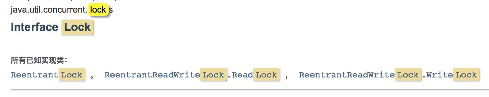

>  Synchronized和Lock区别

1、Synchronized 内部的java关键字，Lock是一个java类；

2、Synchronized无法获取锁的状态，Lock可以判断是否获取到了锁；

3、Synchronized 会自动释放锁，Lock必须手动释放锁，如果不释放锁，会造成死锁；

4、Synchronized 线程1获取到锁如果被阻塞了，线程2会傻傻的等，Lock锁就不一定会等待下去；

5、Synchronized 可重入锁，不可以中断的、非公平锁；Lock 可重入锁、可以判断锁，非公平（可以设置为公平锁）；

6、Synchronized 适合少量的代码同步问题，Lock适合大量的同步代码。


### 4、生产者和消费者

三步曲：

判断是否等待/ 业务代码 / 通知

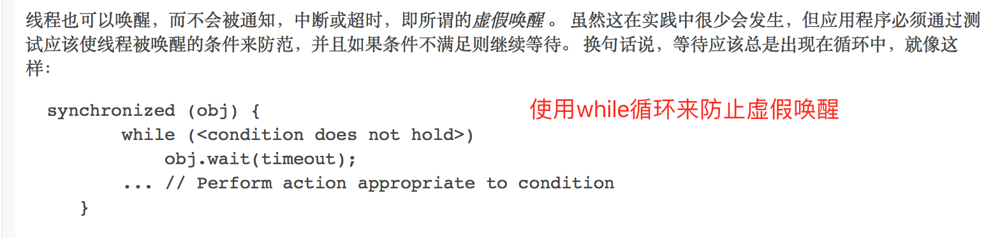

https://www.bilibili.com/video/BV1B7411L7tE?p=7&spm_id_from=pageDriver


> Condition可以精确的通知和唤醒线程

https://www.bilibili.com/video/BV1B7411L7tE?p=13&spm_id_from=pageDriver

### 5、8锁现象

### 6、集合类不安全

### 7、Callable

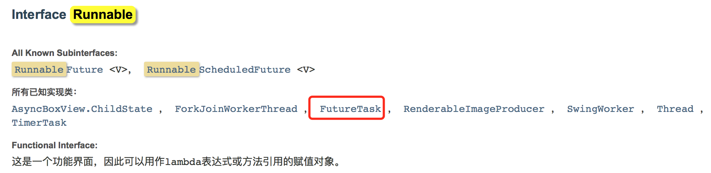

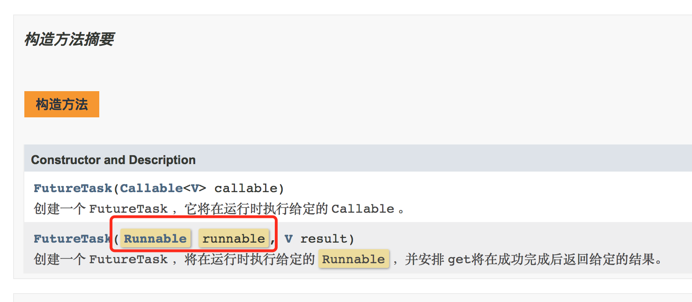

FutureTask是Runnable的实现类。

>  怎么使用Callable呢？

默认传统的做法是：

```java
class MyThread implements Runnable {

    @Override
    public void run() {
        System.out.printf("run()......");
    }
}
```

new Thread(new MyThread()).start(); 就可以启动一个线程。

如果使用Callable，该怎么启动一个线程呢？

```java
class MyThread implements Callable<String> {

    @Override
    public String call() throws Exception {
        System.out.println("call()");
        return "123456";
    }
}
```

我们通过查看文档可以发现，FutureTask是Runnable的一个实现类，而Future又可以调Runnable。所以可以这样做：

```java
MyThread thread  = new MyThread();
FutureTask futureTask = new FutureTask(thread);
new Thread(futureTask, "A").start();

// 获取线程执行结果的返回值(这个get方法有可能会产生阻塞，所以一般把这行代码放在最后)
// 或者使用异步通信(让这个线程跑着，处理完之后，我再去拿结果)
String result = (String) futureTask.get();
System.out.println(result);
```

**引申**

如果再启一个B线程，那么会打印几个call？

```java
MyThread thread  = new MyThread();
FutureTask futureTask = new FutureTask(thread);
new Thread(futureTask, "A").start();
new Thread(futureTask, "B").start();

// 获取线程执行结果的返回值(这个get方法有可能会产生阻塞，所以一般把这行代码放在最后)
// 或者使用异步通信(让这个线程跑着，处理完之后，我再去拿结果)
String result = (String) futureTask.get();
System.out.println(result);
```

答案：还是一个call()

原因：**结果会被缓存，提高效率。**

##### 细节

1、 Callable 有缓存；

2、结果可能要等待，会阻塞！

### 8、常用的辅助类

#### 8.1、CountDownLatch

```java
/**
 * CountDownLatch的使用demo
 *
 * 教室里有6个小学生，在6个小学生都离开教室后，保安会把教室的门锁上。
 *
 * @author Liuyongfei
 * @date 2021/11/17 23:23
 */
public class CountDownLatchDemo2 {

    public static void main(String[] args) {
        // 创建一个计数器
        CountDownLatch countDownLatch = new CountDownLatch(6);

        for (int i = 1; i <= 6; i++) {
            new Thread(() -> {
                System.out.println(Thread.currentThread().getName() + "Go Out");

                // 数量减一
                countDownLatch.countDown();
            }, String.valueOf(i)).start();
        }

        System.out.println("Close Door");
    }
}
```

执行结果：

```bash
1Go Out
3Go Out
2Go Out
Close Door
5Go Out
4Go Out
6Go Out
```

可以看到，会发生还有学生没出教室呢，就关门的现象。

解决：

添加： countDownLatch.await();

```java
/**
 * CountDownLatch的使用demo
 *
 * 教室里有6个小学生，在6个小学生都离开教室后，保安会把教室的门锁上。
 *
 * @author Liuyongfei
 * @date 2021/11/17 23:23
 */
public class CountDownLatchDemo2 {

    public static void main(String[] args) {
        // 创建一个计数器
        CountDownLatch countDownLatch = new CountDownLatch(6);

        for (int i = 1; i <= 6; i++) {
            new Thread(() -> {
                System.out.println(Thread.currentThread().getName() + "Go Out");

                // 数量减一
                countDownLatch.countDown();
            }, String.valueOf(i)).start();
        }

        // 等待计数器归零，再向下执行
        countDownLatch.await();
        System.out.println("Close Door");
    }
}
```

执行结果：

```java
4Go Out
1Go Out
2Go Out
5Go Out
6Go Out
3Go Out
Close Door
```

**原理**

`countDownLatch.countDown();` // 数量减1

`countDownLatch.await();` // 等待计数归零，然后再向下执行

- 每次有线程调用countDown()，数量就会减1；
- 假如计数器变为0，则countDownLatch.await()就会被唤醒，继续向下执行。

#### 8.2 、CyclicBarrier

是一个加法计数器。 

await会计数，达到指定计数后，会开启一条新的线程继续执行。

https://www.bilibili.com/video/BV1B7411L7tE?p=16&spm_id_from=pageDriver

#### 8.3、Semaphore

 可以理解为 抢停车位！

`限流的时候会用这个。你的流量入口只有这么大，你一次性只能进来这么多，不可能超过这个数量了。` 

**原理：**

`semphore.accure()`获得（-1），假设如果已经满了，则会等待，直到被释放为止！

`semaphore.release()`释放，会将当前的信号量释放（+1），然后唤醒等待的线程！

**作用：**

多个共享资源互斥时使用！并发限流，控制最大的线程数。

### 9、读写锁

先来看一个案例：

```java
/**
 * 读写锁的案例
 * 1.不使用读写锁
 * @author Liuyongfei
 * @date 2021/11/18 09:16
 */
public class ReadWriteLockDemo {

    public static void main(String[] args) {
        MyCache myCache = new MyCache ();

        // 启动5个线程，同时向cache中写入数据
        for (int i = 1; i <= 5 ; i++) {
            final int tmp = i;
            new Thread(() -> {
                myCache.put(tmp + "", tmp + " value");
            }, String.valueOf(i)).start();
        }

        // 启动5个线程，同时从cache中读取数据
        for (int i = 1; i <= 5; i++) {
            final  int tmp = i;
            new Thread(() -> {
                myCache.get(tmp + "");
            }, String.valueOf(i)).start();
        }
    }
}

/**
 * 自定义缓存
 */
class MyCache {
    private volatile HashMap<String, Object> cacheMap = new HashMap<>();

    /**
     * 存，写
     * @param key
     * @param value
     */
    public void put(String key, Object value) {
        System.out.println(Thread.currentThread().getName() + " 写入 " + key);
        cacheMap.put(key, value);
        System.out.println(Thread.currentThread().getName() + " 写入ok");
    }

    /**
     * 取，读
     * @param key
     */
    public void get(String key) {
        System.out.println(Thread.currentThread().getName() + " 读取 " + key);
        Object value = cacheMap.get(key);
        System.out.println(Thread.currentThread().getName() + " 读取ok：" + value);
    }
}
```

执行结果可能不会符合你的预期：

```bash
1 写入 1
3 写入 3
3 写入ok
2 写入 2
2 写入ok
4 写入 4
4 写入ok
1 写入ok
5 写入 5
5 写入ok
1 读取 1
2 读取 2
3 读取 3
3 读取ok：3 value
1 读取ok：1 value
2 读取ok：2 value
4 读取 4
4 读取ok：4 value
5 读取 5
5 读取ok：5 value
```

可以看到，1这个值还没写入到cache中，就有其它线程也在执行写入操作了。

**解决办法**

使用读写锁，保证在同一时刻写的时候 只能有一个线程能进行写；读的时候多个线程可以同时读。

```java
/**
 * 自定义缓存，使用读写锁
 */
class MyCacheLock {
    private volatile HashMap<String, Object> cacheMap = new HashMap<>();

    // private Lock lock = new ReentrantLock();
    // 声明一个读写锁：更加细粒度的控制
    private ReadWriteLock readWriteLock = new ReentrantReadWriteLock();


    /**
     * 存，写
     * @param key
     * @param value
     */
    public void put(String key, Object value) {
        readWriteLock.writeLock().lock();
        try {
            System.out.println(Thread.currentThread().getName() + " 写入 " + key);
            cacheMap.put(key, value);
            System.out.println(Thread.currentThread().getName() + " 写入ok");
        } catch (Exception e) {
            e.printStackTrace();
        } finally {
            readWriteLock.writeLock().unlock();
        }
    }

    /**
     * 取，读
     * @param key
     */
    public void get(String key) {
        readWriteLock.readLock().lock();
        try {
            System.out.println(Thread.currentThread().getName() + " 读取 " + key);
            Object value = cacheMap.get(key);
            System.out.println(Thread.currentThread().getName() + " 读取ok：" + value);
        } catch (Exception e) {
            e.printStackTrace();
        } finally {
            readWriteLock.readLock().unlock();
        }
    }
}
```

输出结果：

```bash
1 写入 1
1 写入ok
2 写入 2
2 写入ok
3 写入 3
3 写入ok
4 写入 4
4 写入ok
5 写入 5
5 写入ok
1 读取 1
1 读取ok：1 value
2 读取 2
2 读取ok：2 value
3 读取 3
3 读取ok：3 value
4 读取 4
4 读取ok：4 value
5 读取 5
5 读取ok：5 value
```


### 10、阻塞队列

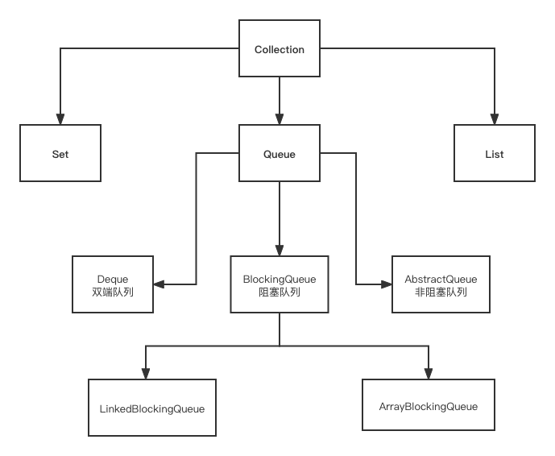

#### 阻塞

- 如果队列满了，此时再往里边写入，则会阻塞；

- 如果队列空了，此时再从里边进行读取元素，则会阻塞；

List、Set的祖宗类都是 Collection。

####  学会使用队列 

添加、移除

#### 四组API

1、抛出异常

2、不会抛出异常

3、阻塞等待

4、超时等待

https://www.bilibili.com/video/BV1B7411L7tE?p=20&spm_id_from=pageDriver


> SynchronousQueue同步队列

和其它的BlockingQueue是不一样的。没有容量，进去一个元素，必须等待取出来之后，才能往里边再放一个元素。

### 11、线程池（重点）

线程池：3大方法、7大参数、4种拒绝策略

>  池化技术

程序的运行，本质就是占用系统的资源，如何去优化资源的使用呢 =》池化技术

事先准备好一些资源，有人要用，就来我这里拿，用完之后还给我。

**线程池的好处**

1、降低资源的消耗；

2、提高响应的速度；

3、便于管理。

> 线程池：3大方法

https://www.bilibili.com/video/BV1B7411L7tE?p=23&spm_id_from=pageDriver

> 7大参数

```java
public static ExecutorService newSingleThreadExecutor() {
    return new FinalizableDelegatedExecutorService
        (new ThreadPoolExecutor(1, 1,
                                0L, TimeUnit.MILLISECONDS,
                                new LinkedBlockingQueue<Runnable>()));
}

public static ExecutorService newFixedThreadPool(int nThreads) {
        return new ThreadPoolExecutor(nThreads, nThreads,
                                      0L, TimeUnit.MILLISECONDS,
                                      new LinkedBlockingQueue<Runnable>());
    }

public static ExecutorService newCachedThreadPool() {
        return new ThreadPoolExecutor(0, Integer.MAX_VALUE,
                                      60L, TimeUnit.SECONDS,
                                      new SynchronousQueue<Runnable>());
    }
```

可以发现，开启线程，本质是调用ThreadPoolExecutor。查看ThreadPoolExecutor源码：

```java
public ThreadPoolExecutor(int corePoolSize, // 核心线程池线程数大小
                          int maximumPoolSize, // 最大线程池线程数大小
                          long keepAliveTime, // 超时多久，没有人调用，就会释放(比如银行的窗口，超过1小时没有人来办理业务，就关闭窗口了)
                          TimeUnit unit, // 超时时间的单位
                          BlockingQueue<Runnable> workQueue,// 阻塞队列(比如银行的候客区，最多只能容纳3个人)
                          ThreadFactory threadFactory, // 线程工程，用来创建线程的，一般不用动
                          RejectedExecutionHandler handler) // 拒绝策略(比如银行的窗口人满了，候客区也满了，这时再有人想办理业务就会被拒绝，不处理这个人的，抛出异常)
```

可以发现这里边有7个参数。

> 阿里巴巴开发规范中提到，不要用Executors去创建，而是使用ThreadPoolExecutor的方式去创建线程池的原因是什么？

1、看一下源码，这几种方式底层都是通过使用ThreadPoolExecutor的方式去创建线程池，规避资源耗尽的风险；

2、FixedThreadPool和SingleThreadPool、CachedThreadPool和ScheduledThreadPool，允许请求的队列长度为Integer.MAX_VALUE，可能会堆积大量的请求，导致OOM。

>  手动创建一个线程池

```java
/**
 * The default rejected execution handler
 */
private static final RejectedExecutionHandler defaultHandler =
    new AbortPolicy();
```

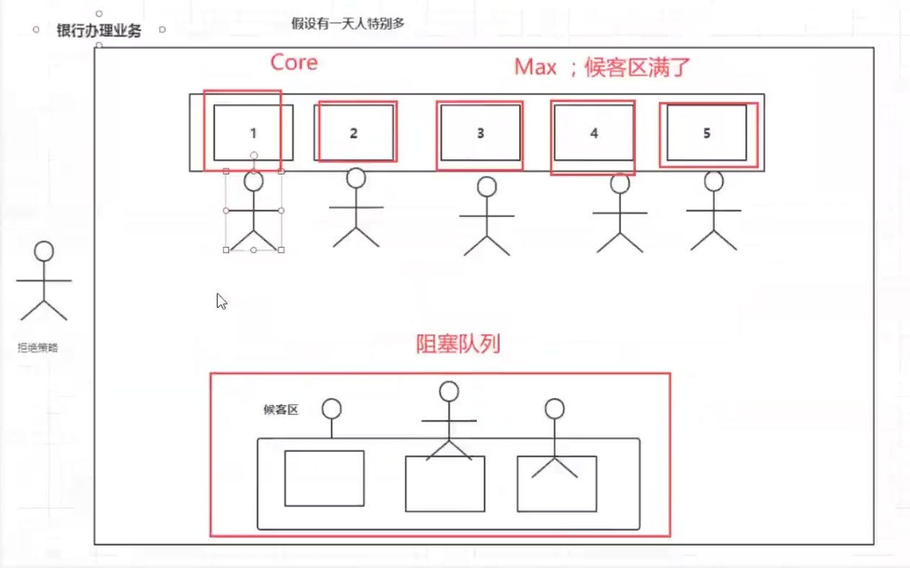

代码：

```java
/**
 * 线程池demo
 *
 * 使用线程池来创建线程
 *
 * 讲解线程池的7大参数，用去银行办理业务的例子来学习
 *
 * 比如银行有2个窗口可以办理业务，有3个窗口暂时不提供服务，然后候客区最多可以容纳3人。
 *
 * 1、这时有1个人来办理业务，正常
 * 2、有5个人来办理业务时，则有2个人可以去2个窗口办理业务，剩下3个人在候客区等待，对应到这里就是会开启2个线程来处理业务，剩下3个人在阻塞队列排队等待
 * 3、有6个人来办理业务时，则开启窗口：原来的2个窗口 + 原来暂时不提供服务的3个窗口会恢复1个窗口提供服务 =》 就会触发3个线程来执行了；
 * 3、有7个人来办理业务时，则开启窗口：原来的2个窗口 + 原来暂时不提供服务的3个窗口会恢复2个窗口提供服务 =》 就会触发4个线程来执行了；
 * 3、有8个人来办理业务时，则开启窗口：原来的2个窗口 + 原来暂时不提供服务的3个窗口会恢复3个窗口提供服务，注意，这时所有的窗口已经全部提供服务了 =》 就会触发5个线程来执行了；
 *
 * 最大承载：等于阻塞队列长度 + maximumPoolSize = 3 + 5 = 8
 *
 * 超出最大承载（8个），在这种策略情况下，会拒绝，并抛出异常
 * 比如，有第9个人来办理业务
 * 手动创建线程池
 * @author Liuyongfei
 * @date 2021/11/19 08:51
 */
public class Demo1 {

    public static void main(String[] args) {
//        ExecutorService threadPool =  Executors.newSingleThreadExecutor();

//        ExecutorService threadPool = Executors.newFixedThreadPool(5);
//
//        ExecutorService threadPool = Executors.newCachedThreadPool();

        // 手动创建一个线程池
        ExecutorService threadPool = new ThreadPoolExecutor(
                2,
                5,
                3,
                TimeUnit.SECONDS,
                new LinkedBlockingDeque<>(3),
                Executors.defaultThreadFactory(),
                new ThreadPoolExecutor.AbortPolicy() // 拒绝策略(比如银行的窗口人满了，候客区也满了，这时再有人想办理业务就会被拒绝，不处理这个人的，抛出异常)

        );

        try {
            for (int i = 1; i <= 6 ; i++) {
                threadPool.execute(() -> {
                    System.out.println(Thread.currentThread().getName() + " OK");
                });
            }
        } catch (Exception e) {
            e.printStackTrace();
        } finally {
            threadPool.shutdown();
        }
    }
}
```

i = 6 时，会启动三个线程：

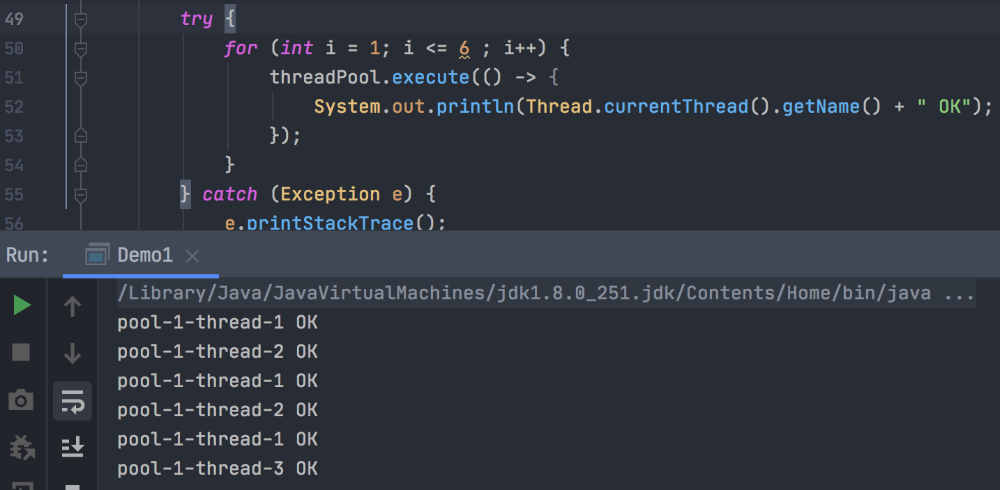

这个地方，本机CPU处理的太快，可能演示不出来。

> maximumPoolSize 这个最大核心线程数该定义多少合适呢？

可以从两方面来衡量：

1、CPU密集型：你的CPU是几核，就定义为几，这样可以保持CPU的效率最高；

2、IO密集型：比如你的程序中有15个非常耗IO的任务，那么最大线程数 > 15，比如最大线程数为 30。

### 12、四大函数式接口（必须掌握）

新时代的程序员，掌握这几个新的东西：lambda表达式、链式编程、函数式接口、Stream流式计算。

函数式接口：只有一个方法的接口。

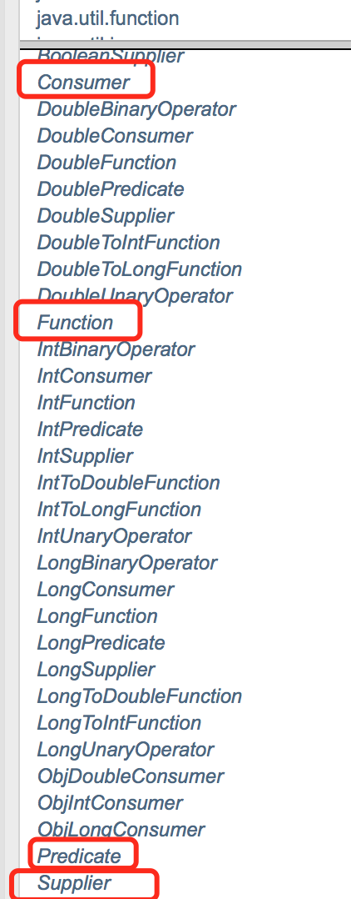

比较典型的是Runnable接口：

```java
@FunctionalInterface // 函数式接口
public interface Runnable {
    /**
     * When an object implementing interface <code>Runnable</code> is used
     * to create a thread, starting the thread causes the object's
     * <code>run</code> method to be called in that separately executing
     * thread.
     * <p>
     * The general contract of the method <code>run</code> is that it may
     * take any action whatsoever.
     *
     * @see     java.lang.Thread#run()
     */
    public abstract void run();
}
```

> Function函数式接口：传入一个参数，返回类型为R

```java
/**
 * 函数型接口
 * 只要是函数型接口，就可以用lambda表达式简化
 * @author Liuyongfei
 * @date 2021/11/20 11:52
 */
public class Demo1 {
    public static void main(String[] args) {
        // 当不知道怎么写参数的时候，可以去看一下源码。
        // Function 函数型接口，传入一个参数，返回类型为R

//        Function<String,String> function = new Function<String, String>() {
//            /**
//             * Applies this function to the given argument.
//             *
//             * @param s the function argument
//             * @return the function result
//             */
//            @Override
//            public String apply(String str) {
//                return str;
//            }
//        };

        // 只要是函数型接口，就可以用lambda表达式简化
        Function<String,String> function = (str) -> { return str; };

        System.out.println(function.apply("hello"));

    }
}
```


> 断定型接口：有一个输入参数，返回值只能是boolean值

```java
/**
 * 函数式接口之
 * Predicate： 断定型接口，传入一个参数，返回一个boolean值
 * @author Liuyongfei
 * @date 2021/11/20 12:58
 */
public class Demo2 {
    public static void main(String[] args) {
//        Predicate<String> predicate  = new Predicate<String>() {
//
//            /**
//             * 判断字符串是否为空
//             * @param s
//             * @return
//             */
//            @Override
//            public boolean test(String s) {
//                return s.isEmpty();
//            }
//        };

        // 用lambda表达式简化
        Predicate<String> predicate = (s) -> {return s.isEmpty();};
        System.out.println(predicate.test(""));
    }
}
```

> Consumer 消费型接口

```java
/**
 * 函数式接口之
 * Consumer：消费型接口，接收参数，没有返回值
 *
 * @author Liuyongfei
 * @date 2021/11/20 14:28
 */
public class Demo3 {
    public static void main(String[] args) {
        Consumer<String>  consumer = new Consumer<String>() {

            @Override
            public void accept(String s) {
                System.out.println("接收参数: " + s);
            }
        };

        consumer.accept("hello");
    }
}
```


> Supplier 供给型接口

```java
/**
 * 函数式接口之
 *
 * Supplier：供给型接口 没有参数，只有返回值
 *
 * @author Liuyongfei
 * @date 2021/11/20 14:38
 */
public class Demo4 {
    public static void main(String[] args) {
//        Supplier<Integer> supplier = new Supplier<Integer>() {
//
//            /**
//             * Gets a result.
//             *
//             * @return a result
//             */
//            @Override
//            public Integer get() {
//                System.out.println("get()");
//                return 1024;
//            }
//        };

        // 使用lambda表达式简化
        Supplier<Integer> supplier = () -> {return 1024;};

        System.out.println(supplier.get());
    }
}
```

### 13、Stream流式计算

> 什么是流式计算

大数据：存储 + 计算

存储，对于我们来说最开始是java的集合框架，比如List、Set、Map，

后来我们学了Mysql，就可以用Mysql来存储，

或者分布式文件系统来进行存储。

这些都是存储东西的，真正的计算应该交给Stream流来操作。

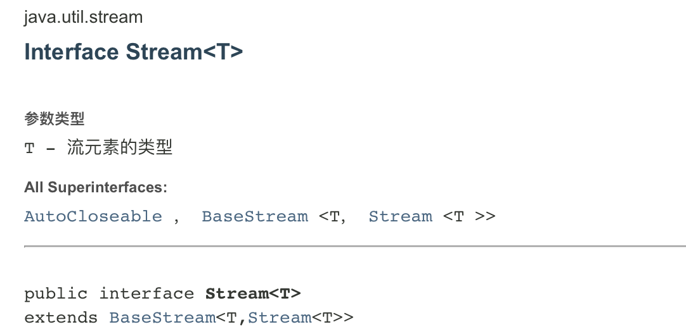

```java
/**
 *
 * 题目要求：一分钟内完成此题，只能用一行代码实现！
 * 现在有5个用户！筛选：
 * 1、ID 必须是偶数
 * 2、年龄必须大于23岁
 * 3、用户名转为大写字母
 * 4、用户名字母倒着排序
 * 5、只输出一个用户！
 *
 * 使用lambda表达式、链式编程、函数式接口、stream流计算 来解决这个题目。
 *
 * @author Liuyongfei
 * @date 2021/11/20 15:11
 */
public class Test {
    public static void main(String[] args) {
        User user1  = new User(1, "a", 21);
        User user2  = new User(2, "b", 22);
        User user3  = new User(3, "c", 23);
        User user4  = new User(4, "d", 24);
        User user5  = new User(6, "e", 25);

        // 存入List中，集合就是存储
        List<User> users = Arrays.asList(user1, user2, user3, user4, user5);

        // 计算交给Stream流
        users.stream()
                .filter(u -> { return  u.getId() % 2 == 0;})
                .filter(u -> { return  u.getAge() > 23;})
                .map(u -> { return  u.getName().toUpperCase();})
                .sorted((uu1,uu2) -> {return uu2.compareTo(uu1);})
                .limit(1)
                .forEach(System.out::println);
    }
}
```

### 14、ForkJoin

> 什么是ForkJoin

- ForkJoin 是jdk1.7提供的一个用于并行执行任务的框架；

- 是一个把**大任务分割**成若干个小任务，最终**汇总每个小任务结果后得到**大任务结果的框架。

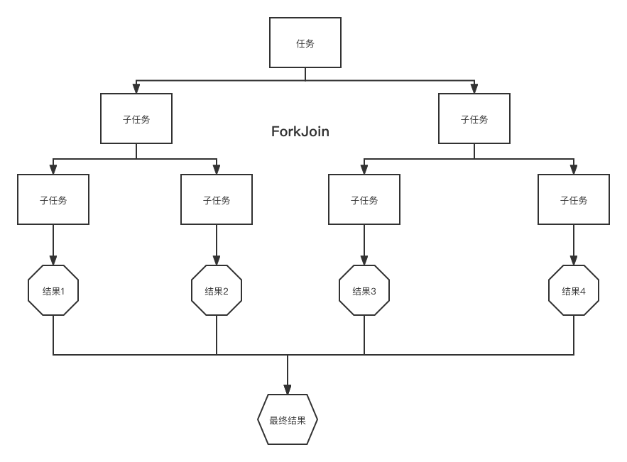

在大数量的时候使用。

大数据Map Reduce（把大任务拆分成小任务）。

> ForkJoin特点：工作窃取

任务分割出的子任务会添加到当前工作线程所维护的双端队列中，进入队列的队头。

**当一个工作线程里的队列暂时没有任务时，它会随机从其它工作线程的队列的尾部获取一个任务（工作窃取算法）。**


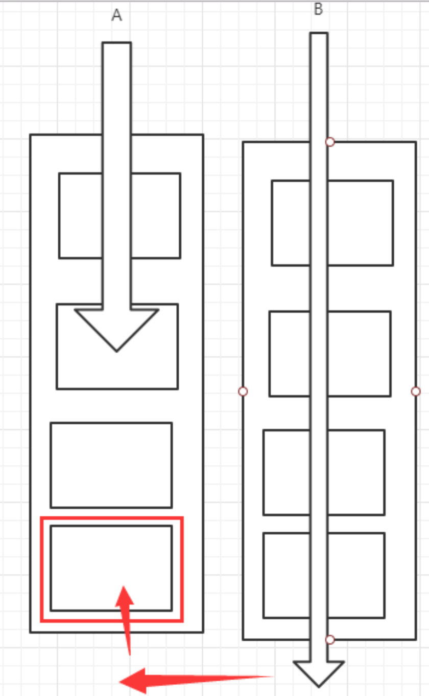


> ForkJoin

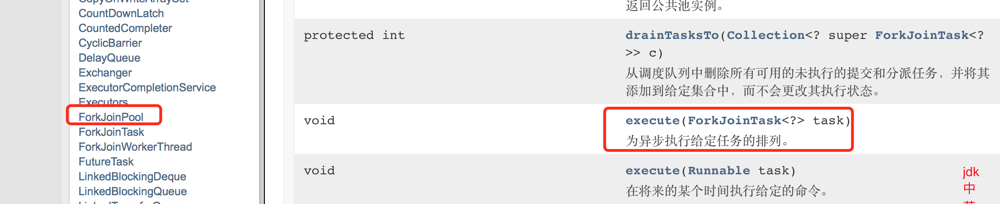

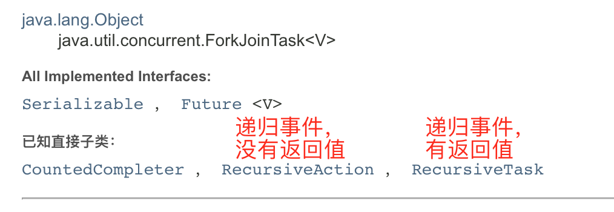

```java
/**
 * 使用ForkJoin求和计算的任务
 *
 * @author Liuyongfei
 * @date 2021/11/20 18:12
 */
public class ForkJoinDemo extends RecursiveTask<Long> {

    private Long start;
    private Long end;

    public ForkJoinDemo(Long start, Long end) {
        this.start = start;
        this.end = end;
    }

    /**
     * 临界值
     */
    private Long tmp = 10000L;

    /**
     * 任务的计算逻辑
     *
     * @return 返回计算结果
     */
    @Override
    protected Long compute() {

        if ((end - start) < tmp) {
            Long sum = 0L;
            for (Long i = start; i <= end; i++) {
                sum += i;
            }
            return sum;
        } else {
            // 使用ForkJoin 递归计算
            long middle = (start + end) / 2;
            ForkJoinDemo task1 = new ForkJoinDemo(start, middle);

            // 拆分任务，把任务压入线程队列
            task1.fork();

            ForkJoinDemo task2 = new ForkJoinDemo(middle + 1, end);
            // 拆分任务，把任务压入线程队列
            task2.fork();
            return  task1.join() + task2.join();
        }
    }
}
```

```java
/**
 * 测试
 * 1、普通方式
 * 2、ForkJoin方式
 * 3、Stream并行流
 * Stream并行流的效果比其他方式高很多
 * @author Liuyongfei
 * @date 2021/11/20 19:13
 */
public class Test {
    public static void main(String[] args) throws ExecutionException, InterruptedException {
//        test1(); // sum=500000000500000000,耗费时间=5223
//          test2(); // sum=500000000500000000,耗费时间=7525
        test3(); // sum=500000000500000000,耗费时间=818
    }

    /**
     * 普通程序员的常规做法
     */
    public static void test1() {
        long start = System.currentTimeMillis();
        Long sum = 0L;

        for (int i = 1; i <= 10_0000_0000 ; i++) {
            sum += i;
        }
        long end = System.currentTimeMillis();
        System.out.println("sum=" + sum + ",耗费时间=" + (end - start));
    }

    /**
     * 会使用ForkJoin的程序员
     */
    public static void  test2() throws ExecutionException, InterruptedException {
        long start = System.currentTimeMillis();

        ForkJoinPool pool = new ForkJoinPool();

        ForkJoinTask<Long> task = new ForkJoinDemo(0L, 10_0000_0000L);

        ForkJoinTask<Long> submit = pool.submit(task);

        Long data = submit.get();

        long end = System.currentTimeMillis();
        System.out.println("sum=" + data + ",耗费时间=" + (end - start));
    }

    public static void test3() {
        long start = System.currentTimeMillis();

        // Stream并行流
        long sum = LongStream.rangeClosed(0L, 10_0000_0000).parallel().reduce(0,Long::sum);

        long end = System.currentTimeMillis();
        System.out.println("sum=" + sum + ",耗费时间=" + (end - start));
    }
}
```

### 	15、异步回调

> Future设计的初衷：对将来的某个事件结果进行建模。

？

```java
/**
 * 异步回调：CompletableFuture
 *
 * 类似于 Ajax
 * @author Liuyongfei
 * @date 2021/11/20 19:58
 */
public class Demo {
    public static void main(String[] args) throws ExecutionException, InterruptedException {
        // 没有返回值的异步回调
//        CompletableFuture<Void> completableFuture = CompletableFuture.runAsync(() -> {
//            try {
//                TimeUnit.SECONDS.sleep(2);
//            } catch (InterruptedException e) {
//                e.printStackTrace();
//            }
//            System.out.println(Thread.currentThread().getName() + "runAsync()");
//        });

//        System.out.println("hello");

        // 获取阻塞执行结果
//        completableFuture.get();

        CompletableFuture<Integer> completableFuture = CompletableFuture.supplyAsync(() -> {
            try {
                TimeUnit.SECONDS.sleep(2);

                int a = 100 / 0;
            } catch (InterruptedException e) {
                e.printStackTrace();
            }
            System.out.println(Thread.currentThread().getName() + "supplyAsync()");
            return 666;
        });

        Integer data = completableFuture.whenComplete((t,u) -> {
            System.out.println("t->" + t);  // t是正常时的返回结果
            System.out.println("u->" + u); //  u是发生异常时的异常信息
        }).exceptionally((e) -> {
            System.out.println(e.getMessage());
            return 111;  // 可以获取到错误时的返回结果
        }).get();

        System.out.println(data);
    }
}
```

### 16、理解JMM

> 请你谈谈你对Volatile的理解。

需要先了解JMM后，才能学volatile。

> 什么是JMM

Java内存模型，不是现实存在的东西，是一个概念/约定。

**关于JMM的一些同步的约定：**

1、线程解锁前，必须把共享变量的值刷回主存；

2、线程加锁前，必须获取主存中最新的值到工作内存去；

3、加锁和解锁是同一把锁。

#### 8种交互操作

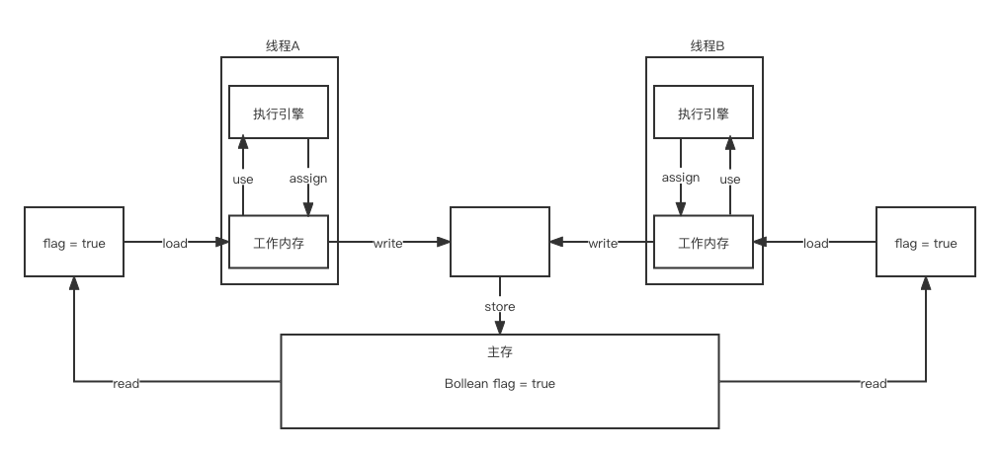

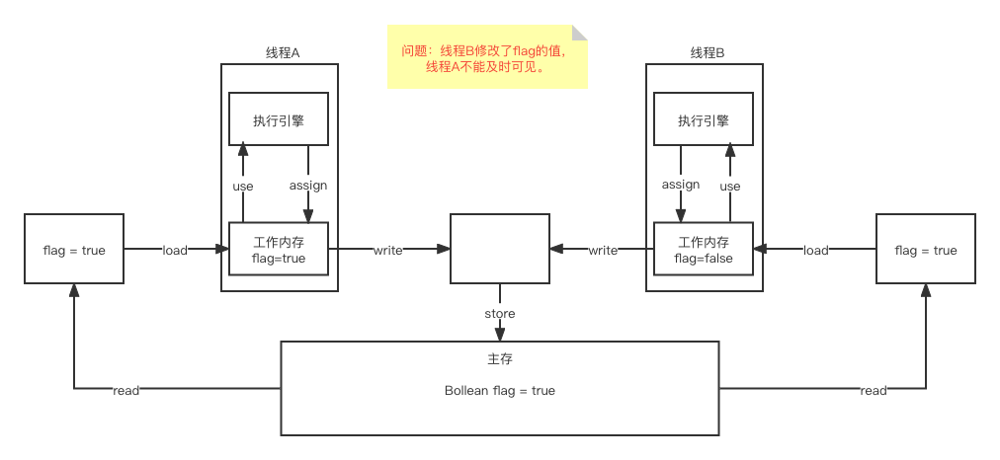

需要线程A知道主存中flag的值发生了变化。

### 17、Volatile

> 1、保证可见性

```java
/**
 * 本demo有两个线程：
 * main线程和自己新建的一个线程
 * 1.num没有加volatile，在main线程中修改num的值，另外一个线程是感知不到num发生变化的，因此一直在死循环，JVM进程也不退出
 * 2.num加volatile，在main线程中修改num的值，另外一个线程是感知不到num发生变化的，因此，while条件不成立了，所以JVM进程也退出了。
 * @author Liuyongfei
 * @date 2021/11/21 15:06
 */
public class VolatileDemo2 {

//    private static int num  = 0;
    private static volatile int num  = 0;

    public static void main(String[] args) {
        new Thread(() -> {
            while (num == 0) {

            }
        }).start();

        try {
            TimeUnit.SECONDS.sleep(1);
        } catch (InterruptedException e) {
            e.printStackTrace();
        }

        num = 1;
        System.out.println(num);
    }
}
```

> 2、不保证原子性

原子性：不可分割。

线程A在执行的时候，不能被打扰的，也不能被分割。要么同时成功，要么同时失败。

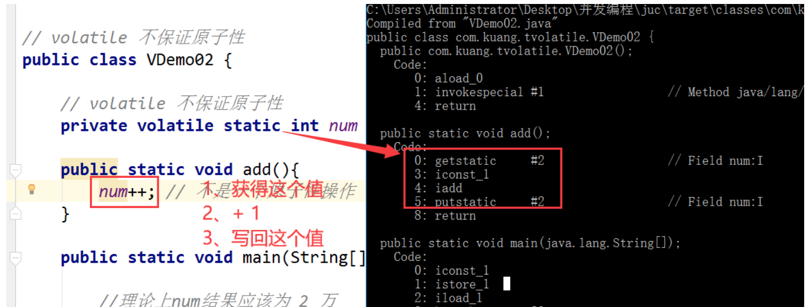

num++，不是一个原子性操作。

可能会存在多个线程同时进来拿到同一个值，写完再改回去。

>  **如果不加lock，不使用synchronized，怎么保证原子性**？

使用原子类，解决原子性问题。

```java
/**
 * volatile不保证原子性
 *
 * 我们期望拿到的num值是20000，但实际输出的不是这样。
 *
 * @author Liuyongfei
 * @date 2021/11/21 15:23
 */
public class VolatileDemo3 {

//    private static volatile int num = 0;
    private static volatile AtomicInteger num = new AtomicInteger();

    private static void add() {
//        num++;
        num.getAndIncrement(); // AtomicInteger + 1，使用CAS。
    }
    public static void main(String[] args) {
        for (int i = 1; i <= 20; i++) {
            new Thread(() -> {
                for (int j = 1; j <= 1000; j++) {
                    add();
                }
            }).start();
        }

        // main,gc
        while (Thread.activeCount() > 2) {
            Thread.yield();
        }

        System.out.println(Thread.currentThread().getName() + " " + num);
    }
}
```

CAS，Unsafe 这些类的底层直接和操作系统挂钩。

> 3、禁止指令重排

什么是指令重排：你写的程序 ，**计算机并不是按照你写的那样去执行的。**

源代码  =》 编译器优化的指令重排 =》 指令并行也可能会重排 =》内存系统也会重排 =》执行。

举个简单的例子，比如你写的代码是这样：

```java
int x = 1;  // 第1行
int y = 2;  // 第2行
x = x + 5;  // 第3行
y = x * x   // 第4行
```

我们可能期望的执行顺序是：1234

但是实际的执行顺序可能会是：1324 或者 2134

但是处理器在执行指令重排的时候，会考虑数据之间的依赖性。因此不会出现 4123 这种顺序。

既然你这么了解volatile，那你能说一下 volatile 内存屏障，在哪个地方使用的最多？ =》 单例模式。

使用了volatile修饰符后，就会在变量的前面和后面都加上内存屏障。

### 18、彻底玩转单例模式

为什么枚举可以避免单例被破坏？

搞懂单例模式、搞懂枚举。

- 饿汉模式

- 懒汉模式

  双重检测锁模式的懒汉式单例，简称DCL懒汉式。=》因指令重排可能存在问题，因此加上 volatile修饰。
  


