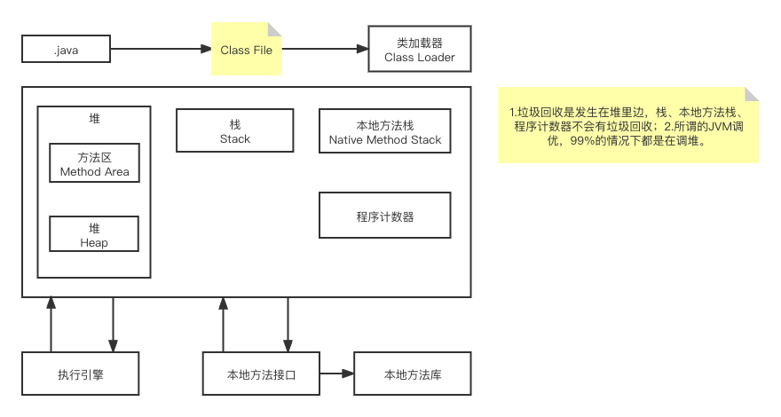
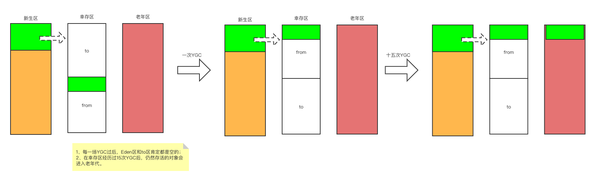
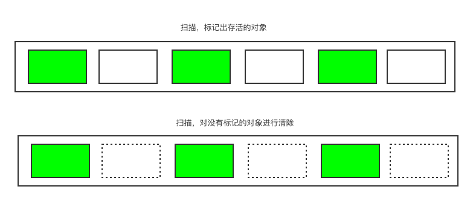
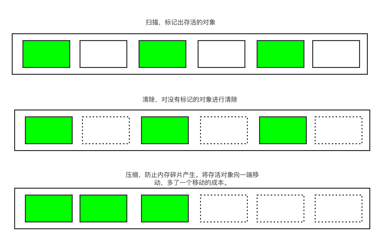

### JVM的体系结构



### 类加载器**（ClassLoader）**

- 我们都知道Java文件被运行，第一步需要通过 javac 编译器编译为 class 文件；第二步，JVM 运行 class 文件，实现跨平台。
- 而 JVM 虚拟机第一步肯定是加载 class 文件。

所以，类加载器实现的就是：

`通过一个类的全限定名来获取描述此类的二进制字节流。`

ClassLoader顾名思义就是类加载器，它的作用：

1. 负责将 Class 文件加载到 JVM 中；
2. 审查每个类由谁加载；
3. 将 Class 字节码重新解析成 JVM 统一要求的对象格式。


#### 类加载器的几个重要特性

1、每个类加载器都有自己的预定义的搜索范围，用来加载 class 文件；

2、每个类和加载它的类加载器确定了这个类的唯一性，也就是说如果一个类被不同的类加载器加载到了 JVM中，那么这两个类就是不同的类，虽然他们来自同一份 class 文件；

3、双亲委派模型。

#### 类加载器的类型

1、虚拟机自带的加载器； 

2、启动（Bootstrap）类（根）加载器； =》jre/lib/rt.jar（这个就是根加载器里面的一些东西）的类库加载到内存中。具体可由启动类加载器加载到的路径可通过`System.getProperty(“sun.boot.class.path”)`查看：

```bash
/Library/Java/JavaVirtualMachines/jdk1.8.0_251.jdk/Contents/Home/jre/lib/resources.jar
:/Library/Java/JavaVirtualMachines/jdk1.8.0_251.jdk/Contents/Home/jre/lib/rt.jar
:/Library/Java/JavaVirtualMachines/jdk1.8.0_251.jdk/Contents/Home/jre/lib/sunrsasign.jar
:/Library/Java/JavaVirtualMachines/jdk1.8.0_251.jdk/Contents/Home/jre/lib/jsse.jar
:/Library/Java/JavaVirtualMachines/jdk1.8.0_251.jdk/Contents/Home/jre/lib/jce.jar
:/Library/Java/JavaVirtualMachines/jdk1.8.0_251.jdk/Contents/Home/jre/lib/charsets.jar
:/Library/Java/JavaVirtualMachines/jdk1.8.0_251.jdk/Contents/Home/jre/lib/jfr.jar
:/Library/Java/JavaVirtualMachines/jdk1.8.0_251.jdk/Contents/Home/jre/classes
```

3、扩展（Extension）类加载器；=》jre/lib/ext 目录下的类库加载到内存中，具体可由扩展类加载器加载到的路径可通过`System.getProperty("java.ext.dirs")`查看：

```bash
/Users/lyf/Library/Java/Extensions
:/Library/Java/JavaVirtualMachines/jdk1.8.0_251.jdk/Contents/Home/jre/lib/ext
:/Library/Java/Extensions
:/Network/Library/Java/Extensions
:/System/Library/Java/Extensions
:/usr/lib/java
```

4、应用程序加载器。=》 就是我们本地自己写的类（只要实现了抽象的java.lang下的抽象类（ClassLoader））

系统类加载器是由 Sun 的 AppClassLoader（sun.misc.Launcher$AppClassLoader）实现的，它负责将用户类路径(java -classpath或-Djava.class.path变量所指的目录，即当前类所在路径及其引用的第三方类库的路径下的类库加载到内存中。具体可由系统类加载器加载到的路径可通过`System.getProperty("java.class.path")`查看：


备注：具体代码见 blog-demo/jvm-demo/Student.java。


### 双亲委派机制

类装载器采用的机制是双亲委派模式。

目的是：安全性考虑。


1. 所有的类加载器都是有层级结构的，每个类加载器都有一个父类加载器（通过组合实现，而不是继承），除了启动类加载器（**Bootstrap ClassLoader**）；
2. 当一个类加载器收到一个类加载的请求时，首先将这个请求委派给它的父类加载器去加载，所以每个类加载请求最终都会传递到顶层的启动类加载器，如果父加载器无法加载时，子类加载器才会去尝试自己去加载。

当前 --》 EXT --》BOOT

1. 类加载器收到类加载的请求；
2. 将这个请求向上委托给父类加载器去完成，一直向上委托，直到启动类加载器（Boot）；
3. 启动加载器检查是否能够加载当前这个类，能加载就结束，使用当前的加载器，否则，抛出异常，通知子加载器进行加载；
4. 重复步骤3。

```java
package java.lang;

/**
 * 举例讲双亲委派机制
 *
 * 这个String跟java管理的是同包同名
 * 
 * @author Liuyongfei
 * @date 2021/12/26 22:31
 */
public class String {

    public String toString() {
        return "Hello";
    }

    public static void main(String[] args) {
        String s = new String();
        System.out.println(s.toString());
    }
}
```


说这个String里找不到main方法，但明明我们这个类里边有main方法呢？

所以可以说明程序是没有执行这个类的。为什么？

双亲委派机制=》为了安全，防止程序员故意去制造一些bug。

**再加个补充：为了防止内存中存在多份同样的字节码，使用了双亲委派机制。**

### Tomcat为什么要JAVA破坏双亲委派机制？

这篇文章讲的特别好：https://www.zhihu.com/question/466696410


#### 原理

在运行一个类之前，会一级一级向上找。从 APP -》EXT =》BOOT。

- 这个例子中，我们是 new String()，会在当前找，有这个String类，然后会再往 EXT里找，最后再往BOOT里找。
- 最终会执行BOOT里的String类；
- 只有当BOOT和EXT都找不到该类时，才会执行当前应用加载器。

#### 通过双亲委派模型就实现了类加载器的三个特性

1、委托：子类加载器委托父类加载器加载；

2、可见性：子类加载器可访问父类加载器加载的类，父类不能访问子类加载器加载的类；

3、唯一性：可保证每个类只被加载一次。比如Object类是被BootStrap ClassLoader加载的，因为有了双亲委派模型，所有的Object类加载请求都委派到了BootStrap ClassLoader，所以保证了只被加载一次。

------------------------------------------------

线程级别的，java是处理不了的，需要调用C++底层了，通过native方法（JNI）:

```java
private native void start0()
```

### Native方法

比如Thread类里的start0方法：

```java
private native void start0();
```

- 凡是带了native关键字的，说明Java的作用范围达不到了，会去调用底层C语言的库；

- 会进入本地方法栈，调用本地方法接口（JNI）；

- JNI作用：扩展java的使用，融合不同的编程语言为java所使用！

  >  Java诞生的时候，C、C++横行，想要立足，必须要有能调用C/C++的程序，于是在内存区域中专门开辟了一块标记区域：Native Method Stack，来等级Native方法。

- 在最终执行的时候，通过JNI去加载本地方法库中的方法。

目前该方法的使用是越来越少了，除非是与硬件有关，比如通过java程序驱动打印机或java系统管理生产设备，在企业级应用中已比较少见。因为现在的异构领域间通信很发达，比如可以使用Socket通信，也可以使用Web Service等等，不多做介绍。

#### Native Method Stack

它的具体做法是 Native Method Stack 中登记native方法，在（Execution Engine）执行引擎的时候加载native Libraries（本地库）。

### 方法区

Method Area 方法区

方法区是被所有线程共享，所有字段和方法字节码，以及一些特殊方法，如构造函数、接口方法也在此定义。

简单说，所有定义的方法的信息都保存在该区域，`此区域属于共享区间`。

`静态变量、常量、类信息（构造方法、接口定义）、运行时的常量池存在方法区中，但是，实例变量存在于堆内存中，和方法区无关`。

### 栈

栈内存，主管程序的运行，生命周期和线程同步；

线程结束，栈内存也就释放了，对于栈来说，不存在垃圾回收问题；

一旦线程结束，栈就Over。

#### 栈里边存哪些东西呢？

- 8大基本类型
- 对象的引用
- 实例的方法

#### 栈运行原理

先进后出。

栈帧：`每一个执行的方法都会产生一个栈帧，按照栈的先进后出的顺序，慢慢被压栈。而程序正在执行的方法，一定在栈的顶部`。执行完这个方法后，就会弹出栈。

`栈满了，就会抛出：StackOverflowError 错误`。

#### 栈+堆+方法区的交互关系

new 一个类的时候，会在栈里边存放一个引用，实例会分配在堆里边。

### 堆

Heap。一个JVM只有一个堆内存，堆内存的大小是可以调节的。

> 类加载器读取了类文件之后，一般会把什么东西放到堆中？（new 一个对象之后，会怎么放？）

一般是类具体的实例，类里边的方法、常量、变量。保存所有引用类型的真实对象。

栈里一般是 引用

常量池都在方法区里。

> 堆内存中还分为三个区

- 新生代

  - 伊甸园区（Eden）：所有的对象都是伊甸园区new出来的。
  - 幸存区0区
  - 幸存区1区
  - 类诞生和成长的地方，甚至死亡。

- 老年代

- 永久代

  这个区域常驻内存。用来存放JDK自身的Class对象、Interface元数据，存储的是Java运行时的一些环境或类信息，这个区域不存在垃圾回收。

  - JDK1.6之前：永久代，常量池是在方法区；
  - JDK1.7：永久代，但是慢慢的退化了，`去永久代`，常量池在堆中；
  - JDK1.8之后：无永久代，常量池在元空间。关闭JVM的时候，会释放这个区域的内存。
  - 什么情况下，在永久区就崩了呢？
    - 一个启动类，加载了大量的第三方jar包；
    - Tomcat部署了太多的应用，大量动态生成的反射类，不断的被加载；直到内存满，就会出现OOM。

`GC垃圾回收主要发生在 新生区和老年区。`

`假设堆内存满了，会报OOM（OutOfMemoryError），堆内存不够了。`

在JDK1.8以后，永久区改了个名字，叫（元空间）。

真理：经过研究，99%的对象都是临时对象。

### 新生区、永久区、堆内存调优

默认情况下，分配的总内存是电脑内存的1/4，而初始化的内存是 1/ 64。

### 使用JProfiler工具分析OOM原因

1. idea需要安装jprofiler插件；
2. 同时电脑需要下载jprofiler客户端，并进行安装。

3. 设置程序的jvm启动参数：

```java
-Xms1m -Xmx8m -XX:+HeapDumpOnOutOfMemoryError
```

意思是假设爆出OOM异常，就把错误信息的文件给Dump下来。

demo代码如下：

```java
/**
 * 写一个会导致OOM的demo，并生成dump文件，使用JProfile工具来分析
 *
 * @author Liuyongfei
 * @date 2022/1/3 21:09
 */
public class DemoOOM {

    byte[] array = new byte[1024 * 1024];

    public static void main(String[] args) {
        int count = 0;
        ArrayList<DemoOOM> list = new ArrayList();
        while (true) {
            list.add(new DemoOOM());
            count++;
        }
    }
}
```

输出信息：

```bash
java.lang.OutOfMemoryError: Java heap space
Dumping heap to java_pid55207.hprof ...
Heap dump file created [7361301 bytes in 0.047 secs]
Exception in thread "main" java.lang.OutOfMemoryError: Java heap space
	at com.fullstackboy.jvm.DemoOOM.<init>(DemoOOM.java:13)
	at com.fullstackboy.jvm.DemoOOM.main(DemoOOM.java:19)

Process finished with exit code 1
```

可以看到在项目的根目录下面生成了一个 java_pid55207.hprof 文件，使用JProfiler 打开。

1. 查看Biggest Objects：


可以看到这个ArrayList 占了很大的内存。

2.点Threa Dump：


可以清晰的看到因为哪一行报错。

常用命令：

- -Xms 设置初始化内存分配大小，默认是电脑内存的1/64；
- -Xmx 设置最大分配内存，默认是电脑内存的1/4；
- -XX:+PrintGCDetails，打印GC垃圾回收信息；
- -XX:+HeapDumpOnOutOfMemoryError，OOM dump

### GC：垃圾回收

JVM在进行GC时，并不是对这三个区域都进行回收。大部分时候，回收都是新生代~

- 新生代
- 幸存区（form，to）
- 老年区

GC两种类型：轻GC（普通GC），重GC（全局GC）。

#### `GC面试题`

- jvm的内存模型和分区，详细到每个区放什么；
- 堆里边的分区有哪些？Eden，form，to，老年区，说说他们的特点；
- GC的算法有哪些？标记清除法，标记压缩，复制算法（新生代、幸存区 主要用的是复制算法），引用计数法，怎么用的？
- 轻GC和重GC，分别在什么时候发送？

#### 复制算法



- 好处：没有内存碎片；
- 坏处：浪费了内存空间，多了一半空间（to）永远是空。

#### 标记清除算法



- 好处：不需要额外空间！
- 缺点：两次扫描，严重浪费时间，会产生内存碎片。

#### 标记清除压缩算法



#### 总结

- 内存效率最高：复制算法 > 标记清除算法 > 标记压缩算法（时间复杂度）
- 内存整齐度：复制算法 = 标记压缩算法 > 标记清除算法
- 内存利用率：标记压缩算法 = 标记清除算法 > 复制算法

思考一个问题：难道没有最优秀的算法吗？

答案：没有最好的算法，只有最合适的算法。 ---》 GC：分带收集算法。

##### 年轻代

- 存活率低；
- 可以用复制算法

##### 老年代

- 区域大，存活率高；
- 可以用标记清除（内存碎片不是很多时） + 标记压缩（内存碎片较多时） 混合实现。


### JMM

1. 什么是JMM？Java Memory Model。java内存模型；
2. 作用：缓存一致性协议，用于定义数据读写的规则。
   - jvm 定义了工作线程内存与 主内存之间的抽象关系；线程之间的共享变量存储在主内存，每个线程都有一个本地内存，是从主内存拷贝的；
   - 因此在多个线程同时操作同一个变量时，就会有可能遇到数据不一致的问题；
   - 为了解决这个共享对象的可见性，需要使用 volidate。

#### JMM的面试题


