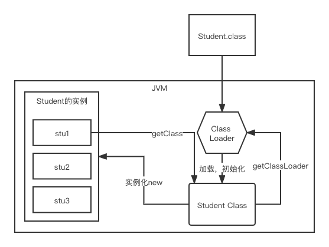
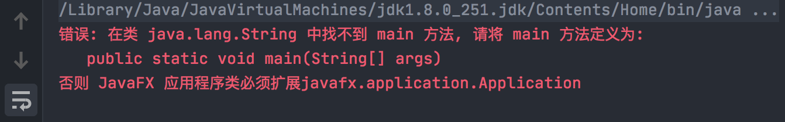

### 类加载器

1、虚拟机自带的加载器； 

2、启动类（根）加载器； =》jre/lib/rt.jar（这个就是根加载器里面的一些东西）

3、扩展类加载器；=》jre/lib/ext 目录下的

4、应用程序加载器。=》 就是我们本地自己写的类（只要实现了抽象的java.lang下的抽象类（ClassLoader））



### 双亲委派机制

类装载器采用的机制是双亲委派模式。

目的是：安全性考虑。

当前 --》 EXT --》BOOT

1. 类加载器收到类加载的请求；
2. 将这个请求向上委托给父类加载器去完成，一直向上委托，直到启动类加载器（Boot）；
3. 启动加载器检查是否能够加载当前这个类，能加载就结束，使用当前的加载器，否则，抛出异常，通知子加载器进行加载；
4. 重复步骤3。

```java
package java.lang;

/**
 * 举例讲双亲委派机制
 *
 * 这个String跟java管理的是同包同名
 * 
 * @author Liuyongfei
 * @date 2021/12/26 22:31
 */
public class String {

    public String toString() {
        return "Hello";
    }

    public static void main(String[] args) {
        String s = new String();
        System.out.println(s.toString());
    }
}
```



说这个String里找不到main方法，但明明我们这个类里边有main方法呢？

所以可以说明程序是没有执行这个类的。为什么？

双亲委派机制=》为了安全，防止程序员故意去制造一些bug。

#### 原理

在运行一个类之前，会一级一级向上找。从 APP -》EXT =》BOOT。

- 这个例子中，我们是 new String()，会在当前找，有这个String类，然后会再往 EXT里找，最后再往BOOT里找。

- 最终会执行BOOT里的String类；
- 只有当BOOT和EXT都找不到该类时，才会执行当前应用加载器。

线程级别的，java是处理不了的，需要调用C++底层了，通过native方法:

```java
private native void start0()
```

### Native方法

目前该方法的使用是越来越少了，除非是与硬件有关，比如通过java程序驱动打印机或java系统管理生产设备，在企业级应用中已比较少见。因为现在的异构领域间通信很发达，比如可以使用Socket通信，也可以使用Web Service等等，不多做介绍。

#### Native Method Stack

它的具体做法是 Native Method Stack 中登记native方法，在（Execution Engine）执行引擎的时候加载native Libraries（本地库）。

### 方法区

Method Area 方法区

方法区是被所有线程共享，所有字段和方法字节码，以及一些特殊方法，如构造函数、接口方法也在此定义。

简单说，所有定义的方法的信息都保存在该区域，`此区域属于共享区间`。

静态变量、常量、类信息（构造方法、接口定义）、运行时的常量池存在方法区中，但是，实例变量存在于堆内存中，和方法区无关。

