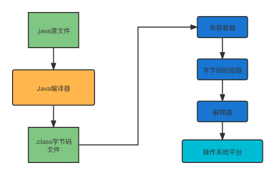
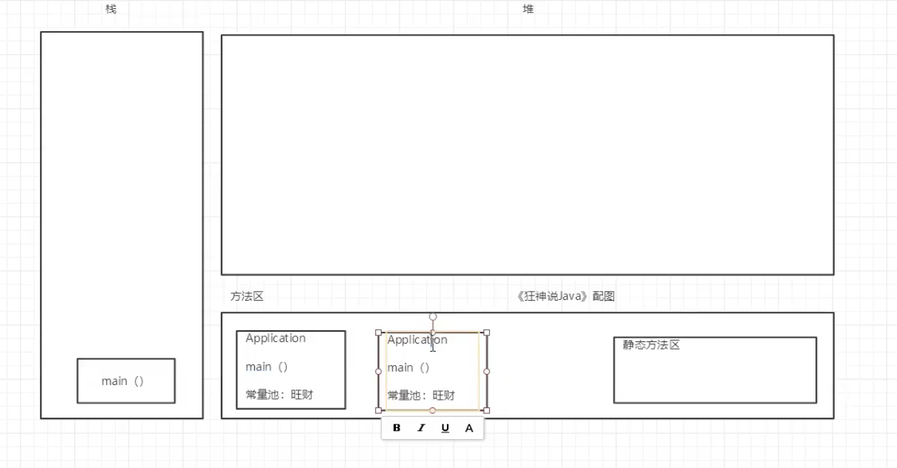
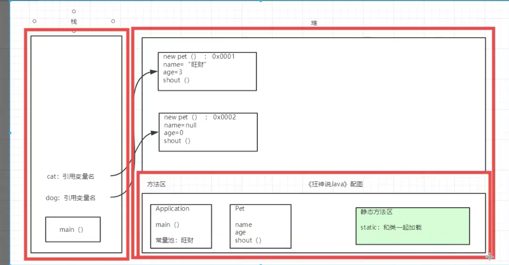
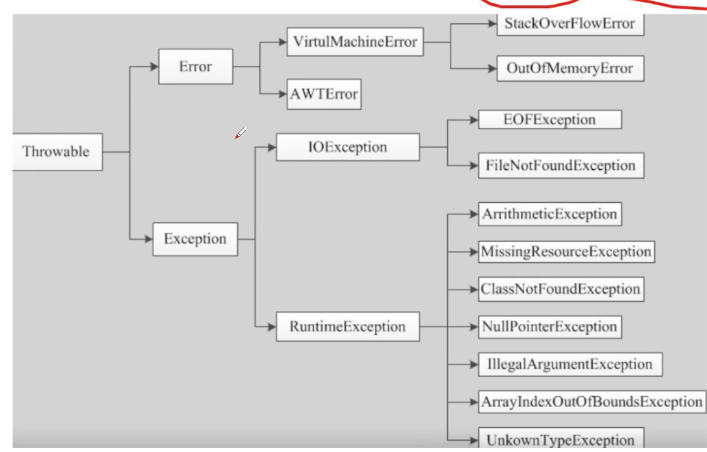
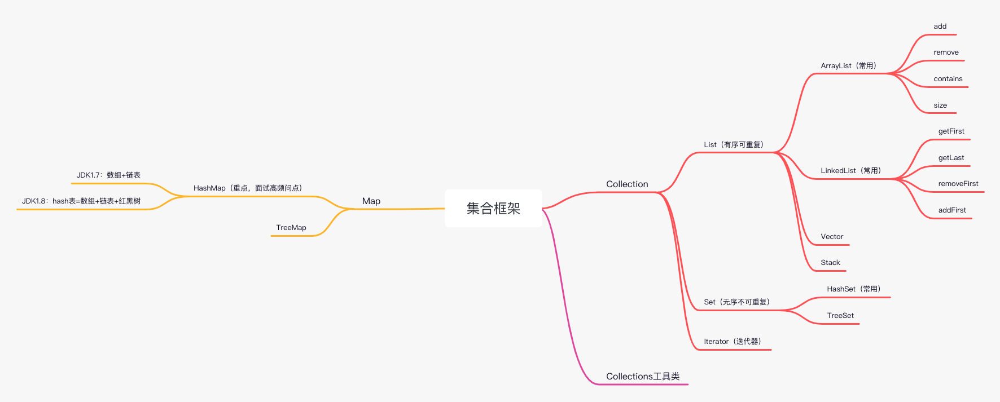
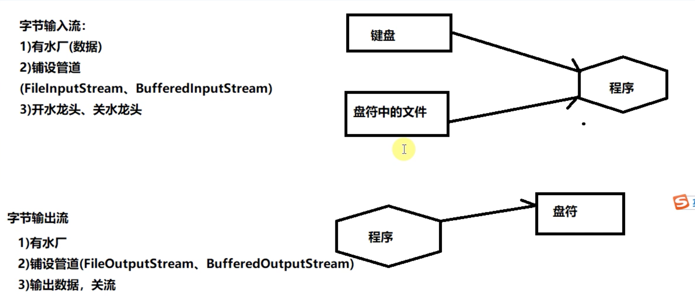
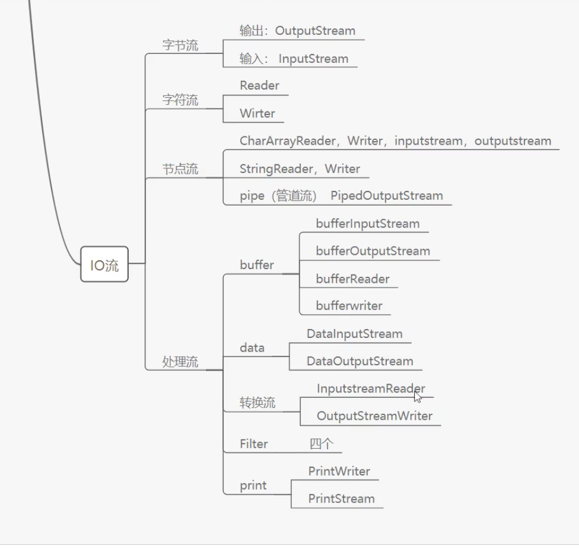
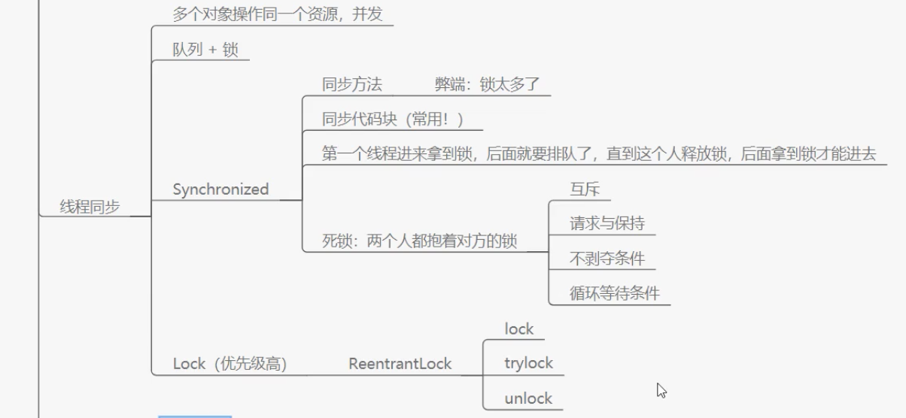
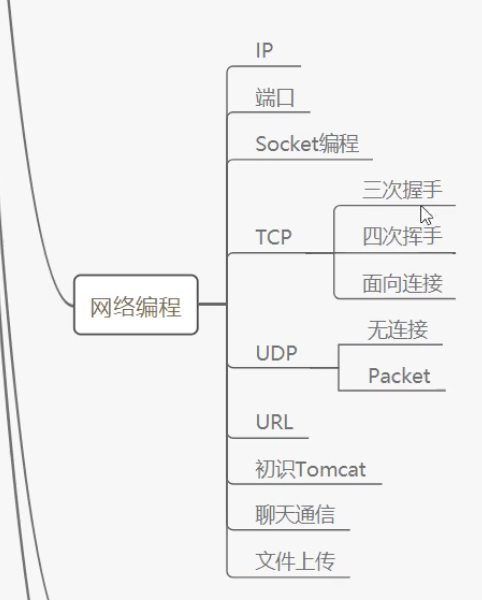
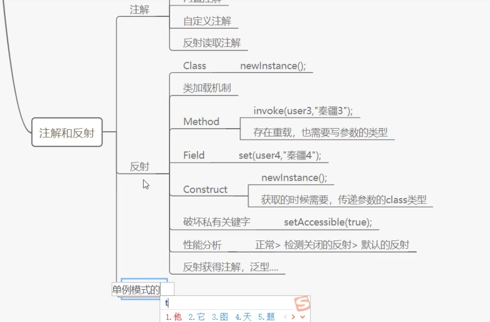

### Java程序运行机制



### Java的八大基本数据类型

整数

- byte   -》 占1个字节
- short -》占2个字节
- int -》占4个字节
- long -》 占8个字节

小数

- float -》 占4个字节
- double -》 占8个字节

字符

- char -》 占2个字节

备注：`String不是关键字，不是基本数据类型，它是类`

布尔值

- boolean：占1位，其值只有true和false两个。

### 什么是字节

- 位（bit）：是计算机内部数据存储的最小单位，11001100 是一个8位的二进制数；
- 字节（byte）：是计算机中处理数据的基本单位，习惯上用大写B来表示；
- 1B（byte，字节）= 8 bit（位）；
- 字符：是指计算机中使用的字母、数字、字和符号。


- 1bit表示1位；
- 1Byte表示一个字节 1B = 8b；
- 1024B = 1KB。

### 基础数据类型扩展及面试题


浮点数扩展，银行业务能用浮点数来算钱吗？

float，是离散的、有舍入误差、大约、接近但不等于的特点。

### 类型转换

强制转换  (类型)变量名  高-》低

自动转换  低-》高

### Java基础：变量、常量、作用域

- 局部变量：必须声明和初始化；
- 实例变量：从属于对象，可以不用初始化，如果不自行初始化，会赋值为这个类型的默认值，比如：int的默认值为0/0.0，String的默认值为null，除了基本类型，引入类型的默认值都是null；

### 自增自减运算符

++,-- 自增、自减  一元云算符

### 位运算符

```java
/**
 * 位运算符
 *
 * @author Liuyongfei
 * @date 2021/12/29 07:29
 */
public class Demo4 {
    public static void main(String[] args) {
        /*
        * A = 0011 1100
        * B = 0000 1101
        */

        // A&B（与，两个都为1，才为1）=》0000 1100
        // A|B（或，如果有1个为1，结果就为1）=》0011 1101
        // A^B（异或，如果这两个相同，则为0，否则则为1）=》0011 0001
        // ~B （取反）=》1111 0010

        // 这就是位运算，与二进制相关的。
        // ****************引出一道面试题，2*8 = 16，怎么计算最快？******************
        // 计算机正常计算这个的话，在底层要做许多事情，因为底下都是电路。
        // 2*2*2*2 = 16，使用位运算，计算效率会非常快，换一下灯亮，改变一下高低电路就行了
        // 这时就可以使用 <<,>> 左移、右移 运算符
        System.out.println(2<<3); // 2 左移3位，16

        /*
        * 分析一波，为什么 2<<3，左移3位，就等于16了呢？
        * 0000 0001   1
        * 0000 0010   2
        * 0000 0100   4
        * 0000 1000   8
        * 0001 0000   16
        *
        * 可以发现一个规律，往左移动一位，值就会变大。2 左移3位，就是16
        * 左移一位，相当于 *2
        * 右移一位，相当于 /2
        */

        }
}
```

### 包机制

包的本质就是文件夹

### 命令行传参

```java
/**
 * 命令行传递参数
 *
 * @author Liuyongfei
 * @date 2021/12/29 13:01
 */
public class Demo7 {

    public static void main(String[] args) {
        for (int i = 0; i < args.length; i++) {
            System.out.println(i + ":" + args[i]);
        }
    }
}
```

```bash
👍 @MacBook-Pro   ~/Workspace/www/blog-demo/test-demo/src/main/java/com/fullstackboy/test   master ●✚  javac Demo7.java
 👍 @MacBook-Pro   ~/Workspace/www/blog-demo/test-demo/src/main/java   master ●✚  java com.fullstackboy.test.Demo7 this is hello
0:this
1:is
2:hello
```

### 可变参数

- JDK1.5开始，Java支持传递同类型的可变参数；
- 在方法声明中，在指定参数类型后加一个省略号：...
- 一个方法中只能指定一个可变参数，它必须是方法的最后一个参数。任何普通的参数必须在它之前声明。

```java
public class Demo7 {

    public static void main(String[] args) {

        Demo7 demo = new Demo7();
        demo.add(1,2,3);
    }

    /**
     * 可变传参
     * @param numbers
     */
    public void add(int ... numbers) {
        for (int i = 0; i < numbers.length; i++) {
            System.out.println(numbers[i]);
        }
    }
}
```

### Java数组：三种初始化及内存分析

- 静态初始化

- 动态初始化

- 数组的默认初始化

```java
/**
 * 数组三种初始化方式
 *
 * @author Liuyongfei
 * @date 2021/12/30 06:31
 */
public class Demo8 {
    public static void main(String[] args) {
        // 静态初始化
        int[] a = {1,2,3};

        // 动态初始化
        int[] b = new int[5];
        b[0] = 100;
        b[1] = 101;
        b[2] = 102;
        b[3] = 103;
        b[4] = 104;

        // 数组的默认初始化（隐式初始化）
        int[] c = new int[5];
        c[0] = 30;
        // 此时打印，c[1],c[2],c[3],c[4],c[5] 都是0。=》数组一旦分配内存空间，其中的每个元素会被默认初始化（int的默认值是0，String的默认值就是null）
    }
}
```


1.声明数组

```java
int[] arr1 = null; // 只是声明了一个数组，名字叫arr1
```

执行这段代码的时候，会向栈里边压入一个名字arr1，不会向堆里边放入任何东西。

2.创建数组

```java
arr1 = new int[5];
```

使用new来创建，这个数组才产生。new出来的东西都会放在堆里边，于是在执行完第二段代码之后，会在堆里边开辟一个空间，空间被分割为5小份。

3.给数组元素赋值

```java
arr1[0] = 1;
arr1[1] = 2;
arr1[2] = 3;
arr1[3] = 4;
arr1[4] = 5;
```

--------------

1.声明和创建也可以一块做

```java
int[] arr1 = new int[5];
```

### 冒泡排序

```java
/**
 * 冒泡排序及添加flag标识位优化
 * 将数组元素从大到小排列
 * @author Liuyongfei
 * @date 2021/12/30 06:48
 */
public class Demo9 {

    public static void main(String[] args) {
        int[] a = {123,13423,5,5675,67,767,3,8};
//        int[] a = {767,30,8};
        int[] newArr = sort(a);
        System.out.println(Arrays.toString(newArr));
    }

    public static int[] sort(int[] a) {
        int tmp = 0;
        // 外层循环，判断要比较多少次
        for (int i = 0; i < a.length - 1; i++) {
            System.out.println("外层循环i:" + i);
            // 通过加标识位，来减少没有意义的比较
            boolean flag = false;
            // 内存循环，比较判断两个数，如果后边的比前边的大，则交换位置
            for (int j = 0; j < a.length - 1 - i; j++) {
                if (a[j+1] > a[j]) {
                    tmp = a[j+1];
                    a[j+1] = a[j];
                    a[j] = tmp;
                    flag = true;
                }
            }
            // 表明该数组已经是一个有序的数组了，因此直接退出循环
            if (!flag) {
                break;
            }
        }
        return a;
    }
}
```

### 创建对象内存分析

https://www.bilibili.com/video/BV12J41137hu?p=65

程序运行时要加载程序运行时的模板，这个模板放在 方法区内。

然后，开始执行main方法，main入栈。




引用变量，是在栈中存的变量名，真正指向的是堆中的对象。




堆里边有一个特殊的区域叫方法区。而栈里边都是一些方法和一些变量的引用。

查看当前类的树型结构，光标放在类里边的某行位置，快捷键 ctrl + h。

### 面向对象

面向对象编程：Object-Oriented Programming，OOP

面向对象编程的本质：以类的方式组织代码，以对象组织（封装）数据

三大特性：

- 封装
- 继承
- 多态

### 多态

```java
// 一个对象的实际类型是确定的
// new Student()
// new Person()

// 可以指向的引用类型就不确定了，比如：父类/有关系的类的引用指向子类
Student s1 = new Student();
Person s2 = new Student();
Object s3 = new Student();
```

**多态注意事项**

1、多态是方法的多态，属性没有多态；

2、父类和子类，有联系，没有联系的类型转换会报 ClassCastException！

3、存在条件：继承关系，方法需要重写（子类重写父类方法），父类的引用指向子类。

- 方法如果不重写，调用的是各自的方法， 那就不是多态了。
- static方法属于类，不属于实例，不能重写；
- final常量不能重写；
- private不能重写。

### Static关键字

static变量跟类一块加载。对于这个类而言，在内存中就一个。能被类中的所有实例所共享。

- 静态代码块：在构造函数之前执行，跟类一块加载的时候就执行一次，永久只执行一次；

- 匿名代码块：在构造函数之前执行（在静态代码块执行后执行）。

```java
/**
 * 静态代码块、匿名代码块
 *
 * @author Liuyongfei
 * @date 2021/12/30 13:12
 */
public class Demo10 {
    
    static {
        System.out.println("执行静态代码块");
    }
    
    {
        System.out.println("执行匿名代码块");
    };

    public Demo10() {
        System.out.println("执行构造函数");

    }

    public static void main(String[] args) {
        Demo10 demo = new Demo10();

        System.out.println("----------------");

        Demo10 demo2 = new Demo10();
    }
}
```

执行结果：

```bash
执行静态代码块
执行匿名代码块
执行构造函数
----------------
执行匿名代码块
执行构造函数
```


### 抽象类

Java的类只能单继承，但接口可以多继承。

### 异常



### 集合框架



### IO流

- 字节流

  - 字节输入流
    比如通过键盘录入到程序里，或者读取磁盘上的某个文件到程序里，这些都叫输入流。
    输入流的3要素：

    - 铺设水管 =》调用API，比如 FileInputStream（细水管），BufferedInputStream（粗水管）,它们的祖宗类是 InputStream（字节输入流祖宗类）
    - 水厂（数据）=》比如磁盘上存放数据的某个文件。
    - 打开水龙头

  - 字节输出流

    

  关于FileInputStream和FileOutStream，BufferedInputStream和BufferedOutStream的demo见：

  blog-demo/test-demo的com.fullstackboy.io。

- 字符流

  - 字符输入流
    - FileReader，BufferedReader，祖宗类是：Reader；
    - FileWriter，BufferedWriter，祖宗类是：Writer。
  - 字符输出流

  https://www.bilibili.com/video/BV1KE411r7rE?p=17& spm_id_from=pageDriver

  https://www.bilibili.com/video/BV1E64y1o7kY/?p=4&spm_id_from=pageDriver

总结：

1、字节流可以读取一切文件，只不过不擅长读取带中文的，容易有乱码；

2、字符流读取纯文本文件比较方便，已经帮我们处理了乱码问题，字符流不能读取图片、音频、视频文件。

- 节点流
- 处理流




### 线程同步

多个对象操作同一个资源，就可能会产生并发，并发就会产生线程安全问题。

前提：队列和锁。比如好多人排队上厕所。

死锁的四个条件：

- 互斥：一个资源同时只能被一个进程使用；
- 请求与保持：一个进程因为这个资源被阻塞了，已经卡住了，它不能再持续的对这个资源抱着不放，则此时需要释放资源；
- 不剥夺条件
- 循环等待条件



### 线程通信

线程与线程是隔离的，怎么能让线程之间互相通信呢？

- 缓冲区：消息队列。做一个缓冲，让线程都去等，然后线程都来这里拿；
- 标志位：生活中的红绿灯；
- 会用到Object里的两个方法：wait()、notifyAll()；

### 线程池

- 池化技术
- 池的大小
- 最大连接数
- 保持时间

### 网络编程




### 注解反射

- 注解

  - 元注解
  - 内置注解
  - 自定义注解
  - 反射读取注解

- 反射

  - Class： new Instance
  - 类加载机制

  

  #### 通过反射创建对象
  
  ##### 1、通过类对象调用newInstance方法
  
  适用于无参构造方法。
  
  ```java
  /**
   * 如何通过反射来创建对象
   *
   * 1、通过类对象调用newInstance()方法  =》 适用于无参构造方法
   * @author Liuyongfei
   * @date 2022/1/8 21:25
   */
  public class Demo1 {
  
      public static void main(String[] args) throws IllegalAccessException, InstantiationException, ClassNotFoundException {
          Demo1 demo1 = Demo1.class.newInstance();
  
          Demo1 demo2 = demo1.getClass().newInstance();
  
          Class demoClass = Class.forName("com.fullstackboy.reflection.Demo1");
          Demo1 demo3 = (Demo1) demoClass.newInstance();
  
          System.out.println(demo1 instanceof Demo1); // true
          System.out.println(demo2 instanceof Demo1); // true
          System.out.println(demo3 instanceof Demo1); // true
  
      }
  }
  ```
  
  ##### 2、通过getConstructor或getDeclaredConstructor和newInstance
  
  - 通过类对象的getConstructor或getDeclaredConstructor方法获得构造器（Constructor）对象；
  - 并调用其newInstance方法创建对象；
  - 适用于无参和有参构造方法。
  
  ```java
  /**
   * 如何通过反射来创建对象
   *
   * 2、通过getConstructor或getDeclaredConstructor方法获得构造器（Constructor）对象；
   *    并调用其newInstance方法创建对象；
   *
   * 适用于无参和有参构造方法
   * @author Liuyongfei
   * @date 2022/1/8 21:50
   */
  public class Demo2 {
      private String str;
      private int num;
  
      public Demo2() {
      }
  
      public Demo2(String str, int num) {
          this.str = str;
          this.num = num;
      }
  
      public Demo2(String str) {
          this.str = str;
      }
  
      public static void main(String[] args) throws Exception {
          Class[] classes = new Class[] {String.class, int.class};
  
          Demo2 demo = Demo2.class.getConstructor(classes).newInstance("hello", 30);
          System.out.println(demo.str);
  
          Demo2 demo2 = Demo2.class.getDeclaredConstructor(String.class).newInstance("hello2");
          System.out.println(demo2.str);
  
          Demo2 demo3 = (Demo2) Class.forName("com.fullstackboy.reflection.Demo2").getConstructor().newInstance();
          System.out.println(demo3 instanceof Demo2);
      }
  }
  ```
  
  

