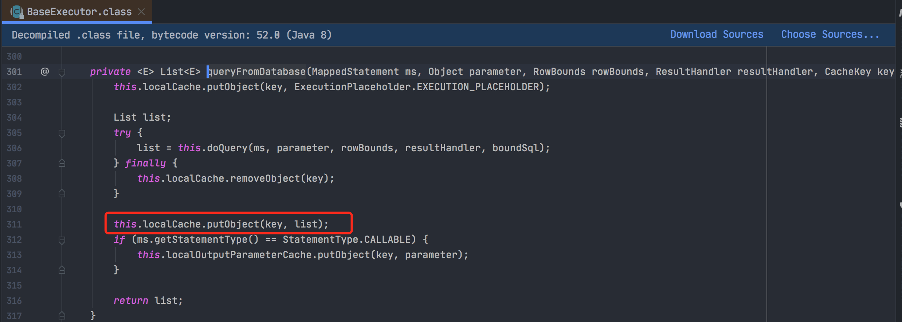

### 什么是缓存

- 存放在内存中的临时数据；
- 将用户经常查询的数据放在缓存（内存）中，用户去查询数据时就不用从磁盘上（关系型数据库数据文件）查询，直接从缓存中查询，提高查询效率，解决了高并发系统的性能问题。

### 为什么使用缓存

- 减少和数据库交互的次数，减少系统开销，提高系统效率；

### 什么样的数据能使用缓存

- 经常查询且不经常改变的数据。

### 简介

#### 1、什么是Mybatis

- 是一款优秀的持久层框架；

- 它支持定制化SQL、存储过程以及高级映射；

- Mybatis避免了几乎所有的JDBC代码和手动设置参数以及获取结果集；

- Mybatis可以使用简单的XML或注解来配置和映射原生类型、接口和Java的POJO（Plan Old Java Objects，普通老式Java对象）为数据库中的记录。

#### 2、什么是持久化

- 就是将程序的数据在持久状态（放在数据库中、文件系统，不删除就不会丢失）和瞬时状态（内存会断电即失）转化的过程。

#### 3、为什么需要持久化

- 有一些对象，不能让它丢掉；
- 内存太贵了。

#### 4、持久层

就是系统中专注于实现数据持久化的相对独立的层面。

#### 5、为什么需要Mybatis

- 帮助程序猿将数据持久化到数据库中；

- 方便；

- 传统的JDBC代码太复杂了，简化这个操作。

- 优点：

  -  简单易学；

  - sql和代码的分离，提高了可维护性；

    

#### Mybatis缓存

这篇文章讲的比较好：

https://blog.csdn.net/weixin_36380516/article/details/109396693

#### 一级缓存

在Mybatis中，一级缓存是在会话（SqlSession）层面实现的，这就说明一级缓存作用范围只能在同一个SqlSession中，跨SqlSession是无效的。

一级缓存默认是开启的，只在一次SqlSession中有效。也就是在拿到连接到关闭连接这个中间有效。

demo：

```java
/**
 * 用户DAO类的单元测试类
 * 同一个会话内，同一个查询，查询多次，会走缓存
 * @author Liuyongfei
 * @date 2021/11/27 17:49
 */
public class Test2UserMapper {

    @Test
    public void getUserListTest() {

        SqlSession sqlSession = MybatisUtil.getSqlSession();
        UserMapper mapper = sqlSession.getMapper(UserMapper.class);
        User user = mapper.getUserById(1);
        User user2 = mapper.getUserById(1);
        System.out.println(user);
        System.out.println(user == user2); // true
        sqlSession.close();

    }
}
```

输出结果：

```bash
[DEBUG] 2021-11-28 21:08:44 org.apache.ibatis.cache.decorators.LoggingCache.getObject(LoggingCache.java:60): Cache Hit Ratio [com.fullstackboy.mybatis.dao.UserMapper]: 0.0
[DEBUG] 2021-11-28 21:08:44 org.apache.ibatis.logging.jdbc.BaseJdbcLogger.debug(BaseJdbcLogger.java:143): ==>  Preparing: select * from mybatis.user where id = ? 
[DEBUG] 2021-11-28 21:08:44 org.apache.ibatis.logging.jdbc.BaseJdbcLogger.debug(BaseJdbcLogger.java:143): ==> Parameters: 1(Integer)
[DEBUG] 2021-11-28 21:08:44 org.apache.ibatis.logging.jdbc.BaseJdbcLogger.debug(BaseJdbcLogger.java:143): <==      Total: 1
[DEBUG] 2021-11-28 21:08:44 org.apache.ibatis.cache.decorators.LoggingCache.getObject(LoggingCache.java:60): Cache Hit Ratio [com.fullstackboy.mybatis.dao.UserMapper]: 0.0
User(id=1, name=张三, pwd=123)
true
```

**在同一次会话中，同一个查询，查询多次，走一级缓存。**

#### 一级缓存源码分析

##### 一级缓存存储在哪

既然一级缓存的作用域只对同一个SqlSession有效，那么一级缓存肯定是存储在DefaultSqlSession（SqlSession的唯一实现类）里：


SqlSession只提供接口，实际执行查询的是Executor。

所以我们去看看Executor的实现类BaseExecutor：


##### 一级缓存的Key是什么结构


##### 一级缓存是什么时候创建的



##### 一级缓存什么时候会被清除

- 获取缓存之前会判断用户是否配置了flushCache=true属性；
- MyBatis全局配置属性localCacheScope配置为Statement时，那么完成一次查询就会清除缓存；
- 在执行commit，rollback，update方法时会清空一级缓存。

#### 二级缓存

一级缓存因为只能在同一个SqlSession中共享，所以会存在一个问题，当在分布式或多线程环境下，不同会话之间对于相同数据可能会产生不同的结果，因为跨会话修改了数据是不能相互感知的，所以就有可能会存在脏数据的问题，正因为一级缓存存在的这种不足，所以我们需要一种作用域更大的缓存，这就是二级缓存。

- 一级缓存作用域太低了，所以诞生了二级缓存；

- 基于namespace级别的缓存，一个名称空间对应一个二级缓存；

- 工作机制

  - 一个会话查询一条数据，这个数据就会被放在当前会话的一级缓存中；
  - 如果当前会话关闭了，这个会话对应的一级缓存就没了；
  - 但是我们想要的是会话关闭了一级缓存中的数据被保存到二级缓存中；
  - 新的会话来查询信息时，就可以从二级缓存中获取内容；
  - 不同的mapper查询出的数据会缓存在对应的缓存（map）中。

  注意：前提是 namespace一样，使用的是同一个Mapper。

要启动二级缓存，只需要在你的SQL映射文件中添加一行：

```xml
<!--开启二级缓存-->
    <cache
            eviction="FIFO"
            flushInterval="60000"
            size="512"
            readOnly="true"/>
```

Demo：

```java
/**
 * 用户DAO类的单元测试类
 * 当前会话结束，一级缓存没了，这时数据保存到了二级缓存中去，新来的会话查询这个数据时，从二级缓存里取。
 * 前提：使用的是同一个Mapper。
 * @author Liuyongfei
 * @date 2021/11/27 17:49
 */
public class Test3UserMapper {

    @Test
    public void getUserListTest() {

        SqlSession sqlSession = MybatisUtil.getSqlSession();
        SqlSession sqlSession2 = MybatisUtil.getSqlSession();
        UserMapper mapper = sqlSession.getMapper(UserMapper.class);
        User user = mapper.getUserById(1);
        System.out.println(user);
        sqlSession.close();

        UserMapper mapper2 = sqlSession2.getMapper(UserMapper.class);
        User user2 = mapper2.getUserById(1);
        System.out.println(user2);
        System.out.println(user == user2); // true
        sqlSession2.close();
    }
}
```


输出结果：

```bash
[DEBUG] 2021-11-28 21:03:25 org.apache.ibatis.cache.decorators.LoggingCache.getObject(LoggingCache.java:60): Cache Hit Ratio [com.fullstackboy.mybatis.dao.UserMapper]: 0.0
[DEBUG] 2021-11-28 21:03:26 org.apache.ibatis.logging.jdbc.BaseJdbcLogger.debug(BaseJdbcLogger.java:143): ==>  Preparing: select * from mybatis.user where id = ? 
[DEBUG] 2021-11-28 21:03:26 org.apache.ibatis.logging.jdbc.BaseJdbcLogger.debug(BaseJdbcLogger.java:143): ==> Parameters: 1(Integer)
[DEBUG] 2021-11-28 21:03:26 org.apache.ibatis.logging.jdbc.BaseJdbcLogger.debug(BaseJdbcLogger.java:143): <==      Total: 1
User(id=1, name=张三, pwd=123)
[DEBUG] 2021-11-28 21:03:26 org.apache.ibatis.cache.decorators.LoggingCache.getObject(LoggingCache.java:60): Cache Hit Ratio [com.fullstackboy.mybatis.dao.UserMapper]: 0.5
User(id=1, name=张三, pwd=123)
true
```

**可以看到，前后两次会话，sql语句只查询了一次，且两次的查询结果对象是一样的。**

#### 二级缓存源码分析

##### 二级缓存存储在哪里

在MyBatis中为了实现二级缓存，专门用了一个装饰器来维护：CachingExecutor。


##### 二级缓存的创建和使用


待事务提交完毕后，再临时属性中的数据放入二级缓存。

##### 查询到结果之后将结果放入缓存


在这里会将存储了临时缓存的值真正刷到二级缓存内。

##### 二级缓存如何进行包装


#### Mybatis缓存原理


https://www.bilibili.com/video/BV1NE411Q7Nx?p=27&spm_id_from=pageDriver