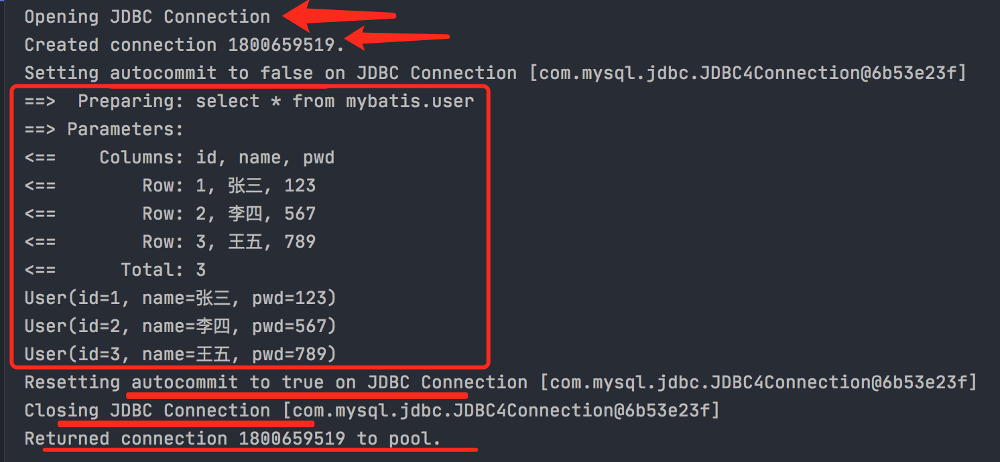
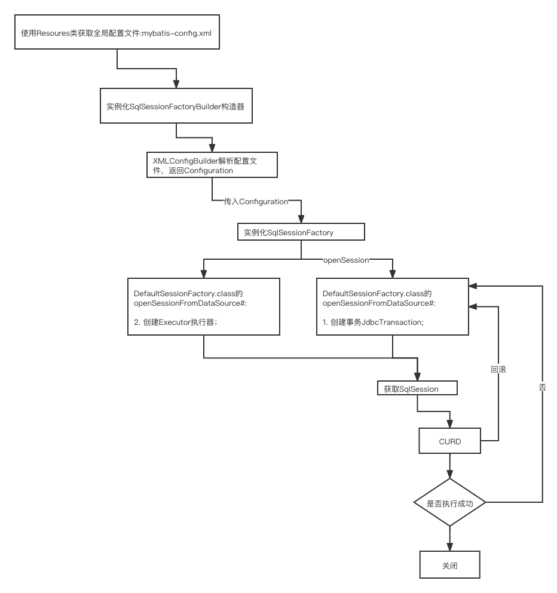

### Mybatis日志

Mybatis通过使用内置的日志工厂提供日志功能。内置日志工厂将会把日志工作委托给下面的实现之一：

- SLF4J
- Apache Commons Logging
- Log4j
- Log4j2
- JDK Logging


#### 使用默认的日志实现类

在mybatis-config.xml里：

```java
<settings>
        <!--默认的日志实现-->
        <setting name="logImpl" value="STDOUT_LOGGING"/>
    </settings>
```

输出：



#### 使用log4j

1、导入log4j的包；

2、log4j.properties

3、配置log4j为日志的实现

```xml
    <settings>
        <setting name="logImpl" value="LOG4J"/>
    </settings>
```


#### Mybatis执行流程

