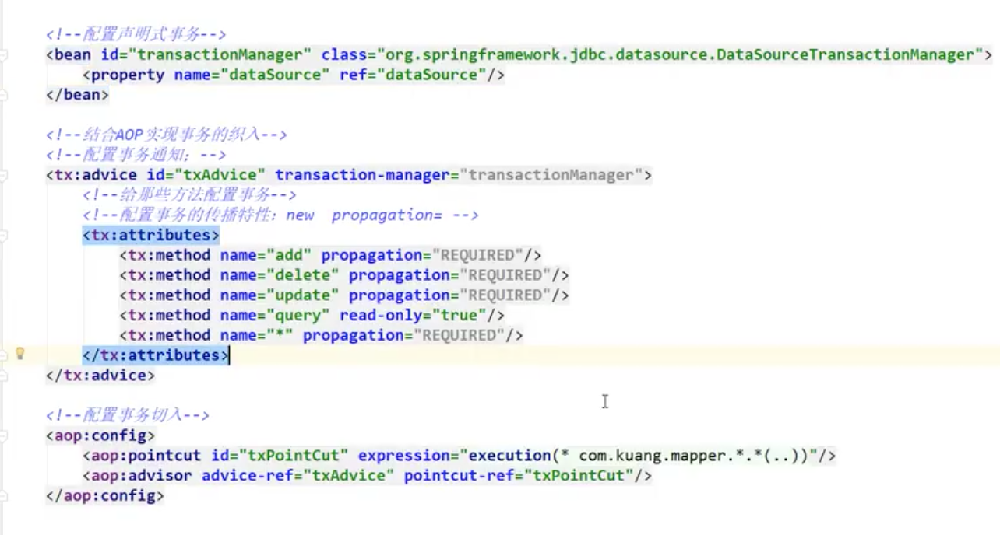

Spring就是一个轻量级的控制反转（IOC）和面相切面编程（AOP）的框架。

### SSM

早期的程序员需要学ssh：Struct2 + Spring + Hibernate

现在比较火的是ssm：Spring MVC + Spring + Mybatis。

#### IOC理论推导

- Hello对象是谁创建的？
  是由Spring创建的。
- Hello对象的属性是怎么设置的？
  是由Spring设置的。

这个过程叫控制反转。

控制：谁来控制对象的创建，传统的应用程序是由程序本身来控制的，使用Spring后，对象是由Spring来控制的。

反转：程序本身不创建对象，而变成被动的接收对象。

依赖注入：就是利用set方法来进行注入的。

IOC是一种编程思想，由主动的编程变成被动的接收。

到了现在，我们不用在程序中去改动了代码了，要实现不同的操作，只需在xml配置文件中进行修改。

所谓的IOC，一句话搞定：对象由Spring来创建，管理，装配。

https://www.bilibili.com/video/BV1WE411d7Dv/?p=6&spm_id_from=pageDriver

### Spring-Mybatis整合

#### 方式一

在之前使用Mybatis的时候，只需要一个 UserMapper接口，一个UserMapper.xml。

但与Spring整合后，需要多一个UserMapperImpl实现类。

为什么多一个UserMapperImpl实现类呢？=》

**因为Spring要接管创建对象的工作，但需要依赖对象的set方法。**

**因此我们需要添加一个实现类，手动加入这个set方法。**

#### 方式二

使用SqlSessionDaoSupport。例子参考：com.fullstackboy.springdemo.transaction

Spring事务管理

https://www.bilibili.com/video/BV1WE411d7Dv?p=24

#### 配置声明式事务

具体代码见：blog-demo/springdemo/transaction。

### 