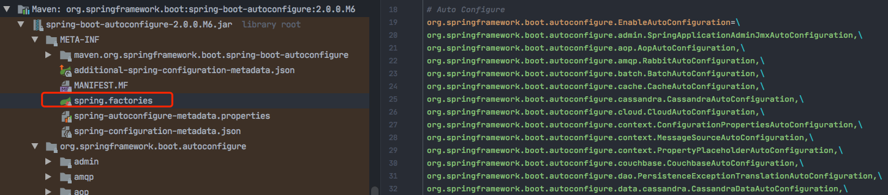
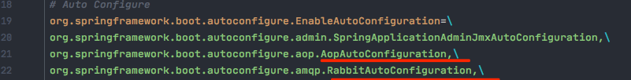
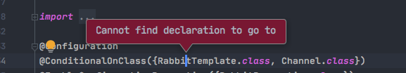
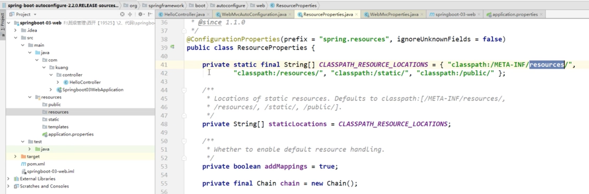
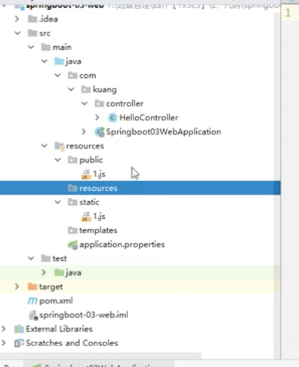
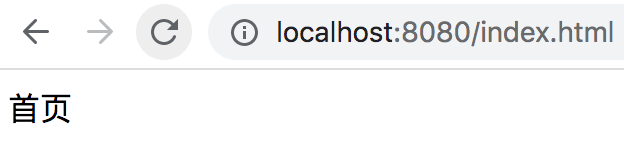
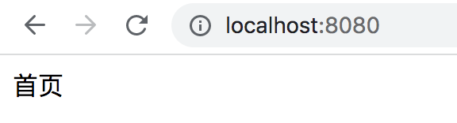
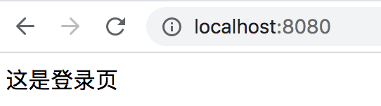

### SpringBoot自动装配原理

#### spring.factories

pom.xml：

- spring-boot-dependencies：核心依赖在父工程中，管理了依赖的版本

- 启动器

  ```xml
  <dependency>
   <groupId>org.springframework.boot</groupId>
   <artifactId>spring-boot-starter</artifactId>
  </dependency>
  ```

  - 启动器说白了，就是Spring Boot的启动场景；
  - 比如说，spring-boot-starter-web，就会帮我们自动导入web环境所有的依赖；
  - springboot 会把所有的功能场景，都变成一个一个的启动器；
  - 如果我们要使用什么功能，就选择对应的启动器（starter）。

  https://www.bilibili.com/video/BV1PE411i7CV?p=6&spm_id_from=pageDriver





#### **@ConditionalOnxxx 注解**




比如这个 AopAutoConfiguration，点进去：

```java
@ConditionalOnClass({EnableAspectJAutoProxy.class, Aspect.class, Advice.class, AnnotatedElement.class})
```

如果这里面的相关类的jar包都已经导入了，因此条件都满足，**AopAutoConfiguration这个类才会生效。**

比如这个 RabbitAutoConfiguration，点进去：

```java
@ConditionalOnClass({RabbitTemplate.class, Channel.class})
```

因为我项目里没有导RabbitTemplate相关的jar包：



**因此 RabbitAutoConfiguration 这个类 不会生效。**

**结论：**

Spring Boot所有自动配置都是在启动的时候扫描并加载：`spring.factories`所有的自动配置类都在这里面。

但是不一定都生效，要判断条件是否成立。

只要导入了对应的starter，就有对应的启动器了，有了启动器，我们自动装配就会生效，然后配置才会成功。

#### **总结**

1、spring boot在启动的时候，从类路径下的/META-INF/spring.factories获取指定的值；

2、将这些自动配置的类导入容器，自动配置就会生效。帮我们进行自动配置；

3、以前我们需要自动配置的东西，现在spring boot帮我们做了；

4、整合java ee，解决方案和自动配置的东西都在spring-boot-autoconfigure-2.2.0.RELEASE.jar这个包下；

5、它会把所有需要导入的组件以类名的形式返回（通过工厂类反射，得到工厂的class对象，构造方法，生成工厂类实例），这些组件就会被添加到容器；

6、容器中也会存在非常多的***AutoConfiguration的文件（@Bean），就是这些类给容器中导入了这个场景需要的所有组件，并自动配置，@Configuration。


### SpringBoot run方法启动

### SpringBoot给属性赋值的几种方式

#### 定义.yml配置文件


yaml配置文件里，可以写一些占位符表达式。

SpringBoot启动后，**默认**会读取yaml配置文件，这时可以写一个类进行映射，给一个Java Bean赋值：

```java
@Component
@ConfigurationProperties(perfix = "person")
public class Person {
	private String name;
}
```

#### 加载指定的配置文件.properties

这时需要在类上加上@PropertySource注解，来加载指定的配置文件：

```java
@Component
@PropertySource(value = "classpath:qinjiang.properties") 
public class Person {
  // Spring EL表达式，取出配置文件的值
  @Value("${name}")
  private String name;
}
```

### 自动配置原理再讲解

https://www.bilibili.com/video/BV1PE411i7CV?p=12&spm_id_from=pageDriver

可以通过在配置文件里设置

```
debug = true
```

然后启动Spring Boot工程，可以在控制台里看出哪些自动配置类生效，哪些自动配置类没生效。

Positive matches（生效的）：


Negative matches（未生效的）：


----

比如在 pom.xml里添加了 spring-boot-starter-web，则就会有一大堆自动配置类生效。

```xml
<dependency>
	 <groupId>org.springframework.boot</groupId>
   <artifactId>spring-boot-starter-web</artifactId>
</dependency>
```


### Spring Boot Web开发

#### 1、导入静态资源

看源码，静态资源目录是下面这几个目录：



因此，上述几个目录里放置静态资源文件后，localhost:8080/1.js 就可以访问到   =》这几个目录映射到 localhost:8080。



>  总结

在Spring Boot中，可以使用如下方式处理静态资源：

- webjars  => localhost:8080/webjars
- public,static,/**（根目录下）,resources  => localhost:8080

优先级：

resources > static（默认）> public。

个人习惯做法：

1、一般在 public下面放一些公关资源，比如大家都会访问的js。

2、static下面放一些图片；

3、resources下面就放一些上传的文件。

> 在 templates目录下面的所有页面，只能由经过Controller请求的来跳转，相当于Spring MVC里的WEB-INF目录。

#### 2、案例测试

新建一个干净的spring boot工程，版本为2.0.0.M6，在public目录下新建一个index.html

##### 访问默认欢迎页

http://localhost:8080/   或  http://localhost:8080/index.html，均可成功访问欢迎页：






##### 自定义欢迎页（通过自定义请求的方式）

比如，访问 "/" 或者 "/index.html"，则跳转到登录页。

**1、创建登录页**

在public目录下面创建login.html。

**2、控制器方法**

```java
/**
 * 测试
 *
 * @author Liuyongfei
 * @date 2021/12/10 23:02
 */
@Controller
public class IndexController {

    @GetMapping({"/", "/index.html"})
    public String index() {
        return "login.html";
    }
}
```

**3、访问**



##### 自定义欢迎页（通过自定义视图控制的方式）

```java
/**
 * 自定义视图控制器
 * 自定义欢迎页（通过自定义视图控制的方式）
 * @author Liuyongfei
 * @date 2021/12/10 下午11:54
 */
@Configuration
public class MyMVCConfig {
    public WebMvcConfigurer webMvcConfigurer() {
        return new WebMvcConfigurer() {

            /**
             * 添加一个自定义的视图控制，用于访问 springboot 项目的默认首页
             */
            @Override
            public void addViewControllers(ViewControllerRegistry registry) {
                registry.addViewController("/").setViewName("main/login");
                registry.addViewController("/index.html").setViewName("main/login");
            }

        };
    }
}
```


### 模板引擎

Spring Boot推荐的模板引擎 Thymeleaf，还有用的比较多的freemaker。 

https://www.bilibili.com/video/BV1PE411i7CV?p=16&spm_id_from=pageDriver

#### thymeleaf模板引擎

`所有的html元素都可以被 thymeleaf 替换接管 =》 th:元素名`

```html
<div th:text="${msg}" th:class="${class}">
  
</div>
```

#### thymeleaf语法

https://www.bilibili.com/video/BV1PE411i7CV?p=18&spm_id_from=pageDriver


https://www.bilibili.com/video/BV1PE411i7CV?p=21&spm_id_from=pageDriver


https://www.bilibili.com/video/BV1PE411i7CV?p=30&spm_id_from=pageDriver