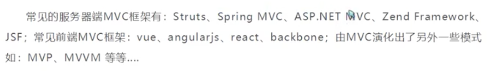
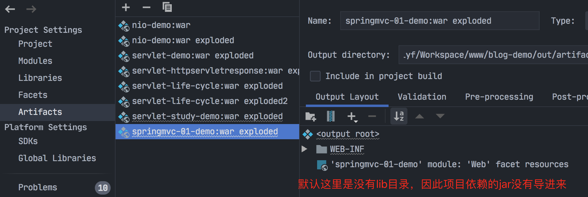
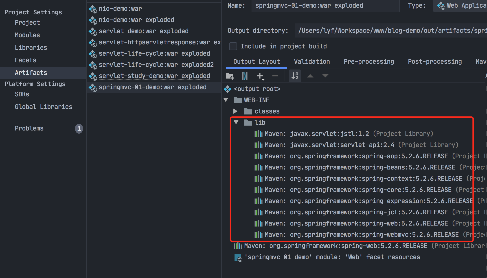
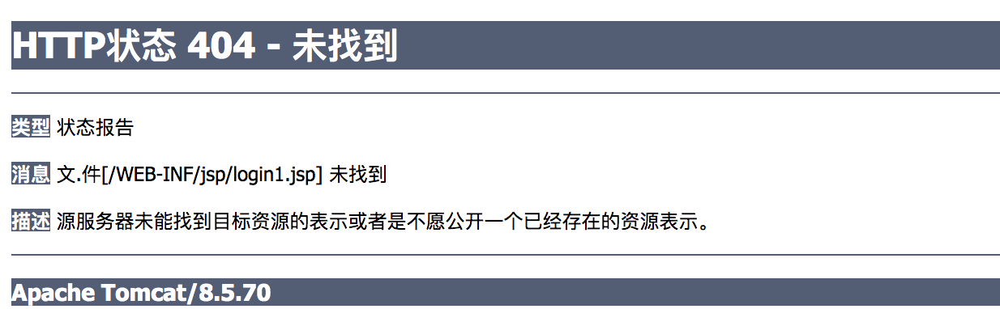
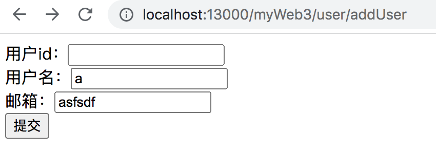
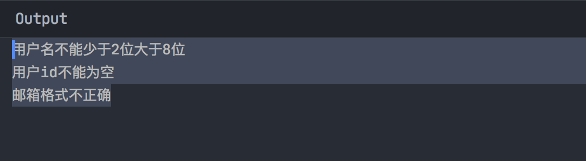

### MVC框架要做的事儿

1. 将URL类映射到java类或java类的方法；
2. 封装用户提交的数据；
3. 处理请求-调用相关的业务处理-封装响应数据；
4. 将响应的数据进行渲染。

说明：



### Spring MVC配置

- Spring MVC是基于Servlet的，DispatcherServlet是整个Spring MVC框架的核心，主要负责截获请求并将请求分派给响应的处理器；
- 所以配置Spring MVC，首先要定义DispatcherServlet；
- 跟所有Servlet一样，用户必须在web.xml中配置。


### 第一个SpringMVC程序

见blog-demo/springmvc-01-demo。

#### 1.定义DispatcherServlet

```xml
<?xml version="1.0" encoding="UTF-8"?>
<web-app xmlns="http://xmlns.jcp.org/xml/ns/javaee"
         xmlns:xsi="http://www.w3.org/2001/XMLSchema-instance"
         xsi:schemaLocation="http://xmlns.jcp.org/xml/ns/javaee http://xmlns.jcp.org/xml/ns/javaee/web-app_4_0.xsd"
         version="4.0">

    <display-name>springMVC</display-name>

    <!-- 部署 DispatcherServlet -->
    <servlet>
        <servlet-name>springmvc</servlet-name>
        <servlet-class>org.springframework.web.servlet.DispatcherServlet</servlet-class>
        <!-- 表示容器再启动时立即加载servlet -->
        <load-on-startup>1</load-on-startup>
    </servlet>


    <servlet-mapping>
        <servlet-name>springmvc</servlet-name>
        <!--处理所有URL-->
        <url-pattern>/</url-pattern>
    </servlet-mapping>
</web-app>
```

Spring MVC初始化时将在WEB-INF目录下查找配置文件，该配置文件的命令规则是：servletName-servlet.xml，例如：springmvc-servlet.xml。

也可以将springmvc-servlet.xml放置程序目录的任何地方，但需要使用servlet的init-param元素加载配置文件，通过contextConfigLocation参数来指定配置文件的位置，示例代码如下：

```xml
<!-- 部署 DispatcherServlet -->
<servlet>
    <servlet-name>springmvc</servlet-name>
    <servlet-class>org.springframework.web.servlet.DispatcherServlet </servlet-class>
    <init-param>
        <param-name>contextConfigLocation</param-name>
        <param-value>classpath:springmvc-servlet.xml</param-value>
    </init-param>
    <!-- 表示容器再启动时立即加载servlet -->
    <load-on-startup>1</load-on-startup>
</servlet>
<servlet-mapping>
    <servlet-name>springmvc</servlet-name>
    <url-pattern>/</url-pattern>
</servlet-mapping>
```

此处使用 Spring 资源路径的方式进行指定，即 `classpath:springmvc-servlet.xml`。

总结：

- 上述代码配置了一个名为"spring-mvc"的Servlet；

- 该Servlet是DispatcherServlet类型，是SpringMVC的入口，并通过`<load-on-startup>1</load-on-startup>`配置标记容器在启动时就加载此DispatcherServlet，即自然启动。

- 然后通过servelt-mapping映射到"/"，即此DispatcherServlet 要截获并处理该项目所有的URL请求。

#### 2、创建Spring MVC配置文件

在WEB-INF目录下新建springmvc-context.xml文件：

```xml
<?xml version="1.0" encoding="UTF-8"?>
<beans xmlns="http://www.springframework.org/schema/beans"
       xmlns:xsi="http://www.w3.org/2001/XMLSchema-instance"
       xsi:schemaLocation="
        http://www.springframework.org/schema/beans
        http://www.springframework.org/schema/beans/spring-beans.xsd">

    <!-- LoginController控制器类，映射到"/login" -->
    <bean name="/login"
          class="com.fullstackboy.springmvcdemo.controller.LoginController"/>
    <!-- LoginController控制器类，映射到"/register" -->
    <bean name="/register"
          class="com.fullstackboy.springmvcdemo.controller.RegisterController"/>
</beans>
```

#### 3、创建Controller

```java
/**
 * 登录控制器
 *
 * Controller是控制器接口，接口中只有一个方法handleRequest，用户处理请求和返回ModelAndView
 * @author Liuyongfei
 * @date 2021/12/2 07:21
 */
public class LoginController implements Controller {
    @Override
    public ModelAndView handleRequest(HttpServletRequest httpServletRequest, HttpServletResponse httpServletResponse) throws Exception {
        return new ModelAndView("WEB-INF/jsp/register.jsp");
    }
}

/**
 * 注册控制器
 * Controller是控制器接口，接口中只有一个方法handleRequest，用户处理请求和返回ModelAndView
 * @author Liuyongfei
 * @date 2021/12/2 07:25
 */
public class RegisterController implements Controller {
    @Override
    public ModelAndView handleRequest(HttpServletRequest httpServletRequest, HttpServletResponse httpServletResponse) throws Exception {
        return new ModelAndView("WEB-INF/jsp/login.jsp");
    }
}
```

> Controller是控制器接口，接口中只有一个方法handleRequest，处于处理请求和返回ModelAndView。

#### 4、创建View

index.jsp：

```jsp
<%@ page language="java" contentType="text/html; charset=UTF-8"
         pageEncoding="UTF-8"%>
<!DOCTYPE html PUBLIC "-//W3C//DTD HTML 4.01 Transitional//EN" "http://www.w3.org/TR/html4/loose.dtd">
<html>
<head>
  <meta http-equiv="Content-Type" content="text/html; charset=UTF-8">
  <title>Insert title here</title>
</head>
<body>
未注册的用户，请
<a href="${pageContext.request.contextPath }/register"> 注册</a>！
<br /> 已注册的用户，去
<a href="${pageContext.request.contextPath }/login"> 登录</a>！
</body>
</html>
```

WEB-INF/jsp/login.jsp：

```jsp
<%@ page contentType="text/html;charset=UTF-8" language="java" %>
<html>
<head>
    <title>Title</title>
</head>
<body>
 登录页面
</body>
</html>
```

WEB-INF/jsp/register.jsp：

```jsp
<%@ page contentType="text/html;charset=UTF-8" language="java" %>
<html>
<head>
    <title>Title</title>
</head>
<body>
    注册页面
</body>
</html>
```

#### 5、部署运行

将项目部署到Tomcat服务，然后访问 http://localhost:13000/myWeb/

#### TOMCAT部署访问web程序出现404

如果启动程序的时候，访问出现404，这时可以去检查一下这里的lib目录有没有将项目用到的依赖都放进去：




解决办法：

新建lib目录，将项目依赖的jar导进来。



重启tomcat，访问：

http://localhost:13000/myWeb/

```.html
未注册的用户，请 注册！
已注册的用户，去 登录！
```

http://localhost:13000/myWeb/register

```
登录页面
```

http://localhost:13000/myWeb/login

```
注册页面
```

### Spring MVC视图解析器(ViewResolver)

视图解析器是Srping MVC的重要组成部分，负责将逻辑视图名解析为具体的视图对象。

Spring MVC提供了很多视图解析类，其中每一项都对应Java Web应用中特定的某些视图技术。

下面介绍一些常用的视图解析类。

#### URLBasedViewResolver

UrlBasedViewResolver是对ViewResolver的一种简单实现，主要提供了一种拼接URL的方式来解析视图。

```xml
<bean id="viewResolver" class="org.springframework.web.servlet.view.UrlBasedViewResolver">            
    <property name="viewClass" value="org.springframework.web.servlet.view.InternalResourceViewResolver"/> <!--用来展示JSP页面，不能省略-->
    <!--前缀-->
    <property name="prefix" value="/WEB-INF/jsp/"/>
    <!--后缀-->
    <property name="suffix" value=".jsp"/>  
 </bean>
```


#### InternalResourceViewResolver


#### Spring MVC执行原理

https://www.bilibili.com/video/BV1aE41167Tu?p=5&spm_id_from=pageDriver

### 使用注解开发Spring MVC

**具体代码见 blog-demo/springmvc-02-demo。**

在第一个Spring MVC 程序中创建了两个传统风格的控制器，它们是实现Controller接口的类。

传统风格的控制器不仅需要在配置文件中部署映射，而且只能编写一个处理方法，不够灵活。

使用基于注解的控制器有以下两个优点：

1、基于注解的控制器类中可以编写多个处理方法，进而可以处理多个请求（动作），这就允许相关的操作编写在同一个控制器类中，从而减少控制器类的数量，方便以后维护；

2、基于注解的控制器类不需要在配置文件中部署映射，只需要使用@RequestMapping注解一个方法进行请求处理即可。


https://www.bilibili.com/video/BV1aE41167Tu?p=7&spm_id_from=pageDriver


### @ResponseBody

不加@ResponseBody注解，会走视图解析器。举例说明：

```java
/**
     * 用户登录
     * @param model
     * @return
     */
    @RequestMapping("/login")
    public String login(Model model) {
        User user = new User();
        user.setName("bianchengbang");

        userService.login(user);

        model.addAttribute("user",user);
        return "login1";// 走视图解析器
    }
```

因此，这里返回一个不存在的 login1时，就会报错：

http://localhost:13000/myWeb2/user/login：



加上@ResponseBody注解，就不会走视图解析器。举例说明：

```java
 /**
     * 用户登录
     * @param model
     * @return
     */
    @RequestMapping("/login")
    public String login(Model model) {
        User user = new User();
        user.setName("bianchengbang");

        userService.login(user);

        model.addAttribute("user",user);
        return "login1"; // 走视图解析器，找
    }
```

http://localhost:13000/myWeb2/user/login，输出：

```bash
login1
```

**备注**：

- @RestController 也是这样的；

- 服务端提供Rest接口时就是这做的，要么类上直接用@RestController注解，要么是类上加@Controller + 方法上加@ResponseBody注解。

### Spring MVC数据校验

Spring MVC 有以下两种方法可以验证输入：

- 利用 Spring 自带的验证框架
- 利用 JSR 303 实现

JSR 303是Java为 Bean的数据合法性校验所提供的标准框架。JSR 303通过在Bean属性上标注类似于 @NotNull、@Max等标准的注解指定校验规则，并通过标准的数据校验接口对Bean进行校验。

Spring本身没有提供 JSR 303的实现，Hibernate Validator实现了 JSR 303。

具体demo见： blog-demo/springmvc-03-demo。

pom.xml里引入hibernate-validator：

```xml
<!--数据校验，像validation-api、classmate、jboss-logging这些不用特意加进来，
Maven在倒入hibernate-validator的时候会自动引进来-->
<dependency>
    <groupId>org.hibernate.validator</groupId>
    <artifactId>hibernate-validator</artifactId>
    <version>6.0.16.Final</version>
</dependency>
<!--数据校验 end-->
```

springmvc-context.xml配置Spring使用HibernateValidator：

```xml
<!--配置Spring MVC注解驱动，使用的BeanValidator为HibernateValidator-->
    <mvc:annotation-driven validator="hibernateValidator"></mvc:annotation-driven>

    <!--实例化HibernateValidator-->
    <bean id="hibernateValidator" class="org.springframework.validation.beanvalidation.LocalValidatorFactoryBean">
        <property name="providerClass">
            <value>org.hibernate.validator.HibernateValidator</value>
        </property>
    </bean>
```

pojo类:

```java

/**
 * 用户实体类
 *
 * @author Liuyongfei
 * @date 2021/12/3 18:15
 */
@Data
@NoArgsConstructor
@AllArgsConstructor
public class User {

    @NotNull(message = "用户id不能为空")
    private Integer id;

    @NotNull
    @Length(min = 2, max = 8, message = "用户名不能少于2位大于8位")
    private String name;

    @Email(regexp = "[a-zA-Z0-9]+@[a-zA-Z0-9]+\\.[a-zA-Z0-9]", message = "邮箱格式不正确")
    private String email;
}
```

UserController：

```java
/**
 * 用户控制器
 *
 * @author Liuyongfei
 * @date 2021/12/3 18:13
 */
@Controller
@RequestMapping("/user")
public class UserController {

    @RequestMapping("/login")
    public String getLogin(Model model) {
        User user = new User();
        user.setName("编程帮");
        model.addAttribute("user", user);

        return "login";
    }

    @RequestMapping("/register")
    public String getRegisterUser() {
        return "register";
    }

    @RequestMapping("/validate")
    public String validate(@Valid User user, BindingResult bindingResult) {
        // 如果有异常信息
        if (bindingResult.hasErrors()) {
            // 获取异常信息
            List<ObjectError> allErrors = bindingResult.getAllErrors();
            // 遍历，打印异常信息
            for (ObjectError error : allErrors) {
                System.out.println(error.getDefaultMessage());
            }
        }
        return "redirect:/index.jsp";
    }

    @RequestMapping("/addUser")
    public String add() {

        return "addUser";
    }
}
```

启动Tomcat：



idea终端输出结果：




### Spring MVC：整合SSM

环境要求：

- IDEA；
- Mysql：5.7.19
- Tomcat 9
- Maven：3.6

https://www.bilibili.com/video/BV1aE41167Tu?p=17&spm_id_from=pageDriver