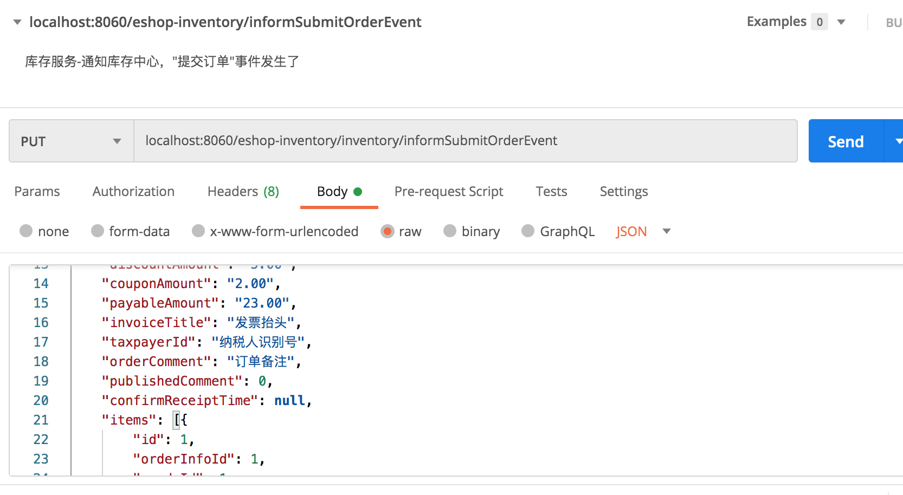

### 重构库存服务和调度服务的消息队列代码

#### 重构说明

使用Rabbitmq消息队列 + spring cloud stream。

#### 库存服务

通知库存中心，"提交订单事件发生了"：

```java
informSubmitOrderEvent(OrderInfoDTO orderInfoDTO) {
  try {
      // ...... 
      // 发送异步消息到内存队列
      GoodsStockUpdateMessage message = new GoodsStockUpdateMessage();
      message.setId(UUID.randomUUID().toString().replace("-",""));
      message.setOperation(GoodsStockUpdateOperation.SUBMIT_ORDER);
      message.setParameter(orderInfoDTO);

      // 改为使用rabbitmq消息中间件
      String messageJson = JSON.toJSONString(message);
      Message msg = MessageBuilder.withPayload(messageJson.getBytes()).build();
      messageService.stockUpdateMessageQueue().send(msg);
        } catch (Exception e) {
            logger.error("error",e);
            return false;
        }
        return true;
    }
```

#### 调度服务

在Spring启动类里添加接收消息方法：

```java
@SpringBootApplication
@EnableScheduling
@ServletComponentScan
@EnableEurekaClient
@EnableFeignClients
@EnableBinding(MessageService.class)
@Import(DruidDataSourceConfig.class)
public class ScheduleApplication {
    public static void main(String[] args) {
        ApplicationContext context = SpringApplication.run(ScheduleApplication.class, args);
        SpringContext.setContext(context);
    }

    @StreamListener("stock-update-message-queue")
    public void receive(byte[] message) {
        ScheduleStockUpdateMessageConsumer consumer =
                SpringContext.getContext().getBean(ScheduleStockUpdateMessageConsumer.class);
        consumer.consume(new String(message));
    }
}
```

消费者直接消费消息：

```java
@Component
public class ScheduleStockUpdateMessageConsumer {
  /**
     * 消费库存更新消息
     */
    public void consume(String messageJson) {
        try {
            // 从队列中取出消息
            GoodsStockUpdateMessage message = JSONObject.parseObject(messageJson, GoodsStockUpdateMessage.class);

            if (!isOrderRelatedMessage(message)) {
                return;
            }

            // 处理消息
            OrderInfoDTO order = getOrderFromMessage(message);
            processMessage(message, order);
        } catch (Exception e) {
            logger.error("error", e);
        }
    }
}
```

#### 使用postman测试

##### 服务说明

库存服务有两个实例，调度服务有两个实例：


##### 请求参数




构造订单数据：

```json
{
    "id": 1,
    "orderNo": "no123",
    "userAccountId": 1,
    "username": "测试1",
    "orderStatus": 1,
    "consignee": "张三",
    "deliveryAddress": "北京海淀",
    "consigneeCellPhoneNumber": 19898,
    "freight": "5.00",
    "payType": 1,
    "totalAmount": "30.00",
    "discountAmount": "5.00",
    "couponAmount": "2.00",
    "payableAmount": "23.00",
    "invoiceTitle": "发票抬头",
    "taxpayerId": "纳税人识别号",
    "orderComment": "订单备注",
    "publishedComment": 0,
    "confirmReceiptTime": null,
    "items": [{
        "id": 1,
        "orderInfoId": 1,
        "goodsId": 1,
        "goodsSkuCode": 101,
        "goodsName": "sdfsdfsdfsdfsd",
        "saleProperties": "fglkljl",
        "goodsGrossWeight": "10.00",
        "purchaseQuantity": "20",
        "purchasePrice": "5.00",
        "promotionActivityId": null,
        "goodsLength": "2.00",
        "goodsWidth": "3.00",
        "goodsHeight": "4.00"
    }],
    "orderOperateLog": [
        {
            "id": 1,
            "orderInfoId": 1,
            "operateType":1,
            "operateContent": "测试"
        }
    ]
}
```

由于使用了spring cloud feign，它本身就包含了spring cloud ribbon，所以从库存中心发起的请求，会通过负载均衡，只有一台库存服务会接收到请求：


接着看调度服务：


消费消息：


