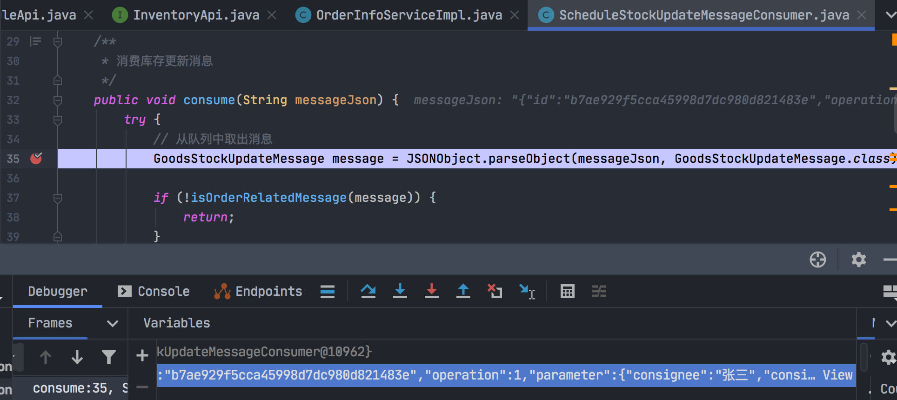

### 重构库存服务和调度服务的消息队列代码

#### 重构说明

使用Rabbitmq消息队列 + spring cloud stream。

#### 库存服务

通知库存中心，"提交订单事件发生了"：

```java
informSubmitOrderEvent(OrderInfoDTO orderInfoDTO) {
  try {
      // ...... 
      // 发送异步消息到内存队列
      GoodsStockUpdateMessage message = new GoodsStockUpdateMessage();
      message.setId(UUID.randomUUID().toString().replace("-",""));
      message.setOperation(GoodsStockUpdateOperation.SUBMIT_ORDER);
      message.setParameter(orderInfoDTO);

      // 改为使用rabbitmq消息中间件
      String messageJson = JSON.toJSONString(message);
      Message msg = MessageBuilder.withPayload(messageJson.getBytes()).build();
      messageService.stockUpdateMessageQueue().send(msg);
        } catch (Exception e) {
            logger.error("error",e);
            return false;
        }
        return true;
    }
```

#### 调度服务

在Spring启动类里添加接收消息方法：

```java
@SpringBootApplication
@EnableScheduling
@ServletComponentScan
@EnableEurekaClient
@EnableFeignClients
@EnableBinding(MessageService.class)
@Import(DruidDataSourceConfig.class)
public class ScheduleApplication {
    public static void main(String[] args) {
        ApplicationContext context = SpringApplication.run(ScheduleApplication.class, args);
        SpringContext.setContext(context);
    }

    @StreamListener("stock-update-message-queue")
    public void receive(byte[] message) {
        ScheduleStockUpdateMessageConsumer consumer =
                SpringContext.getContext().getBean(ScheduleStockUpdateMessageConsumer.class);
        consumer.consume(new String(message));
    }
}
```

消费者直接消费消息：

```java
@Component
public class ScheduleStockUpdateMessageConsumer {
  /**
     * 消费库存更新消息
     */
    public void consume(String messageJson) {
        try {
            // 从队列中取出消息
            GoodsStockUpdateMessage message = JSONObject.parseObject(messageJson, GoodsStockUpdateMessage.class);

            if (!isOrderRelatedMessage(message)) {
                return;
            }

            // 处理消息
            OrderInfoDTO order = getOrderFromMessage(message);
            processMessage(message, order);
        } catch (Exception e) {
            logger.error("error", e);
        }
    }
}
```

#### 使用postman测试

##### 服务说明

库存服务有两个实例，调度服务有两个实例：


##### 请求参数


构造订单数据：

```json
{
    "id": 1,
    "orderNo": "no123",
    "userAccountId": 1,
    "username": "测试1",
    "orderStatus": 1,
    "consignee": "张三",
    "deliveryAddress": "北京海淀",
    "consigneeCellPhoneNumber": 19898,
    "freight": "5.00",
    "payType": 1,
    "totalAmount": "30.00",
    "discountAmount": "5.00",
    "couponAmount": "2.00",
    "payableAmount": "23.00",
    "invoiceTitle": "发票抬头",
    "taxpayerId": "纳税人识别号",
    "orderComment": "订单备注",
    "publishedComment": 0,
    "confirmReceiptTime": null,
    "items": [{
        "id": 1,
        "orderInfoId": 1,
        "goodsId": 1,
        "goodsSkuCode": 101,
        "goodsName": "sdfsdfsdfsdfsd",
        "saleProperties": "fglkljl",
        "goodsGrossWeight": "10.00",
        "purchaseQuantity": "20",
        "purchasePrice": "5.00",
        "promotionActivityId": null,
        "goodsLength": "2.00",
        "goodsWidth": "3.00",
        "goodsHeight": "4.00"
    }],
    "orderOperateLog": [
        {
            "id": 1,
            "orderInfoId": 1,
            "operateType":1,
            "operateContent": "测试"
        }
    ]
}
```

由于使用了spring cloud feign，它本身就包含了spring cloud ribbon，所以从库存中心发起的请求，会通过负载均衡，只有一台库存服务会接收到请求：


本机启动RabbitMQ：

```bash
cd /usr/local/Cellar/rabbitmq/3.8.14
sbin/rabbitmq-server
```

然后访问：http://localhost:15672/


接着看调度服务：


消费消息：




总结一下 spring cloud stream 的使用：

1. 在 eshop-inventory 服务里：

   库存中心对外提供的接口：InventoryService#informSubmitOrderEvent里：

   ```java
   ......
   // 改为使用rabbitmq消息中间件
   String messageJson = JSON.toJSONString(message);
   Message msg = MessageBuilder.withPayload(messageJson.getBytes()).build();
   messageService.stockUpdateMessageQueue().send(msg);
   ......
   ```

   跳转到：

   ```java
   /**
    * 消息中间件的接口
    * @author Liuyongfei
    * @date 2021/07/16
    */
   public interface MessageService {
   
       /**
        * 库存更新消息队列
        * @return
        */
       @Output("stock-update-message-queue")
       SubscribableChannel stockUpdateMessageQueue();
   }
   ```

2. 调度服务 eshop-schedule：

​       启动类添加注解：

        ```java
@EnableBinding(MessageService.class)
        ```

​      并添加：

    ```java
@StreamListener("stock-update-message-queue")
public void receive(byte[] message) {
 ScheduleStockUpdateMessageConsumer consumer =
 SpringContext.getContext().getBean(ScheduleStockUpdateMessageConsumer.class);
  consumer.consume(new String(message));
}
    ```

和:

```java
/**
 * 消息中间件的接口
 *
 * @author Liuyongfei
 * @date 2021/7/16 14:17
 */
public interface MessageService {

    /**
     * 库存更新消息队列
     * @return
     */
    @Input("stock-update-message-queue")
    SubscribableChannel stockUpdateMessageQueue();
}
```

然后 ScheduleStockUpdateMessageConsumer#consume 进行消费消息的逻辑。


#### Spring Cloud Stream

在 Spring Cloud 体系内用于构建高度可扩展的基于**事件驱动**的微服务，其目的是为了简化消息在 Spring Cloud应用程序中的开发。

想要熟悉 SCS，必须先要了解Spring Messaging 个 Spring Intergration 这两个项目。

Spring Messaging 是 Spring Framework 中的一个模块，其作用就是统一消息的编程模型。

比如消息 Messaging 对应的模型就包括一个消息体 Payload 和消息头 Header。


具体到我们代码中的例子：

InventoryService#informSubmitOrderEvent：

```java
// 发送异步消息到内存队列
GoodsStockUpdateMessage message = new GoodsStockUpdateMessage();
message.setId(UUID.randomUUID().toString().replace("-",""));
message.setOperation(GoodsStockUpdateOperation.SUBMIT_ORDER);

// 改为使用rabbitmq消息中间件
String messageJson = JSON.toJSONString(message);
Message msg = MessageBuilder.withPayload(messageJson.getBytes()).build();
messageService.stockUpdateMessageQueue().send(msg);
```

##### Spring Integration

Spring Integration 提供了 Spring 编程模型扩展用来支持企业集成模式，是对 Spring Messaging的扩展。它提出了不少新概念，包括消息的路由MessageRoute、消息分发MessagDispatcher、消息过滤Filter、消息转换Transformer、消息分割Spliter。同时还提供了 MessageChannel、MessageHandler的实现。

##### Spring Cloud Stream

- Spring Cloud Stream在Spring Integration的基础上进行了封装，提出了 Binder、Binding、@EnableBinding、@StreamListener 等概念；
- Spring Cloud Stream 是Spring Integration的加强，同时与Spring Boot体系进行了融合。它屏蔽了消息中间件的实现细节，希望以统一的API来进行消息的发送和消费，底层消息中间件的实现细节由各消息中间件的 Binder 完成。
- Binder 是提供与外部消息中间件集成的组件，为构造 Binding 提供了2个方法，分别是 bindConsumer 和bindProducer，它们分别用于构建生产者和消费者。目前的官方实现有 Rabbit Binder和Kafka Binder，Spring Cloud Alibaba内部已经实现了 RocketMQ Binder。
- Binding 是连接应用程序跟消息中间件的桥梁，用于消息的消费和生产。

详细可看：https://blog.csdn.net/zhuguang10/article/details/89183514

