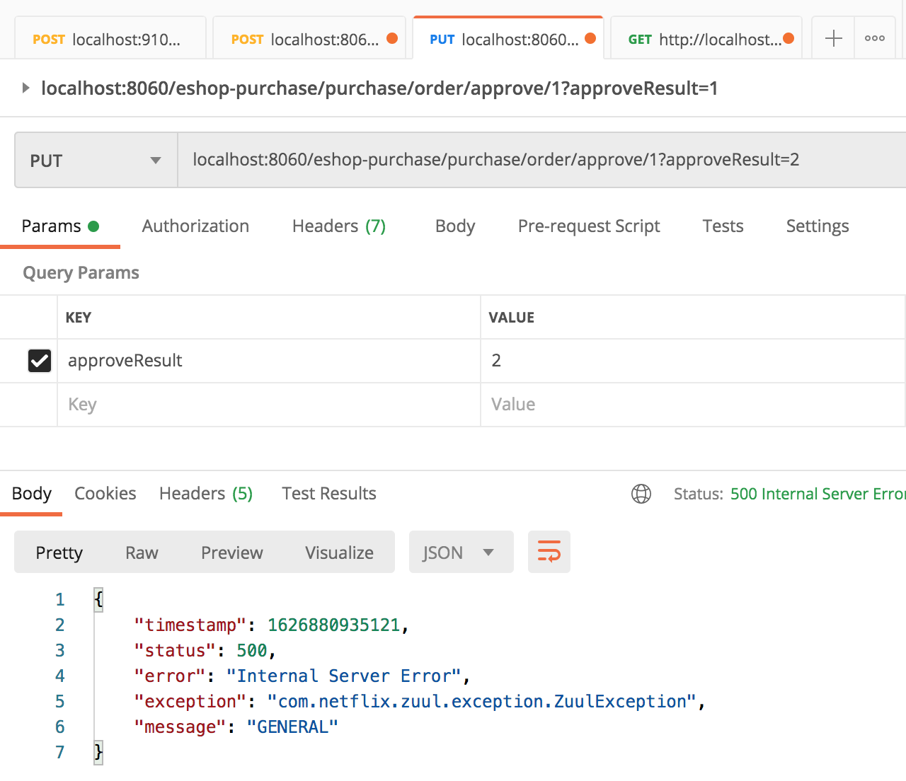
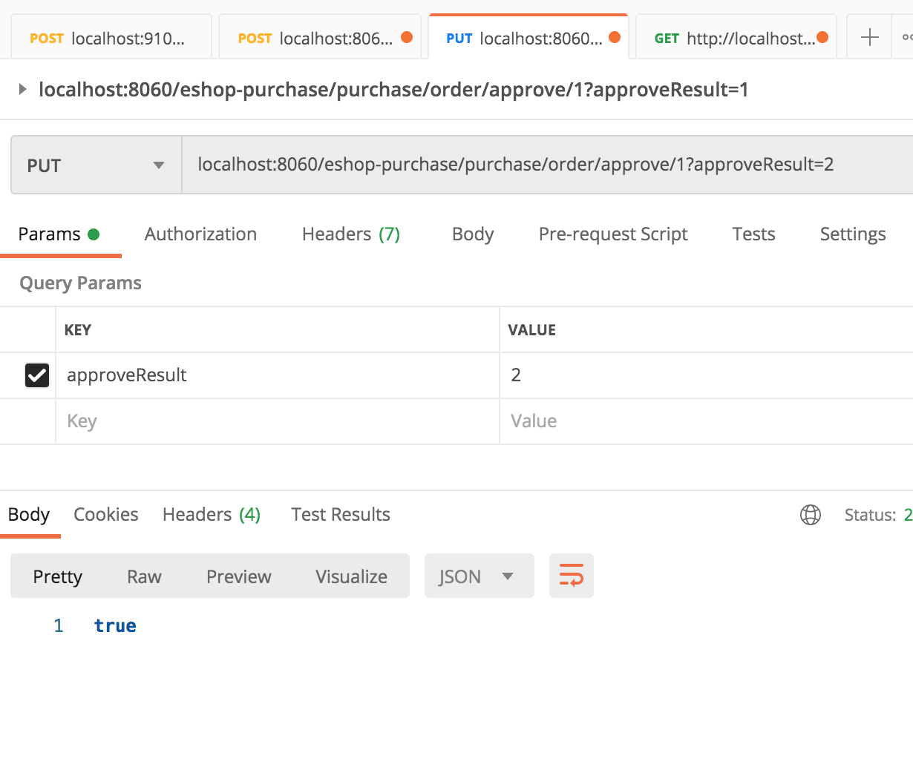

### 原因

对本地数据库的操作是纯事务，不应该将本地数据库操作跟远程接口的调用，混在一块儿。

可能会出现莫名其妙的事务之间的锁争用的问题。**通过分布式系统触发了一个分布式系统场景下的问题。**

### 调用链路

采购服务：审核采购单，更新采购单状态后，通知调度中心  =》调度服务：调度采购入库 =》 wms服务：创建采购入库单。

### 错误浮现

使用postman请求 库存服务的 审核采购单接口：


调度服务报错如下：

```java
mvc.EndpointHandlerMapping     : Did not find handler method for [/schedule/schedulePurchaseInput]
```

仔细查看了代码，该加的注解已经都加上了呀。

将 ScheduleApi里的请求改为 PUT后，再次访问，报这个错：

```java
feign.FeignException: status 405 reading ScheduleService#schedulePurchaseInput(PurchaseOrderDTO); content:
{"timestamp":1626625363086,"status":405,"error":"Method Not Allowed","exception":"org.springframework.web.HttpRequestMethodNotSupportedException","message":"Request method 'POST' not supported","path":"/schedule/schedulePurchaseInput"}
```

一时没找到解决办法，于是尝试使用用postman直接请求（不经过zuul网关）来测试一下：


又看了看 OrderService里的getOrderById方法，与课程里的代码OrderService的getOrderById方法一比较发现:orderInfoId参数，没有使用@PathVariable来接收。

于是修改OrderService的getOrderById方法（使用@PathVariable来接收orderInfoId）：

```java
/**
 * 根据id查询订单
 *
 * @param orderInfoId 订单id
 * @return 订单
 */
@Override
public OrderInfoDTO getOrderById(@PathVariable("orderInfoId") Long orderInfoId) {
    try {
        return orderInfoService.getById(orderInfoId);
    } catch (Exception e) {
        logger.error("error",e);
        return null;
    }
}
```

重新打包，再次请求，可以访问到数据了：

虽然调度服务依然有这个日志：

```bash
2021-07-19 23:47:15.713 DEBUG 85213 --- [nio-9113-exec-5] o.s.b.a.e.mvc.EndpointHandlerMapping     : Looking up handler method for path /schedule/getScheduleResult
2021-07-19 23:47:15.720 DEBUG 85213 --- [nio-9113-exec-5] o.s.b.a.e.mvc.EndpointHandlerMapping     : Did not find handler method for [/schedule/getScheduleResult]
```

但是可以正常访问订单服务了，并返回数据：


思考：为什么必须加上@PathVariable来接收orderInfoId？

使用Postman发起 审核采购单请求：



#### 查看日志

##### Zuul网关日志

```java
com.netflix.zuul.exception.ZuulException: Forwarding error

com.netflix.client.ClientException: null

java.lang.RuntimeException: java.net.SocketTimeoutException: Read timed out

java.net.SocketTimeoutException: Read timed out
————————————————
版权声明：本文为CSDN博主「l去留无心」的原创文章，遵循CC 4.0 BY-SA版权协议，转载请附上原文出处链接及本声明。
原文链接：https://blog.csdn.net/qq_41937388/article/details/105484352
```

zuul调用等待超时，可以在application.yml设置超时连接时长：

```yml
zuul:
  host:
    connect-timeout-millis: 60000
    socket-timeout-millis: 60000

```


##### 采购服务

```java
2021-07-21 23:26:49.034 ERROR 4745 --- [io-9112-exec-20] c.f.p.c.PurchaseOrderController          : error

feign.RetryableException: Read timed out executing PUT http://eshop-schedule/schedule/schedulePurchaseInput
	at feign.FeignException.errorExecuting(FeignException.java:67) ~[feign-core-9.5.0.jar:na]
	at feign.SynchronousMethodHandler.executeAndDecode(SynchronousMethodHandler.java:104) ~[feign-core-9.5.0.jar:na]
```

##### 调度服务

```java
2021-07-21 23:26:49.014 ERROR 49499 --- [nio-9113-exec-3] c.f.schedule.api.ScheduleService         : error

feign.RetryableException: Read timed out executing POST http://eshop-wms/wms/createPurchaseInputOrder
	at feign.FeignException.errorExecuting(FeignException.java:67) ~[feign-core-9.5.0.jar:na]
	at feign.SynchronousMethodHandler.executeAndDecode(SynchronousMethodHandler.java:104) ~[feign-core-9.5.0.jar:na]
```


### 采购服务超时的原因

1. 审核采购单方法开启了第一个事务对purchase_order（采购单表）进行状态更新，占据了表的一行锁，还没释放；
2. 然后方法又调用了远程的接口，远程的接口触发了第二个事务；
3. 第二个事务尝试去获取表的一行的行锁，结果第一个事务还没释放，所以导致第二个事务更新如此缓慢，一直卡在那里。


### 解决办法

重构采购服务代码：

```java
 /**
     * 审核采购单
     * 这里重构代码，原因：
     * 调用的远程服务接口会开启事务，又和本地的方法在一个事务里，这样会导致引起mysql的行锁竞争，请求服务时就一直卡死
     * @param id            采购单id
     * @param approveResult 审核结果
     * @throws Exception
     */
    @Override
    public void approve(Long id, Integer approveResult) throws Exception {
        if (PurchaseInputOrderApproveResult.REJECTED.equals(approveResult)) {
            purchaseOrderDAO.updateStatus(id, PurchaseOrderStatus.EDITING);
            return;
        }

        purchaseOrderDAO.updateStatus(id, PurchaseOrderStatus.APPROVED);

//        // 通知调度中心
//        scheduleService.schedulePurchaseInput(getById(id));
    }
```

将通知调度中心放在controller层来做：

```java
/**
     * 审核采购单
     * @param id  采购单id
     * @return 处理结果
     */
    @PutMapping("/approve/{id}")
    public Boolean approve(@PathVariable("id") Long id, Integer approveResult) {
        try {
            purchaseOrderService.approve(id, approveResult);

            // 通知调度中心（重构后的代码）
            PurchaseOrderDTO purchaseOrder = purchaseOrderService.getById(id);
            scheduleService.schedulePurchaseInput(purchaseOrder);
            return true;
        } catch (Exception e) {
            logger.error("error", e);
            return false;
        }
    }
```

重启服务后，再次使用postman请求：



请求成功。

