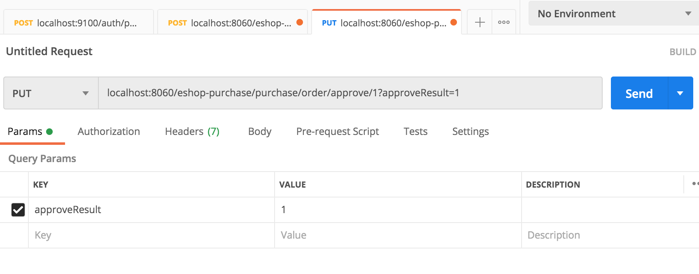
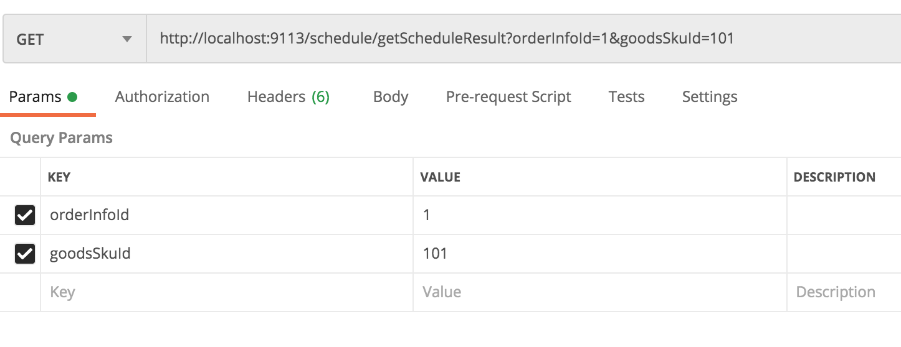
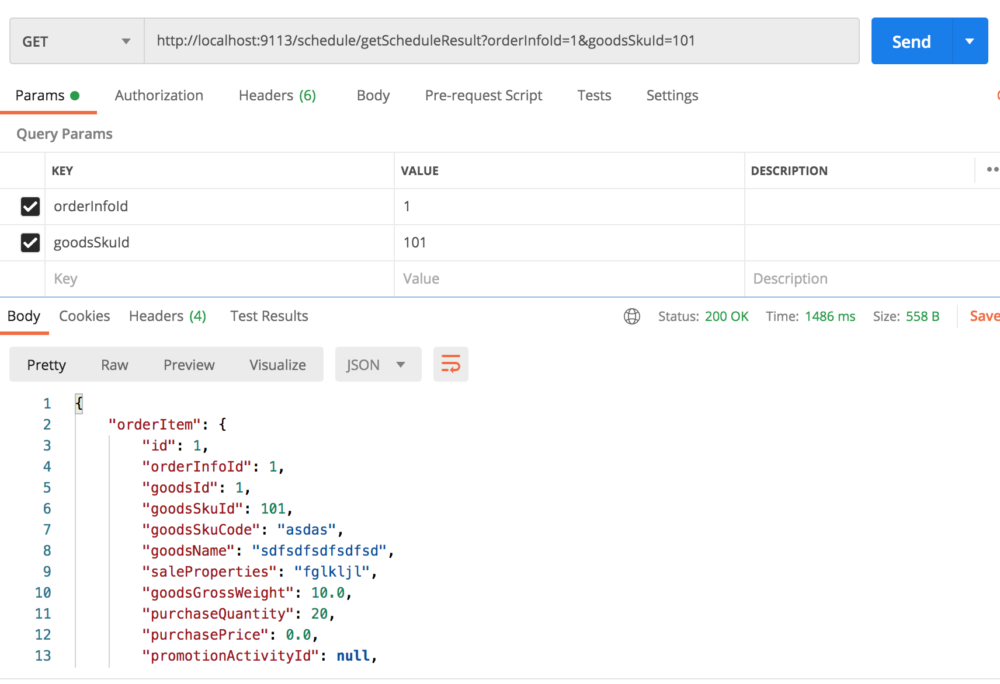

### 原因

对本地数据库的操作是纯事务，不应该将本地数据库操作跟远程接口的调用，混在一块儿。

可能会出现莫名其妙的事务之间的锁争用的问题。**通过分布式系统触发了一个分布式系统场景下的问题。**

### 调用链路

采购服务：审核采购单，更新采购单状态后，通知调度中心  =》调度服务：调度采购入库 =》 wms服务：创建采购入库单。

### 错误浮现

使用postman请求 库存服务的 审核采购单接口：



调度服务报错如下：

```java
mvc.EndpointHandlerMapping     : Did not find handler method for [/schedule/schedulePurchaseInput]
```

仔细查看了代码，该加的注解已经都加上了呀。

将 ScheduleApi里的请求改为 PUT后，再次访问，报这个错：

```java
feign.FeignException: status 405 reading ScheduleService#schedulePurchaseInput(PurchaseOrderDTO); content:
{"timestamp":1626625363086,"status":405,"error":"Method Not Allowed","exception":"org.springframework.web.HttpRequestMethodNotSupportedException","message":"Request method 'POST' not supported","path":"/schedule/schedulePurchaseInput"}
```

一时没找到解决办法，于是尝试使用用postman直接请求（不经过zuul网关）来测试一下：



又看了看 OrderService里的getOrderById方法，与课程里的代码OrderService的getOrderById方法一比较发现:orderInfoId参数，没有使用@PathVariable来接收。

于是修改OrderService的getOrderById方法（使用@PathVariable来接收orderInfoId）：

```java
/**
 * 根据id查询订单
 *
 * @param orderInfoId 订单id
 * @return 订单
 */
@Override
public OrderInfoDTO getOrderById(@PathVariable("orderInfoId") Long orderInfoId) {
    try {
        return orderInfoService.getById(orderInfoId);
    } catch (Exception e) {
        logger.error("error",e);
        return null;
    }
}
```

重新打包，再次请求，可以访问到数据了：

虽然调度服务依然有这个日志：

```bash
2021-07-19 23:47:15.713 DEBUG 85213 --- [nio-9113-exec-5] o.s.b.a.e.mvc.EndpointHandlerMapping     : Looking up handler method for path /schedule/getScheduleResult
2021-07-19 23:47:15.720 DEBUG 85213 --- [nio-9113-exec-5] o.s.b.a.e.mvc.EndpointHandlerMapping     : Did not find handler method for [/schedule/getScheduleResult]
```

但是可以正常访问订单服务了，并返回数据：



思考：为什么必须加上@PathVariable来接收orderInfoId？