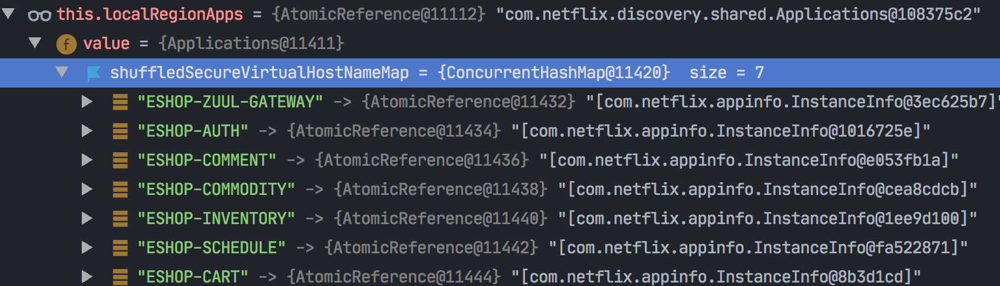
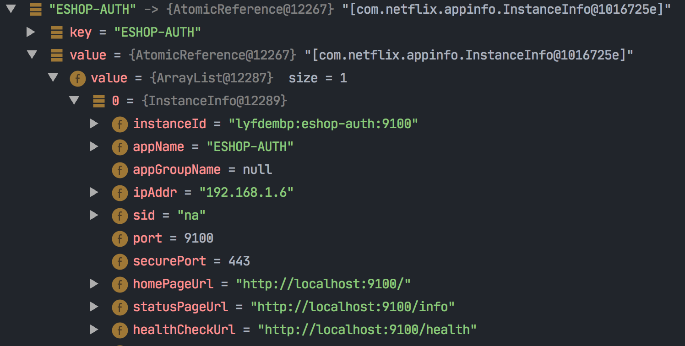

### 场景

明明客服服务启动了，eureka注册中心里也是有的，但是zuul网关却始终感知不到客服服。

如果在公司里投入生产环境使用的时候，碰到了这个问题怎么办呢?

源码级别定位来解决这个问题。

zuul是依赖ribbon，ribbon感知服务的server list，实际上是通过eureka client（com.netflix.eureka.eureka-client jar包代码）来的。

我们找一下ribbon整合eureka获取server list的代码，打上断点来看一下。

ribbon从eureka里获取service list的代码

看**spring-cloud-netflix-eureka-client** 工程jar里的ribbon.eureka包下面的DomainExtractingServerList类。

DomainExtractingServerList.java的getUpdatedListOfServers方法

 => DiscoveryEnableNIWSServerList.java的getUpdatedListOfServers()

DiscoveryClient.java：

```java
public List<InstanceInfo> getInstancesByVipAddress(String vipAddress, boolean secure, @Nullable String region) {
        if (vipAddress == null) {
            throw new IllegalArgumentException("Supplied VIP Address cannot be null");
        } else {
            Applications applications;
            if (this.instanceRegionChecker.isLocalRegion(region)) {
                applications = (Applications)this.localRegionApps.get();
            } else {
                applications = (Applications)this.remoteRegionVsApps.get(region);
                if (null == applications) {
                    logger.debug("No applications are defined for region {}, so returning an empty instance list for vip address {}.", region, vipAddress);
                    return Collections.emptyList();
                }
            }

            return !secure ? applications.getInstancesByVirtualHostName(vipAddress) : applications.getInstancesBySecureVirtualHostName(vipAddress);
        }
    }
```

这里的 localRegionApps里有一个 shuffledSecureVirtualHostNameMap：



key为 instance name转化为大写，value存了每个 instance的信息：



接着看：

```java
getInstancesByVirtualHostName(vipAddress)
```

Application.java（com.netflix.eureka.eureka-client）jar里：

```java
public List<InstanceInfo> getInstancesByVirtualHostName(String virtualHostName) {
    AtomicReference<List<InstanceInfo>> ref = (AtomicReference)this.shuffleVirtualHostNameMap.get(virtualHostName.toUpperCase(Locale.ROOT));
    return (List)(ref != null && ref.get() != null ? (List)ref.get() : new ArrayList());
}
```

这里将传过来的virtualHostName（就是instacne name，比如 eshop-auth）转化为大写，然后去shuffleVirtualHostNameMap里找。

**找到原因**

当定位到这里的时候，就一下子找到了原因：

原来是客服服务传过来的 instacne name是 "eshop-custommer"，单次拼错了，应该是 "eshop-customer"，

所以在shuffleVirtualHostNameMap里找不到。=》 从现象上看 zuul网关就一直发现不了 客服服务。