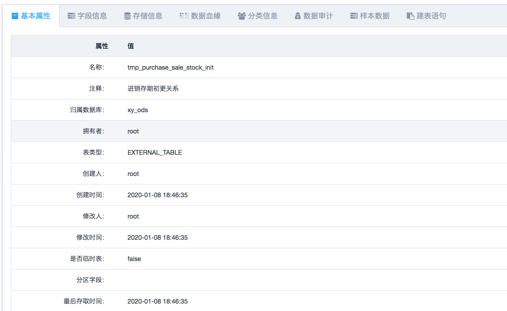
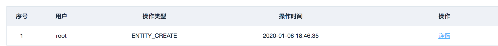
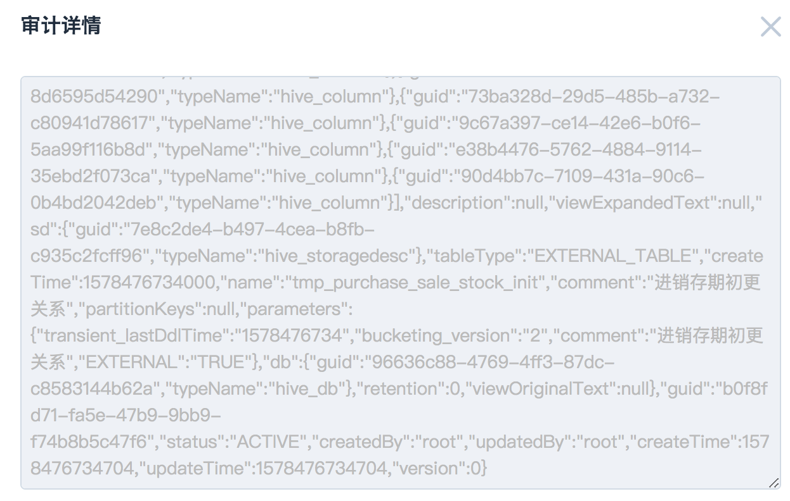

## 数据仓库

### 数据仓库-仓库管理

从 energy_entity_database 表查询数据。

### 数据仓库-数据表管理

从 energy_entity_table 表查询数据。

#### 1.查询业务类型

apache atlas 分类类型

queryAllTypeDefs.do =》

```java
//拼装查询参数
String requestUrl = ATLAS_SRV_URL + "/types/typedefs?type=" + type;
HttpResult httpResult = HttpUtil.sendHttpGet(requestUrl);
```

如果是初始化，则并将数据插入 energy_classification （元数据分类信息表）。

#### 2.获取字典标签信息

queryGlossaries.do =》

```java
//拼装查询参数
String requestUrl = ATLAS_SRV_URL + "/glossary";
HttpResult httpResult = HttpUtil.sendHttpGet(requestUrl);
```

还有一个循环获取term注释信息 =》

```java
String innerUrl = ATLAS_SRV_URL + "/glossary/term/" + guid;
HttpResult innerResult = HttpUtil.sendHttpGet(innerUrl);
```

如果是初始化，则将数据插入 energy_glossary（元数据标签信息表）。

## 数据表详情

1.查询实体详情 queryById.do =》

```java
//拼装查询参数
String requestUrl = ATLAS_SRV_URL + "/entity/guid/" + guid;
HttpResult httpResult = HttpUtil.sendHttpGet(requestUrl);
```



2.查询审计信息

queryAuditInfoById.do =》

```java
//拼装查询参数
String requestUrl = ATLAS_SRV_URL + "/entity/" + guid + "/audit";
HttpResult httpResult = HttpUtil.sendHttpGet(requestUrl);
```





3.获取样本数据

getSampleData.do =》

由guid 从 energy_entity_sample 表取。

4.获取存储信息

queryStorageInfoById.do =》

```java
 //拼装查询参数
String requestUrl = ATLAS_SRV_URL + "/entity/guid/" + guid;
HttpResult httpResult = HttpUtil.sendHttpGet(requestUrl);
```

