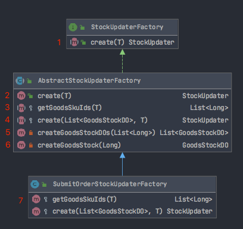
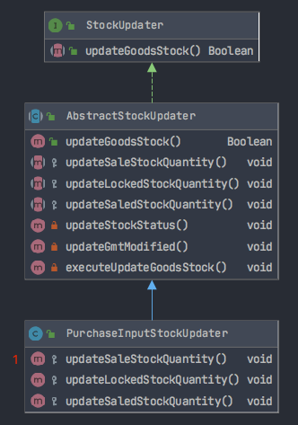

## 库存更新

### 一、场景

有多种业务场景都需要更新库存中心某个sku id的库存，比如：

- 取消订单
- 支付订单
- 采购入库
- 退货入库
- 提交订单

这些动作完成后，都需要同时去更新库存中心的库存表：

```mysql
CREATE TABLE `inventory_goods_stock` (
  `id` bigint(20) NOT NULL AUTO_INCREMENT COMMENT '主键',
  `goods_sku_id` bigint(20) NOT NULL COMMENT '商品sku ID',
  `sale_stock_quantity` bigint(20) NOT NULL COMMENT '销售库存',
  `locked_stock_quantity` bigint(20) NOT NULL COMMENT '锁定库存',
  `saled_stock_quantity` bigint(20) NOT NULL COMMENT '已销售库存',
  `stock_status` tinyint(4) NOT NULL COMMENT '库存状态，0：无库存，1：有库存',
  `gmt_create` datetime NOT NULL COMMENT '创建时间',
  `gmt_modified` datetime NOT NULL COMMENT '更新时间',
  PRIMARY KEY (`id`),
  UNIQUE KEY `uk_goods_sku_id` (`goods_sku_id`)
) ENGINE=InnoDB DEFAULT CHARSET=utf8 COMMENT='库存中心的商品库存表';
```

那么，这种情况时，可以使用工厂模式和命令模式，将二者结合起来使用。


### 二、库存更新命令工厂的URL类图



#### 库存更新命令工厂接口

```java
public interface StockUpdaterFactory<T> { 

   /**
    * 创建一个库存更新命令
    * @param parameter 参数对象
    * @return 库存更新命令
    */
   StockUpdater create(T parameter);
   
}
```

#### 库存更新命令工厂的父类

```java
public abstract class AbstractStockUpdaterFactory<T> 
      implements StockUpdaterFactory<T> {
    // 上图2：创建 库存更新命令，逻辑如下：
    // 1> 调用抽象方法goodsSkuIds(子类自己实现逻辑)， 根据传参得到 goodsSkuIds 的 List集合
    // 2> 循环 goodsSkuIds 集合，查询 库存中心的商品库存表里 是否有该goods_sku_id
    // 2>.1 没有的话，则新建 GoodsStockDO 对象
    // 3> 得到 goodsStockDOs 的 List集合
    // 4> 调用抽象方法 create，让子类 自己去实现 create 逻辑。
}
```

#### 采购入库 库存更新命令

```java
public class PurchaseInputStockUpdaterFactory<T> 
		extends AbstractStockUpdaterFactory<T> {
	 // 需要实现 父类抽象方法的逻辑
   
  /**
	 * 获取商品sku id集合
	 * @return 商品sku id集合
	 * @throws Exception
	 */
	@Override
	protected List<Long> getGoodsSkuIds(T parameter) throws Exception {		
		PurchaseInputOrderDTO purchaseInputOrderDTO = (PurchaseInputOrderDTO) parameter;
		List<PurchaseInputOrderItemDTO> purchaseInputOrderItemDTOs = 
				purchaseInputOrderDTO.getItems();
		
		if(purchaseInputOrderItemDTOs == null || purchaseInputOrderItemDTOs.size() == 0) {
			return new ArrayList<Long>();
		}
		
		List<Long> goodsSkuIds = new ArrayList<Long>(purchaseInputOrderItemDTOs.size());
		
		for(PurchaseInputOrderItemDTO purchaseInputOrderItemDTO : purchaseInputOrderItemDTOs) {
			goodsSkuIds.add(purchaseInputOrderItemDTO.getGoodsSkuId());
		}
		
		return goodsSkuIds;
	}
  
  /**
	 * 创建库存更新命令
	 * @param goodsStockDOs 商品库存DO对象集合
	 * @return 库存更新命令
	 * @throws Exception
	 */
	@Override
	protected StockUpdater create(
			List<GoodsStockDO> goodsStockDOs,
			T parameter) throws Exception {
		PurchaseInputOrderDTO purchaseInputOrderDTO = (PurchaseInputOrderDTO) parameter;
		List<PurchaseInputOrderItemDTO> purchaseInputOrderItemDTOs = 
				purchaseInputOrderDTO.getItems();
		
		Map<Long, PurchaseInputOrderItemDTO> purchaseInputOrderItemDTOMap = 
				new HashMap<Long, PurchaseInputOrderItemDTO>(CollectionSize.DEFAULT);
		
		if(purchaseInputOrderItemDTOs != null && purchaseInputOrderItemDTOs.size() > 0) {
			for(PurchaseInputOrderItemDTO purchaseInputOrderItemDTO : purchaseInputOrderItemDTOs)  {
				purchaseInputOrderItemDTOMap.put(purchaseInputOrderItemDTO.getGoodsSkuId(), 
						purchaseInputOrderItemDTO);
			}
		}
		
    // 重要：这里调用 采购入库单的 库存更新命令
		return new PurchaseInputStockUpdater(goodsStockDOs, goodsStockDAO, 
				dateProvider, purchaseInputOrderItemDTOMap); 
	}
}
```

### 三、采购入库单库存更新命令的UML类图



#### 1.商品库存更新命令的接口

```java
/**
 * 商品库存更新命令的接口
 * @author zhonghuashishan
 *
 */
public interface StockUpdater {

   /**
    * 更新商品库存
    * @return 处理结果
    */
   Boolean updateGoodsStock();
   
}
```

#### 2.商品库存更新命令的抽象基类

将公共代码和方法放入基类，将需要子类自己去实现的方法定义为抽象方法，让子类自己去实现。

```java
public abstract class AbstractStockUpdater implements StockUpdater {
  /**
	 * 更新商品库存
	 */
	@Override
	public Boolean updateGoodsStock() {
		try {
			updateSaleStockQuantity();
			updateLockedStockQuantity();
			updateSaledStockQuantity();
			updateStockStatus();
			updateGmtModified();
			executeUpdateGoodsStock();
		} catch (Exception e) {
			logger.error("error", e); 
		}
		return true;
	}
	
	/**
	 * 更新商品的销售库存
	 * @throws Exception
	 */
	protected abstract void updateSaleStockQuantity() throws Exception;
	
	/**
	 * 更新商品的锁定库存
	 * @throws Exception
	 */
	protected abstract void updateLockedStockQuantity() throws Exception;
	
	/**
	 * 更新商品的已销售库存
	 * @throws Exception
	 */
	protected abstract void updateSaledStockQuantity() throws Exception;
	
	/**
	 * 更新商品的库存状态
	 */
	private void updateStockStatus() throws Exception {
		for(GoodsStockDO goodsStockDO : goodsStockDOs) {
			if(goodsStockDO.getSaleStockQuantity() > 0L) {
				goodsStockDO.setStockStatus(StockStatus.IN_STOCK); 
			} else {
				goodsStockDO.setStockStatus(StockStatus.NOT_IN_STOCK); 
			}
		}
	}
	
	/**
	 * 更新商品库存的修改时间
	 */
	private void updateGmtModified() throws Exception {
		for(GoodsStockDO goodsStockDO : goodsStockDOs) {
			goodsStockDO.setGmtModified(dateProvider.getCurrentTime());
		}
	}
	
	/**
	 * 实际执行更新商品库存的操作
	 * @throws Exception
	 */
	private void executeUpdateGoodsStock() throws Exception {
		for(GoodsStockDO goodsStockDO : goodsStockDOs) {
			goodsStockDAO.updateGoodsStock(goodsStockDO);
		}
	}
}
```

#### 3.采购入库库存更新命令

子类写自己的方法逻辑

```java
public class PurchaseInputStockUpdater extends AbstractStockUpdater {
  /**
	 * 更新销售库存
	 */
	@Override
	protected void updateSaleStockQuantity() throws Exception {
		for(GoodsStockDO goodsStockDO : goodsStockDOs) {
			PurchaseInputOrderItemDTO purchaseInputOrderItemDTO = 
					purcahseInputOrderItemDTOMap.get(goodsStockDO.getGoodsSkuId());
			goodsStockDO.setSaleStockQuantity(goodsStockDO.getSaleStockQuantity() 
					+ purchaseInputOrderItemDTO.getArrivalCount()); 
		}
	}

	/**
	 * 更新锁定库存
	 */
	@Override
	protected void updateLockedStockQuantity() throws Exception {
		
	}

	/**
	 * 更新已销售库存
	 */
	@Override
	protected void updateSaledStockQuantity() throws Exception {
		
	}
}
```


### 四、调用库存更新命令

比如：

通知库存中心，"采购入库完成"事件发生了，这时需要更新库存，调用方式如下：

```java
// 更新本地库存
StockUpdater goodsStockUpdateCommand = 
      purchaseInputStockUpdateCommandFactory.create(purchaseInputOrderDTO);
goodsStockUpdateCommand.updateGoodsStock();
```

通知库存中心，“完成退货入库”事件发生了，这时需要更新库存，调用方式如下：

```java
// 更新本地库存
StockUpdater goodsStockUpdateCommand = 
      returnGoodsInputStockUpdateCommandFactory.create(returnGoodsInputOrderDTO);
goodsStockUpdateCommand.updateGoodsStock();
```

通知库存中心，“提交订单”事件发生了，这时需要更新库存，调用方式如下：

```java
// 更新本地库存
StockUpdater goodsStockUpdateCommand = 
      submitOrderStockUpdaterFactory.create(orderDTO); 
goodsStockUpdateCommand.updateGoodsStock();
```

### 五、总结

使用模板设计模式、工厂模式和命令模式的好处：

#### 模板模式

设计一系列的command，将通用的步骤抽取到抽象的基类中去，比如这里将：

- 更新商品的库存状态；

- 商品库存的修改时间；

- 实际执行更新库存的操作 

  

这三个方法都放在了抽象的基类中。

另外：

基于模板模式，限定了每个库存更新的过程都是一样的，按照一样的步骤和顺序去走，很清晰。

#### 工厂方法设计模式

这里将工厂方法设计模式与模板模式结合了起来

就是说你可能需要的不是一个工厂，而是会需要不同的工厂，不同的工厂创建不同的产品。

比如，"取消订单"、"支付订单"、"退货入库"等场景。

将通用的逻辑抽取到父工厂里面去，比如由sku_id去获取商品库存DO对象集合的

```java
createGoodsStockDOs(List<Long> goodsSkuIds) 
```

方法。（得到goodsSkuIds集合后作为参数传给对应的命令去修改库存）

子工厂就专注干自己的事儿，比如

```java
protected abstract List<Long> getGoodsSkuIds(T parameter)
```

方法就是一个抽象方法，子工厂根据传参去获取对应的采购入库单条目、订单条目等。

#### 命令模式

将不同类型的库存更新操作，封装了不同的库存更新命令。

我们将一些操作封装成这个命令，然后后续可以对这些命令做一些高级的操作，比如说将命令发送到异步队列中去，这个是命令模式最常用的一个应用场景。


我们至所以在这里使用命令模式，虽然暂时看起来只是简单的去执行了这个命令中的逻辑，但是我们是为了以后打下一个扩展的逻辑，如果以后要对库存更新的操作，比如说实现异步话，或者是库存更新操作的撤销，等等一些高级的操作，就可以基于command命令的概念去做。