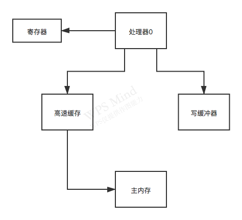

### 可见性在硬件级别的说明



#### 引发可见性的3个场景

1. 每个处理器都有自己的寄存器，所以多个处理器各自运行一个线程的时候，可能导致某个变量给放到寄存器里，就会导致各个线程没法看到其它处理器寄存器内变量值的修改了；
2. 处理器运行的线程对变量的写操作都是针对写缓冲来的，并不是直接更新到主内存，所以很可能导致一个变量修改了只是放在写缓冲内，没有更新到主内存。这时其它线程也是没办法读取到他写缓冲区内的值。
3. 然后即使这个时候一个处理器的线程更新了写缓冲区之后，将值又同步更新到了自己的高速缓存（或主内存），然后还把这个更新通知了其他的处理器，但是其它处理器可能把这个通知放到了无效队列里，没有更新他的高速缓存，此时，其它处理器的线程从高速缓存里读数据的时候，读的还是过时的旧值。

#### 解决办法：MESI协议

MESI协议只是一个协议，实际有很多不同的实现，具体的实现机制要靠底层的系统如何实现。

为了实现MESI协议，有两个配套的专业机制：flush处理器缓存和refresh处理器缓存。

- flush处理器缓存：
  - 线程在更新完数值后，强制将数据刷回到高速缓存（或主内存）；
  - 同时将会给总线发送一个消息，总线会通知其它处理器变量值发生了修改；
- refresh处理器缓存：
  - 处理器中的一个线程在读取变量值的时候，如果嗅探到其它处理器的线程对变量的值进行了更新，则会从其它处理器的高速缓存（或主内存）中读取这个变量的值，并强制刷回到自己的高速缓存中。

#### MESI协议与内存屏障如何搭配使用

```java
volatile boolean isRunning = true;

......
isRunning = false; // 这是一个volatile变量写操作，会通过执行一个内存屏障，在底层会触发flush处理器缓存操作
......
while (isRunning) {  // 读volatile变量，会执行一个内存屏障，在底层触发refresh处理器缓存操作，
	
}
```


