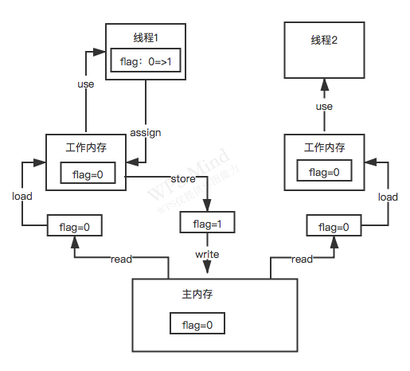

### Java内存模型

java内存模型，是基于CPU缓存模型图来建立的，只不过java内存模型是标准化的，屏蔽掉底层不同的计算机的区别。

#### java内存模型图

- read：从主内存读；
- load：将主内存读取到的值写入到工作内存；
- use：从工作内存读取数值来计算；
- assign：将计算好的数值重新赋值到工作内存；
- store：将工作内存中的数据写入到主内存；
- write：将store过去的值赋给主存中的变量。

### 为什么加了volatile就可以保证线程的可见性了

1. 在线程修改变量后，执行assign，只要发现这个变量加了volatile关键字，就会在执行assign之后，强制执行store+write，将新值刷到主内存里；
2. 同时会将其它线程里的工作内存中该变量的缓存立即过期；
3. 线程2如果在从工作内存里读取该变量的值时，会发现缓存已经过期，这时就会直接从主内存中来重新加载这个变量的值。

通过volatile 这个关键字，可以实现的一个效果是：只要其中一个线程修改了这个共享变量的值，则其它线程能够立马感知到。