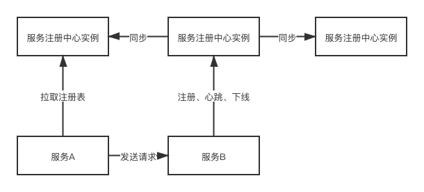

## 集群机制

### 集群机制有什么好处？

#### 高并发

每台机器承载的并发请求是有限制的，单台机器每秒可能几百次请求，但是未来慢慢的微服务规模越来越大，服务实例越来越多时，最后就可以向单台机器请求的并发达到每秒几千次，上万次。

采用集群机制，所有的服务请求可以采用负载均衡的方式，来请求服务注册中心集群里的任意一个实例，这样用一个集群扛下了每秒上千次甚至上万次的高并发请求。

#### 高可用

如果是单机部署的话，假如这台机器宕机了，就会导致服务注册中心不可用了。

如果是集群部署的话，那么任何一个机器宕机，不会导致服务注册中心不可用的。

### 微服务注册中心的集群同步机制

借鉴 spring cloud中的 三层队列同步机制，仿照这个机制来实现。

