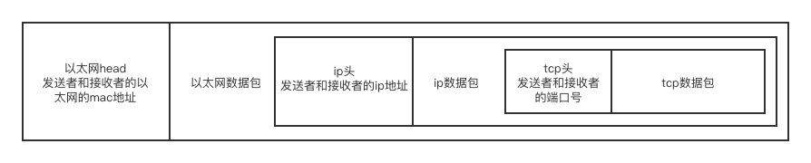

### Socket工作原理

应用层：http协议；

传输层：tcp协议；

网络层：ip协议；

数据链路层：以太网协议。

如果基于http协议去玩儿，那就是tomcat，springmvc，springcloud，大家都走http协议，我给你发起一个http请求，你给我一个响应，或者是通过浏览器发送。

现在假如两台机器就是要通信，且不基于http协议，如果说基于tcp协议去玩，那就可以基于socket编程。

可以理解为基于传输层的编程规范，api。

socket把tcp协议封装一下，封装到代码层面，你代码应该怎么写才能够基于tcp协议进行通信。

socket底层会根据tcp协议，把数据放到tcp数据包里。

最后通过以太网包，广播到网关上，网关通过层层转发，最后转发到你要发送的那台机器上去。一层一层的解包，解成tcp包，然后处理数据。

