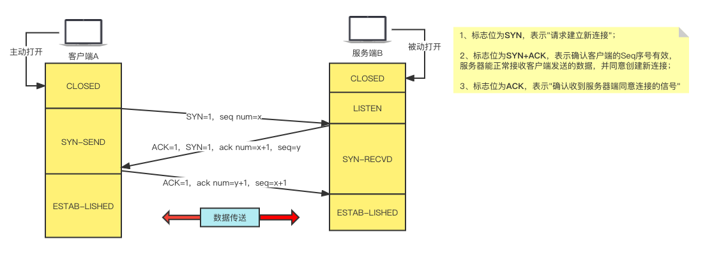
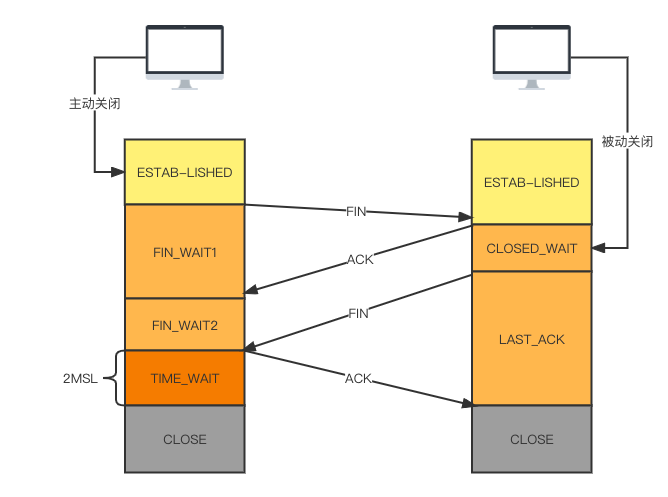

## 目录

第五阶段：复杂业务场景下的系统设计实践

- 01_精通基础开发技术之讲给Java工程师听的大白话网络课程

知乎上这篇文章讲的比较好：https://zhuanlan.zhihu.com/p/72114693

Java工程师必须要了解的一些网络知识。

## TCP/IP协议

#### TCP的几个状态

在TCP里，有几个FLAGS字段，这个字段（位码/TCP标志位）有以下几个标识：SYN，FIN，ACK，PSH，RST，URG。

其中对我们日常分析有用的就是前面的5个字段：

- SYN：表示建立连接；
- FIN：表示关闭连接；
- ACK：表示响应
- PSH：表示有 DATA 数据传输；
- RST：表示连接重置。

一般地，当出现FIN/RST包时，我们便认为客户端与服务端断开了连接；

而当出现SYN/SYN+ACK包时，我们认为客户端与服务端建立了一个连接；

PSH为1的情况，一般只出现在DATA内容不为0的包中，也就是说PSH为1表示的是有真正的TCP数据包内容被传递；

TCP的连接建立和关闭，都是通过请求-响应的模式完成。

#### TCP三次握手的流程

讲的比较好的文章：https://baijiahao.baidu.com/s?id=1654225744653405133&wfr=spider&for=pc

##### 为什么需要三次握手

是因为在第二次握手过程中，服务器端发送给客户端的TCP报文是以SYN与ACK做为标识位的。

SYN是**请求连接标志**， 表示同意建立连接请求；ACK是**确认报文**， 表示告诉客户端，我收到了你的请求报文。

即**SYN建立连接报文**与 **ACK确认报文** 是在同一次握手当中传输的，所以三次握手不多不少，正好让双方明确彼此消息互通。

#### TCP四次挥手

- 第一次握手：客户端打算关闭连接的时候，会发送 FIN报文告诉服务端我要关闭连接了，之后客户端就会处于一个 WAIT_1 状态；

- 第二次握手：服务端收到报文之后，就会发送一个ACK确认报文，告诉客户端，我知道你要关闭连接了，等我这边数据处理完再通知你，接着服务端就会进入一个 CLOSED_WAIT 状态；

- 第三次握手：客户端收到服务端发送的ACK报文后，就进入WAIT_2状态，等待服务端处理完数据后，也会向客户端发送FIN报文，告诉客户端我这边数据处理完了，可以关闭连接了，之后服务端就处于LAST_ACK状态；

- 第四次握手：客户端收到服务端的FIN报文之后，会回一个ACK报文，之后进入一个 TIME_WAIT 状态；

  服务端收到了ACK的报文之后，就会进入一个 closed 状态，至此，服务端已经完成了关闭连接；

  客户端再经过两倍的 mls 时间之后，自动会进入一个 close 状态，至此，客户端也完成了关闭连接；

#### 为什么挥手需要四次

其实仔细想一下，tcp建立连接的时候三次握手中，第二次握手是同时包含了SYN和ACK 标识位的，但断开连接的时候不能合并，因为服务端可能还需要有数据处理和发送。只有等到服务端不再发送数据的时候才发送FIN报文给客户端，表示同意关闭连接。所以不能和三次握手的时候一样进行合并。

#### 为什么需要等待一个两倍的msl时间而不能直接关闭

要先了解什么是msl？

msl指的是报文的最大生存时间，也就是说任何报文在网络上超过这个生存时间的话将会被丢弃。因为报文经过一来一回刚好是两倍的msl。

`如果我们的服务端没有收到客户端最后的ack报文`，那超时之后，`服务端会重发FIN报文`，那么当客户端接收到这个重传的FIN报文之后会再次发送ack，如果此时服务端接收到客户端发过来的ack后就不会再发送任何消息。

因此，客户端为了确保对方能收到ack报文，必须要等待一段时间。因此，最坏的情况就是：ACK消息的最大存活时间+FIN消息的最大存活时间刚好是2ML。

--------------------------------

#### 建立TCP连接到底是什么意思呢？

就是以TCP协议的规范，一台电脑的一个端口上的程序，有一个socket；跟另一个服务器上的某个端口上的程序，另外一个socket，通过交换几次TCP包，大家交换了一下数据，最后就在各自的电脑/服务器上，建立了对应的socket，就代表说，建立了一个TCP连接。

没有TCP三次握手建立连接的话，两个程序之间不知道对方的一些基本情况，没法进行有效的通信，所以通过三次握手建立连接，交换一些数据，就知道对方是什么情况了，此时就可以进行通信了。

#### Socket网络编程跟TCP/IP协议的关系是什么

socket就是java的网络编程的一个包，就是基于java网络编程里的socket的概念来进行编程。

基于socket编程进行连接，实际就是基于tcp的三次握手进行连接。

socket就是在传输层里把tcp/ip协议给封装一下，我们程序员一般都是面向socket来编程的，比如java原生就支持socket网络编程。

以IO流的方式发数据。

IP协议跟它又有什么关系呢？

每一个TCP包都被包裹在IP包里。IP是在跨子网的时候需要定位到给下一个子网的哪个路由器发包。

应用层 => HTTP协议

传输层 => TCP协议

网络层 => IP协议

数据链路层 => 以太网协议

#### socket编程大体步骤

大体来说这个步骤，就是我们搞一个ServerSocket无限等别人来连接你，然后某个机器要连接你，就在本地创建一个socket去连接你，然后建立连接之后，在服务器上，ServerSocket也会创建出来一个socket的。

通过客户端的socket跟服务端的socket进行通信，我给你写数据，你给我写数据，我读数据，大概就是这个过程。

#### HTTP请求的底层原理

1. http请求封装到应用层数据包 => 封装在tcp数据包 => 封装在ip数据包 => 封装在以太网数据包，如果以太网数据包过大，可能拆成几个包；
2. 走 以太网协议 -> 广播 -> 网关 -> 多个网关 -> 目标的机器 -> 一层一层拆包 -> http请求报文 -> 传递给 tomcat -> spring mvc -> http响应 -> 一样的路径回去。

##### 最最底层，这个数据怎么传输？

走的是物理层，网线，光缆，所有数据都是0/1电路信号。

#### http长链接

http本身没什么所谓的长连接，短连接之说。其实说白了都是http下层的tcp连接是长连接还是短连接。

http1.0的时候，底层的tcp都是短连接，一个网页发起的请求，每个请求都是先tcp三次握手，然后发送请求，获取响应，最后tcp四次挥手断开连接。

http1.1的时候，tcp长连接，tcp三次握手，建立了连接，无论有多少次请求都是走一个tcp连接的。