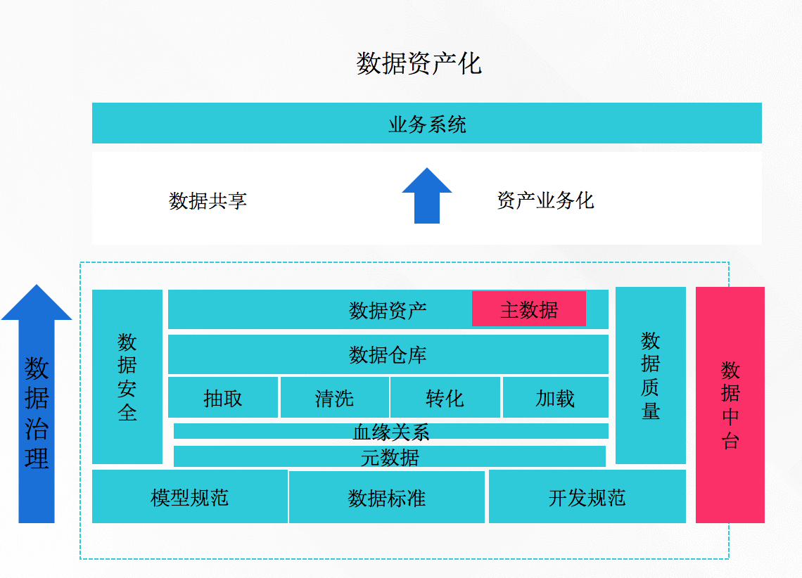
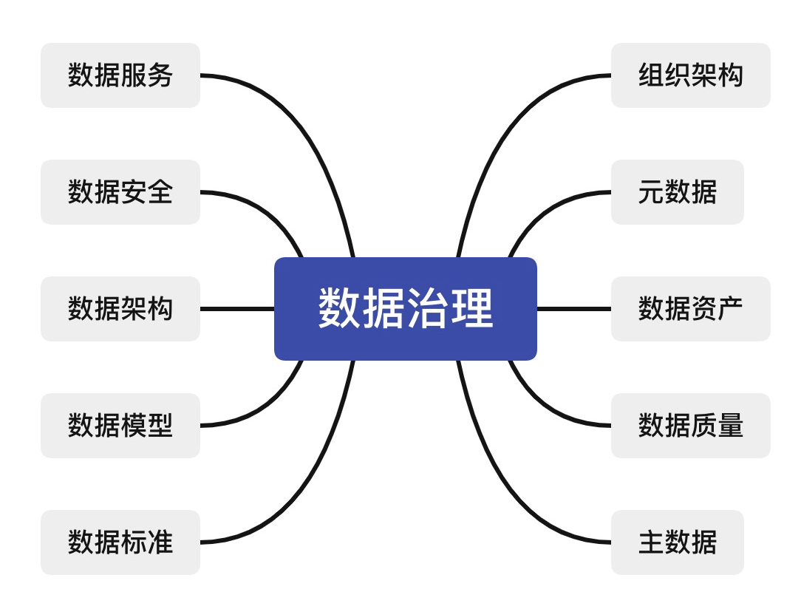
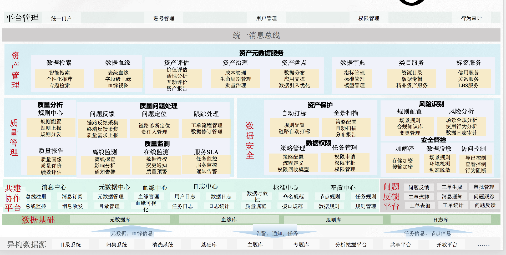

## 第一周

### 技术的发展

数据库 -》 数据仓库 -》数据平台 -》数据中台

数据库：把业务数据进行数据化的一个过程。=》把业务数据转化为数据语言

数据仓库：业务系统的数据进来了之后，不能集中分析，为业务赋能。数据仓库可以解决这个问题。=》以数据为导向

数据平台：进行传统的数仓开发时，有一部分的调度可能用传统的调度工具，也可能用商用的调度工具，结合底层的数据库，整个过程会发现一个问题，底层的数仓需要维护，etl平台需要维护，有的etl平台甚至都没有自己的调度系统。

**所以就有了数据平台的概念，会把底层的数据库、调度系统都屏蔽了，所有的都放在一个平台上，大家可以写代码，可以对数据进行预览，可以进行调度，离线开发实时开发都集中在平台上，需要数据开发同学做的技术都集中到一个平台上。**=》是以功能为导向。

数据中台：数据中台的内容会更多。会把数据平台的功能也包含进来。

数据中台跟传统的数仓的区别：

- 数仓是以业务为驱动的，面向主题的。

- 数据中台是大而全的，通过数据的准备，通过数据驱动业务，把数据进行标准化后，及时的进行共享，给业务赋能。

包含数据仓库+数据平台+业务侧的内容，及时的跟业务赋能

### 大数据架构设计

#### 普通的大数据架构

#### lambda架构

同时有离线和实时增量，数据会冗余、数据一致性问题（离线数据和实时数据怎么保持一致）。

#### kappa架构

不管全量和增量，都用流同步。随着数据增长，数据会越来越大，实时分析大批量的数据，非常耗性能，对计算和存储资源要求较高。系统一旦挂了，怎么去做数据二次恢复，高可用。

#### 架构选型-总结

在进行架构选型时，成本和场景支持最关键的两个要素，lambda架构成本适中，又能满足实时和离线两个场景。

推荐：Lambda架构。

### 中台产品选择-我们学习选择

- 通用性：建议阿里巴巴DataWorks + QuickBI；
- 开放性：建议CDH + DolphinScheduler
- 独立的第三方：建议选择一个交付公司实践1-2个项目
- 业务性：选择一个甲方企业，深入研究业务

## 第二周

## 第九周

### 数据治理

数据治理框架-货币和文字统一启示。

### 什么是数据治理

国际数据管理协会（DAMA）给出的定义：

数据治理是对数据资产管理行使权力和控制的活动集合。

### 为什么要数据治理

#### 数据孤岛

##### 逻辑性数据孤岛

不同部门站在自己角度定义数据，缺少统一的数据标准，使得相同数据被赋予不同含义，加大了跨部门数据合作的沟通成本。

##### 物理性数据孤岛

数据在不同部门相互独立存储，独立维护，彼此间相互孤立。

#### 烟囱化现象严重

##### 业务系统

烟囱式系统，重复功能建设，不必要的开发成本和运维成本。

##### 数据平台

烟囱式数据开发，缺少底层模型建设，计算任务重复，数据产出困难，数据使用成本高。

#### 数据不可知

用户不知道有哪些数据，也不知道这些数据和业务的关系是什么，虽然意识到数据的重要性，但不知道平台中有没有能解决自己所面临业务问题的关键数据，该到哪里去寻找这些数据。

比如，我需要一个数据的时候需要找很多部门的人去沟通。=》没有数据目录。

####  数据不可取

业务人员知道数据平台中具备哪些数据，并且知道这些数据可以解决自己的业务问题，但是不能便捷自助的拿到这些数据，需要技术帮忙取数。

#### 数据不可用

`缺少数据质量监控及管理`，导致数据使用者获取到的数据质量差，数据不可用。错误的数据比没有数据支撑更可怕。

#### 数据不可控

用户不知道集成了哪些数据，处理了哪些数据。

服务提供了哪些数据，数据使用方拥有什么样的权限，哪些数据是敏感数据。

=》哪些数据不能让别人看，数据在不知道的情况下被别人下载了等。

### 数据治理框架

数据治理已成为企业`精细化管理`及`运营不可或缺的基础`，只有切实做好数据治理工作，才能`提升企业数据质量`，`实现数据价值升华`，`真正成为应对市场挑战的助推力`。

### 数据治理内容

第九周：059

数据服务、数据安全、数据架构、数据模型、数据标准

组织架构、元数据、数据资产、数据治理、主数据。

### 数据治理理解

数据资产化是通过数据治理来实现。

数据中台的核心任务是`数据资产业务化`，数据资产是数据治理的核心内容，质量和安全是保证数据资产高可用的。

- 元数据、数据血缘是质量和安全的基础；
- 数据抽取、数据清洗、数据转化、数据加载是数据资产沉淀的途径；
- 数据仓库是数据资产的工程和载体；
- 数据标准、模型规范、开发规范是数据资产的价值体现；
- 主数据是资产共享重要表现形式，是数据中台实施是否成功的关键要素；
- 组织架构是数据治理能否落地最关键保障因素。

### 数据治理框架-数据治理内容

### 数据治理框架-架构设计

天机拿自己之前的一家公司的一个项目来讲：

## 第十周

### 数据治理因素-元数据

#### 元数据概念

描述数据的数据。

例如图书的分类，电影的介绍。。。这些描述就是元数据。

然后描述表结构的信息，就是元数据。

#### 业务元数据

主要关注数据的内容和条件，另包括与数据治理相关的详细信息。

业务元数据的示例包括:

1)数据集、表和字段的定义和描述。

等等其它。

#### 技术元数据

表名、字段名、字段属性、数据库对象属性等。

#### 操作元数据

描述了处理和访问数据的细节。=》日志信息

#### 管理元数据

例如：

1、人员；

2、流程；

3、职责，岗位；

4、组织、部门；

5、权限、审批。

