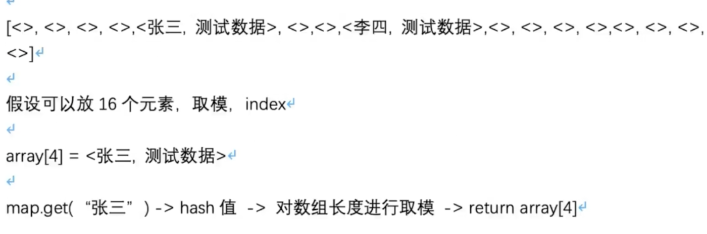
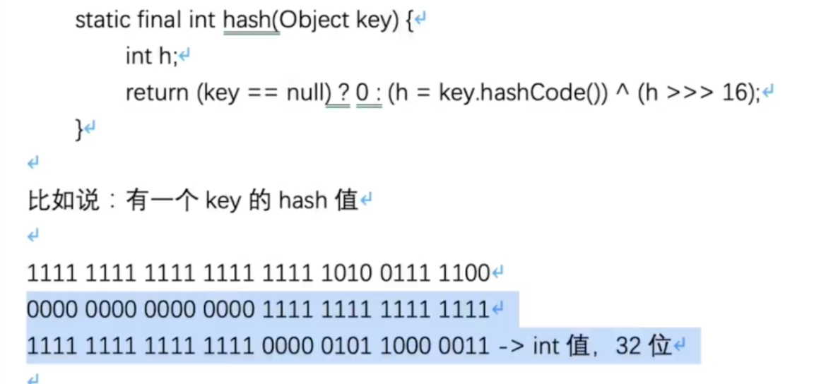

面试突击的定位

面试突击第一季：

redis连环炮、mq连环炮、网络连环炮、JDK集合连环炮、jvm连环炮、spring源码连环炮、tomcat连环炮、linux连环炮、系统设计连环炮、生产实践连环炮

面试突击第二季：

针对分布式架构这个专题讲，带一点点的小深度。

面试突击第三季：

对于每一个小专题（偏基础），都会挑选几个高频的问题出来进行讲解。

## HashMap

### 你知道HaspMap底层的数据结构是什么吗

底层最核心的数据结构就是 数组。

往里边put数据的时候，会根据key算出来一个hash值，根据hash值与Map的长度进行取模（比如长度是16，取模后的值肯定是在0到16之间），然后就会定位到数组的一个元素里去。

### 你知道HashMap是如何解决hash碰撞的吗

**Java中的hashCode方法就是根据一定的规则，将与对象相关的信息（比如对象的存储地址、对象的字段等）映射成一个数值，这个数值称为散列值。**

最最简单的理解：



异或，两个不一样值就为1。hash算法，右移16位：



右移16位，高16位 与 低16位，进行异或。

**意义在哪**

hash算法优化：

对每个hash值，在他的低16位中，让高低16位都进行了异或，让他的低16位同时保持了高16位的特征，尽量避免一些hash值后续出现冲突，进入数组的同一个位置。

经过这个算法，尽量让高16位和低16位，都参与到了运算，尽量避免后边产生hash冲突。

寻址算法优化：

 (n - 1) & hash 的性能会比较高，就跟数学公式那样记着就行了。用与运算替代取模，提升性能。

##### hash冲突

多个key，他们计算出来的hash值，与 n-1 与运算之后，发现定位出来的数组还是同一个位置，这就是hash碰撞、hash冲突了。

这个时候会在这个位置挂一个链表，这个链表里放入多个元素，让多个key-value对同时放在数组的同一个位置里。

get的时候如果发现这个位置挂的是一个链表，那么此时就遍历该链表，从里边找到自己想要的那个key-value对即可。

假设你的链表很长，可能会导致遍历链表性能会比较差，O(n)。

`做了什么优化呢`：

如果链表的长度达到了一定的长度后，就会将链表转换为红黑树，遍历一颗红黑树找一个元素，此时是 O(logn)，性能会比链表高。

### 说说HashMap是如何进行扩容的

hashmap底层是一个数组，当这个数组满了之后，他会自动进行扩容，变成一个更大的数组，让你在里面可以放更多的元素。

默认就是2倍扩容，扩容之后要进行rehash，给元素重新分配位置。

比如原来数组的长度是16，数组的长度扩容之后就变为32，会重新对每个hash值进行寻址，也就是用每个hash值跟新数组的 length-1 进行与运算。

举例：

```
n-1：  0000 0000 0000 0000 0000 0000 0001 1111
hash1：1111 1111 1111 1111 0000 1111 0000 0101
&结果： 0000 0000 0000 0000 0000 0000 0000 0101 = 5 (index=5的位置)
```


```
n-1：  0000 0000 0000 0000 0000 0000 0001 1111
hash1：1111 1111 1111 1111 0000 1111 0001 0101
&结果： 0000 0000 0000 0000 0000 0000 0001 0101 = 21 (index=21的位置)
```

判断二进制结果中是否多出1个bit 的1，如果没多，那就是原来的index，如果多了出来，那么就是index + oldCap（原来数组的长度），通过这个方式，就避免了refresh的时候，用每个hash对新数组.length取模，取模性能不高，位运算的性能比较高。

## BAT面试官为什么都喜欢问并发编程的问题

syncronized实现原理、CAS无锁化的原理、AQS是什么、Lock锁、ConcurrentHashMap分段加锁的原理、线程池的原理、java内存模型、volatile、对java并发包有什么了解。

### 说说synchronized关键字的底层原理是什么？

可以对对象加锁，也可以对类加锁。


