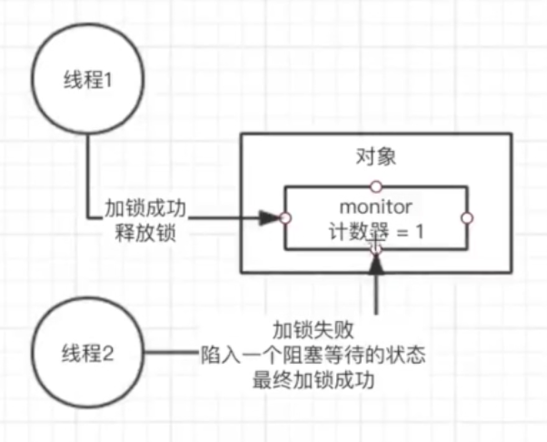
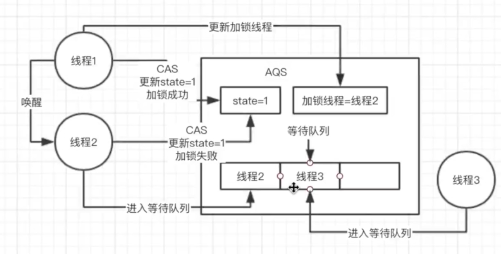
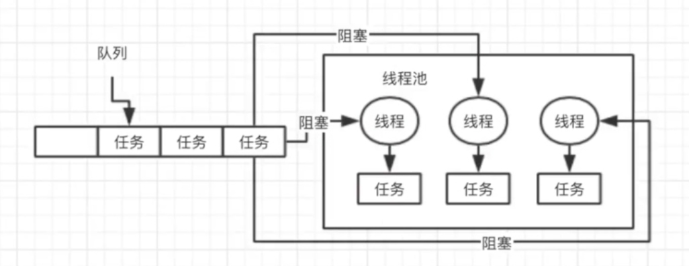

面试突击的定位

面试突击第一季：

redis连环炮、mq连环炮、网络连环炮、JDK集合连环炮、jvm连环炮、spring源码连环炮、tomcat连环炮、linux连环炮、系统设计连环炮、生产实践连环炮

面试突击第二季：

针对分布式架构这个专题讲，带一点点的小深度。

面试突击第三季：

对于每一个小专题（偏基础），都会挑选几个高频的问题出来进行讲解。

## HashMap

### 你知道HaspMap底层的数据结构是什么吗

底层最核心的数据结构就是 数组。

往里边put数据的时候，会根据key算出来一个hash值，根据hash值与Map的长度进行取模（比如长度是16，取模后的值肯定是在0到16之间），然后就会定位到数组的一个元素里去。

### 你知道HashMap是如何解决hash碰撞的吗

**Java中的hashCode方法就是根据一定的规则，将与对象相关的信息（比如对象的存储地址、对象的字段等）映射成一个数值，这个数值称为散列值。**

最最简单的理解：


异或，两个不一样值就为1。hash算法，右移16位：


右移16位，高16位 与 低16位，进行异或。

**意义在哪**

hash算法优化：

对每个hash值，在他的低16位中，让高低16位都进行了异或，让他的低16位同时保持了高16位的特征，尽量避免一些hash值后续出现冲突，进入数组的同一个位置。

经过这个算法，尽量让高16位和低16位，都参与到了运算，尽量避免后边产生hash冲突。

寻址算法优化：

 (n - 1) & hash 的性能会比较高，就跟数学公式那样记着就行了。用与运算替代取模，提升性能。

##### hash冲突

多个key，他们计算出来的hash值，与 n-1 与运算之后，发现定位出来的数组还是同一个位置，这就是hash碰撞、hash冲突了。

这个时候会在这个位置挂一个链表，这个链表里放入多个元素，让多个key-value对同时放在数组的同一个位置里。

get的时候如果发现这个位置挂的是一个链表，那么此时就遍历该链表，从里边找到自己想要的那个key-value对即可。

假设你的链表很长，可能会导致遍历链表性能会比较差，O(n)。

`做了什么优化呢`：

如果链表的长度达到了一定的长度后，就会将链表转换为红黑树，遍历一颗红黑树找一个元素，此时是 O(logn)，性能会比链表高。

### 说说HashMap是如何进行扩容的

hashmap底层是一个数组，当这个数组满了之后，他会自动进行扩容，变成一个更大的数组，让你在里面可以放更多的元素。

默认就是2倍扩容，扩容之后要进行rehash，给元素重新分配位置。

比如原来数组的长度是16，数组的长度扩容之后就变为32，会重新对每个hash值进行寻址，也就是用每个hash值跟新数组的 length-1 进行与运算。

举例：

```
n-1：  0000 0000 0000 0000 0000 0000 0001 1111
hash1：1111 1111 1111 1111 0000 1111 0000 0101
&结果： 0000 0000 0000 0000 0000 0000 0000 0101 = 5 (index=5的位置)
```


```
n-1：  0000 0000 0000 0000 0000 0000 0001 1111
hash1：1111 1111 1111 1111 0000 1111 0001 0101
&结果： 0000 0000 0000 0000 0000 0000 0001 0101 = 21 (index=21的位置)
```

判断二进制结果中是否多出1个bit 的1，如果没多，那就是原来的index，如果多了出来，那么就是index + oldCap（原来数组的长度），通过这个方式，就避免了refresh的时候，用每个hash对新数组.length取模，取模性能不高，位运算的性能比较高。

## BAT面试官为什么都喜欢问并发编程的问题

syncronized实现原理、CAS无锁化的原理、AQS是什么、Lock锁、ConcurrentHashMap分段加锁的原理、线程池的原理、java内存模型、volatile、对java并发包有什么了解。

### 12、说说synchronized关键字的底层原理是什么？

可以对对象加锁，也可以对类加锁。

底层原理是跟JVM指令和monitor对象有关。



### 13、能聊聊你对CAS的理解以及其底层实现原理可以吗？

cas是原子的，底层会对应着硬件级别的一些类似锁的机制（`使用 cpu 硬件提供的 lock 信号保证其原子性`）。

一次cas只能有一个线程执行成功。

比如线程1执行cas的时候发现旧值是0跟最初读到的值是一样的，说明此时没有别的线程修改过，则累加1。

线程2在执行cas的时候，则发现已经变为1，与最初读到的值不一样了，cas就失败了。于是会重新读取当前值，发现是1，再次尝试累加为2，这个时候已经没有其他线程在执行CAS操作了，会发现旧值跟最初读到的值是一样的，则累加为2成功。

CAS在底层的硬件级别给你保证 一定是原子性的，同一时间只有一个线程可以执行cas，先比较再设置。其他线程的CAS同时间执行此时会失败。

### 14、ConcurrentHashMap实现线程安全的底层原理到底是什么？

有多个线程要同时修改一个数据的时候，可能会有线程安全的问题，这个时候可以使用 synchronized 进行加锁 或 CAS 去进行安全的累加，去实现多线程场景下的安全的更新一个数据的效果。

JDK并发包里推出了一个 ConcurrentHashMap，默认实现了线程安全性。

#### JDK1.7及JDK1.7之前

JDK1.7及JDK1.7之前，采用的是分段加锁。因为HashMap的底层还是数组，将一个数组分成多个小的数组，每个小数组都对应一个锁，实现分段加锁。

put多个元素的时候，如果put的元素是属于不同的数组的，则互不影响。

#### JDK1.8以及以后

又变成了只有一个数组。然后数组里的每一个元素进行put操作的时候，都是有一个不同的锁。

如果两个线程都是要对同一个位置进行put操作，就采取CAS的策略。

如果多个线程对不同位置进行操作这时是没有关系的，如果是对同一个位置进行。如果CAS执行失败了，就表明比如数组[5]这个位置，刚刚已经有别的线程往这个位置放入元素了，这个时候就需要在这个位置基于链表+红黑树进行处理。

会采取类似 synchronized(数组[5])这种方式，对数组[5]这个对象进行加锁，然后基于链表或红黑树在这个位置插入自己的数据。

你想想，如果不采用这种方式，而是直接对整个数组加锁，这样就相当于串行，效率会比较低的。

所以JDK1.8以后，就是这种方式：

`如果多个线程对不同位置的元素操作，此时大家是可以并发执行的；如果是对同一个位置的元素进行操作，才会加锁串行化处理。`

### 15、你对JDK中的AQS理解吗？AQS的实现原理是什么？

abstract queue synchronizer，抽象队列同步器

```java
ReentrantLock lock = new ReentrantLock();

// 多个线程过来都尝试对同一个lock进行加锁

lock.lock();

// 代码

lock.unlock;
```


ReentrantLock 底层有个核心的组件就是 AQS：




### 16、说说线程池底层工作原理可以吗？




newFixedThreadPool 举例，这些参数分别是干什么用的？

```java
public ThreadPoolExecutor(int corePoolSize,
                              int maximumPoolSize,
                              long keepAliveTime,
                              TimeUnit unit,
                              BlockingQueue<Runnable> workQueue) {
        this(corePoolSize, maximumPoolSize, keepAliveTime, unit, workQueue,
             Executors.defaultThreadFactory(), defaultHandler);
    }
```

- corePoolSize：核心线程数量，比如设置为 3 个；
- maximumPoolSize：比如设置为 200。当队列中一下子来了很多任务，corePoolSize 这3个线程也还在处理任务，没有空闲的，这时就会再创建新的线程，能创建的最大数量就是这个maximumPoolSize；
- keepAliveTime：比如设置为 60s。当队列中的任务都被处理完毕之后，再等 60s，如果还没有新的任务到来，则会销毁 额外创建的线程；
- BlockingQueue<Runnable> workQueue：设置的队列

如果额外线程也满了，队列也满了，此时还有任务要进来，只能reject 掉，他有几种 reject 策略，可以传入 RejectedExecutionHandler