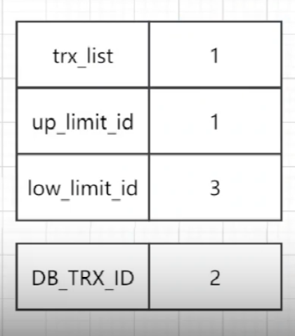

面试突击的定位

面试突击第一季：

redis连环炮、mq连环炮、网络连环炮、JDK集合连环炮、jvm连环炮、spring源码连环炮、tomcat连环炮、linux连环炮、系统设计连环炮、生产实践连环炮

面试突击第二季：

针对分布式架构这个专题讲，带一点点的小深度。

面试突击第三季：

对于每一个小专题（偏基础），都会挑选几个高频的问题出来进行讲解。

### 07、你知道HaspMap底层的数据结构是什么吗

### 08、JDK1.8中的hash算法和寻址算法是如何优化的？

底层最核心的数据结构就是 数组。

往里边put数据的时候，会根据key算出来一个hash值，根据hash值与Map的长度进行取模（比如长度是16，取模后的值肯定是在0到16之间），然后就会定位到数组的一个元素里去。

最最简单的理解：


### 09、你知道HashMap是如何解决hash碰撞的吗

**Java中的hashCode方法就是根据一定的规则，将与对象相关的信息（比如对象的存储地址、对象的字段等）映射成一个数值，这个数值称为散列值。**

异或，两个不一样值就为1。hash算法，右移16位：


右移16位，高16位 与 低16位，进行异或。

**意义在哪**

#### hash算法优化

对每个hash值，在他的低16位中，让高低16位都进行了异或，让他的低16位同时保持了高16位的特征，尽量避免一些hash值后续出现冲突，进入数组的同一个位置。

经过这个算法，尽量让高16位和低16位，都参与到了运算，尽量避免后边产生hash冲突。

#### 寻址算法优化

 (n - 1) & hash 的性能会比较高，就跟数学公式那样记着就行了。用与运算替代取模，提升性能。

#### hash冲突

多个key，他们计算出来的hash值，与 n-1 与运算之后，发现定位出来的数组还是同一个位置，这就是hash碰撞、hash冲突了。

这个时候会在这个位置挂一个链表，这个链表里放入多个元素，让多个key-value对同时放在数组的同一个位置里。

get的时候如果发现这个位置挂的是一个链表，那么此时就遍历该链表，从里边找到自己想要的那个key-value对即可。

假设你的链表很长，可能会导致遍历链表性能会比较差，O(n)。

`做了什么优化呢`：

如果链表的长度达到了一定的长度后，就会将链表转换为红黑树，遍历一颗红黑树找一个元素，此时是 O(logn)，性能会比链表高。

### 10、说说HashMap是如何进行扩容的

hashmap底层是一个数组，当这个数组满了之后，他会自动进行扩容，变成一个更大的数组，让你在里面可以放更多的元素。

默认就是2倍扩容，扩容之后要进行rehash，给元素重新分配位置。

比如原来数组的长度是16，数组的长度扩容之后就变为32，会重新对每个hash值进行寻址，也就是用每个hash值跟新数组的 length-1 进行与运算。

举例：

```
n-1：  0000 0000 0000 0000 0000 0000 0001 1111
hash1：1111 1111 1111 1111 0000 1111 0000 0101
&结果： 0000 0000 0000 0000 0000 0000 0000 0101 = 5 (index=5的位置)
```


```
n-1：  0000 0000 0000 0000 0000 0000 0001 1111
hash1：1111 1111 1111 1111 0000 1111 0001 0101
&结果： 0000 0000 0000 0000 0000 0000 0001 0101 = 21 (index=21的位置)
```

判断二进制结果中是否多出1个bit 的1，如果没多，那就是原来的index，如果多了出来，那么就是index + oldCap（原来数组的长度），通过这个方式，就避免了refresh的时候，用每个hash对新数组.length取模，取模性能不高，位运算的性能比较高。

**BAT面试官为什么都喜欢问并发编程的问题**

syncronized实现原理、CAS无锁化的原理、AQS是什么、Lock锁、ConcurrentHashMap分段加锁的原理、线程池的原理、java内存模型、volatile、对java并发包有什么了解。

### 12、说说synchronized关键字的底层原理是什么？

可以对对象加锁，也可以对类加锁。

底层原理是跟**JVM指令和monitor对象**有关。=》详见 阶段三：02基础开发技术之JDK并发包源码剖析以及真实生产案例实战/synchronized学习 笔记。


### 77、synchronized锁同时对原子性、可见性以及有序性的保证

概述

synchronized 是可以同时保证原子性、可见性以及有序性。

原子性：加上 synchronized 后，同一段代码只能有拿到锁的那个线程执行；

可见性：会加入一些内存屏障，在同步代码块对变量的写操作，都会在释放锁的时候，全部执行flush操作（store内存屏障，将变量的值刷新到自己的工作缓存和主内存去），在进入代码块的时候，对变量的读操作，会强制执行refresh操作（load内存屏障，  从主内存里加载数据到自己的工作缓存去，保证拿到的数据是最新的）。

有序性：synchronized 关键字，会通过加各种各样的内存屏障，来保证说 LoadLoad、StoreStore 等等重新排序。  

### 78、深入分析synchronized是如何通过加锁保证原子性的？

详细讲 实现原子性的核心原理。


### 79、synchronized是如何使用内存屏障保证可见性和有序性的？

**保证可见性**：主要还是加内存屏障。

```
int b = 0;
int c = 0;
synchronized(this) { -> monitorenter 指令

Load内存屏障
 int a = b;
 c = 1;
} -> monitorexit 指令

Store 内存屏障
```

Load内存屏障，会强制执行refresh操作（从主内存里读取最新的值放到工作内存里去）；

退出代码块的时候，Store内存屏障，强制执行flush操作（将高速缓存里的数据强制刷回工作内存和主内存里去）。  

**保证有序性**： 也是通过内存屏障。

 ```
int b = 0;
int c = 0;
synchronized(this) { -> monitorenter 指令

Load内存屏障
Acquire 屏障
 int a = b;
 c = 1;
 Release屏障
} -> monitorexit 指令

Store 内存屏障    
 ```

`Acquire屏障的作用是禁止读操作和读写操作之间发送指令重排；`

`Release屏障的作用是禁止写操作和读写操作之间发送重排。`

只有synchronized 内部的指令可以重排序，但是绝对不会跟外部的指令发生重排序。

 

### 13、能聊聊你对CAS的理解以及其底层实现原理可以吗？

cas是原子的，底层会对应着硬件级别的一些类似锁的机制（`使用 cpu 硬件提供的 lock 信号保证其原子性`）。

一次cas只能有一个线程执行成功。

比如线程1执行cas的时候发现旧值是0跟最初读到的值是一样的，说明此时没有别的线程修改过，则累加1。

线程2在执行cas的时候，则发现已经变为1，与最初读到的值不一样了，cas就失败了。于是会重新读取当前值，发现是1，再次尝试累加为2，这个时候已经没有其他线程在执行CAS操作了，会发现旧值跟最初读到的值是一样的，则累加为2成功。

CAS在底层的硬件级别给你保证一定是原子性的，同一时间只有一个线程可以执行cas，先比较再设置。其他线程的CAS同时间执行此时会失败。

### 14、ConcurrentHashMap实现线程安全的底层原理到底是什么？

有多个线程要同时修改一个数据的时候，可能会有线程安全的问题，这个时候可以使用 synchronized 进行加锁 或 CAS 去进行安全的累加，去实现多线程场景下的安全的更新一个数据的效果。

JDK并发包里推出了一个 ConcurrentHashMap，默认实现了线程安全性。

#### JDK1.7及JDK1.7之前

JDK1.7及JDK1.7之前，采用的是分段加锁。因为HashMap的底层还是数组，将一个数组分成多个小的数组，每个小数组都对应一个锁，实现分段加锁。

put多个元素的时候，如果put的元素是属于不同的数组的，则互不影响。

#### JDK1.8以及以后

又变成了只有一个数组。然后数组里的每一个元素进行put操作的时候，都是有一个不同的锁。

如果两个线程都是要对同一个位置进行put操作，就采取CAS的策略。

如果多个线程对不同位置进行操作这时是没有关系的，如果是对同一个位置进行，如果CAS执行失败了，就表明比如数组[5]这个位置，刚刚已经有别的线程往这个位置放入元素了，**这个时候就需要在这个位置基于链表+红黑树进行处理**。

会采取类似 synchronized(数组[5])这种方式，对数组[5]这个对象进行加锁，然后基于链表或红黑树在这个位置插入自己的数据。

你想想，如果不采用这种方式，而是直接对整个数组加锁，这样就相当于串行，效率会比较低的。

所以JDK1.8以后，就是这种方式：

`如果多个线程对不同位置的元素操作，此时大家是可以并发执行的；如果是对同一个位置的元素进行操作，才会加锁串行化处理。`

### 15、你对JDK中的AQS理解吗？AQS的实现原理是什么？

AbstractQueuedSynchronizer，抽象队列同步器

```java
ReentrantLock lock = new ReentrantLock();

// 多个线程过来都尝试对同一个lock进行加锁

lock.lock();

// 代码

lock.unlock;
```


ReentrantLock 底层有个核心的组件就是 AQS：


FIFO结构图：


其中：

- state 是用 volatile 修饰的，用来标识是否持有锁，这个锁是乐观锁；
- 如果获取当前同步状态state失败时，会将当前线程及等待信息等构建成一个Node，将Node放到FIFO队列里，同时阻塞当前线程，当线程同步状态state释放时，会把FIFO队列中的首节唤醒，使其获取同步状态state；
- 很多JUC包下的锁都是基于AQS实现的；

#### 总结

- 在AQS中维护着一个FIFO的队列，当线程加锁失败后，则会进入这个队列的队尾，并一直保持着自旋；
- 在队列中的线程在自旋时会判断其前驱节点是否为首节点，如果为首节点，则不断尝试获取同步状态，如果state为0，则表明此时没有其它线程在加锁，则该线程会加锁成功，并退出队列；
- 当线程执行完逻辑后，会更新state为0，并唤醒后续节点。

#### 共享式同步状态过程

共享式与独占式的最主要区别是 同一时刻独占式只能有一个线程获取同步状态，而共享式同一时刻则可以有多个线程获取同步状态。例如：读操作可以有多个线程同时进行，而写操作同一时刻只可以有一个线程运行，其它线程都会被阻塞。

### 16、说说线程池底层工作原理可以吗？

### 17、那你再说说线程池的核心配置参数都是干什么的？平时我们应该怎么用？


newFixedThreadPool 举例，这些参数分别是干什么用的？

```java
public ThreadPoolExecutor(int corePoolSize,
                              int maximumPoolSize,
                              long keepAliveTime,
                              TimeUnit unit,
                              BlockingQueue<Runnable> workQueue) {
        this(corePoolSize, maximumPoolSize, keepAliveTime, unit, workQueue,
             Executors.defaultThreadFactory(), defaultHandler);
    }
```

- corePoolSize：核心线程数量，比如设置为 3 个；
- maximumPoolSize：比如设置为 200。当队列中一下子来了很多任务，corePoolSize 这3个线程也还在处理任务，没有空闲的，这时就会再创建新的线程，能创建的最大数量就是这个maximumPoolSize；
- keepAliveTime：比如设置为 60s。当队列中的任务都被处理完毕之后，再等 60s，如果还没有新的任务到来，则会销毁 额外创建的线程；
- BlockingQueue<Runnable> workQueue：设置的队列

如果额外线程也满了，队列也满了，此时还有任务要进来，只能reject 掉，他有几种 reject 策略，可以传入 RejectedExecutionHandler

平时怎么用？

1. 可以让队列设置为无界队列，这样队列就不会满，就不用创建额外线程；
2. 也可以使用有界队列，然后 maximumPoolSize设置为 Integer.MAX_VALUE。

### 18、如果在线程中使用无界阻塞队列会发生什么问题？

比如，假如线程里边会调用远程的服务。那么在远程服务异常的情况下，使用无界阻塞队列，会导致内存飙升。

调用超时，假如有新的任务不断的进来，则队列会变得越来越大，此时会导致内存突然飙升起来，而且还可能导致系统 OOM，内存溢出。

### 19、你知道如果线程池的队列满了之后，会发生什么事情吗？

如果你的线程池这样设置：

- corePoolSize：10；
- maximumPoolSize： Integer.MAX_VALUE；
- ArrayBlockingQueue(200)；

有界队列，可以避免内存溢出。但是在队列满了之后，你要给人家讲清楚后边的原理。

**这时会创建很多额外线程。假设有很多任务，corePoolSize 也满了，这时就会无限制的创建额外线程。**

但是每个线程都有 栈内存，无限制的创建线程 也会导致内存资源耗尽，系统也会崩溃掉。

即使内存没有崩溃，但创建过多的线程也有可能会导致你的cpu负载特别的高。

如果此时将 maximumPoolSize 调小一点，比如调为 200，那么会导致有很多的任务直接就走 拒绝策略被 拒绝掉了。

面试官这样问，其实就是想了解你对线程池的底层原理是否了解。

那么该怎么创建线程池呢？具体得看你的业务系统，比如会不会有瞬间来多个任务，或者每个任务处理时间是否需要很久。

**也可以自定义一个 reject 策略。如果线程池无法创建更多任务了，此时可以把后续的任务信息持久化到磁盘里去，然后后台可以专门启动一个线程，等待你的线程池工作负载降低了，他可以慢慢的从磁盘里读取之前持久化的任务，重新提交到线程池里去。**

### 20、如果线上机器突然宕机，线程池的阻塞队列中的请求怎么办？

会必然导致线程池里积压的任务 实际上都会丢失的。

**那怎么解决这个问题呢？**

1. 如果你要提交任务到线程池里去，那么在提交任务到线程池里去之前，麻烦你先在数据库里插入这个任务信息，同时设置一个状态字段：未提交、已提交、提交成功。

2. 然后，搞一个后台线程，扫描数据库里 未提交和已提交的任务信息，重新提交到线程池里去。

3. 这个时候，如果机器突然宕机，然后系统重启后，后台线程处理这个逻辑就行了。

### 21、谈谈你对Java内存模型的理解可以吗？


多个线程同时操作一个内存中的变量，需要经过 read、load、use、aggign、store、write 六个指令。

Java内存模型，多线程并发时的一个工作流程原理。

我们会发现，最后的结果 data是等于1，并不是我们想象的等于2。

demo见：/Users/lyf/Workspace/www/blog-demo/thread-demo/src/main/java/unsafe/Test3.java

但是没有运行出来想要的效果。

### 22、你知道Java内存模型中的原子性、有序性、可见性是什么吗？

Java 内存模型 -》原子性、可见性、有序性 -》volatile -》 happens-before / 内存屏障

#### 可见性

#### 原子性

比如线程1在执行加的操作时（read、load、use、assign、store、write），那么线程2是不允许做加操作的。

只有在线程1把值写回到主内存后，线程2才能开始进行操作。

**这个就叫 有原子性**。

`什么叫有原子性？`

比如：data++这个操作，必须是独立运行的，没有人影响我的，一定是我自己执行成功之后，别人才能来进行下一次的 data++ 的执行。

#### 有序性

```txt
// 全局变量
flag = false;

// 线程1：
// 准备资源
prepare();
flag = true;

// 线程2：
while(!flag) {
	Thread.sleep(1000);
}
// 基于准备好的资源进行操作
execute();
```

所谓的有序性，就是指 你写的代码是这个样子，但是在编译的时候，编译器和指令器编译的时候，可能会为了提高代码执行效率，会对代码指令进行重新排序。比如，有可能会把 flag=true 排到了前边，就会导致 while 条件直接跳过了，资源还没有准备好呢，就进行操作了。=》导致整个代码逻辑就出问题了。

如果说具备有序性，也就是说不会发生指令重排。

### 23、能聊聊volatile关键字的原理吗？

volatile 是用来解决可见性、有序性的，在有些罕见的条件下，可以有限的保证原子性，他主要不是用来保证原子性的。

给 data 变量加上 volatile 关键字后，当data被更新后，数值 write 到主内存后，同时会将线程2里的 工作内存里的 data 缓存设置为失效，这样的话，就会强制从主内存重新 read 数据，也就拿到了最新的 data = 1。


比较适合的场景，对于多个线程，有的线程要更新这个变量，有的线程要读这个变量。使用volatile来保证可见性，一个线程更新后，另一个线程立马可以读到最新的值。

### 24、你知道指令重排以及happens-before原则是什么吗？

编译器、指令器可能对代码重排序。但是怎么能保证不乱排呢？这就是 happens-before原则。

只要符合happens-before 原则，那么就不能胡乱重排。

- 程序次序规则；
- 锁定规则；
- volatile变量规则；
- 传递规则；
- 线程启动规则；
- 线程中断规则。。。。。。

大概了解一下就行。

这些规则就指定了在一些特殊情况下，不允许指令重排。

### 25、volatile底层是如何基于内存屏障保证可见性和有序性的？

volatile + 可见性 -》volatile + 有序性（指令重排 + happens before）-》volatile + 原子性

那么直接告诉大家，`volatile 不能保证原子性`，虽然有些极端特殊的情况下有保证原子性的效果（比如 64位的long 数字进行操作，可以保证一定的原子性）。

`volatile 为什么不能保证原子性呢？`

- 比如线程a先得到了data的初始值为0，然后还没来得及修改就阻塞了；

- 这时线程b开始了，它也得到了data的值，即使data使用了关键字volatile修饰，但是由于主内存的变量值没有发送变化，所以线程b得到的值也是0，之后对其进行+1操作，然后将最新的值写入到缓存中，再刷入主存；
- 根据可见性原则，最新data值可以被其它线程都可见；
- 问题来了，线程已经读取到了data的值为0，也就是说读取的这个原子操作已经结束了，所以这个可见性来的有点晚了，线程a阻塞结束后，继续将data值加1，得到1，再将值写入缓存，再刷入主内存。
- 所以，`即使volatile可以保证可见性，也不能保证对它修饰的变量具有原子性`。

要想保证原子性，还是得使用 synchronized 或 lock 锁。

#### volatile 是怎么做到保证有序性的呢

加了volatile后，可以保证前后的一些代码不被指令重排，这个是如何做到的呢？

内存屏障是非常非常复杂的机制，这里只需要理解，加了volatile后：

LoadLoad 屏障

```
Load1:
int localVar = this.variable;

Load2:
int localVar = this.variable;
```

还有好多其他的屏障。

加入这些屏障后，就可以避免指令重排。

#### volatile是如何保证可见性的呢？

- 对volatile修饰的变量，执行写操作的话，JVM会发送一条lock前缀指令给CPU，CPU在计算完之后会立即将这个值写会到主内存，同时因为有MESI 缓存一致性协议，所以各个CPU都会对总线进行嗅探自己本地的缓存是否被别人修改过。

- 如果发现别人修改了某个缓存的数据，那么CPU就会将自己本地缓存的数据过期掉，然后这个CPU上的线程在读取这个变量的时候，就会从主内存读取最新的数据了。

### 26、说说你对Spring的 IOC 机制的理解可以吗？


主要就是干了两件事儿：

- 一是实例化bean；
- 二是有依赖关系的对象进行依赖注入

底层用的主要技术：

- 就是反射，通过反射去创建对象

最大的作用：

- 就是代码层面的编码完全解耦。如果要实现代码层面的组件切换变动，不用进行硬编码，直接修改修改配置就行了，避免重复测试，避免bug的产生。

### 27、说说你对Spring的AOP机制的理解可以吗？

核心思想其实就是把系统中的重复代码给抽到切面（动态代理类）里的跟被代理对象同样名字的方法里。

切面，定义一批类的一批方法，

然后对这一批类的这一批方法织入增强的代码。

一旦定义好了这些后，spring的aop机制就会帮我们处理了（生成代理对象，在代理对象的方法里加入增强逻辑，然后Controller里注入的是这个代理对象）。

没有aop的时候，你的各个类里边可能会有很多重复、通用的代码。

有了aop后，定义一个切面，把这些重复的代码都放到切面类里写一次，然后运行的时候会生成一个动态代理类，然后把你写入的这些增强代码给织入进去。 

看一下 demo，手动写一下。

### 28、了解过cglib动态代理吗？他跟jdk动态代理的区别是什么？

https://zhuanlan.zhihu.com/p/126503023

静态代理就是在程序运行之前，代理类字节码`.class`就已编译好了。

动态代理类与静态代理类最主要不同的是，`代理类的字节码不是在程序运行前生成的，而是在程序运行时在虚拟机中程序自动创建的`。

### 29、额外加餐：能说说Spring中的Bean是线程安全的吗？

tomcat 会有专门的线程去监听指定的端口有没有请求过来，不同的请求会分发给不同的线程去处理。

要把这个问题给解释清楚，不要上来直接说是 线程安全，或者直接说是线程不安全的。从以下三个方面来解释：

1. 所有spring bean 是很有可能被多线程并发访问的同一个bean实例里的变量，比如存放一些非线程安全的变量。由于spring bean默认是singleton，单实例的，因此是线程不安全的。

类似这样：

```java
public class MyServiceImpl implements MyService {
	private int data;
  public void doService() {
    data++;
    ......
  }
} 
```

对实例变量 data 执行 加操作，这个时候就有可能会出现线程不安全的问题。

2. 如果你的单例bean里存放的是线程安全的实例变量，比如ConcurrentHashMap 类似的线程安全的数据结构的话，多线程并发访问的时候，其实也是安全的。

如果你的代码都是这样：

```java
public class MyServiceImpl implements MyService {
  public void doService() {
    // 访问数据库
  }
} 
```

3. 如果你的代理里没有在组件里边放一些状态而言的变量，都是访问数据库的一些操作，那么即使都是线程不安全，其实也没有关系，无非是会有多个线程并发的去访问数据库。

### 30、Spring的事务实现原理是什么？能聊聊你对事务传播机制的理解吗？

#### 事务的实现原理

 使用@Transactional 注解开启事务后，spring会使用aop的思想，拦截你的方法，对你的这个方法在执行之前，先去开启事务，执行完毕之后，根据你方法是否报错，来决定回滚还是提交事务。

#### 事务的传播机制

##### Propagation.REQUIRED

默认的传播级别是：Propagation.REQUIRED。多个方法调用，大家都加入到一个事务里去。

```java
@Transactional
public void methodA() {
   methodB();
   // do something
}

@Transactional
public void methodB() {
   // do something
}
```

大概类似于这样的效果：

```txt
// 开启事务
// 执行方法A的代码，接着执行方法B的代码
// 提交或者回滚事务
```


##### Propagation.SUPPORTS

**比较少用**

支持当前事务，如果当前存在事务，就加入该事务；如果当前不存在事务，就以非事务执行。

```java
@Transactional(propagation=Propagation.REQUIRED)
public void methodA() {
   methodB();
   // do something
}

@Transactional(propagation=Propagation.SUPPORTS)
public void methodB() {
   // do something
}
```

比如 methodA() 方法调用 methodB()，methodB()方法的代码会加入事务；如果直接调用methodB()方法，则不会开启事务。

##### Propagation.MANDATORY

```java
@Transactional(propagation=Propagation.REQUIRED)
public void methodA() {
   methodB();
   // do something
}

@Transactional(propagation=Propagation.SUPPORTS)
public void methodB() {
   // do something
}
```

比如 methodA() 方法调用 methodB()，methodB()方法的代码会加入事务；如果直接调用methodB()方法，则会报错。必须得先调用开启事务的方法，通过这个方法再来调用 methodB() 方法。

##### Propagation.NEW

```java
@Transactional(propagation=Propagation.REQUIRED)
public void methodA() {
   methodB();
   // do something
}

@Transactional(propagation=Propagation.SUPPORTS)
public void methodB() {
   // do something
}
```


在  methodA() 方法调用 methodB() 的时候， methodB() 方法会开启一个新事务。两个事务互不影响。

### 31、额外加餐：能画一张图说说Spring Boot的核心架构吗？

SpringBoot程序通过执行main方法启动后 ：

```txt
=》 会启动内嵌的tomcat服务器 

=》把 Spring MVC的核心的原始组件比如 Servlet、Filter 给注册到 Tomcat 上去，Spring MVC 会接收所有的请求 =》同时也必然会启动 Spring 容器，扫描所有的代码，根据注解去实例化bean 实例 

=》tomcat 会监听指定的端口号，当有多个请求过来的时候，会有多个线程并发的处理请求 

=》多个线程会并发调用 Spring MVC 代码 

=》并发调用我们写的 Controller 代码 、Service、dao 代码。
```


Spring Boot 比较核心的是：

**做了很多自动装配的事儿。**

比如说：你要整合mybatis，

1. Spring Boot 会自动把 Mybatis的核心组件给 装配好 （自动完成bean的装配和定义）；

2. =》 因为 MyDAOImpl 这个bean 会需要使用到 这些核心组件bean，SpringBoot 就会自动把这些核心组件bean给注入到 MyDAOImpl 里去；
3. =》你的 Service 会应用 MyDAOImpl，然后 MyDAOImpl 就会调用 Mybatis的核心组件 =》调用数据库，执行SQL语句

#### 总结

- 没有SpringBoot的时候，我们得自己去写好代码，自己去部署tomcat，为了使用 Mybatis、Rabbitmq这些，我们需要配置各种各样的bean，自己去配置bean的依赖注入；

- 用Spring Boot后：
  - 它内嵌了tomcat 服务器，你直接执行main方法，就会给你启动一个tomcat；
  - 直接就把Spring mvc 这种所用到的bean都给注册完毕了；
  - 启动容器把所有bean实例化；
  - 自动把 Mybatis这些技术的核心bean自动进行装配，自动进行注入；
  - 后边有一连串的请求过来，比如要使用mybatis访问数据库，其实底层就会使用到Spring Boot 帮我们装配好的bean 去执行sql语句/访问redis啊等等。

### 32、额外加餐：能画一张图说说Spring的核心架构吗？


#### spring的生命周期

spring会管理我们的bean。

那么bean的生命周期是什么？

所谓的生命周期就是指 什么时候创建 -》什么时候使用 -》什么时候销毁

1. 使用bean；
2. 依赖注入
3. 处理Aware接口；
4. BeanPostProcessor的 before
5. InitializingBean 与 init-method
6. BeanPostProcessor的 after

到这一步，bean的整个创建和初始化已经完成。给你提供了接口和扩展点。

使用bean。当bean不再需要的时候，会经过清理阶段。

7. DisposableBean
8. destory-method

### 33、能说说Spring中都使用了哪些设计模式吗？

#### 工厂模式

对象创建的过程，封装在工厂类里的一个静态方法里了。

Spring IOC 核心的设计模式思想的体现，他就是一个大工厂，把所有的bean实例都放在了 spring 容器里（大工厂），如果你要使用bean，就找 spring 容器就可以了，你自己不用创建对象了。

#### 单例模式

spring默认来说，对每个bean都是单例类。确保你的一个类在运行期间只有一个实例对象，只有一个bean。

```java
public class DoubleCheckSingleton {
	private static volatile DoubleCheckSingleton instance;
  private DoubleCheckSingleton() {}
  public static DoubleCheckSingleton getInstance() {
    if (instance == null) {
      // 能够保证有多个线程过来的时候，只会有一个线程加锁成功,其它线程会卡在这里
      synchronized(DoubleCheckSingleton.class) {
        // 第一个线程进来，发现instance为空，就创建一个实例
        // 第二个线程进来后，如果不加这个if判断，就会再创建一次实例。
        if (instance == null) {
          instance = new DoubleCheckSingleton();
        }
      }
    }
    return instance;
  }
}
```

#### 代理模式

如果说你要对一些类的一些方法切入一些增强的代码，spring中就会创建代理对象，当你对那些目标对象访问时，会先经过代理对象，执行代理对象里的一些增强代码，然后再调用你的目标对象的方法。

在设计模式里，这就是一个代理模式的体现和运用。

### 34、额外加餐：能画一张图说说Spring Web MVC的核心架构吗？

对于Spring MVC，其实就是有一个 Servlet 注册到 tomcat 里去，然后tomcat收到请求后，通过线程把请求给 Spring MVC 的Servlet，然后进行一路调用，最后返回数据。

以前都是由 spring mvc 通过模板技术渲染页面，直接返回给浏览器了。

现在都是前后端分离，返回json数据给前端工程，由前端工程渲染页面，返回给浏览器。

### 35、额外加餐：能画一张图说说Spring Cloud的核心架构吗？

eureka、ribbon、feign、zuul、hystrix

ribbon + feign

ribbon 负载均衡，feign 构造http请求，进行rpc调用

### 36、JVM中有哪几块内存区域？Java 8之后对内存分代做了什么改进？

我们基于框架写一些代码，完事儿之后，就会把代码进行一个部署。一般来说是通过 tomcat、jetty 来部署java web系统。

tomcat 部署，tomcat自己就是基于java来开发的，我们启动的不是自己的系统，启动的是tomcat的jvm进程。

我们的系统代码只不过是放在tomcat的某个目录下面，tomcat会去加载我们的代码到jvm里去。

tomcat去负责接收请求，执行我们写好的代码。

### 36-43 是关于jvm的

### 42、你在实际项目中是否做过JVM GC优化，怎么做的？

这个可以借助数屏工程 data-board的，来稍微包装一下。

试着在本地单机部署，然后压测一下，比如单机 500 并发请求，去观察jvm的运行情况，这个时候会不会存在频繁GC的问题，你就去调优一下。就可以基于这个压测的例子去说了。


### 44-46_你能聊聊TCP/IP四层网络模型吗？OSI七层网络模型也说一下！

经常用的是四层：数据链路层、网络层、传输层、应用层。

#### 物理层

可以理解为 网线、海底电缆，统一属于网络的物理层。然后传递0/1电路信号

#### 数据链路层

物理层给两个电脑连接起来了，还传输最底层的0和1电路信号，肯定不行啊，你得定义清楚哪些0和1分为一组。

这些信号啥意思，这样才能进行通信。

一组电路信号是一个数据包，叫一个帧，每个帧包含两部分，包含头和数据。

子网内的电脑是广播出去的，那怎么知道哪些电脑是在一个子网里呢？这就得靠网络层了，这里有一套IP地址，IP地址就可以让我们区分哪些电脑是一个子网的。

#### 网络层

网络层里有IP协议，IP协议定义的地址就叫IP地址。

#### 传输层

tcp 协议。

传输层的tcp协议，仅仅只是规定了一套基于端口的点对点的通信协议，包括如何建立连接、如何发送和读取消息，但是实际上，如果你要基于tcp协议进行开发，一般就是使用socket，java socket网络编程。

#### 应用层

通过tcp的传输层可以传输数据，但是人家收到数据之后，怎么来处理？

 应用层就是拿到数据后，怎么来处理数据？=》Http协议。

### 47、浏览器请求www.baidu.com的全过程大概是怎么样的？（上）

http协议分为几个部分：

      

1、浏览器请求一个地址，会先按照应用层的http协议，封装一个应用层数据包，数据包里就放了http请求报文；

2、接着就到了传输层，传输层是 tcp 协议；

3、网络层，走的是Ip协议

4、数据链路层，这块走以太网协议

      以太网的数据包有个限制，每个数据包最多只能放1500个字节。如果Ip数据包大于1500个字节，那么需要切成几个包。


### 49、画一下TCP三次握手流程图？为啥是三次而不是二次或者四次呢？

### 50、聊聊HTTP协议的工作原理！


http的关键就是让你聊聊http请求和http响应的规范。

#### 请求的报文

请求行、请求头、请求方法、请求正文。

```txt
POST http://user/api/v1/list Http 1.1  // 请求行
HOST: www.baidu.com
User-Agent：Mozilla/5.0 （windows NT 6.1；rv：15.0）Gecko/20100101 Firefox/15.0        //空白行，代表请求头结束
Username=admin&password=admin       //请求正文
```


#### 响应的报文

状态行、响应头、响应正文。

```txt
HTTP/1.1 200 OK  // 响应行
Date: Sun, 15 Nov 2015 11:02:04 GMT    //响应头
Context-Type: application/javascript
Context-Length:2605
Context-Encoding:gzip
Expires: Fri, 13 Jun 2025 09:54:00 GMT
					      //空白行，代表响应头结束
<html>
<head><title>Index.html</title></head>
</html>
```

#### http的工作原理

就是按照http协议封装了http请求，把http请求数据包封装在tcp数据包里，再封装包网络数据包里，再封装到以太网数据包里，如果包过大，可能会拆成几个包，然后走以太网协议+交换机 -》 广播 -》网关-》 多个网关 -》目标的机器 -》一层一层拆包，取出对应http报文 -》做出解析，传递给tomcat -》spring mvc -》http响应。

最最底层数据如何传输走的是物理层，网线，光缆传输，所有数据都是0/1电路信号。

#### http1.0

早期（2000年之前）因为网站都是文字，没有什么图片呀，css呀，所以默认是短连接，其实走的就是底层的tcp连接。

发一次请求，响应，就断开了。

2000年之后，特别是2010年，网站发展非常迅猛，一个网页包含大量的突破，css，js。

如果还是基于http1.0的话，那显然是不行的。

比如需要建立30次 tcp连接，释放30次tcp连接。

其实最慢的不是说发送请求和获取响应，打开和释放连接，其实是很重的过程。

#### http1.1

http1.1默认是支持长连接的。

浏览器第一次去请求一个网站的页面的时候，就会打开一个tcp连接，接着就在一段时间内就都不关闭了，然后接下来这个网页加载css、js、图片等大量的请求全部走同一个tcp连接了。

等这些请求都完毕了，然后才回去释放那个tcp连接。大幅提升复杂网页的打开速度、性能。

#### http2.0

还没有推广开。支持多路复用，基于一个tcp连接并行发送多个请求及接收响应，解决了http1.1对同一时间同一个域名的请求有限制的问题。

### 51、聊聊HTTPS的工作原理？为啥用HTTPS就可以加密通信？

有点绕，跳过了。

### 52、聊聊http的长连接的工作原理到底是啥？

http其实没有长连接、短连接一说。

指的是http 1.0的底层tcp是短连接；http1.1的底层tcp是长连接。

### 53、MySQL、MyISAM和InnoDB存储引擎的区别是啥？（上）

#### 什么是存储引擎？

`不同的数据文件在磁盘的不同组织形式。`

##### innodb


在innodb 这种存储引擎中，数据文件和索引文件是放在一起的。

innodb 里既有聚簇索引也有非聚簇索引。因为跟数据绑定的是聚簇索引，其它的没有跟数据绑定的就是非聚簇索引。

##### Myisam


可以看到 myisam的 索引文件和数据文件 本来就是分开的。所以myisam 只有非聚簇索引。

### 54、MySQL、MyISAM和InnoDB存储引擎的区别是啥？（下）

- MyIsam

  适合使用的场景是：查询多，插入或更新少的场景，比如基于大数据的产出的数据报表系统。

- innodb
  支持事务。业务系统，支持增删改查的场景。支持分库分表、读写分离、主备切换，全部都可以基于innodb来玩儿。

主要区别：

1. 从文件构成上来说，每个myisam在磁盘上有三个文件，第一个文件的名字是以表的名字开始的。.frm文件存储表定义；数据文件的扩展名为.MYD；索引文件的扩展名.MYI。
2. 事务处理方面：myisam强调的是性能，其执行速度比Innodb快，但不支持事务；innodb提供支持事务、外键等功能；
3. 如果执行大量的select语句时，myisam是更好的选择，如果执行大量的update/insert，应该使用innodb。


### 55、聊聊MySQL的索引实现原理？各种索引你们平时都怎么用的？（上）

#### 索引的数据结构

mysql索引是一颗b+树。

要了解b+树，先来看看b-树：


索引的创建跟存储引擎是挂钩的。存储引擎表示不同的数据在磁盘中的不同组织形式。

#### 三层B树能存储多少条记录

比如我要找 主键id=28 这条数据，需要读3个磁盘块。1个磁盘块16KB，总共需要读取48KB的磁盘块。

为了方便计算：

- 就算 data 一条数据大小是 1KB；
- 且假设 p1,p2,p3 指针不占大小；
- 由于1个磁盘块是16KB，1条数据是1KB，所以1个磁盘块最多有16条数据；
- 所以3个磁盘块的话，最多可以存储16 * 16 * 16 = 4086 条数据，`实际中会小于 4086 条`。

这很明细是有问题的，能存储的数据条数太小了，那么怎么才能存储更多条数的呢？=》加层数，三层变四层，四层变五层，但是这样的话，IO就会变高。

所以如果不想让变高的话，那就只能让变胖。

**每个磁盘块里，data是占据了大量的空间，所以考虑能不能把data干掉，所以慢慢有了B+树。**


b+树跟b-树不太一样的地方在于：


最大的区别：

`非叶子节点只存储key，不存储data。`

#### myisam存储引擎的索引实现

在myisam存储引擎的索引中，每个叶子节点的data存放的是数据行的物理地址，比如 0x07 之类的东西，然后我们可以画一个数据表出来，一行一行的，每行对应一个物理地址。

索引文件：


id=15，data：0x07，0a89，这样的物理地址

数据文件会单独放一个文件：

物理地址    id  name  age

0x07          15   张三    25

0a89          22  李四     34

然后执行：

```
select * from table where id = 15
```

时，其实会先由 id =15 找到 物理地址 0x07，再由 0x07 去数据文件里里找到对应的那一行数据。=》 15 张三 25

#### innodb存储引擎索引

https://www.bilibili.com/video/BV1644y1k72Y?p=4&spm_id_from=pageDriver

**innodb 存储引擎中，数据在进行插入的时候需要跟一个索引列绑定在一起，这个索引列如果有主键，那么使用主键，如果没有主键，那么用唯一键，如果没有唯一键，那么使用6字节的rowid。**

`数据跟索引绑定存储在一起的叫聚簇索引；`

`数据跟索引分开存储的叫非聚簇索引。`


innodb 的数据文件，本身也是个索引文件。这个索引就是默认根据主键建立的，叫做聚簇索引。

id=15， data： 15 张三 25 （完整的一行数据）

假如 name 字段建了索引，那么此时查找 name：

```mysql
select * from table where name = "张三"
```

先到name的索引里去找，找到 "张三" 对应的叶子节点，叶子节点的data 就是那一行的主键 id = 15，

然后再到数据文件的聚簇索引里根据 id = 15 去定位出来这一行完整的数据。

#### 索引使用规则

### 什么是Mysql的回表

Mysql中的索引有很多种不同的方式，可以按照数据结构分，可以按照逻辑角度分，也可以按照物理存储分。

其中，按物理存储方式可以分为 **聚簇索引和非聚簇索引**。

`是否是聚簇索引取决于数据跟索引是否在一起。`

我们日常所说的主键索引，其实就是聚簇索引；主键索引之外的，其它都称为非主键索引。

对于主键索引和非主键索引，使用的数据结构都是B++，唯一的区别在于叶子节点中存储的内容不同：

- 主键索引的叶子节点存储的是一行完整的数据；
- 非主键索引的叶子节点存储的是主键值。

所以，当我们要查询数据的时候：

假设id是主键

```mysql
select * from table where id = 1
```

那么此时只需要搜索主键索引的B+树 就可以找到数据。

```mysql
select * from table where username="zhangsan"
```

那么，此时需要先搜索到 username 这一列索引的B++树找到 主键的值，然后通过主键值再去搜索主键索引的B+树，就可以获取到一行完整的数据。

`对于第二种查询方式，一共搜索了两颗B+树，第一次搜索B+树拿到主键后再去搜索主键索引的B+树，这个过程就是所谓的回表。`

造成回表的sql语句不推荐使用，效率不高。

怎么解决回表？=》把你要查询的字段 都放到索引的叶子节点的data里

### 57、你能说说事务的几个特性是啥？有哪几种隔离级别？（上）

用mysql的三个基本面：存储引擎、索引、事务（了解事务的隔离级别、基于spring的事务支持）

#### 事务的ACID

1. Atomic：原子性。一堆的sql，要么都执行成，要么都别执行。用undo log实现。
2. isolation：隔离性。多个事务互不干扰。
3. durability：持久性。事务执行成功了，就必须对数据是永久修改成功了，别过来一会儿数据自己没了。用 redo log实现。
4. Consistency：一致性。这个是针对数据一致性来说的，就是一组sql执行之前，数据必须是准确的，执行之后，数据也必须是准确的。前面三个的最终目的就是为了确保一致性。

#### 隔离级别

1. ##### 读未提交

**事务A读到了事务B未提交的数据。**

比如有一条数据，name="张三"。

有一个事务B，修改name="李四"后，还没提交事务呢，事务A里去查询name的时候却能查到 name为"李四"。

2. ##### 读已提交 RC

   也叫不可重复读。

事务A读取不到事务B未提交的数据，但是事务B一旦提交，事务A就立马读到修改后的数据。

比如有一条数据，name="张三"。

有一个事务B，修改name="李四"后，还没提交事务呢，事务A第一次读取到的数据是name为"张三"，

然后这是事务B提交了事务，事务A第二次读取的时候就立马读到了 name="李四"

3. ##### 可重复读 RR

   无论事务B是否修改了name，是否提交了事务，事务A多次读取到的仍旧是最先读到的"张三"。

   `也就是说这个一个事务当中，多次读取的数据都是一样的。`

4. ##### 幻读

   比如事务A读第一次读取到只有1条数据，事务B新增了一条数据，提交事务后，表中为2条数据；

   事务A第二次读可以读取到两条数据。

   然后事务A不确定是不是出现了幻觉。

   `如果当前的所有操作都是当前读，那么是不会产生幻读。只有当前读和快照读一起使用的时候，才会产生幻读。`

   解决办法：可以给 select 语句强行加锁： select .... from for update...

5. ##### 串行化

   比如事务A第一次读取到只有1条数据，然后事务B此时想插入一条数据。不好意思，不让插入，只有等事务A提交后，事务B才能操作。

   事务A在执行期间，事务B就不让你跑。

Mysql 默认的隔离级别是 `可重复读`。

就是说每个事务都会开启一个自己要操作的某个数据的快照，事务期间，读到的都是这个数据的快照罢了，对一个数据的多次读都是一样的。

#### MVCC机制

可以看这篇：https://www.bilibili.com/video/BV1t5411u7Fg?spm_id_from=333.337.search-card.all.click

数据库是通过加锁，来实现事务的隔离性的。

加锁确实好使，可以保证隔离性。比如串行化隔离就是加锁实现的。但是频繁的加锁，导致读数据时，没办法修改，修改数据时，没办法读取，大大降低了数据库性能。

**那么，如何解决加锁后的性能问题呢？**

答案就是：MVCC 多版本并发控制。

先了解什么是快照读，什么是当前读。

- 快照读：读取的是mysql对应数据的历史版本 -》select
- 当前读：读取的是最新的数据结果 -》select ...lock in share mode、select ...for update、insert、update、delete。

那么MVCC 与快照读、当前读有一个什么样的关系呢？


**通过版本链 + ReadView快照**

`它实现读取数据时不用加锁，可以让读取数据时，同时修改。修改数据同时可以读取`。

##### 版本链


##### ReadView

ReadView 定义了访问数据的规则，作用就是让我们从版本链里选出一条记录作为查询的结果。


##### RR是如何解决不可重复读的

可重复读生成ReadView 是以事务为单位提交的，RC是每次 select，都会生成一个ReadView。

比如：我一个事务里有三个 select 语句，那么第一个 select、第二个select、第三个select 使用的都是同一个ReadView。

##### 当前读是如何解决幻读的

快照度是通过 MVCC 来实现的，当前读是通过`间隙锁`来实现的。

会锁住一段范围，比如会把 id >2 的这一段范围全部上锁。别人也就不能往这个范围内插入数据了，因为已经上锁了。

Mysql 默认的隔离级别是 RR，且默认是开启了间隙锁。**所以在Mysql的 innodb 引擎里是可以解决这个幻读的**。

##### 演示一下


这个时候我开启了两个事务，分别执行了一些sql语句，如下：


那么：

| m_ids          | 20,60 |
| -------------- | ----- |
| min_trx_id     | 20    |
| max_trx_id     | 61    |
| creator_trx_id | 0     |

creator_trx_id: 创建当前Read View的事务ID。

根据判断条件：


只要满足其中一个条件，我们就可以读到这个版本。

张三是最初的1条数据，事务已经提交，事务id = 10。

| 某版本 | trx_id == creator_trx_id | trx_id < min_trx_id   | trx_id > max_trx_id | min_trx_id <= trx_id <= max_trx_id |
| ------ | ------------------------ | --------------------- | ------------------- | ---------------------------------- |
| 王五   | 20 == 0 ？               | 20 < 20 ?             | 20 > 61?            | 20 < 20 < 61?                      |
| 李四   | 20 == 0 ？               | 20 < 20 ?             | 20 > 61?            | 20 < 20 < 61?                      |
| 张三   | 10 == 0 ？               | 10 < 20 ? =》**成立** |                     |                                    |

所以查出来的是 张三这条数据。


为什么？

#### 可见性算法

1. 首先比较 DB_TRX_ID < up_limit_id，如果小于，则当前事务能看到 DB_TRX_ID 所在的记录。如果大于，则进入下一个判断；
2. 判断 DB_TRX_ID >= low_limit_id，如果大于等于则代表 DB_TRX_ID 所在的记录肯定是在 ReadView 生成之后才出现的，那么对于当前事务肯定是不可见。如果小于，则进入下一个判断；
3. 判断 DB_TRX_ID 是否还在活跃状态中，则代表在 ReadView 生成时刻，这个事务还是活跃状态，还没有commit，修改的数据，当前事务是看不到的；如果不在活跃状态中，则说明这个事务在生成ReadView之前就已经commit了，那么修改的数据是能够看见的。

左边对应的readView结果值是：



右边对应的readView结果值是：


#### 总结

能否看到修改的数据，取决于可见性算法。可见性算法比较的时候取决于readView中的结果值。

因为在不同的隔离级别的时候，生成的readview的时机是不同的。

RC：每次执行快照读都会生成新的readview；

RR：只有在当事务第一次进行快照读的时候生成readview，之后的快照读操作都会用当前的readview。


### 59、你能说说MySQL数据库锁的实现原理吗？如果死锁了咋办？

按照锁的粒度来分的话：行锁、表锁。

按照读写来分的话：共享锁、排他锁。

实际是否加锁：乐观锁（不加锁）、悲观锁。 

#### mysql锁-表锁

先聊聊mysql锁类型吧，一般也就是表锁、行锁、页锁。

- 一般 myisam 会加表锁。
- 就是 myisam 引擎下，执行查询的时候，会默认加个表共享锁，也就是表读锁。这时候别人可以来读，但是不能写。
- 然后myisam写的时候，加个独占锁，也就是表写锁，这个时候别人不能读，也不能写。

如果往表里边大量导入数据时，其它请求是不能读的。

有一次报表系统出现问题，点每个报表都提示504，最后发现原因是 hadoop 系统出故障了，导致大数据任务延迟，上午10-11点时，还在向表里导入大量数据。这时用户再去点报表查询数据时，就会由于锁问题，查询不了数据。

所有现在 myisam 引擎很少用了。

#### mysql锁-页级锁

页级锁就更少用了，可以不管了。

#### mysql锁-行锁

行锁主要就是针对 Innodb 来说的。

innodb 的行锁 有 共享锁和排他锁。说白了呢就是：

- 多个事务都可以加共享锁读同一行数据，但是别的事务不能写这行数据；
- 排他锁呢，就是一个事务可以写这一行数据，别的事务只能读，不能写。

比如，当你执行 insert、update、delete 语句的时候，mysql就会自动加上 行级排他锁。

执行 select 语句呢，什么锁都不加，因为 innodb 的事务隔离级别是 可重复读，也就是 MVCC 机制，所以多个事务可以随便读一个数据，一般不会有什么冲突，大家读那个快照就可以了。不涉及什么锁的问题。

innodb 不会自己主动加共享锁的，除非你用下面的语句自己手动加个锁。

手动加共享锁：

```mysql
select * from table where id = 1 lock in share mode
```

手动加排他锁：

意思是你准备修改，别的事务就别修改了，别的事务会 hand 住。

```mysql
select * from table where id = 1 for update
```

#### 悲观锁和乐观锁是啥

mysql的悲观锁，类似这样的语句 ：

```mysql
select * from table where id = 1 for update
```

就使用了 悲观锁。意思是，我很悲观， 我担心自己拿不到这把锁，所以先锁死，自己我自己一个人可以干这个事儿，别人干不了，不能加排他锁，也不能加共享锁。

乐观锁，就是说我觉得应该没啥问题，我修改的时候差不多可以拿到锁，不需要提前搞一把锁。

比如说：我先查出一条数据：

```mysql
select * from table where id =1
```

执行完业务逻辑之后，再进行更新的时候带上版本号：

```mysql
update table set name = '新值', version=version+1 where id=1 and version=10
```

就是说每次update之前，比较一下当前数据的版本号与我之前查出来的版本号是否一致，如果不一样，就再查询一次，再更新。

#### 死锁

互相等待，造成死锁。

比如，事务a：

```mysql
select * from table where id = 1 for update
```

事务b：

```mysql
select * from table where id = 2 for update
```

然后事务a又执行了：

```mysql
select * from table where id = 1 for update
```

事务b又执行了：

```mysql
select * from table where id = 2 for update
```

这样就会造成死锁，所有要尽量少用这种语句。

###  60、MySQL的SQL调优一般都有哪些手段？你们一般怎么做？

1. 在我们的系统里，大部分的sql语句都是单表查询；
2. 然后需要join的、复杂逻辑尽量放在java代码里做；

如果单表查询，会有什么性能问题吗？

大部分都是索引没有建或者索引没有用上。

使用 explain 执行计划，来看看sql语句 是否用到 索引。

```mysql
explain select * from table
```


**type** 这个很重要，通过这个type值可以判断出当前的这个sql语句查询效率是高还是低：

- all：全表扫描；=》也就是说你的sql语句一定要去优化的。
- const：读常量，最多一条记录；
- eq_ref：走主键，最多一条记录；
- index：扫描全部索引；
- range：扫描部分索引 =》达到 range 级别的还可以；

possible_keys：可能使用的索引

**key**：

**extra**：

- use_filesort：需要额外进行排序；
- use_tempory：使用了临时表；
- use_where：对查询的结果使用了where过滤。

### 补充Mysql：1、海量数据下，如何根据执行计划调优SQL

https://www.bilibili.com/video/BV1644y1k72Y?spm_id_from=333.337.search-card.all.click

使用 explain 执行计划，重点看 type、key、extra 这三个字段。


### 补充Mysql：2、Mysql索引体系如何应该海量数据存储

1. Mysql索引的底层数据结构是什么？ =》 B+ 树

2. 为什么使用B+树呢？=》速度快，减少深度，io次数少。到底该怎么描述？

   - Mysql的数据文件存储在磁盘；

   - Mysql的索引文件也存储在磁盘；

   - 当我们启动Mysql后，会将数据文件和索引文件从磁盘加载到内存里去；

   - 如果数据很大，比如1G，10G，当内存里放不下数据的时候，该怎么办？=》如果整块的数据放不下，那么就需要 分块进行数据读取（读取页的整数倍）；

   - 使用什么样的数据结构在存储（格式K-V），hash，树（二叉树，BST，AVL，红黑树），B+。

     

### 补充Mysql：3、海量数据下，如何设计性能优良的MySQL索引

1. 面试官：Mysql的索引一般是几层的B+树？

       答案：应该这样描述：一般情况下，三-四层的B+树，足以支撑千万级别的数据量。

2. 面试官：Mysql在索引选择的时候是使用int，还是使用varchar呢？
   答案：key要尽可能小的占用存储空间。int 占4个KB，varchar是可以指定长度的，如果小于4个字节，则用varchar。
3. 面试官：Mysql在创建表的时候，指定了主键是id int类型，到底要不要自增呢？
   答案：要在满足业务系统的场景下，要尽可能的自增。=》有序的往新的磁盘块里添加数据，不会影响老磁盘块，这样有利于磁盘的维护。
4. mysql索引面试必问：回表、索引覆盖、最左匹配。


补充Mysql：7、海量数据下，必知必会的Mysql分布式集群？

1. 主从复制： 是读写分离和 分库分表的基础。
   使用MTS后，基本上解决了主从的数据不一致问题。
2. 读写分离
   通过配置
3. 分库分表
   分片键。我写的sql语句的where条件不包含分片键，这个时候会轮询，把所有的表都查询一次。=》很明显效率低了。
   雪花算法。


#### 数据更新的流程


有 binlog 不就行了，为什么还要有 redo log呢？

这里边有段历史，mysql早期的版本默认的存储引擎是myisam，后来又发现innodb的执行效率比myisam高，然后就将默认的存储引擎换成了innodb。

本身 innodb 设计的时候，就有了 redo log 和undo log，所以redo log、binlog 就都有了，那就需要有一定的机制来保持着两个日志里边的数据保持一致。

#### Redo log两阶段提交

为什么要把redo log 分成两个状态呢？

假设不使用两段式提交，而是：

- **先写 redo log，后写 binlog**：假设在 redo log写完，binglog还没写的时候，mysql进程异常重启。此时虽然基于redo log，仍然能够把数据恢复回来，但是由于binlog没写，等于是binlog里数据是丢失的了，那么在使用binlog进行数据同步的时候，两边的数据是不一致的。
- **先写binlog，后写redo log**：如果在binlog写完之后崩溃，由于redo log还没写，崩溃恢复以后，这个事务是无效的，所以这一行status的值还是0。但是由于binlog里面已经记录了"把status从0改成1"这个日志，所以之后在使用binlog同步数据的时候得到的status的值为1，这样**主库从库**两边的数据还是不一致。

`那么，两阶段提交就能保持两份日志数据是一致的了吗？`

1. 假设先写完redo log，处于 prepare 状态，这时mysql进程异常重启，重启成功后，会尝试恢复数据。这时会去binlog里查找对应的记录，如果找到会把当前的状态改成commit；如果在binlog里没有找到这条数据，则会认为redo log里记录了一条无效的数据，那么这个数据也就不会恢复了。

2. 第二种情况，假设写完binlog后，mysql进程异常重启了，这时去redo log里，发现处于 prepare 状态，就会去binlog里查找对应的记录，在binlog里有这条数据（写完binlog后才异常重启的），那么就把prepare状态 修改为 commit 状态。

  

### innodb中的B+树是怎么产生的？

innodb 当向磁盘中读取、写数据的时候，最小的单位就是1页。1页1页的读，1页1页的写。这个页的大小是 16KB。


### 63、你能聊聊BIO、NIO、AIO分别都是啥？有什么区别？（上）

### 64、你能聊聊BIO、NIO、AIO分别都是啥？有什么区别？（下）

可以见 **阶段三：03基础加强：NIO核心精讲**

### 65、线上服务器CPU 100%了！该怎么排查、定位和解决？


可以看这篇文章：https://www.cnblogs.com/wangbin/p/14037426.html

### 66、线上机器的一个进程用kill命令杀不死该怎么办？磁盘空间快满了又该怎么处理？

df -h

查看磁盘使用情况。

find / -size +100M | xargs ls -lh

### 67、再谈原子性：Java规范规定所有变量写操作都是原子的

在 Java 语言规范中，简单的赋值操作，是原子性的。

但是 像 i++，y = i + 2，这种就不是原子性的了。=》volatile 不能保证原子性，原因是：见 **25、volatile底层是如何基于内存屏障保证可见性和有序性的？**

### 68、32位Java虚拟机中的long和double变量写操作为何不是原子的？

因为对于32位操作系统来说，单次操作能处理的最长长度为32bit，而long/double类型为8字节，64bit，所以对long的读写指令需要两条指令才能完成。（即每次读写64bit中的32bit）。

这样在多线程同时并发执行的时候，就会出现一个错误的结果（类似于乱码之类的）。

### 69、volatile原来还可以保证long和double变量写操作的原子性

volatile 对原子性保障的语义，在 java里是很有限的，几乎可以忽略不计。

可以认为仅仅就是这个特殊的case下：在32位的jvm中，由于long和double变量写操作为何不是原子的，这时加个 volatile 修饰，可以保证原子性了。

### 70、到底有哪些操作在Java规范中是不保证原子性的呢？

i++；

x = y+1；

i = x * y；

这种不是简单的赋值操作的。

比如 i = x * y，大概需要经过这些步骤：

1. x，y分别从主内存里加载到工作内存里来；
2. 然后再从工作内存里加载出来执行计算（处理器）；
3. 计算后的结果写回工作内存；
4. 最后还要从工作内存里刷回主内存。

你敢说 这是原子性的？

### 71、可见性涉及的底层硬件概念：寄存器、高速缓存、写缓冲器（上）

开始看：

https://apppukyptrl1086.pc.xiaoe-tech.com/detail/v_5e4d3fd138639_ZsyQZnBm/3?from=p_5dd3ccd673073_9LnpmMju&type=6&parent_pro_id=

 