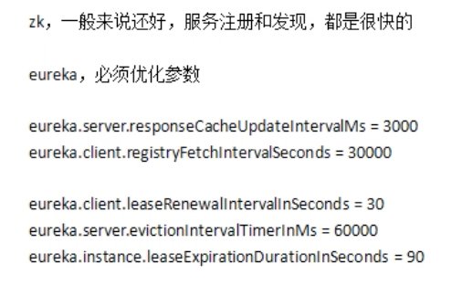

### 01、你们公司用的Dubbo？那你再额外说说Spring Cloud的核心架构原理？（上）

哪怕百万级用户，十万级日活，单块系统就不合适了。

### 01、你们公司用的Dubbo？那你再额外说说Spring Cloud的核心架构原理？（中）

### 01、你们公司用的Dubbo？那你再额外说说Spring Cloud的核心架构原理？（下）

我们的数据巴士用的 

Spring Boot 版本：2.2.1.RELEASE、

Spring Cloud 版本：Hoxton.RC1。

Spring Cloud的几个核心组件：

#### 服务注册中心

##### 服务注册

有一个路由表，会存储每个服务的相关信息，比如服务名字，服务的ip地址，端口号等。

##### 服务发现

订单系统会有一个服务发现，从服务注册中心拉取路由表，从路由表里就能知道 库存系统，仓储系统分，积分系统别部署在哪台机器上，使用的哪个端口。

#### 服务调用Feign

 订单系统使用Feign的包，通知Feign，底层会把请求转化成 http 请求，把请求发送给指定机器的端口上。

调用的接口使用了 @FeignClient注解，例如：

```java
@FeignClient(value="inventory-service")
public interface InventoryService extends InventoryApi {

}
```

会生成 JDK Proxy 动态代理类实例，实现了调用接口，就会通过 InvokeHandler 调用处理器分发远程调用。

RequestTemplate，构造 Request 实例。

Feign 或找 Ribbon，Ribbon 根据负载均衡算法返回给Fegin  一个请求地址。

#### 负载均衡Ribbon

比如订单系统下载订单后，库存系统部署在多个机器上，那么怎么决定扣减库存时去请求哪台机器呢？=》 Ribbon。 

Ribbon 会从路由信息表里读取到 库存系统的两台机器的信息，然后通过负载均衡算法，选出其中1台机器，然后再交给Feign，Feign再把请求发送出去。

#### 网关Zuul

1、授权认证，过滤请求。 

2、 前端来请求服务的时候，太多服务太多接口，记录起来会很复杂。这个时候其实可以对外暴露一个网关地址，前端所有请求直接访问网关地址。

3、灰度发布。比如说现在 库存系统有两个机器，其中一个机器上了新版本的代码，另一个机器还是用了老版本的代码。网关可以设置灰度发布，比如说为了测试新功能是否有问题，可以将90%的请求打到老版本的机器上，10%的请求打到新版本代码的机器上，待确认新版本的代码没有问题了，再切换成各个机器都是50%，50%的接收请求。

4、 性能监控，通过网关来检测每个接口有多少次请求，耗时，成功率。。。

5、系统日志

6、限流，比如你经过压测，每秒钟最多可承受1000个请求，但现在不知道什么原因，突然每秒钟过来2000个请求，这时网关就可以控制每秒最多发送1000个请求到后边的服务上。=》比如说，引入第三方jar包：spring-cloud-zuul-ratelimit，开箱即用。配置文件里添加类似配置：

```properties
zuul:
  routes:
    client-a:
      path: /client/**
      serviceId: client-a
  ratelimit: 
    #key-prefix: springcloud-book #按粒度拆分的临时变量key前缀
    enabled: true #启用开关
    repository: IN_MEMORY #key存储类型，默认是IN_MEMORY本地内存，此外还有多种形式
    behind-proxy: true #表示代理之后
    default-policy: #全局限流策略，可单独细化到服务粒度
      limit: 2 #在一个单位时间窗口的请求数量
      quota: 1 #在一个单位时间窗口的请求时间限制（秒）
      refresh-interval: 3 #单位时间窗口（秒）
      type: 
        - user #可指定用户粒度
        - origin #可指定客户端地址粒度
        - url #可指定url粒度
```

上面的配置是说，**3秒中内不能有超过2次的接口调用**，只需在zuul工程中加入pom依赖，修改配置文件，即可实现效果。

7、动态路由：开发某个服务，动态把请求路径和服务的映射关系热加载到网关中去，服务增减机器，网关自动热感知。=》 常见的解决方案就是：用一个mysql表，新增一个服务后，向这个表维护一条数据。代码从 配置文件和 db 两个地方读取 请求路径和服务的映射关系。

网关在收到请求后，会根据请求再路由到对应的服务。

##### 比如我们的数据巴士项目

1. 网关统一暴露的地址是：http://databus.yunzongnet.com

2. 网关zuul服务的配置文件里，会配置路由信息，如：

   ```properties
   zuul.routes.dcmq-service=/api/dcmq/**
   zuul.routes.dcdd-service=/api/dcdd/**
   zuul.routes.dchb-service=/api/dchb/**
   zuul.routes.dckf-service=/api/dckf/**
   ```

   

3. 然后 云雀数据平台调用 mysql 数据服务时，请求路径为：http://databus.yunzongnet.com/api/dcmq/query

4. 然后请求就会被 zuul 给路由到  dcmq-service 服务上，而这个 dcmq-service 就是我们部署的 mysql 数据服务的 应用名称（见 mysql服务的配置文件）：

      ```properties
spring.application.name=dcmq-service
      ```

如果让聊 Spring Cloud 的核心架构原理，其实就拿出来这几个核心组件来讲，现场画画图就可以了。


### 09_01、看过Dubbo源码吗？说说Dubbo的底层架构原理？（上）

面试官是想看看你的技术深度。

### 09_01、看过Dubbo源码吗？说说Dubbo的底层架构原理？（中）

  网络请求怎么发送呢？ =》 将数据序列化后，通过网络通信框架 netty

#### Dubbo消费端的一个整体的流程

1. 服务端提供接口服务，并暴露出去；

2. 消费端通过 new，然后调用 sayHello()方法时，底层会生成一个代理类的代理对象；

   ```java
   ClassPathXmlApplication context  = new ClassPathXmlApplicationContext( ...);
   // 获取远程服务代码
   DemoService service = (DemoService)context.getBean("demoService");
   // 执行远程方法
   String hello = demoService.sayHello("world");   // 其实就是调用代理对象的方法
   System.out.println(hello);
   ```

3.  然后代理对象执行方法的时候，底层会有一系列的组件操作，包括负责均衡选择机器，选择dubbo协议，选择网络通信框架netty，序列化数据，然后把这个请求给你发送出去。

#### dubbo底层架构原理


### 10、咱们来聊点深入的，说说Dubbo底层的网络通信机制原理！

除了上面那个底层架构原理图，你要能说出来，画出来外，网络通信机制这块 还有可能会深问你。

#### Dubbo网络通信原理

**以netty来举例，底层是基于nio来实现的。**

如果有人问你 dubbo网络通信原理，其实就是要你说出 netty 底层基于 nio 来实现的这套通信机制。

  

### 11、Dubbo框架从架构设计角度，是怎么保证极高的可扩展性的？

官方有文档。基于 SPI机制 去进行扩展。

第一点：核心组件全部接口化，


### 13、如果让你设计一个RPC框架，网络通信、代理机制、负载均衡等该如何设计？

其实是想让你站在系统设计的角度上，来考虑一下，到底要如何设计一个RPC框架，如何来考虑。

1. 动态代理：比如消费者和提供者，其实都是需要一个实现某个接口的动态代理的，RPC框架的一切的逻辑细节，都是在这个动态中实现的。
2. 调用动态代理方法之后，此时就应该先干一个事情，通过 Cluster 层的一些组件，从本地缓存的服务注册表里获取到要调用的服务的机器列表（这里就需要一个服务注册中心，用什么技术来实现）；
3. 接下来，就需要有负载均衡，选出来一台机器，端口号，调用哪个  interface 的哪个方法，要把这些信息交给协议层；
4. 把数据组织一下，序列化（比如将复杂的请求数据序列化成二进制的字节数组），底层常用 netty 网络通信框架，来发送请求。这里稍微讲一下 netty 基于nio的网络通信机制；
5. 收到请求后，反序列化，解析。解析后就知道了要调用本地哪个interface的哪个方法，然后通过反射就可以调用本地方法了。
6. 然后再返回响应。

### 14_01、平时除了使用外，有研究过Spring Cloud的底层架构原理么？（上）

### 14_02、平时除了使用外，有研究过Spring Cloud的底层架构原理么？（下）

将这几个核心组件分别讲讲。

#### Eureka

**两大核心功能：服务注册于发现，心跳故障。**

eureka里会有一个服务注册表。

各个服务可以通过参数来配置多长时间从eureka拉取一次，比如每隔30秒拉取一次。

这里边有一个多级缓存。

**先从ReadOnly缓存**找（大部分场景都是服务注册表没有修改，只是拉取） =》**ReadWrite缓存** =》**服务注册表**

这样设计的目的是为了避免多个服务同时读写，频繁加读写锁，并发冲突，造成的性能问题。

##### 新增了一个服务

这时，如果又新增一个服务，服务注册表会拉取到最新的，然后立马同步给 ReadWrite缓存。

`注意，可能这一段时间内，各个服务拉取到的还是旧的缓存。`

那么 ReadWrite 和 ReadOnly 缓存是什么时候会同步的呢？ => `通过后台的线程，定时去同步`，这里也可以通过配置时间参数来控制同步的时间间隔。

##### 挂掉了一个服务

也是会有一个后台线程，会定时去检测每个服务的最后一次心跳时间，比如如果超过了 90秒还没有心跳，心跳时间仍然没有更新，则认为这个服务就挂掉了。

#### Ribbon+Feign

对外发布的接口，其实就是普普通通的 http 接口。

feign 对接口打了一个注解，他一定会针对这个接口生成动态代理 

=》然后调用方法的时候，肯定会在底层生成 http协议格式的请求

=》使用 ribbon 从本地的 eureka 注册表的缓存里获取出来机器列表

=》然后对那台机器发送 http 请求过去接口。

#### Zuul

配置一下不同的请求路径和服务的对应关系，你的请求到了网关，他就会匹配到你的服务，然后就直接把Http请求转发给那个服务的某个机器。

### 15、从底层实现原理的角度，对比一下Dubbo和Spring Cloud的优劣！

底层架构有很多类似之处。

Dubbo，rpc的性能比HTTP的性能更好，并发能力更强，经过深度优化的RPC服务框架，性能和并发能力是更好一些。

dubbo之前的定位，就是一个单纯的服务框架而已，不提供任何其它的功能。

但为什么 Spring cloud，中小型公司用的特别多？=> 全家桶的概念，组件齐全，功能齐全。网关直接提供了，分布式配置中心，授权认证，服务调用链路追踪，hystrix可以做资源隔离，熔断降级，消息中间件框架等。

**胜就胜在功能齐全，中小型公司开箱即用，直接满足系统的开发需求。**

现在又慢慢演变为  Spring Cloud Alibaba，越来越多的 alibaba的组件也融入了进来。

### 16、

该看 第16集了。

### 18、画图阐述一下你们的服务注册中心部署架构，生产环境下怎么保证高可用？

集群部署，将 eureka 部署2台，3台机器。 

#### CAP理论

C：一致性（Consistency）

A：可用性（Availability）

P：分区容错性（Partition tolerance）。

eureka 保证了 CAP 理论中的 AP。

#### 什么是 eureka的AP性

在eureka中注册过的服务会定时向eureka发送心跳。当网络故障/网络延迟/服务宕机就不会再向eureka发送心跳，eureka从接不到心跳的那一秒开始算起，（90秒）之后，会直接把这个服务给剔除掉。

因为provider的机房停电了，大面积的provider都无法向eureka发送心跳，90秒之后还是没有接收到心跳，
eureka就不会再剔除任何一个服务（也就是说会把全部的服务都保留下来)(这个就是eureka的AP性）。

#### 为什么eureka不会剔除大量的服务

AP：只保证了服务的可用性，不保证数据的一致性。

```txt
   如果eureka把所有的服务全部剔除，当consumer进行访问调用的发现eureka中并没有任何服务了，整个项目都会处于瘫痪状态，整个客户端的体验就会非常差，也就是说相当于报错500！
   如果当大面积服务都没有心跳，eureka不剔除的情况下，consumer进行访问调用的时候依然可以找到所注册服务，然后就可以直接获取到数据，这些数据可能不是最新的数据！
```

ZooKeeper 选择了 **C**，就是尽可能的保证数据一致性，某些情况下可以牺牲可用性。

Eureka 则选择了 **A**，所以 Eureka 具有高可用性，在任何时候，服务消费者都能正常获取服务列表，但不保证数据的强一致性，消费者可能会拿到过期的服务列表。

### 19、你们系统遇到过服务发现过慢的问题吗？怎么优化和解决的？

eureka，必须优化的参数：

让服务尽快的拉取服务注册表。



#### 1、服务向eureka发送心跳的间隔

心跳间隔：将原来的30秒调整为3秒，提速10倍。

leaseRenewalIntervalInSeconds: 3 

#### 2、服务向eureka拉取路由信息的间隔

将原来的30秒改为3秒。

#### 2、eureka检查心跳的间隔

这个是在 eureka 里配置的，eureka里的后台线程 每隔6s检查一下每隔服务的心跳时间


#### 3、判断没有发送心跳的最大间隔

如果发现这个服务超过9秒都没有发送心跳了，这时就把这个挂掉的服务路由信息给去掉。


####  4、ReadWrite缓存向 ReadOnly缓存定时同步 

将这个间隔由30秒改为 3秒。


#### 5、同时，还可以关闭eureka的自我保护机制

这个自我保护机制，主要的实现思路就是 eureka如果发现达到一定比率的服务都有故障了，他就认为这是网络出了故障，然后就会不会下线这些服务。=》这个功能有bug，尽量不要用。

**这样下来，整个服务发现的时效性就到了秒级。** 

### 23、如果网关需要抗每秒10万的高并发访问，你应该怎么对网关进行生产优化？

#### zuul网关部署的是什么配置的机器

=》部署8核16G，对网关路由请求的转发，每秒扛几千个请求是不成问题的。部署几十台 zuul 网关机器。

=》如果直接用 32核64G，可能一秒钟扛个小几万请求都可以，这个时候就要几台网关机器就可以了。

=》如果每秒是1万请求，8核16G的机器，部署zuul 网关，可能5台机器就够了。

前端 =》LVS 负载均衡 =》nginx =》 zuul。

#### 生产级的网关该如何优化

要做一些二次开发：

1、授权认证；

2、性能监控：每个接口的耗时，成功率，QPS；

3、系统日志；

4、限流

5、灰度发布；

6、动态路由 =》从db中加载路由表，然后定时刷新

6、缓存

### 25、如果需要部署上万服务实例，现有的服务注册中心能否抗住？如何优化？

https://apppukyptrl1086.pc.xiaoe-tech.com/detail/v_5d46b0a205f7c_5AbrAdmP/3?from=p_5d3110c3c0e9d_FnmTTtj4&type=6&parent_pro_id=

### 33_01、你们生产环境的服务是怎么配置超时和重试参数的？为什么要这样配置？（01）

面试官可能会问你：多个服务之间相互调用的时候，会不会出现调用的超时，每个服务的超时时间是多少？超时之后是否进行重试，重试几次？

现象：spring cloud系统经常在第一次请求的时候，会出现一个500， internal error。

### 33_02、你们生产环境的服务是怎么配置超时和重试参数的？为什么要这样配置？（02）

原因：每个服务第一次被请求的时候，他会去初始化 Ribbon 的组件，初始化这些组件需要耗费一定的时间，所以很容易导致出现500。

优化：解决ribbon的懒加载，让每个服务启动的时候就直接初始化 Ribbon 相关的组件。

对应配置-各个服务里：

```true
ribbon:
 eager-load:
  enabled: true
```

zuul里：

```
zuul:
  ribbon:
    eager-load:
      enabled: true
```


### 33_03、你们生产环境的服务是怎么配置超时和重试参数的？为什么要这样配置？（03）

线上的服务，每个服务部署上线的时候，一般来说都需要配置相关的超时时间，还有重试次数。

订单服务 =》 积分服务、库存服务、仓储服务

订单服务对于其他服务的调用，一般来说限制在多长时间就必须认为是超时了？如果超时之后，如何进行重试？

积分服务部署了2台机器，机器1和机器2。

订单服务在一次请求中请求机器1的时候，超过1秒钟，超时了；此时需要进行重试，对积分服务当前的这台机器1重试几次？如果说机器1还不行，是否可以重试一下积分服务的机器2？

配置如下（从ConnectTimeout开始）：

```properties
ribbon:
  eager-load:
    enabled: true
  ConnectTimeout: 1000
  ReadTimeout: 1000
  OkToRetryOnAllOperations: true
  // 当前的机器重试1次
  MaxAutoRetries: 1
  // 当前的机器重试不行，就重试下一个机器1次
  MaxAutoRetriesNextServer: 1
```

还有就是服务向eureka发送心跳的间隔、服务向eureka拉取路由的间隔、eureka检查心跳的间隔。 =》详见第 19。

### 34、如果出现服务请求重试，会不会出现类似重复下单的问题？

幂等性。

### 35、对于核心接口的防重幂等性，你们是怎么设计的？怎么防止重复下单问题？

该 35 集了。