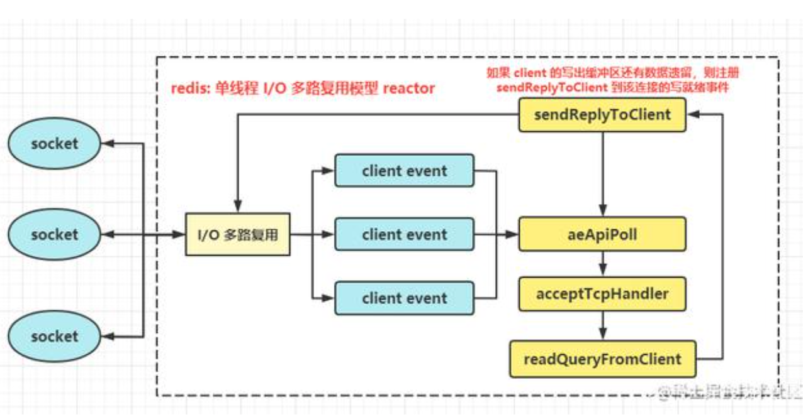

### StringBuilder和StringBuffer区别

#### 区别一：线程安全

StringBuffer：线程安全，因为StringBuffer的所有公开方法都是synchronized修饰的，而StringBuilder并没有synchronized修饰。

#### 区别二：缓存区

StringBuilder代码段：

```java
@Override
public String toString() {
  // Create a copy,don't share the array
  return new String(value,0,count);
}
```

StringBuffer代码段：

```java
private transient char[] toStringCache;
 
@Override
    public synchronized String toString() {
        if (toStringCache == null) {
            toStringCache = Arrays.copyOfRange(value, 0, count);
        }
        return new String(toStringCache, true);
    }
```

可以看出，StringBuffer每次获取toString都会直接使用缓存区的toStringCache值来构造一个字符串。

而StringBuilder则每次都需要复制一个字符串，再构造一个字符串。

#### 区别三：性能

既然StringBuffer是线程安全的，他的所有公开方法都是同步的，StringBuilder是没有对方法加锁同步的，所以StringBuilder的性能要远大于StringBuffer。

#### 总结

StringBuffer是线程安全的，适用于在多线程操作；单线程场合则StringBuilder更适合。


### 开发一个提供给别人使用的SDK?

### Restful的 PUT与POST区别？

例如，eshop项目里，ScheduleApi 里的那些请求为什么都用PUT接收？

PUT和POST都可以创建和修改资源，它们的区别是什么？

- 在更新资源时，PUT和POST基本相同；
- 在创建资源时，PUT可以指定资源路径，POST无法指定资源路径。

比如：

/user/create，每次调用它都会新建一个用户，这时可以用POST；

/user/update/{id}，PUT方法更加关心一个具体资源对应的URI，比如更新当前用户信息，这里可以用PUT。

当以更新的形式来修改某一具体资源时，如何判断用PUT还是POST呢？

很简单，如果该更新对应的URI多次调用的结果一致，则PUT:

比如：更新用户信息接口，/user/update/{id}，每次更新提交相同内容时，结果都一致，则用PUT；

每次更新提交相同内容最终的结果不一致时，则用POST。

举个常见的例子，一个接口的功能是将当前余额减一个值，每次提交该值为100，接口如下：

/amount/deduction，调用一次，你的余额-100，调用两次，余额-200，这个时候就用POST。


### ORM

#### 什么是ORM

对象关系映射。

Object：就是 javaBean；

Relational：关系，二维表，数据库中的表；

Mapping：映射，对象中的属性 与表中的字段存在对应关系。

#### 主流的ORM框架

- JPA：Java Persistence API，JPA通过JDK 5.0注解或XML描述对象－关系表的映射关系（只有接口规范）；
- Hibernate： 最流行额ORM框架，通过对象-关系映射配置，可以完全脱离底层SQL;
- Mybatis：apache的一个开源项目iBatis，支持SQL查询，存储过程和高级映射的优秀持久层框架；
- Apache DBUtils，Spring JDBCTemplate。

##### Hibernate编写流程概要

1. 创建数据库和表；
2. 导入hibernate的jar包；
3. 编写核心配置文件hibernate.cfg.xml，配置获得数据源链接、隐射文件等参数；
4. 编写映射文件 hibernate mapping （*.hbm.xml）;
5. 使用api测试。

详见：https://blog.csdn.net/uotail/article/details/81813210


#### k8s

一句话说：就是管理docker容器的一个玩意。

具体的说：能把n个docker容器组装到一起，打包弄成一个整体俗称pod，然后可以在各个物理节点上创建这个pod。

其实对于这个pod，k8s可以进行弹性伸缩，只需简单配制一下就能创建n个一摸一样的pod；也可以对这n个pod进行负载均衡，也可以对这n个pod的运行资源进行限制比如每个pod限制几个cpu多少的内存等等。

#### 线上CPU 100%后，怎么解决

找到是哪个进程后，再找出这个进程里边占用最高的那个线程，拿出进程之后就转换为16进制的一个，然后再用jstack，打出它具体的堆栈，定位到具体的哪一行代码

1、找出占用CPU最高的进程

执行top -c，按P，按照 CPU占用率排序：


2、找出这个进程占用CPU最高的线程

top -Hp 30120

这个显示的pid是十进制的，需要转化为 十六进制。

3、导出进程快照

jstack -l 3033 > ./3033.stack

4、执行grep命令，看那个线程做了什么

```bash
cat 3033.stack |grep 'bda' -C 8
```

从而定位到问题。

详细参考：https://www.cnblogs.com/xichji/p/11713300.html


Mysql

Redis的集群

Dubbo的调用链路

常用的设计模式

分布式锁

Spring Cloud、 bus

---------------

需要充电的：

1. java乐观锁和悲观锁的区别

2. synchronized 偏向锁 轻量级锁

    

### Java线程的几种状态

https://blog.csdn.net/xyzyhs/article/details/121417200

- NEW-新建
- RUNNABLE-可运行
- BLOCKED-阻塞
- WAITING-等待
- TIMED_WAITING 等待（有时限）
- TERMINATED-终结


### 并发编程系列——wait原理的讨论

https://blog.csdn.net/java_lyvee/article/details/110996764?spm=1001.2014.3001.5501

**synchronized**关键字是倒序唤醒，但是如果你使用**ReentrantLock**那么则是正序唤醒；

状态：没有看。

### redis的线程模型

redis 内部使用文件事件处理器 file event handler。这个文件事件处理器是单线程的，所以 redis 才叫做单线程的模型。


文件事件分派器从队列中获取socket，交给连接应答处理器。

**连接应答处理器**会创建一个与客户端能够通信的socket01，并将该 socket01 的 AE_READABLE 事件与**命令请求处理器**关联。

假设此时客户端发送了一个 set key value 请求，

redis6.0之后的版本抛弃了单线程模型的这一设计，原本使用单线程运行的redis也开始选择性的使用多线程模型。

redis的多线程只是用来处理网络数据的读写和协议解析，执行命令仍然是单线程。

### redis的主要数据类型

- String
- Hashes
- Set：无序集合，自动去重。
- Lists
- Sorted Sets

### Redis过期策略

#### 定期删除

#### 惰性删除

#### 内存淘汰机制

allkeys-lru：

当内存不足以容纳新写入的数据时，在键空间中，移除最近最少使用的key（这个是最常用的）。

### Redis如何才能做到高可用

Redis的高可用架构，叫做 failover 故障转移，也可以叫做主备切换。

master node 在故障时，自动检测，并将某个 slave node 自动切换为 master node 的过程，叫做主备切换。这个过程，实现了redis的主从架构下的高可用。

### Redis哨兵集群实现高可用

- 集群监控
- 消息通知
- 故障转移
- 配置中心

### 哨兵的核心知识

- 哨兵至少需要3个实例，来保证自己的健壮性；
- 哨兵+Redis主从的部署架构，是不保证数据零丢失的，只能保证redis集群的高可用性。

### Redis哨兵主备切换的数据丢失问题

- 异步复制导致的数据丢失；
- 脑裂导致的数据丢失

#### 数据丢失问题的解决方案

```bash
min-slave-to-write 1
min-slave-max-tag 10
```

表示，要求至少有1个slave，数据复制和同步的延迟不能超过10秒。

如果说一旦所有的slave，数据复制和同步都超过了10秒，那么这个时候，master就不会再接收任何请求了。

### Redis的持久化有哪几种方式？

#### RDB

#### AOF

#### RDB和AOF到底该如何选择

### 缓存雪崩

缓存雪崩的事前事中事后的解决方案如下：

- 事前：Redis高可用，主从+哨兵，避免全崩溃；
- 事中：本地cache缓存+ hystrix限流&降级，避免mysql被打死；
- 事后：redis持久化，一旦重启，自动从磁盘上加载数据，快速恢复缓存数据。

### 缓存穿透

假设一秒5000个请求，结果其中4000个请求都是黑客发出的恶意攻击。

黑客发出的那4000个攻击，缓存中查不到，每次你去数据库中里查，也查不到。

解决方式很简单：每次系统A只要从数据中没查到，就写一个空值到缓存里去，比如： set -999 UNKNOW。

然后设置一个过期时间，这样下次有相同的key来访问的时候，在缓存失效之前，都可以直接从缓存中取数据。

### 缓存击穿

就是说某个key非常热点，访问非常频繁，处于集中式高并发访问的情况，当然这个key在失效的瞬间，大量的请求就击穿了缓存，直接请求数据库。

不同场景下的解决方式：

- 若缓存的数据基本不会发生更新的，则可尝试将该热点数据设置为永不过期；

- 若缓存的数据更新不频繁，且缓存刷新的整个流程耗时较少的情况下，则可以采用基于Redis、zookeeper等分布式中间件的分布式互斥锁，或者本地互斥锁，以保证仅少量的请求能请求数据库并重新构建缓存，其余线程则在锁释放后能访问到新内存。

- 若缓存的数据更新频繁或者在缓存刷新的流程耗时较长的情况下，可以利用定时线程在缓存过期前主动地重新构建缓存或者延后缓存的过期时间，以保证所有的请求能一直访问到对应的缓存。

  

### JVM

#### JVM有哪些垃圾回收算法

https://apppukyptrl1086.pc.xiaoe-tech.com/detail/i_5d11dd43d099f_U4Z2ECuX/1?from=p_5d0ef9900e896_MyDfcJi8&type=6&parent_pro_id=

**新生代垃圾回收算法：复制算法**
   1.两块内存区域，然后对正在使用的那块内存区域将垃圾对象标记出来（Yong GC 会采用复制算法，从GC Roots（方法的局部变量、类的静态变量）开始追踪，标记出来存活的对象）
   2.然后将存活的对象转移到另一块内存区域中，紧凑的排列在一起，保证没有内存碎片。
   3.但是这样经常有一半的内存区域利用不上，所以就对这个算法进行了优化。
 优化后的：
   1.把Eden区的存活对象都一次性转移到空着的Survivor区里；
   2.接着Eden区就会被清空，然后再次分配新对象到Eden区。

   什么情况下新生代里的对象会进入老年代

老年代垃圾回收算法：标记整理算法
   1.首先标记出来老年代当前存活的对象，这些对象可能是东一个西一个
   2.接着会让这些存活对象在内存里进行移动，把存活的对象都挪到一起，避免垃圾回收过后出现过多的内存碎片；
   3.再一次性的把垃圾对象都回收掉。
大家要注意一点，这个老年代的垃圾回收算法的速度至少比新生代的垃圾回收算法的速度要慢10倍。

#### 进入老年代的几个条件

1、年轻代躲过15次；

2、建的大对象超过了JVM设置的参数值；

3、一次YongGC过后，存活的对象太多了，导致Survivor区域放不下了；

4、可能几次Yong GC过后，Survivor区域中的对象占用超过了50%的内存，此时会判断年龄1+年龄2+年龄n对象的总和超过了Survivor区域的50%，此时年龄N及年龄N以上的对象都进入老年代，这就是动态年龄判定规则。

#### 触发老年代的几个条件

1、老年代自身有一个阈值，有一个JVM参数可以控制，一旦老年代内存使用达到这个阈值，就会触发Full GC，一般建议调大一点，比如92%；

2、在执行Yong GC 之前，如果判断发现老年代可用空间小于了历次Yong gc过后存入老年的平均对象大小的话，那么就会在Yong GC之前触发Full GC，先回收掉一批老年代对象，然后再执行Yong GC；

3、如果Yong gc过后存活的对象太多，survivor区域也放不下，就要进入老年代，此时老年代也放不下，就会触发Full GC，回收掉老年代一些对象，再把这些存活的对象放入老年代中。

#### JVM年轻代垃圾回收器ParNew

1. 新生代垃圾回收器ParNew采用`多线程垃圾回收机制`，可以充分利用线上机器多个CPU的优势。

2. ParNew在合适的时机执行Yong GC的时候，会把系统程序的工作线程全部停掉，禁止程序继续运行创建新的对象；
3. 然后自己就用多个垃圾回收线程去进行垃圾回收，回收的机制和算法就是上面总结的复制算法。
4. 可以通过使用"-XX:+UseParNewGC"选项，JVM启动之后对新生代进行垃圾回收的，就是ParNew垃圾回收器了。

#### JVM老年代垃圾回收器CMS

采用的是标记清理算法。其实非常简单，就是之前文章里讲过的标记方法区标记出那些对象是垃圾，然后把这些垃圾对象清理掉。

##### 如果Stop the World然后垃圾回收会如何？

如果停止一切工作线程，然后慢慢的去执行"标记-清理"算法，会导致系统卡死时间过长，很多响应无法处理。

所以CMS垃圾回收器采用的是`垃圾回收线程和系统工作线程尽量同时执行的模式来处理的`。

##### CMS如何实现系统一边工作的同时进行垃圾回收

CMS在执行一次垃圾回收的过程一共分为4个阶段：

1. 初始标记；=》系统的工作线程会全部停止，
2. 并发标记；=》这个阶段会让系统线程可以随意创建各种新对象，继续运行（这个阶段就是对所以老年代对象进行GC Roots 追踪，其实是最耗时的）
3. 重新标记；=》系统的工作线程会停止下来。这个阶段需要会第2阶段生成的存活对象和重新变为的垃圾对象进行标记；
4. 并发清理。=》系统会继续运行。=》这个阶段也很耗时，因为要对对象进行清理，但是他也是跟系统程序并发运行的，所以其实也不影响系统的执行。

所以大家看完CMS的垃圾回收机制之后，就会发现，他已经尽可能的进行了性能优化。

最耗时的第二阶段和第四阶段，其实是要对老年代对象进行GC Roots追踪，然后就是对各种垃圾对象从内存里清理掉，这是很耗时的，但是都是和程序并发运行的，所以这两个最耗时的二阶段对性能影响不大；

只有第一个和第三个阶段是需要"Stop the World"的，但是这两个阶段，都是简单的标记而已，速度非常的快，所以基本上对系统运行影响也不大。

#### Jstat、jmap、MAT

##### jstat

```
jstat -gc 140

jstat -gc 140 1000 10
```

##### jmap

```
jmap -heap 140   =》 效果跟 jstat -gc 140 差不多，还没有jstat的全

jmap -histo 140 | more   => 查看系统运行时的对象分布

jmap -dump:live,format=b,file=dump.hprof 140 =>生成堆内存快照
```

这个堆内存快照是个二进制文件，不能直接打开。它把这一刻堆内存里所有的对象的快照放到文件里去了，供你后续分析。

##### MAT

memory analyzer tool，是一种快速的，功能丰富的 Java 堆内存分析工具。能帮你找到内存泄露和减少内存消耗。

有一个 Dominator Tree 功能，以占用总内存百分比的形式列举出了所有的实例对象，可以用来发现大内存对象。

redis的IO多路复用：

redis 处理快，不单单因为它是个单线程纯内存系统，还有它采用了 Reactor 模型，使用 I/O 多路复用来实现对外部请求的处理，减少网络连接、读写等待时间。使其在网络 I/O 操作中能并发处理大量的客户端请求，实现高吞吐率，高并发。




redis 6.0的多线程版本I/O模型：


### redis支持的数据结构

1、String
2、Hash
   hset person name zhangsan
   hset person age 30
   hset person id 12
   hget person name
3、List 有序,可以重复
   lpush mylist 1
   lpush mylist 2
   lpush mylist 3
   lpush mylist 3
   lrange 0 -1  => 0 是开始位置，-1是结束位置，即查看所有
4、Set 无序，自动去重
   sadd myset 1
   sadd myset 2
   sadd myset 3
   smembers myset => 查看全部元素
   sadd myset 1 => 返回0，执行添加失败（即自动去重）
5、Sorted Sets 排序的set，去重，可以排序
   zadd board 85 a
   zadd board 70 b
   zadd board 60 c
   zadd board 90 d
   zrevrange board 0 2 => 获取排名前3的用户 

#### Redis持久化

redis-server/redis-cli   **5.0.8 版本**

- RDB：RDB持久化机制，是对Redis中的数据执行周期性的持久化；
- AOF：AOF机制对每条写入命令作为日志，以 append-only 的模式写入一个日志文件中，在Redis重启的时候，可以通过回放AOF日志中的写入指令来重新构建整个数据集。

`redis从4.0开始，就默认提供了混合持久化的机制（同时使用 RDB + AOF）`。

混合持久化的数据恢复和AOF持久化过程是一样的，只需要把 appendonly.aof 文件放到redis的根目录下，在redis启动时，只要开启了AOF持久化，redis就会自动加载并恢复数据。

那么在 Redis重启的时候，会使用 AOF来重新构建数据，因为AOF中的数据更加完整。

##### RDB优缺点

- RDB 会生成多个数据文件，每个文件代表了某一时刻 redis 中的数据，这种多个数据文件的方式，非常适合做冷备；（这里的冷备可以理解为将已生成的文件拷贝到其他机器或者云服务器上。）
- RDB 对 Redis对外提供的读写服务影响非常小，可以让Redis保持高性能。因为Redis主进程只需要fork一个子进程，让子进程执行磁盘IO操作来进行RDB持久化即可；
- 相对于AOF 持久化机制来说，直接基于 RDB 数据文件来重启和恢复 Redis进程，更加快速；
- 如果想要在Redis故障时，尽可能减少丢失数据，那么RDB 没 AOF 好。一般来说，RDB数据快照文件，都是每隔5分钟或者更长时间生成一次，这个时候一旦redis进程宕机，那么会丢失最近5分钟的数据。
- RDB每次在fork子进程来执行RDB数据快照的时候，如果数据文件特别大，可能会导致对客户端提供的服务暂停数毫秒，甚至数秒。

##### AOF优缺点

- AOF 可以更好的保护数据不丢失，一般AOF会每隔1秒钟，通过一个后台线程执行 fsync 操作，最多丢失1秒的数据；
- AOF 是以 append-only 模式写入，所以没有任何磁盘寻址的开销，写入性能非常高；
- AOF有一个 rewrite 机制，这个特性非常适合做灾难性的误删除的紧急恢复。比如某人不小心用fulshall 命令清空了所有数据，只要这个时候后台 rewrite 还没有发生，那么就可以立即拷贝AOF文件，将最后一条 flushall 命令给删了，然后再将AOF文件放回去，就可以通过恢复机制，自动恢复所有数据。
- AOF这种较为复杂的基于命令日志/merge的方式，比基于RDB每次持久化一份完整的数据快照文件的方式，更加脆弱一些。rewrite 过程有可能会导致 bug。因此每次rewrite的时候，并不是基于旧的指令日志进行merge，而是基于当时内存中的数据进行指令的重新构建，这样健壮性会好很多。

##### RDB和AOF到底该如何选择

- 不要仅仅使用RDB，那样会丢失很多数据；
- 也不要仅仅使用AOF，有两个原因：第一通过AOF做冷备，没有RDB做冷备的恢复速度快；第二RDB每次简单粗暴生成数据快照，更加健壮，可以避免AOF这种复杂的备份和恢复机制的bug；
- Redis支持同时开启两种持久化的方式。我们可以综合使用这两种持久化机制。使用AOF来保证数据不丢失，做为数据恢复的第一选择；用RDB做不同程度的冷备，在AOF文件都丢失或损坏不可用的时候，还可以使用RDB来进行快速的数据恢复。

##### 结合我们公司的线上环境使用情况

运维把 RDB 和 AOF 给关了，说 RDB 在数据量较大的时候，容易造成 IO 堵塞。

我们使用 哨兵模式。哨兵集群（3个节点） + redis 主从（1主2从）的部署架构。

当master节点发生故障后，故障转移，slave 会自动切换为 master。

##### 在主备切换的时候的数据丢失问题

- 异步复制导致的数据丢失
- 脑裂导致的数据丢失

解决方案：

进行如下配置：

```bash
min-slaves-to-write 1
min-slaves-max-lag 10
```

表示要求，至少有1个 slave 能写，数据复制和同步的 延迟不能超过10秒，超过10秒的话，就直接拒绝客户端的写请求。

### 如何保证消息不被重复消费?或者说，如何保证消息消费的幂等性?

Kafka 实际上有个 offset 的概念，就是每个消息写进去，都有一个 offset，代表消息的序号，然后 consumer 消费 了数据之后，每隔一段时间(定时定期)，会把自己消费过的消息的 offset 提交一下，表示“我已经消费过了，下 次我要是重启啥的，你就让我继续从上次消费到的 offset 来继续消费吧”。 

但是凡事总有意外，比如我们之前生产经常遇到的，就是你有时候重启系统，看你怎么重启了，如果碰到点着急 的，直接 kill 进程了，再重启。这会导致 consumer 有些消息处理了，但是没来得及提交 offset，尴尬了。重启之 后，少数消息会再次消费一次。 

其实重复消费不可怕，可怕的是你没考虑到重复消费之后，**怎么保证幂等性**。 

`幂等性，通俗点说，就一个数据或者一个请求，给你重复来多次，你得确保对应的数据是不会改变的，不能出错。 `

所以第二个问题来了，怎么保证消息队列消费的幂等性? 其实还是得结合业务来思考，我这里给几个思路: 

其实还是得结合业务来思考，我这里给几个思路: 

- 比如你拿个数据要写库，你先根据主键查一下，如果这数据都有了，你就别插入了，update 一下好吧。
-  比如你是写 Redis，那没问题了，反正每次都是 set，天然幂等性。 
- 比如你不是上面两个场景，那做的稍微复杂一点，你需要让生产者发送每条数据的时候，里面`加一个全局唯一 的 id`，类似订单 id 之类的东⻄，然后你这里消费到了之后，先根据这个 id 去比如 Redis 里查一下，之前消费 过吗?如果没有消费过，你就处理，然后这个 id 写 Redis。如果消费过了，那你就别处理了，保证别重复处 理相同的消息即可。
-  比如基于数据库的`唯一键`来保证重复数据不会重复插入多条。因为有唯一键约束了，重复数据插入只会报错， 不会导致数据库中出现脏数据。 

### 如何保证消息的可靠性传输?或者说，如何处理消息丢失的问题?

#### kafka

##### 消费端丢数据

唯一可能导致消费者弄丢数据的情况，就是说，你消费到了这个消息，然后消费者那边自动提交了 **offset**，让 Kafka 以为你已经消费好了这个消息，但其实你才刚准备处理这个消息，你还没处理，你自己就挂了，此时这条消 息就丢咯。 

那么只要关闭自动提交 offset，在处理完之 后自己手动提交 offset，就可以保证数据不会丢。但是此时确实还是可能会有重复消费，比如你刚处理完，还没提 交 offset，结果自己挂了，此时肯定会重复消费一次，自己保证幂等性就好了。 

#### **Kafka** 弄丢了数据 

这块比较常⻅的一个场景，就是 Kafka 某个 broker 宕机，然后重新选举 partition 的 leader。大家想想，要是此 时其他的 follower 刚好还有些数据没有同步，结果此时 leader 挂了，然后选举某个 follower 成 leader 之后，不 就少了一些数据?这就丢了一些数据啊。 

生产环境也遇到过，我们也是，之前 Kafka 的 leader 机器宕机了，将 follower 切换为 leader 之后，就会发现说 这个数据就丢了。 

所以此时一般是要求起码设置如下 4 个参数: 

- 给 topic 设置 replication.factor 参数:这个值必须大于 1，要求每个 partition 必须有至少 2 个副本。 
- 在 Kafka 服务端设置 min.insync.replicas 参数:这个值必须大于 1，这个是要求一个 leader 至少感知到 有至少一个 follower 还跟自己保持联系，没掉队，这样才能确保 leader 挂了还有一个 follower 吧。
- 在 producer 端设置 acks=all :这个是要求每条数据，必须是写入所有 **replica** 之后，才能认为是写成功 了。
- 在 producer 端设置 retries=MAX (很大很大很大的一个值，无限次重试的意思):这个是要求一旦写入失 败，就无限重试，卡在这里了。 

我们生产环境就是按照上述要求配置的，这样配置之后，至少在 Kafka broker 端就可以保证在 leader 所在 broker 发生故障，进行 leader 切换时，数据不会丢失。 

#### 生产者会不会弄丢数据? 

如果按照上述的思路设置了 acks=all ，一定不会丢，要求是，你的 leader 接收到消息，所有的 follower 都同步 到了消息之后，才认为本次写成功了。如果没满足这个条件，生产者会自动不断的重试，重试无限次。 

### 如何保证消息的顺序性? 

我举个例子，我们以前做过一个 mysql binlog 同步的系统，压力还是非常大的，日同步数据要达到上亿，就是 说数据从一个 mysql 库原封不动地同步到另一个 mysql 库里面去(mysql -> mysql)。常⻅的一点在于说比如大 数据 team，就需要同步一个 mysql 库过来，对公司的业务系统的数据做各种复杂的操作。 

你在 mysql 里增删改一条数据，对应出来了增删改 3 条 binlog 日志，接着这三条 binlog 发送到 MQ 里面，再 消费出来依次执行，起码得保证人家是按照顺序来的吧?不然本来是:增加、修改、删除;你愣是换了顺序给执行 成删除、修改、增加，不全错了么。 

```
本来这个数据同步过来，应该最后这个数据被删除了;结果你搞错了这个顺序，最后这个数据保留下来了，数据同
步就出错了。
```

**Kafka** 

比如说我们建了一个 topic，有三个 partition。

- 生产者在写的时候，其实可以指定一个 key，比如说 我们指定了某个订单 id 作为 key，那么这个订单相关的数据，一定会被分发到同一个 partition 中去，而且这 个 partition 中的数据一定是有顺序的。
- 消费者从 partition 中取出来数据的时候，也一定是有顺序的。 
- 到这里，顺序还是 ok 的，没有错乱。接着，我们在消费者里可能会搞多个线程来并发处理消息。  因为如果消费者 是单线程消费处理，而处理比较耗时的话，比如处理一条消息耗时几十 ms，那么 1 秒钟只能处理几十条消 息，这吞吐量太低了。而多个线程并发跑的话，顺序可能就乱掉了。 

##### 解决方案

kafka

- 一个 topic，一个 partition，一个 consumer，内部单线程消费，单线程吞吐量太低，一般不会用这个。
- 写 N 个内存 queue，具有相同 key 的数据都到同一个内存 queue，然后对于 N 个线程，每个线程分别消费 一个内存 queue 即可，这样就能保证顺序性。 

### 大量消息在 **mq** 里积压了几个小时了还没解决 

几千万条数据在 MQ 里积压了七八个小时，从下午 4 点多，积压到了晚上 11 点多。这个是我们真实遇到过的一个 场景，确实是线上故障了，这个时候要不然就是修复 consumer 的问题，让它恢复消费速度，然后傻傻的等待几个 小时消费完毕。这个肯定不能在面试的时候说吧。 

一个消费者一秒是 1000 条，一秒 3 个消费者是 3000 条，一分钟就是 18 万条。所以如果你积压了几百万到上千 万的数据，即使消费者恢复了，也需要大概 1 小时的时间才能恢复过来。 

一般这个时候，只能临时紧急扩容了，具体操作步骤和思路如下:

- 先修复 consumer 的问题，确保其恢复消费速度，然后将现有 consumer 都停掉。
- 新建一个 topic，partition 是原来的 10 倍，临时建立好原先 10 倍的 queue 数量。 
- 然后写一个临时的分发数据的 consumer 程序，这个程序部署上去消费积压的数据，消费之后不做耗时的处 理，直接均匀轮询写入临时建立好的 10 倍数量的 queue。
- 接着临时征用 10 倍的机器来部署 consumer，每一批 consumer 消费一个临时 queue 的数据。这种做法相 当于是临时将 queue 资源和 consumer 资源扩大 10 倍，以正常的 10 倍速度来消费数据。 
- 等快速消费完积压数据之后，得恢复原先部署的架构，重新用原先的 consumer 机器来消费消息。 

### **RocketMQ**消息积压解决方案 

#### **1.**提高消费并行度 

绝大部分消息消费行为都属于 IO 密集型，即可能是操作数据库，或者调用 RPC，这类消费行为的消费速度在于后 端数据库或者外系统的吞吐量，通过增加消费并行度，可以提高总的消费吞吐量，但是并行度增加到一定程度，反 而会下降。所以，应用必须要设置合理的并行度。 如下有几种修改消费并行度的方法: 

同一个 ConsumerGroup 下，通过增加 Consumer 实例数量来提高并行度(需要注意的是超过订阅队列数的 Consumer 实例无效)。可以通过加机器，或者在已有机器启动多个进程的方式。 提高单个 Consumer 的消费并 行线程，通过修改参数 consumeThreadMin、consumeThreadMax 实现。 

#### 2.批量方式消费 

某些业务流程如果支持批量方式消费，则可以很大程度上提高消费吞吐量，例如订单扣款类应用，一次处理一个订 单耗时 1 s，一次处理 10 个订单可能也只耗时 2 s，这样即可大幅度提高消费的吞吐量，通过设置 consumer 的 consumeMessageBatchMaxSize 返个参数，默认是 1，即一次只消费一条消息，例如设置为 N，那么每次消费的 消息数小于等于 N。 

#### **3.**跳过非重要消息 

发生消息堆积时，如果消费速度一直追不上发送速度，如果业务对数据要求不高的话，可以选择丢弃不重要的消 息。例如，当某个队列的消息数堆积到 100000 条以上，则尝试丢弃部分或全部消息，这样就可以快速追上发送消 息的速度。 

#### **4.**优化每条消息消费过程 

举例如下，某条消息的消费过程如下: 

- 根据消息从 DB 查询【数据 1】 
- 根据消息从 DB 查询【数据 2】 
- 复杂的业务计算
- 向 DB 插入【数据 3】 
- 向 DB 插入【数据 4】 

这条消息的消费过程中有 4 次与 DB 的 交互，如果按照每次 5ms 计算，那么总共耗时 20ms，假设业务计算耗时 5ms，那么总过耗时 25ms，所以如果能把 4 次 DB 交互优化为 2 次，那么总耗时就可以优化到 15ms，即总体性 能提高了 40%。所以应用如果对时延敏感的话，可以把 DB 部署在 SSD 硬盘，相比于 SCSI 磁盘，前者的 RT 会小 很多。 

----------------

### 充电

1. 为什么要用jwt？
   最开始做的用户号认证：用户输入用户名和用户密码，session信息存储在服务端，session需要与之对应的cookieid，不适合移动端（不依赖cookie）；还有一个方面，集群化部署的时候，第一次路由到a机器，信息存储在a机器上，第二次路由到b机器时，就拿不到认证信息了。

   jwt有3部分组成：header， payload，sign。sign可以防止用户伪造payload里的数据。这三部分就组成了一个 token。

   好处：服务端不用再存储认证信息了。

2. 分布式定时任务框架？Quartz，XXXJob？

3. 二分查找；

4. 树

5. Elasticsearch；

6. 分布式锁：ReentrantLock、ression、zk的分布式锁。

7. spring boot starter的实现机制；

8. 线程 wait()，notify()，await()

### 面试总结

1. 你的分布式项目，做过什么优化吗？
  