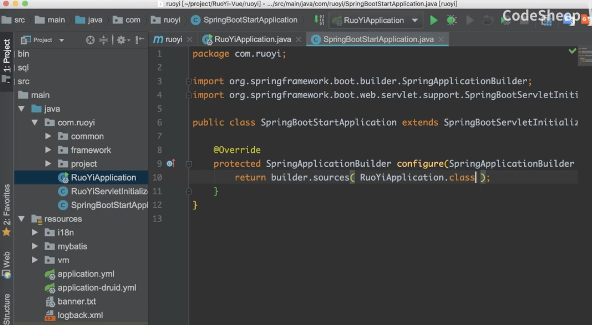
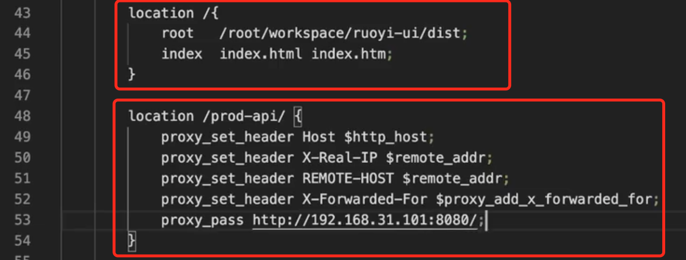
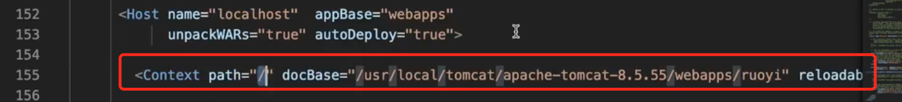
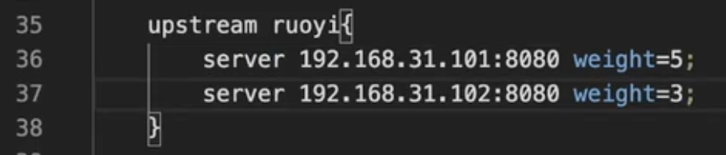
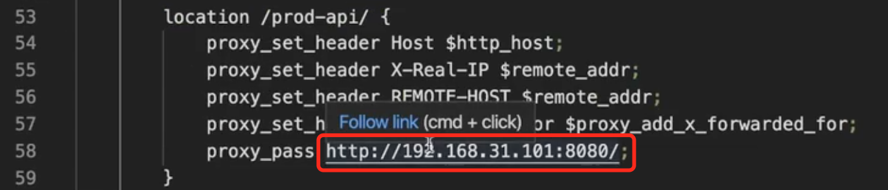
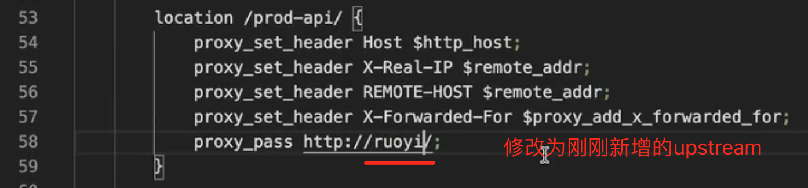

还比如说，一个Spring Boot项目，自带有tomcat：

```xml
 <dependency>
     <groupId>org.springframework.boot</groupId>
     <artifactId>spring-boot-starter-web</artifactId>
 </dependency>
```

如果想把项目部署到服务器上装好的tomcat，也就是说不使用spring boot自带的tomcat，那么通常会选择将项目打成war包。需要改动三个地方。

##### 第一个地方：修改pom文件里的打包方式

修改为war：

```xml
<packaging>war</packaging>
```

##### 第二个地方：排除掉自带的tomcat

那么这时就需要把spring boot自带的tomcat给排除掉：

```xml
<dependency>
    <groupId>org.springframework.boot</groupId>
	  <artifactId>spring-boot-starter-tomcat</actifactId>
	  <scope>provided</scope>
</dependency>
```

把内嵌的tomcat在发布的时候给排除掉，只在编译和测试的时候用。

##### 第三个地方：修改启动类



将前后端项目关联起来

nginx这里需要添加配置：

凡是 prod-api的请求路径，都代理到 192.168.31.101机器上的8080端口对应的服务：




如果是用tomcat部署，启动tomcat后，默认的访问是tomcat的一个默认访问地址，怎么给修改成默认打开的是我们的项目呢？

需要在101机器的tomcat的配置文件service.xml里，添加一行配置：




现在后端项目在102机器上也同时部署了一个，要和101上的服务做成了一个小集群，则需要修改nginx配置。

在101集群的tomcat配置文件service.xml里：




修改之前的代理转发的配置：

为：




